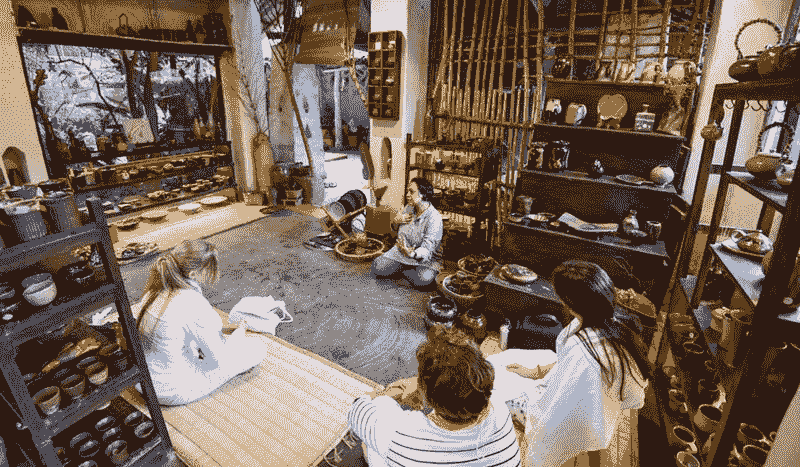

# Soulscape 和 Project Atlas 合作，使领导者能够茁壮成长而不会精疲力竭。

> 原文：<https://medium.datadriveninvestor.com/soulscape-and-project-atlas-partner-to-teach-leaders-how-to-thrive-without-burnout-a6996688c2d1?source=collection_archive---------13----------------------->

我们工作的社会、精神和物质环境在我们的整体幸福中扮演着重要的角色，但这一角色在很大程度上被低估了。30%的创始人患有抑郁症，27%患有问题性焦虑。超过 65%的创业公司因联合创始人冲突而失败；这比离婚率还高。几乎三分之一的失败创业公司认为精神健康问题是他们失败的关键。

虽然医学界仍然没有跟上这一步伐，但总部位于伦敦的道德旅游公司 [Soulscape](https://tosoulscape.com/) 已经与总部位于旧金山的 [Project Atlas](https://atlasq.com/) 联手，这是一个为创始人、企业家和领导者的情感、精神和身体健康提供支持的项目，旨在提供身临其境的旅行体验，以防止倦怠和增强复原力。

Project Atlas 的创始人支持计划最近由硅谷风险投资公司 Alpha Bridge Ventures 推出，该公司的口号“健康的创始人，健康的回报”谈到了管理合伙人豪伊·戴蒙德(Howie Diamond)和杰克·查普曼(Jake Chapman)如何灌输一种信念，即公司创始人应该像运动员一样受到支持。

Soulscape 的创始人和获奖的社会企业家 Manjul Rathee 说:“当你负责一家公司的成功和领导时，不可能不在工作中迷失自己——你的大脑一直处于连线状态。”

Rathee 也是其他几个社会风险企业的联合创始人，在她自己职业生涯的各个阶段，她都处于精疲力竭的边缘。“创始人往往愿意把自己的幸福放在次要位置，直到筋疲力尽、放弃或破坏个人关系。每个人都告诉你休息一下，但有一种潜在的文化，即设定高期望，然后如果你不够努力就会感到内疚，这需要改变。人们很容易忘记，运营公司的是人，而不是机器人，你的公司成功的最大资产就是你。”

Atlas 的创始人 Kari Sulenes 在她自己和她的客户身上观察到，“许多企业家知道，抽出时间有助于他们放慢速度，最终加快他们的速度，但人们一次又一次地说，他们将*跳过旅行*,因为他们无法关闭他们的大脑，或者他们已经开始相信，如果他们抽出一点时间，一切都会内爆！我注意到的是公司，尤其是在成长阶段，因为*人的问题*而失败。作为企业的创始人或唯一的(也是灵魂的)贡献者，花点时间来获得视角、提升和建立一个支持性的社区是避免你自己的个人相关问题的关键。对于那些天生好奇、需要多样性的人来说，有目的、有创意的旅行对于增加能量、保持竞争优势至关重要。”

有越来越多的[研究](http://www.cnn.com/2015/04/09/health/creativity-socializing-delay-dementia/)围绕参与创造性活动如何以新的方式培养大脑的不同区域，有数据表明，参与创造性任务通过促进新神经元的产生来改善大脑功能——这对维持健康的中枢神经系统至关重要。将其与新文化的经历结合起来，这不仅有助于开发大脑中与语言和推理相关的关键区域，还提供了学习和变得更有同理心的机会。

Soulscape 在世界上鲜为人知的地区策划创意探险，融合创意学习、文化探索和福祉，提供身临其境的变革体验，同时通过道德旅游支持当地经济。该伙伴关系旨在为选定的专业人员提供在印度西孟加拉邦的联合国教科文组织遗产地 Santiniketan 进行灵魂景观体验之前、期间和之后获得 Project Atlas 教练一对一指导的机会。

第一次[领导力考察](https://www.atlasq.com/travel/)定于 2019 年 2 月 16 日至 24 日举行，仅限 8 名参与者。

**了解更多关于 Soulscape 的信息:**[https://tosoulscape.com/leadership-development](https://tosoulscape.com/leadership-development)

**了解更多项目图册:**[https://www.atlasq.com/travel](https://www.atlasq.com/travel)

*原载于 2018 年 11 月 11 日*[*tosoulscape.com*](https://tosoulscape.com/soulscape-and-project-atlas-partnership/)*。*