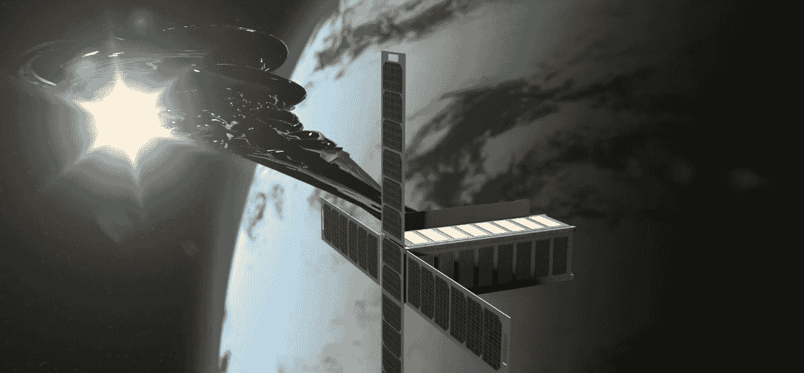

# 太空艺术、设计师婴儿和 2019 年及以后值得关注的其他趋势

> 原文：<https://medium.datadriveninvestor.com/space-art-designer-babies-and-other-trends-to-watch-in-2019-and-beyond-58a7aa791924?source=collection_archive---------19----------------------->

The [Orbital Reflector](https://www.orbitalreflector.com/) space sculpture

ICYMI，“太空艺术”将很快成为现实: [SpaceX 将于本周日将](https://www.wired.com/story/spacex-is-launching-a-piece-of-art-into-orbit/)艺术家特雷弗·帕格伦的[轨道反射器](https://www.orbitalreflector.com/)太空雕塑项目发射到更低的轨道，使其成为世界上第一个太空艺术展(如果你想知道，这里是[将东西送入太空的费用](http://spaceflight.com/schedule-pricing/#6041327976638340))。

抛开酷炫的空间艺术不谈，就新研究和技术发展的速度和数量而言，可以肯定地说，2018 年是记忆中最繁忙的一年。以下是 2019 年及以后需要关注的其他五个新兴趋势:

[**化身 AI**](https://disruptionhub.com/at-a-glance-embodied-ai/) **进化的速度比我们意识到的要快得多**

最近几个月，我们已经看到了关于跳舞的机器人和跑酷的机器人的视频，更不用说互动的数字婴儿和 ANZ 的数字助手杰米·T21 了。几家科技公司也在开发人工智能化身，它们将在不久的将来成为我们的“数字复制品”,让我们的数字肖像在我们死后很长一段时间内继续存在于网络空间。

智能助手几乎无处不在

从苹果的 Siri 到谷歌 Home 和亚马逊的 Alexa，再到挑战图灵测试的谷歌助手，消费者似乎正在集体采用智能助手*。今天，你可以在[四分之一的美国家庭](https://www.theverge.com/circuitbreaker/2018/9/30/17914022/smart-speaker-40-percent-us-households-nielsen-amazon-echo-google-home-apple-homepod)中找到智能音箱，预计到 2019 年，几乎一半的家庭将拥有智能音箱。几乎每个拥有智能手机或智能手表的人都带着智能个人助理四处走动。*

***设计师宝贝来了，我们还没准备好***

*一位不守规矩的科学家最近宣布第一个基因工程“设计婴儿”的诞生，遭到了大多数科学界人士的普遍震惊和谴责，有些人甚至将其描述为“可怕的永生”。这里有一份最近对最令人担忧的问题的分析，或者你可以看看 1997 年的 [*Gattaca*](https://www.imdb.com/title/tt0119177/) 看看它是如何变得糟糕透顶的。同时，处于争议中心的科学家[据报道失踪了](https://futurism.com/gene-edited-babies-scientist-missing) …*

***先教 AI 飞，再教它开？***

*这似乎是几个现任者和新进入者的方法，如 [UberAir](https://www.uber.com/us/en/elevate/) 和[泽法](https://cora.aero/)，他们正在加速开发[自动“空中出租车”](https://www.airnewzealand.co.nz/press-release-2018-air-new-zealand-partners-with-zephyr-airworks-to-bring-air-taxis-to-new-zealanders)。当我们在等待按需、自动飞行出租车的不远的将来时，[这里是半自动汽车](https://www.gizmodo.com.au/2018/12/tesla-model-s-appeared-to-drive-seven-miles-on-autopilot-while-drunk-driver-slept-police/)今天正在发展的。*

***很快，我们将使用** [**原力**](https://en.wikipedia.org/wiki/The_Force) **来控制我们周围的物体***

*嗯，差不多——一些人已经在使用可穿戴和可植入的脑机接口和其他设备来“远程操作”和控制平板电脑、外骨骼、无人机、机器人和任何潜在的联网设备。这项技术已经存在，并且正在迅速发展成为以前科幻小说领域的应用，例如[远程存在](https://www.forbes.com/sites/japan/2018/01/26/telexistence-how-this-tokyo-startup-is-building-real-life-avatar-robots/#cb934a740940)。*

*就我个人而言，我期待着在不久的将来，我们的散文将出现在屏幕上，将键盘打字归入数字黑暗时代。*

*在此之前:*

**

*本文中表达的观点和意见仅代表作者，不一定反映任何机构、组织、雇主或公司的官方政策或立场。*