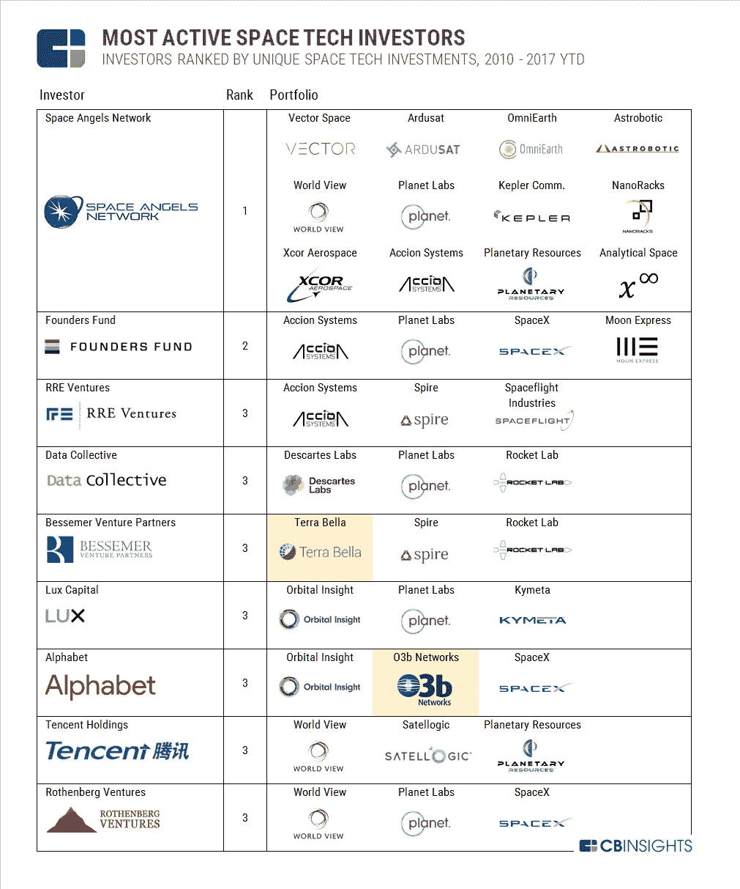

# 太空技术投资者:无限和超越

> 原文：<https://medium.datadriveninvestor.com/space-tech-investors-to-infinity-and-beyond-1c59b2768b4b?source=collection_archive---------4----------------------->

风险资本家在研究一个技术领域时会思考一些事情。它们包括 TAM(总目标市场)、投资者、初创公司、该领域的资本、成熟度和退出。由于这个领域的本质，风投和他们资助的企业家是世界技术发展的尖端。在许多方面，推动我们的世界向前发展的最重要的技术是空间技术。

幸运的是，我不是唯一一个持这种观点的人，有一些公司积极投资于空间技术领域。以上是 CBInsights 对最活跃的太空技术投资者的快照，包括 [Bessemer Venture Partners](https://www.bvp.com/space-tech) 、 [Founders Fund](https://foundersfund.com/portfolio/) 和[太空天使](https://www.spaceangels.com/)。

根据 CBInsights 的数据，天使投资者网络 Space Angels 已经投资了 24 家公司，部署了超过 1.26 亿美元。他们是太空技术领域最活跃的投资者。在负责 500 亿美元房地产投资组合的摩根大通(JP Morgan Chase)前高管查德·安德森(Chad Anderson)的带领下，查德已指示团队对多家公司进行小额投资。天使们 2018 年的最新投资是 [LeoLabs](https://www.leolabs.space/) 、[太空制造](http://madeinspace.us/)、 [Iceye](https://www.iceye.com/) 和 [SpaceWatch 太空应用](https://www.skywatch.co/)。

创始人基金是该领域第二活跃的投资者，是 SpaceX 等知名品牌公司的支持者。创始人基金由彼得·泰尔、肯·豪瑞、肖恩·帕克和卢克·诺塞克创建。Pitchbook 报告管理着 319 亿美元。在这个领域，他们已经向 SpaceX、Accion Systems、Planet Labs、Moon Express 等公司投资了超过 2.3 亿美元。

虽然不在太空技术领域最活跃投资者的前三名之列，但腾讯控股值得一提。被 Quartz 称为“中国的软银”，仅在 2018 年就投资了 30 多家公司。腾讯也是创始人基金 Moon Express 的投资者。狂热是他们最近在太空领域的投资。腾讯太空投资于行星资源公司，该公司专注于让人类从小行星上开采资源，例如水。另一项投资是用于地球实时数据传输的纳米卫星。

对于投资者来说，太空领域是一个不断扩大的领域，我很高兴看到进一步的发展。