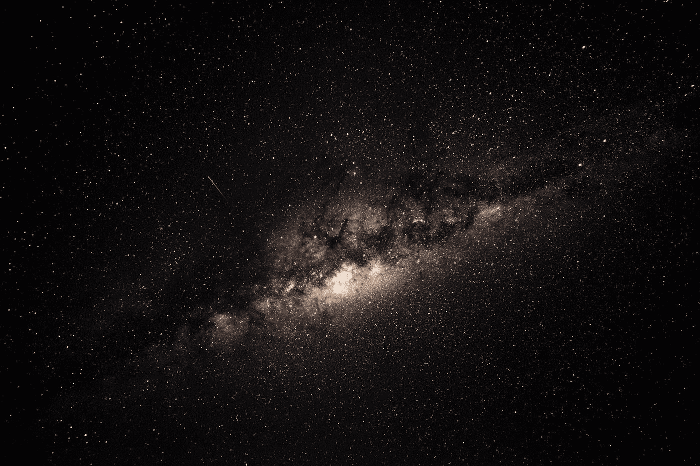

# 空间。下一个采矿前沿？

> 原文：<https://medium.datadriveninvestor.com/space-the-next-mining-frontier-2c5546bcbb54?source=collection_archive---------25----------------------->

“black and brown galaxy” by [Brett Ritchie](https://unsplash.com/@brett_ritchie_photography?utm_source=medium&utm_medium=referral) on [Unsplash](https://unsplash.com?utm_source=medium&utm_medium=referral)

科幻小说早已激发了在月球及更远的地方生活的可能性。这一阴谋激起了投资者的兴趣，如历史上第一家获得政府许可在地球轨道之外旅行的私营公司月球快递公司。它已经筹集了超过 4000 万美元的私募股权融资，为其定于 2020 年进行的首次月球任务提供资金。据报道，月球表面拥有数千亿美元的未开发资源，如水、氦和稀土矿物。12 月 6 日是全国矿工日。采矿的未来不一定在地球，而在星星。随着技术和地貌的发展，采矿的主要风险和危险将始终存在，同时需要更严格的安全措施。

# 地球之外的采矿

从 2018 年春天开始，科罗拉多矿业学院空间资源中心将为有史以来第一个专门从事太空采矿的学术项目开设一门试点课程，预计将把采矿教育带入一个新的半球。像深空工业和行星资源这样的公司已经在计划太空探测任务。

据[国家矿业协会](https://www.youtube.com/watch?v=dlHJM9LNkXc)称，2016 年是地球矿业有史以来最安全的一年。采矿业领袖表示，他们将技术、统一的安全方法以及加强安全计划的企业文化归功于此。采矿业的未来是探索地球以外的可能性。一艘美国国家航空航天局的飞船正在前往获取一颗小行星的样本并将其带回地球的途中，国际上和商业界都在谈论长期居住在太空的问题。

采矿仍然是美国最危险的工作之一，矿工们每天都冒着生命危险应对健康和安全问题。尽管许多旧的危险已经被较新的技术消除，例如为了工人的安全在机器上进行传感检测，但是煤矿安全经理仍然需要确保遵循正确的救援计划、协议和正确的设备使用。负责安全作业的人员还必须定期对矿井和设施进行多次检查，排除机械和电气故障，并对机械、电气、泵送、加热和相关设备进行紧急维修。对培训和程序信息进行一致的更新，以及使用安全标志和标签保持现场清晰和一致的沟通是很重要的。

煤矿操作员必须能够随时找到煤矿工人并与之通信，尤其是在发生火灾、冒顶或其他危及生命的情况下。同样重要的是，通信系统在停电、风扇停止运转或气体积聚时保持活跃。灭火装置上的正确标签和通知其位置的标志需要放在所有工人都能看到的地方。标签设备、PPE 和安全/救援供应箱用于在被困井下的情况下保护矿工，有助于日常作业。

在检查地下矿井中的皮带传动装置时，每周进行电气和气体危险检查，执行所需的每周灭火检查，并确保工业级标志和标签上有正确的信息和象形图。经理还应确保员工在工作中使用安全措施，如火焰切割和焊接，机器安全说明到位，遵循[矿山安全和健康管理局](https://www.msha.gov/news-media/announcements/2016/02/25/preventing-accidents-involving-machinery-equipment)的提示。呼吸保护标志可以很容易地指示呼吸器的存放位置。检查以确保设备如拉铲挖掘机、电铲、大型卡车、斗轮挖掘机和输送机有安全所需的标签。雇主还可以使用棱镜[反光带](https://store.graphicproducts.com/en-us/pathfinder/reflect)来增加能见度，改善寻路，并在光线不足的情况下传达危险。

*原载于 2017 年 12 月 5 日*[*www.graphicproducts.com*](https://www.graphicproducts.com/newsroom/space-mining/)*。*