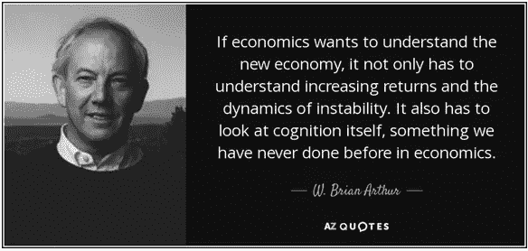
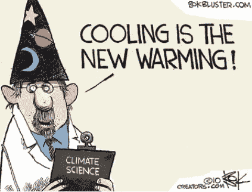
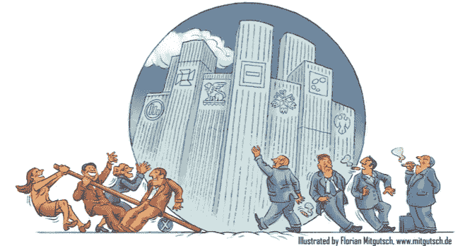
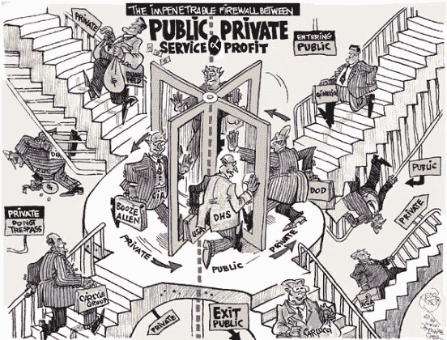
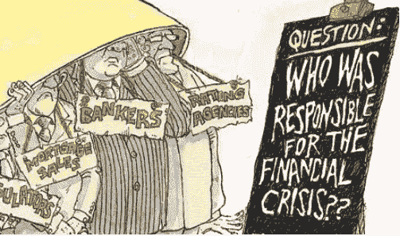
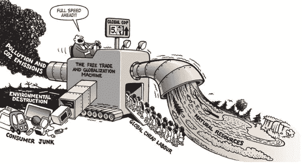

# 布莱恩·阿瑟:一个历史性的转变正在发生，我们正处于开始阶段

> 原文：<https://medium.datadriveninvestor.com/sparks-interview-w-a864b47bdbbd?source=collection_archive---------24----------------------->

## 在这一期的 Sparks 访谈中，我们很荣幸邀请到复杂性经济学之父 W. Brian Arthur 与我们分享他对[比特币](https://www.datadriveninvestor.com/glossary/bitcoin/)和[区块链](https://www.datadriveninvestor.com/glossary/blockchain/)的一些看法，以及对金融市场预测的一些见解。

*X-Order 是一家投资和研究机构，致力于研究开放金融中的价值捕捉，由 Tony Tao 创立。我们努力成为新金融和与科学和研究相关的跨学科领域之间的桥梁。托尼·陶也是 NGC 风险投资公司的合伙人。*

# 嘉宾介绍

## 布莱恩·亚瑟

> *著名经济学家，圣达菲研究所外聘教授，PARC 帕洛阿尔托研究中心智能系统实验室客座研究员。*

20 世纪 80 年代，亚瑟被诺贝尔经济学奖获得者肯尼斯·阿罗邀请到新成立的圣达菲研究所。在圣达菲研究所，亚瑟将复杂系统理论与经济学研究相结合，从而逐渐引入了**“复杂性经济学”的概念。**他凭借收益递增理论获得了 1990 年的熊彼特奖。

 [## 为什么包容性财富指数比 GDP 更能衡量社会进步？|数据驱动…

### 你不需要成为一个经济奇才或金融大师就能知道 GDP 的定义。即使你从未拿过 ECON 奖…

www.datadriveninvestor.com](https://www.datadriveninvestor.com/2019/03/08/why-inclusive-wealth-index-is-a-better-measure-of-societal-progress-than-gdp/) 

作为报酬递增理论的支持者，阿瑟创造了一种新的经济学和复杂系统的跨学科研究模式。作为圣达菲学院的第一批复杂性学习者，亚瑟是复杂性科学的创始人之一。由于其杰出的研究成就，他还获得了 2008 年首届拉格朗日复杂性科学奖。

AZQuotes.com

# 你对比特币有什么看法？它会像 2001 年的互联网一样是颠覆性的技术吗？

首先，我对比特币了解不多，但我认为比特币的诞生是一个**新兴现象**。我们不知道它是如何出现的，但它出现的方式超出了政府的控制。所以，无论中国还是美国是否喜欢比特币，它都会存在。

比特币自发产生。它是国际化的，没有被广泛接受。在我们的认知雷达中，它带来了秘密。不管任何国家或政府想对比特币做什么，它还是会存在的。而对于[区块链](https://www.datadriveninvestor.com/glossary/blockchain/)来说，比特币是技术在交易中的一种体现。

Lionsroar.com

另一方面，在欧洲、美国或中国，我还没有看到任何人知道如何应对迫在眉睫的威胁。

区块链的角色因人而异。众所周知，区块链给我们带来了另一种记录商业活动的方式，可以让交易变得容易得多。例如，我上周听说，如果你从某人那里得到一幅非常有价值的画，你现在可以在区块链上记录这些交易。**任何价值** [**交换**](https://www.datadriveninvestor.com/glossary/exchange/) **的区块链都会让区块链更加重要。**

而且，银行其实也不知道怎么处理。去年，我与一家主流国际商业银行进行了交谈。他们知道区块链已经到来，但不知道该怎么办。

> 那么，接下来会发生什么？

我觉得一切都被某个[块](https://www.datadriveninvestor.com/glossary/block/)以某种方式记录下来是必然的。区块链将成为我们日常生活的一部分。

CoinTelegraph.com

我们实际上正处于一场巨大的变革之中。银行、保险、航运、贸易、石油、运输、石油运输、商业银行、零售银行——所有这些行业都将不得不接受区块链， ***可能包括比特币*** ，但主要是区块链和[人工智能](https://www.datadriveninvestor.com/glossary/artificial-intelligence/)。他们都处于变革之中，当然，他们也可能处于变革的开端。

当我与这些行业的人交谈时，他们告诉我，10 年或 15 年后，他们将不可避免地成为一家金融科技公司(T21)，但他们不知道如何实现这一目标。

大公司认为数字化是不可避免的，他们欢迎这样的变化。然而，他们不知道如何去做。有点像穿越红海。他们可以在水边停下来，试着把脚放进去，但是他们不知道自己是否会游泳。

> 因此，这将是一次重大的历史性变革。

# 比特币在 2008 年金融危机期间出现。如果下一次金融危机临近，会不会是比特币的又一次机会？

如果我去美国，我想我认识的人中没有人能够预测下一次金融危机什么时候会发生。如果他们不知道会发生什么，他们会把钱投入股市。没有人能确定股市是否会崩盘。不过，我觉得这件事没什么大不了的。

更重要的是，我们正处于一个时代，无论是在美国、欧洲还是中国，每个行业都面临着历史性的变革。每个传统行业都在**变革，数字化**。比如医疗行业开始关注 15 年后我们会是什么样子。另一方面，在 10 到 15 年内，运输和物流行业可能会有来自中国或澳大利亚的卡车跨国运输货物。

Autodesk.com

> *所有这些变化都在发生，而我们才刚刚开始。*

# 在复杂系统中，一个经典的例子是预测天气的困难。然而，在过去的 30 年里，尽管困难重重，但它越来越准确。对此有什么看法？

天气预报的难点在于**天气系统是高度非线性的**；就连背后的**基础物理也是混沌的**。

如果在预报开始时有**一些小的偏差**，比如气温相差两到三摄氏度；这可能意味着两周后**的天气会非常不同**。

如果从更宏观的角度来看这个问题，会发现气象学领域也有一场**革命**:传感器、温度计、压力表无处不在。在 2000 年，这种人并不多。现在，我们可能有几十万甚至几百万个这样的传感器。它们遍布海平面、北极，甚至中国或西伯利亚的偏远地区。

ClimateEtc.com

所有的传感器都收集大量的数据。大约在 2012 年，我们都开始谈论[大数据](https://www.datadriveninvestor.com/glossary/big-data/)。虽然当时手头有很多数据，但我们不知道如何处理它们。相比之下，我们的计算机和 CPU 变得更快了。我们也有深度学习的神经网络和算法。因此，**结合更高效的数据处理能力和更好的算法**可以帮助我们做出更好的预测。它将改变一切，但仍不完美。

> 我们正处于一个由传感器或技术驱动的新领域的前沿，这给我们带来了大量的数据、更快的计算速度和更好的算法。它会改变一切。

# 既然我们可以通过你刚才说的技术革命更好的预测天气，那么我们是否可以更好的预测市场，或者说我们已经做到了？

> *这是一个价值 64 亿美元的问题，我的答案肯定是肯定的。*

我们能够比以前更好地预测一切，但我们的**预测永远不会完美。这是因为如果你有一个好的预测，你会根据它进行投资，但反过来，这个行动会改变你的预测。因此，我确实认为我们在预测方面做得越来越好。而且，[自然语言处理](https://www.datadriveninvestor.com/glossary/natural-language-processing/)已经用于阅读文本。我觉得这个预测是可以通过认知测试来正面检验的。但我认为它远非完美。**

Mitgutsch.de

例如，有一个叫贾马尔的人在土耳其被谋杀，或者在类似的地方如伊斯坦布尔，沙特阿拉伯，和詹姆斯。这种突发事件很可能会改变大家对沙特的态度，油价可能会受到影响。**这样不可预测的事件总是会发生。**

如果你能预测好，其他人也能。这也将对预测结果产生**影响。我认为所有的预测都将变得更加准确，包括那些与健康相关的，例如谁会患心脏病等等。但是它总是不完美的。**

# 你认为经济系统是一个复杂的系统，但它也是一个动力系统吗？如果它是一个动力系统，就意味着它必须有一个动力学方程。你认为最基本的动力学方程可能是什么？

这是一个非常好的问题，也是一个非常基本的问题。离开这里后，我可能会在接下来的六个月里考虑这个问题。

为了将经济视为一个**标准系统**，新古典经济学家倾向于将经济视为一个**平衡系统**。所有的力都是平衡的，就像蜘蛛网里的相互作用力，最终都是平衡的。所以，他们是主张平等的自由主义者。所以，主流经济学的**概念是均衡。当然，系统中可能会有一些部分偏离平衡，但它们最终会回到平衡状态。就像你摸一个蜘蛛网，它很快就会恢复原状。**

> 然而，和我一起开发复杂性经济学的团队不太同意这个概念。我们试图指出经济不一定处于平衡状态。

因此，如果我们把**经济看作不平衡的**，我们就不会把它看作一台机器，或者一张蜘蛛网，或者任何一种平衡的系统。我们认为它是**一个生态系统**，其中每个人都有不同的信仰和行为。你并不总是知道哪些行动是谁做的，你的技术会有多好，政府会如何应对。

在硅谷，我们有各种各样的想法，但政府只有在三年后才会做出回应。类似的事情也可能发生在中国。

结果，在这样一个不平衡的系统中，你**的知识**有限，并且总是**探索一个有许多参与者的环境**。这些参与者也在努力思考该做些什么。大家好像都在黑暗中摸索。其中可能有做的好的人，或者能从别人身上赚钱的人，等等。所以，从根本上说，把经济当成一个复杂系统，就是把它当成一个生态系统。

Evonomics.com

回到你的问题，有许多动力系统可以用方程来描述，但不一定用算法来描述。这是因为算法主要来源于平衡系统。因此，这些方程很容易展开，就像洛伦兹方程是否正确一样。

在经济学中，很多事情都是一起触发的。如果发生这种情况，中央银行将介入并重新稳定货币。

> *因此，并不是所有的动力系统都可以写成方程。*

从复杂性经济学的观点来看，我们倾向于**把经济看作是计算**本身。这就像一个有许多参与者和不同策略的生态系统。你一般可以把它描述为一个**计算过程，有很多不同的因素。**

FreedomThisTime.Wordpress

这个计算对于整个经济来说是非常复杂的。但是，如果只是针对某一笔石油交易或者针对其他交易做一个模型，很可能是用算法模型来做。

# 基于主体的模型(ABM)是复杂理论研究的重要方法。如果 ABM 不能完全模拟社会中人与人之间的相互作用，那么用它来预测金融中的系统性风险是否可行？

我们运行了一些最早的 ABMs。在圣达菲研究所，我们建立了一个基于 31 年前股票市场的模型。以我的经验来看，建立这种模式的代理并不难。关键是要搞清楚**主体是谁**和**他们代表的是谁**(可能是银行或者金融机构，保险公司)。每个主题都是一个参与者，然后将通过目标对象库进行计算。可能是 [Python](https://www.datadriveninvestor.com/glossary/python/) 或者 C ++。

每一个都成为它自己的单个单元，一个编程单元，并且每个单元的许多指令可能是不同的。如果发生这种情况，你可以尝试先预测，然后下注。

Stefan Thurner 对你之前问的问题做了一些很好的研究，即**建立一个可以帮助你预测系统性风险的模型**。Stefan Thurner 有一篇论文我觉得很有逻辑，但是有系统性风险。这是奥地利学院的一个非常**大的主题模型。**

WienerZeitung.at

需要注意的是，**系统性风险源于金融机构之间的相关性**。这是因为银行之间可能相互持有债务。换句话说，如果你的银行最初赚了钱，但另一家银行遇到了问题；也可能导致你的银行陷入困境。这些代理人可能遇到的**问题**统称为**系统性风险。**

在这种情况下，你可以建立一个现实的金融机构模型来找出它们之间的联系。例如，当一家银行的经营出现问题时，这些风险是如何转移到其他关联的银行，甚至是通过整个金融体系进一步扩散的？

RebellionResearch.com

这就是 2008 年金融体系发生的事情。美国国际集团、雷曼兄弟和其他大银行面临困境，与它们关系密切的银行也陷入困境。然后整个金融体系崩溃了，美国政府不得不出手干预，支持国家的金融体系。

> 斯特凡·瑟纳认为，一些金融公司非常危险。一旦它们在系统中崩溃，将导致许多国家的经济崩溃。

# 在复杂性经济学中，报酬递增和路径依赖理论表明，经济发展是由各种经济力量和随机“历史事件”的相互作用决定的。此外，这个结果不一定是最佳的，也不能完全预测。因此，从研究者的角度来看，我们应该做些什么呢？

Pinterest.com

我给你举个例子。在 1500 年，意大利是世界上最先进的国家之一。当然，1400 年左右也是如此。他们有一些世界上最好的科学家，像伽利略或类似的研究人员。意大利北部和南部的经济发展相似。那不勒斯在南方，罗马在更南边。北部还有佛罗伦萨、锡耶纳和米兰。

事实证明，为了超越或赶上经济更发达的地区并因此变得更加繁荣，该地区的工人将学习更多的技能，从而吸引公司和投资进入该地区。历史上，意大利南部一直发展良好，在一段时间内也是如此。

所以，如果意大利南部先发展起来，它会发展得越来越好；北方也是如此，这是历史上发生的事情。从 19 世纪 50 年代到 2000 年，汽车工业和时装业遍布意大利北部。因此，米兰的旅游业和其他部门也得到发展。这些例子和你的问题是一致的。你可以说它们都是**依赖于历史、各种小事件，甚至是意大利发展所特有的。**然而，如果意大利历史上发生了一系列不同的事情，或许意大利南部的发展会占据主导地位。

我的意思是，如果一个地区、一家公司或一项技术在发展中一直是**领先的**，那么它就会在这个基础上**获得更多的优势**并且**保持领先地位**。但是，我们无法提前预测造成这种情况的原因。

> 此外，这样的结果甚至可能不是最佳的。

# **接下来是什么？**

*以下文章将是我们“对密码周期的观察”系列的一部分。敬请期待！*

*原载于 2019 年 12 月 17 日*[*https://www.datadriveninvestor.com*](https://www.datadriveninvestor.com/2019/12/17/interview-brian-arthur/)*。*

## 在 Linkedin 上与我们联系！

翻译:心悦

***编辑:*** *谭*