# 扬声器二进制化

> 原文：<https://medium.datadriveninvestor.com/speaker-diarization-22121f1264b1?source=collection_archive---------0----------------------->

## 音频文件中多个扬声器的分离。

## 二元化:根据说话者身份将输入音频流分割成同质片段的过程。

Identifying the number of Speakers in an Audio File

“谁在什么时候说过话？”—扬声器 1/扬声器 2 何时“开始/停止”讲话。

***应用:***

1.  医疗记录:医生与患者语音分离(提供更有条理的笔记)。
2.  会议笔记的自动生成
3.  呼叫中心数据分析
4.  法院和议会。
5.  广播新闻(电视和广播)

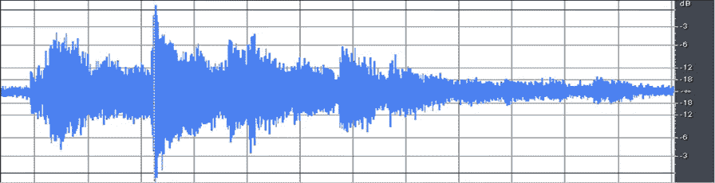

Audio File in Graph Form

**说话人二进制化的任务遇到很多困难:**

1.  节目中的发言人数不详。
2.  没有关于程序中的人的身份的先验知识。
3.  许多发言者可以同时发言
4.  可能有不同的录音条件
5.  音频通道不仅可以包含语音，还可以包含音乐和其他非语音源(掌声和笑声等)

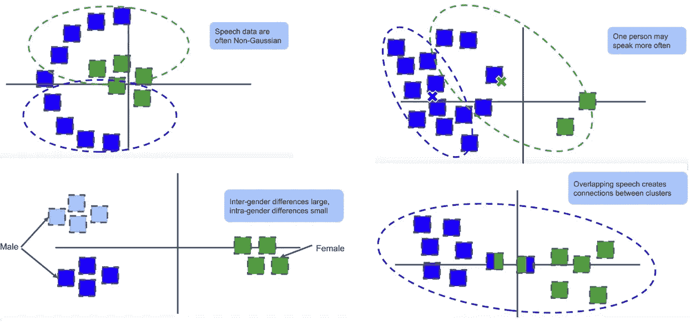

Problems to Identify Multiple Speakers in an Audio File.

***解剖学*** ***(内功)&基础结构的二化。***

1.  **语音检测** —使用语音活动检测器(VAD)去除噪音和非语音。
2.  **语音分段** —从音频中提取小段(滑动窗口)&运行 LSTM 网络以产生每个滑动窗口的 D 向量。

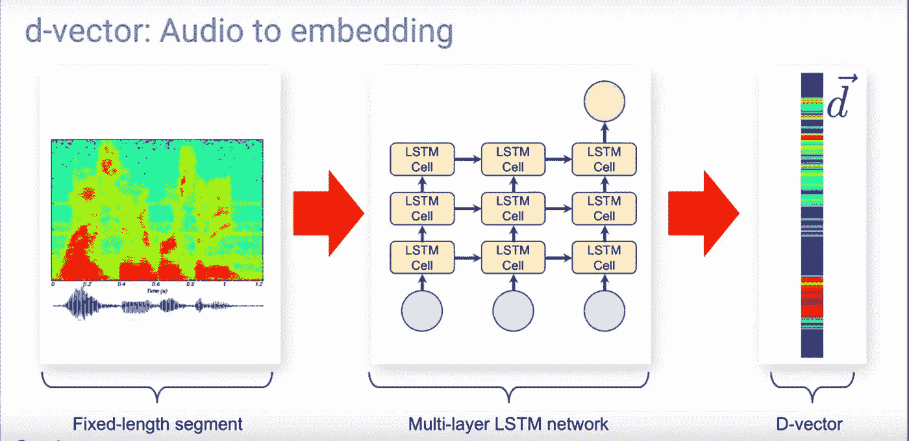

Generating D-vector from segments

3.**嵌入提取(识别部分)** —对于每个片段集合，属于该片段的 D 向量产生片段式嵌入(将 D 向量附加到滑动窗口)

4.**聚类(对片段进行聚类)** —最后对片段式嵌入进行聚类，以产生二值化结果。根据每个发言者的时间戳确定发言者的数量。

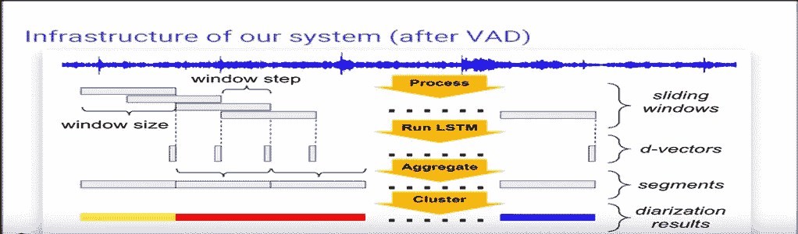

Infrastructure of Speaker Diarization Process

***在一个音频文件中识别多个说话人的问题可以用二进制化解决。***

**谱聚类:**有助于确定聚类的个数。

当 k 为 8 时，间隙具有最大值，在这种情况下，8 个簇是最佳的。

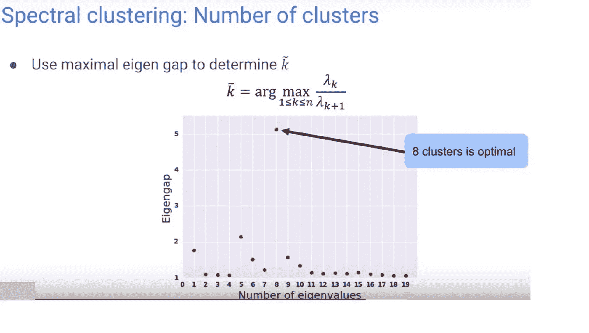

Spectral Clustering to find the Optimal Clusters

谱聚类根据有助于说话人二分化的数据找到最佳的图切割。

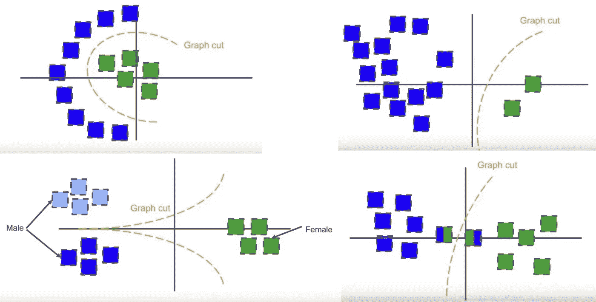

Diarization provides solution for the above problems

***不是什么二进制？***

***二化！=说话人变化检测:***

每当新的说话者出现，如果同一说话者再次出现，它提供相同的标签。然而，在说话人变化检测中，没有给出这样的标签。

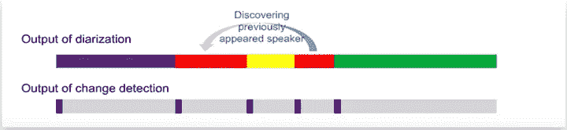

Speaker Change Detection

***二化！=说话人识别***

不登记:他们不保存任何已知说话人的声纹。在运行程序之前，他们不会注册任何说话者的声音。而且说话人也是动态发现的。

***执行谷歌云语音二值化的步骤如下:***

**第一步:**使用 Google Cloud 创建一个帐户。

**第二步:**创建一个项目。

**第三步:**获取密钥。转到服务帐户密钥页面。

***获取服务账户密钥的步骤***

(1)从**服务账户**下拉列表中选择**新服务账户。**

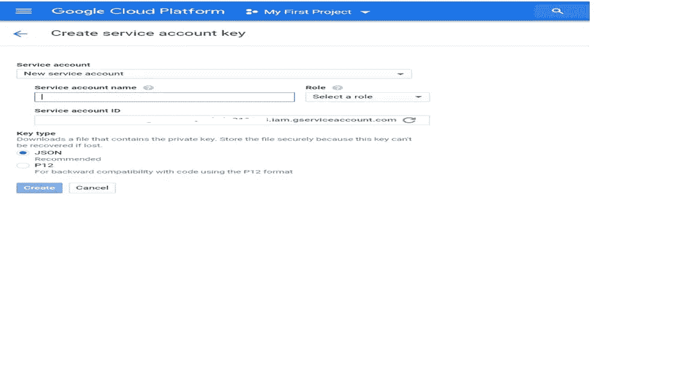

Google Service Account Key Page

(2)在**服务帐户名称**字段中输入名称。

(3)从**角色**下拉列表中选择**项目** > **所有者**。

(4)点击**创建**。一个 JSON 文件，包含下载到您计算机的密钥。

***在 Python/Python IDE 终端中执行的步骤:***

1.pip 安装谷歌云。

2.pip 安装谷歌云语音

3.在执行程序之前，导出 JSON 文件:

***针对 Linux/Ubuntu***

导出 GOOGLE _ APPLICATION _ CREDENTIALS = "/home/user/Downloads/[文件名]。json "

***用于 Windows PowerShell***

$ env:GOOGLE _ APPLICATION _ CREDENTIALS = "[PATH]"

***Python 代码实现说话人二进制化:***

# -*-编码:UTF-8 -*-
导入 argparse
导入 io
导入系统

def transcriptor _ file _ with _ diarization(file _ path):
“同步转录给定的音频文件并进行二进制化。”" "
#【START speech _ transcriptor _ diarization _ beta】
来自 google.cloud 导入 speech_v1p1beta1 作为 speech
client = speech。语音客户端()

speech_file = sys.argv[1]

用 open(speech_file，' rb ')作为 audio _ file:
content = audio _ file . read()

audio = speech . types . recognitionaudio(content = content)

config = speech . types . recognition config(
encoding = speech . enums . recognition config . audio encoding . linear 16，
sample_rate_hertz=48000，
language_code='en-US '，
enable _ speaker _ dia ization = True，
enable _ automatic _ punctuation = True，
dia ization _ speaker _ count = 4)

print('等待操作完成…')
response = client . recognize(config，audio)

#每个结果中的抄本是独立的，并且按结果排序。
#但是，备选项中的单词列表包括迄今为止所有结果中的所有单词
#。因此，要获得带有 speaker
#标签的所有单词，只需从最后一个结果中获取单词列表:
result = response . results[-1]

words _ info = result . alternatives[0]。话

speaker 1 _ 转录本= " "
speaker 2 _ 转录本= " "
speaker 3 _ 转录本= " "
speaker 4 _ 转录本=""
#打印输出:
for word _ info in words _ info:
if(word _ info . speaker _ tag = = 1):speaker 1 _ 转录本= speaker1 _ 转录本+word_info.word+' '
if(word _ info . speaker _ tag = = 2):speaker 2 _ 转录本= speaker2 _ 转录本+word _ info . wordformat(speaker 1 _ 抄本))
print("speaker2: '{} ' "。format(speaker 2 _ 抄本))
print("speaker3: '{} ' "。format(speaker 3 _ 抄本))
print("speaker4: '{} ' "。format(speaker 4 _ transcript))
#【END speech _ transcriptor _ diarization _ beta】

用二进制化转录文件(sys.argv[1])

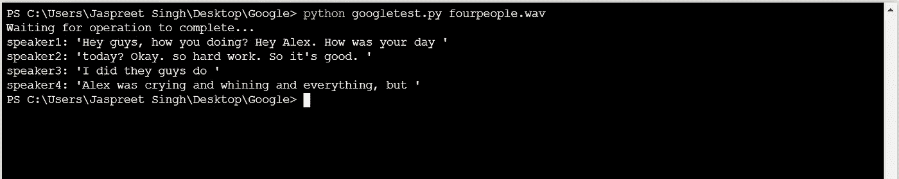

Diarization results on Jupyter terminal

***其他提供类似服务的公司:***

**Amazon(AWS transcripte)**:它在 JSON 文件中提供了类似的解决方案，可以用于进一步的应用。

亚马逊转录提供了高质量和负担得起的语音到文本转录为广泛的使用案例。

步骤 1:创建转录作业

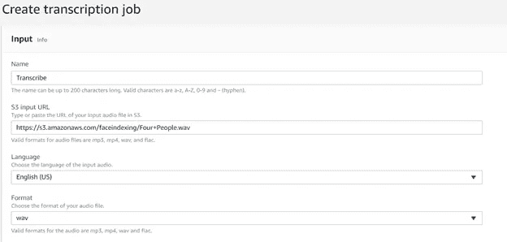

输出:JSON 文件被上传到 S3 桶上，带有成绩单结果 JSON 成绩单文件。

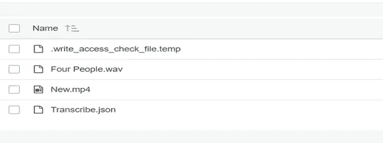

JSON 抄本文件

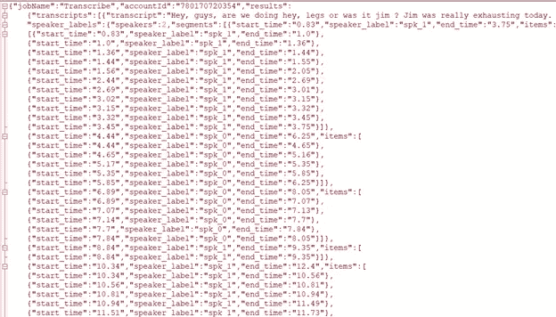

微软——认知说话人识别。

它有助于根据语音识别用户，因为语音具有独特的特征，可以用来识别和确定说话人。

就像每个人都有独一无二的指纹，每个人都有独一无二的声音。

**如何实现说话人识别**

第一步:创建一个 Microsoft Azure 帐户。

第二步:在所有服务->去 AI+机器学习。

第三步:点击认知服务。

第四步:点击添加->在认知服务中点击更多。

第五步:点击说话人识别。

第六步:点击创建。

这将生成两个密钥，这两个密钥将一直有效，直到您的帐户被激活。

**说话人识别的代码实现**

步骤 1:创建配置文件:使用订阅密钥创建配置文件 id

步骤 2:配置文件注册:使用配置文件 id 和订阅密钥注册语音样本。

步骤 3:说话人识别:传递带有简档 id 的语音样本。

输出:如果声音样本是正确的，它与配置文件 id 相关联，程序将显示配置文件 id，否则显示 00000…

注意:下面实现代码所需的文件(调用 Microsoft Azure 的服务时需要这些文件)

IdentificationServiceHttpClientHelper

识别轮廓

识别响应

注册响应

ProfileCreationResponse

可以在 Github 上找到。

**扬声器识别的输出**

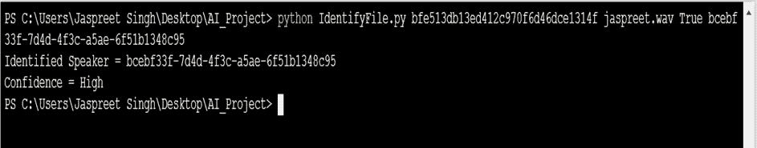

Speaker Identification

**整合谷歌和微软代码形成速记:**

# -*-编码:UTF-8 -*-

导入 argparse

导入 io

导入标识服务 HttpClientHelper

导入系统

定义标识文件(订阅密钥，文件路径，强制短音频，配置文件标识):

helper = IdentificationServiceHttpClientHelper。IdentificationServiceHttpClientHelper(subscription _ key)

identificati on _ response = helper . identify _ file(file _ path，profile_ids，force _ short _ audio . lower()= = " true ")

print('Identified Speaker = {0})。格式(identificati on _ response . get _ identified _ profile _ id())

print('Confidence = {0})。格式(identificati on _ response . get _ confidence()))

if identificati on _ response . get _ identified _ profile _ id()= = ' 3c 4712 ea-c6b 9–4f 66-ac83-d 21 de 36 CFAF 6 ':

打印('胫骨 _ID ')

if identificati on _ response . get _ identified _ profile _ id()= = ' BCE BF 33 f-7d4d-4f3c-a5ae-6f 51 b 1348 c 95 ':

打印(' Jaspreets_ID ')

if identificati on _ response . get _ identified _ profile _ id()= = ' a 091 add 1–87a 0–464 c-aa8b-7a 953273 F3 d 7 ':

打印('院长标识')

if identificati on _ response . get _ identified _ profile _ id()= = ' 3f 81 D6 d 5–9f 77–4da 0–8f 65–8188 c 0978219 ':

打印(' JTs_ID ')

def transcriptor _ file _ with _ diarization(subscription _ key，file_path，force_short_audio，profile_ids):

helper = IdentificationServiceHttpClientHelper。IdentificationServiceHttpClientHelper(subscription _ key)

identificati on _ response = helper . identify _ file(file _ path，profile_ids，force _ short _ audio . lower()= = " true ")

" " "与二进制化同步转录给定的音频文件。"""

#[START speech _ transcripte _ diarization _ beta]

从 google.cloud 导入 speech_v1p1beta1 作为语音

客户=演讲。语音客户端()

speech_file = sys.argv[2]

使用 open(speech_file，' rb ')作为音频文件:

content = audio_file.read()

audio = speech . types . recognitionaudio(content = content)

config = speech . types . recognition config(encoding = speech . enums . recognition config . audio encoding . linear 16，sample_rate_hertz=16000，language_code='en-US '，audio_channel_count=1，enable _ speaker _ diarization = True，enable _ automatic _ punctuation = True，diarization _ speaker _ count = 1s)

打印('二进制化结果:')

response = client.recognize(配置、音频)

#每个结果中的抄本是独立的，并且按结果排序。

#但是，备选项中的单词列表包括所有单词

#从目前所有的结果来看。因此，用扬声器获取所有单词

#标签，您只需从最后一个结果中提取单词列表:

result = response.results[-1]

words _ info = result . alternatives[0]。话

speaker1 _ 抄本= " "

speaker2 _ 抄本= " "

speaker3 _ 抄本= " "

speaker4 _ 抄本= " "

#打印输出:

对于 word_info 中的 word _ info:

if(word _ info . speaker _ tag = = 1):speaker 1 _ 抄本= speaker1 _ 抄本+word_info.word+' '

if(word _ info . speaker _ tag = = 2):speaker 2 _ 抄本= speaker2 _ 抄本+word_info.word+' '

if(word _ info . speaker _ tag = = 3):speaker 3 _ 抄本= speaker3 _ 抄本+word_info.word+' '

if(word _ info . speaker _ tag = = 4):speaker 4 _ 抄本= speaker4 _ 抄本+word_info.word+' '

print(identificati on _ response . get _ identified _ profile _ id()，":"，speaker1 _ 抄本)

print(" speaker 2:“{ }”)。格式(speaker2 _ 抄本))

print(" speaker 3:“{ }”)。格式(speaker3 _ 抄本))

print("speaker4: '{} ' "。格式(speaker4 _ 抄本))

#[END speech _ transcripte _ diarization _ beta]

if __name__ == "__main__ ":

if len(sys . argv)< 5:

print(‘Usage: python IdentifyFile.py <subscription_key><identification_file_path>“<profile_ids>……”)</profile_ids></identification_file_path></subscription_key>

print('\t <subscription_key>是服务的订阅密钥')</subscription_key>

print('\t <identification_file_path>是用于识别的音频文件路径')</identification_file_path>

print('\t <force_short_audio>真/假放弃所需的建议最低音频限制'</force_short_audio>

用于注册’)

打印(' \t <profile_ids>用于识别音频的配置文件的配置文件 id。')</profile_ids>

sys.exit('错误:不正确的用法。)

identify_file(sys.argv[1]，sys.argv[2]，sys.argv[3]，sys.argv[4:])

transcriptor _ file _ with _ diar ization(sys . argv[1]，sys.argv[2]，sys.argv[3]，sys.argv[4:])

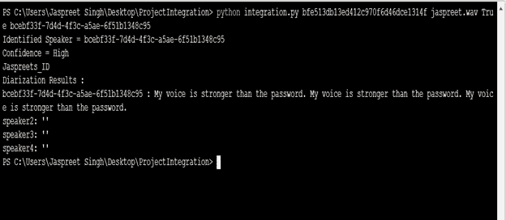

Output of Integrated Code

***结论:*** 在本文中，我们描述了识别音频文件中多个说话者的语音的问题。Google Speaker diarization 是一种强大的技术，可以获得用 Speaker 标签转录扬声器的预期结果。说话人二值化技术局限性小，易于实现。

***限制:*** 由于没有注册过程，说话人二进制化技术无法识别特定的说话人。

***参考文献:***

 [## [1710.10468]LSTM 扬声器二进制化

### 摘要:多年来，基于 I 向量的音频嵌入技术一直是说话人确认的主流方法。

arxiv.org](https://arxiv.org/abs/1710.10468)  [## Google cloud platform/python-docs-samples

### cloud.google.com 上使用的代码示例。为 Google cloud platform/python-docs-samples 开发做出贡献，创建一个…

github.com](https://github.com/GoogleCloudPlatform/python-docs-samples/blob/master/speech/cloud-client/beta_snippets.py)  [## 使用 LSTM -谷歌人工智能的扬声器二进制化

### 多年来，基于 I 向量的说话人嵌入技术一直是说话人确认和说话人识别的主流方法

ai.google](https://ai.google/research/pubs/pub46453)  [## [1810.04719]全监督扬声器二进制化

### 摘要:本文提出了一种全监督说话人二值化方法，称为无界交错状态二值化方法

arxiv.org](https://arxiv.org/abs/1810.04719)  [## 使用监督学习的准确在线说话人二进制化

### 说话者二分化，将多人的音频流分割成同质片段的过程…

ai.googleblog.com](https://ai.googleblog.com/2018/11/accurate-online-speaker-diarization.html)