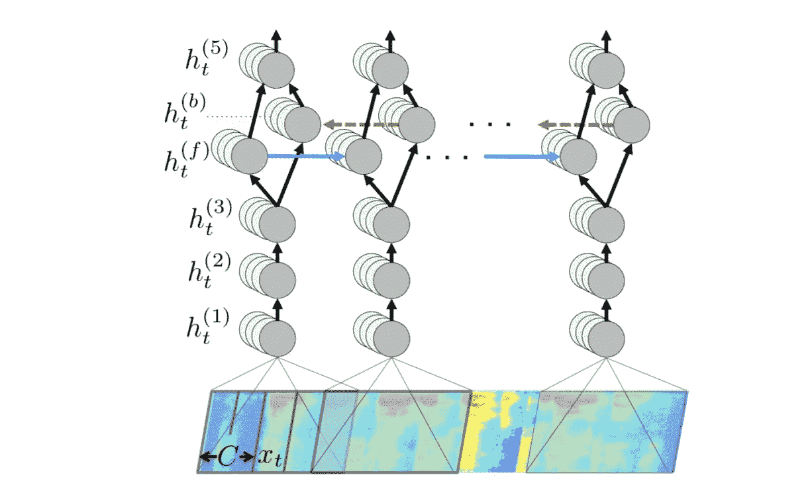
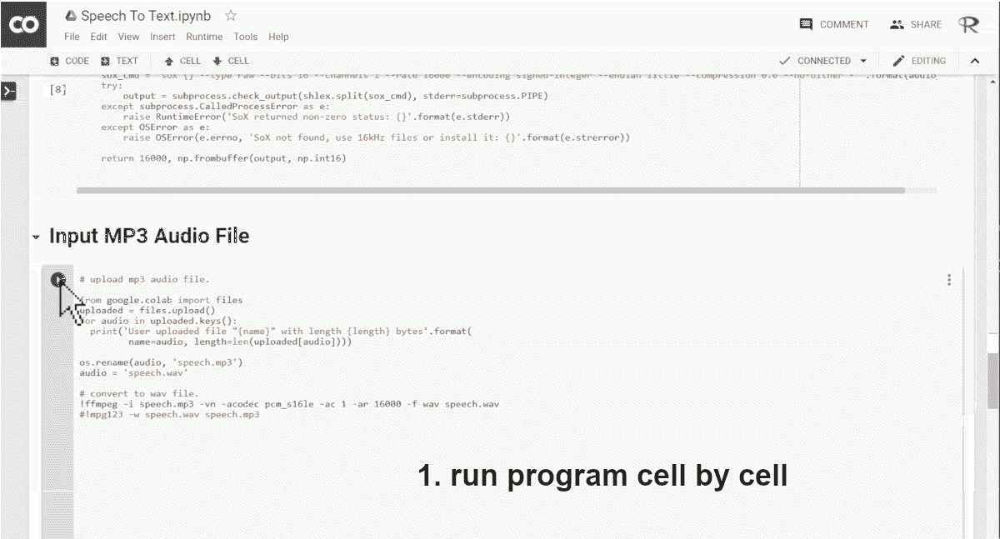

# 使用深度学习的浏览器中的语音到文本应用程序

> 原文：<https://medium.datadriveninvestor.com/speech-to-text-app-in-your-browser-using-deep-learning-35889fbd50ed?source=collection_archive---------4----------------------->

Smart speakers with speech to text technology

# 介绍

深度语音是一种使用深度学习的自动语音识别技术。语音识别的现代时代始于 1971 年，当时卡耐基梅隆大学开始了一项综合研究工作(参考: [CMU 的哈佩项目](https://www.youtube.com/watch?v=N3i6NoUZsSw))，以识别人类语音中的 1000 多个单词。2011 年，谷歌通过其语音搜索应用程序率先在移动设备上应用语音识别。很快，Siri、Alexa、Cortana 和谷歌等语音助手抓住了这种兴奋感。

这些现代设备采用各种系统，包括用于处理原始语音信号的 DSP，如频域转换、仅恢复所需信息等。该信号然后被翻译成中间语音表示，该中间语音表示与参考语音模式进行比较，以确定实际单词或单词模式。

**端到端语音识别系统**无需语音转换。这种系统直接将带有字符序列的音频频谱图转录成单词。在本文中，我们使用了“[深度语音](https://arxiv.org/abs/1412.5567)”——一种深度学习网络模型。

# 深度学习

LSTM 递归神经网络(RNNs)和时间延迟神经网络(TDNN)已被证明有希望改善语音识别质量。然而，它们的推理性能需要改进。深度语音使用 RNN 的简化形式，如下图所示:

[Deep Speech: Scaling up end-to-end speech recognition](https://arxiv.org/pdf/1412.5567.pdf)

# 浏览器中的语音转文本

那么开发一个使用深度语音的 MP3 到文本的翻译器需要什么呢？对于语音输入，我们选择 MP3 格式，因为 MP3 享有将声音序列压缩成非常小的文件而不显著损失质量的标准技术和格式的地位。所以我们使用 MP3 作为输入，并使用深度学习模型“deep speech”来推断口语单词。

# 应用详细信息

深度语音模型以 wav 格式作为输入。我们使用 colab 中的 ffmpeg 包将 mp3 输入转换为深度语音模型所需的 wav 格式，音频通道减少到 1，采样频率适应 16000。音频代码 pcm_s16le 用于将原始 pcm 音频写入 WAV 容器。

> ！ffmpeg-I speech . MP3-VN-acodec PCM _ s16le-AC 1-ar 16000-f wav speech . wav

下一步是用以下参数加载深度语音模型。

> # 1.要使用的 MFCC 功能数量
> N_FEATURES = 26
> 
> # 2.用于在输入向量
> N_CONTEXT = 9 中产生时间步长的上下文窗口的大小
> 
> # 3.构建候选转录时 CTC 解码器中使用的波束宽度
> BEAM_WIDTH = 500

一旦加载了基础深度语音模型，就可以选择语言模型(英语、普通话、印地语、德语等。)加载到推理中。你已经准备好上传 mp3 文件，看看魔术在行动。

# 笔记本

这里有一个 [google colab 笔记本](https://colab.research.google.com/drive/1fXJ_YUWACs0w8ohORFijuWo4_pCLMIEK)的链接，可以下载并播放你的演讲，看看 deep speech 是否能识别你的话。下面是如何在云中运行应用程序的快照。

# 结果

深度语音严重依赖于语言模型，在小句上效果很好。它有时会打断或连接说话。

deep speech in google cloud

 [## 语音转文本

### 使用 python，google colan 笔记本和深度语音模型- srohit0/ML-Misc

github.com](https://github.com/srohit0/ML-Misc/blob/master/speechToText/DeepSpeech%20To%20Text%20Using%20Google%20Colab.ipynb) 

# 参考

1.  [深度演讲的文档](https://deepspeech.readthedocs.io/en/latest/index.html)
2.  [设计自动化中的机器智能](http://amzn.to/2paZ53b)
3.  [FFMPG —多媒体框架](https://www.ffmpeg.org/documentation.html)