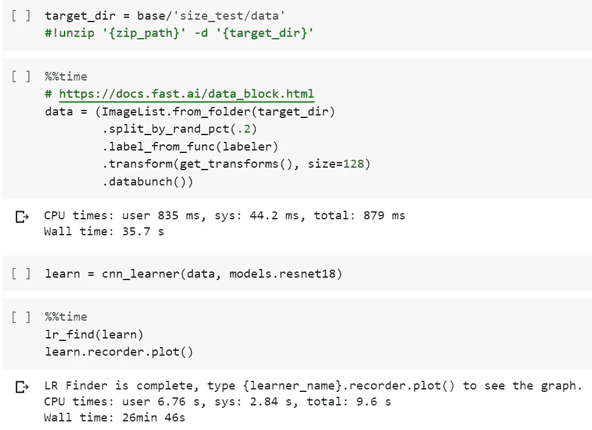

# 在 Google Colab 上加速你的图像训练

> 原文：<https://medium.datadriveninvestor.com/speed-up-your-image-training-on-google-colab-dc95ea1491cf?source=collection_archive---------0----------------------->

获得一个因素 20 加速训练猫对狗分类器免费！

Your time is valuable, you shouldn’t wait for file transfers!

# 有什么问题？

在我的一篇[帖子中，](https://medium.com/datadriveninvestor/setting-up-google-colab-for-deeplearning-experiments-53de394ae688)我详细介绍了如何使用 GoogleColab 和 GoogleDrive 建立深度学习实验的环境。

那时，我正在研究单变量时间序列。我的训练数据的总大小非常小，所以我没有意识到我的设置的这个特定问题:从驱动器向 Colab 复制文件需要花费很长时间。虽然这在处理非常小的数据集时没有问题，但当面对较大的数据时，例如图像分类时，这就非常烦人了。训练时间从“很长”到“由于驱动器超时而中止”。

 [## 深度学习用 7 个步骤解释-更新|数据驱动的投资者

### 在深度学习的帮助下，自动驾驶汽车、Alexa、医学成像-小工具正在我们周围变得超级智能…

www.datadriveninvestor.com](https://www.datadriveninvestor.com/2019/01/23/deep-learning-explained-in-7-steps/) 

然而，有一个解决办法，我在这篇文章中描述了它。为了证明它的有效性，我使用了来自 kaggle 的[猫对狗数据集。压缩后的培训目录总大小约为 500MB。解压后的目录并不大，有 550MB。](https://www.kaggle.com/c/dogs-vs-cats-redux-kernels-edition)

# 从驱动器加载:慢！

我将通过将数据集加载到 [fastai](https://www.fast.ai/) databunch 并运行学习率查找器( [lr_find](https://docs.fast.ai/basic_train.html#lr_find) )来测试性能。通常，这一步是任何学习任务中确定合理学习率的第一步。

上图展示了为数不多的成功尝试之一。在许多情况下，该过程只是因为“驱动器超时”错误而中止。当它起作用时，用了 20 多分钟。这里有什么问题？

尽管看起来 Drive 中的所有文件都在本地 Colab 上，但实际情况并非如此。每当您访问这些文件中的一个时，Colab 必须将它从您的驱动器实例转移到它自己的实例。简单的解决方法？在实验开始时，将您的训练数据复制到 Colab 一次。

# 解决方案:将数据复制到 colab 一次

处理大量小文件很慢。最好处理包含小文件的 zip 文件。计划是这样的:

*   将 zip 文件从驱动器复制到 Colab
*   在 Colab 中解压文件
*   删除 zip 文件以释放空间(在 Colab

所有这些都可以在大约 20 秒内运行的 3 行代码中完成(对于这个特定的数据集):

> zip _ path = base/' size _ test/cats _ dogs . zip '
> 
> ！CP“{ zip _ path }”。
> 
> ！unzip -q cats_dogs.zip
> 
> ！rm cats_dogs.zip

让我们一行一行地走一遍。

*   zip_path。如果你已经按照[这个](https://medium.com/datadriveninvestor/setting-up-google-colab-for-deeplearning-experiments-53de394ae688)教程设置了你的 Colab 环境，你就可以通过*基地*访问到顶层驱动器的路径。在这里，您需要指定包含培训数据的 zip 文件的确切路径。
*   下一行 **c** o **p** 将 zip_path 中的文件指向当前的工作目录(用点表示)
*   解压缩……解压缩存档文件。不要输入 **cats_dogs.zip** ，而是输入你的存档文件的名字。选项 **-q** 使其成为 **q** uiet 操作。否则，它会打印出解压缩到 Colab 中的每个文件的名称，这可能是您不想要的。
*   最后一行是档案。既然你已经解压了它的内容，你就不再需要它了。

现在，您的 Colab 环境中已经有了存档的内容。这对速度问题有帮助吗？确实是的！

拷贝、解包和删除归档大约需要 20 秒，并且每个会话只需执行一次。lr_find 过程不到 1 分钟。太好了，我们刚刚把训练速度提高了 20 倍！请注意，这意味着您不需要在 GoogleDrive 中“解压”您的训练数据。只保留压缩版就够了。

# 额外:拉链

但是如果没有压缩版呢？也许你不知道 Colab Drive 的这个限制，直接把数据集内置到 Drive 里？这发生在我跟 [fast.ai 第二课](https://course.fast.ai/videos/?lesson=2)的时候。它展示了如何通过编写 google search 脚本来构建数据集。您可以在 Colab 中运行这个程序，并将文件传输到驱动器。但是现在我们知道单个文件是不好的，我们如何创建？改为 zip？

一种方法是将所有训练数据下载到您的本地机器，压缩它，然后上传压缩文件。从技术上来说，这是可行的……但是它不是很优雅。如果你的互联网连接速度很慢(我当时就是这样)，这种方式并不可取。相反，您可以直接在 Drive 中压缩文件！以下是方法:

假设您的驱动器中有一个文件夹“top ”,其中包含一个文件夹“content”。您希望将“内容”压缩到“content.zip”:

创建一个笔记本，将其连接到驱动器，如这里所述。然后，运行以下代码:

> folder = base/'top/'
> 
> ！(CD“{ folder }”& & zip-r-q content . zip content)

这些行暂时将工作目录更改为“content”的位置，将“content”中的所有内容(包括子目录)压缩到一个名为“content.zip”的文件中。这个新文件将在文件夹“top”中创建。

就是这样！您只需创建一个包含培训数据的 zip 文件，无需下载任何内容。

## 解决纷争

一个常见的错误是在处理 Colab 中的路径时忘记了符号。有必要将任何指向您的驱动器的路径用引号括起来，因为它至少包含一个空格(“我的驱动器”)。

如果没有引号，Colab 认为空格表示命令的结束，这会导致一些有趣的失败消息。

另一个常见的错误是忘记花括号。用花括号将字符串括起来意味着引用 python 环境中的变量。所以“cp {test}”将复制本地变量“test”指向的任何路径。相比之下，“cp 测试。”将复制一个名为“test”的文件。

暂时就这样了。如果你的训练仍然需要很长时间，你可能需要使用类似 hd5 的东西。

如果您在遵循说明时遇到困难，请告诉我！