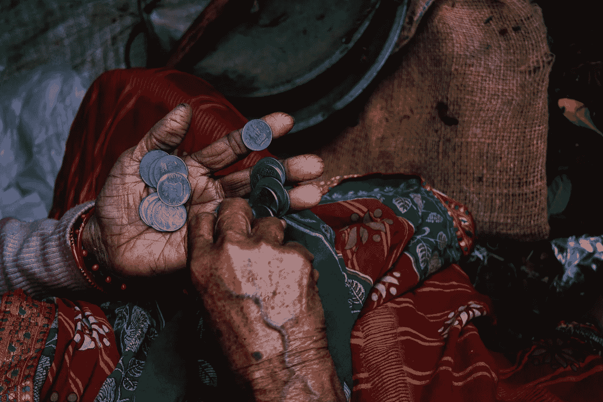
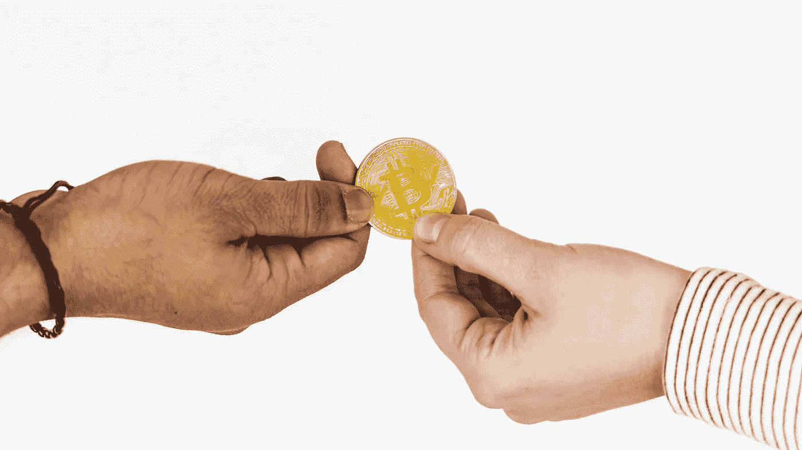

# 将比特币分成两个阵营——想要它的阵营和需要它的阵营

> 原文：<https://medium.datadriveninvestor.com/splitting-bitcoin-into-two-camps-those-that-want-it-and-those-that-need-it-a067cab8920a?source=collection_archive---------3----------------------->

## 加密货币和区块链技术——帮助没有银行账户和银行服务不足的人

Photo by [Riya Kumari](https://www.pexels.com/@riyakumari08?utm_content=attributionCopyText&utm_medium=referral&utm_source=pexels) from [Pexels](https://www.pexels.com/photo/person-holding-coins-874684/?utm_content=attributionCopyText&utm_medium=referral&utm_source=pexels)

在发达国家，我们的金融体系在很大程度上是有效的(除了 2007-2008 年中本聪用比特币解决的金融崩溃)。我们可能会诅咒费用，特别是在跨境或外汇交易中，一些交易不能在银行营业时间以外完成，等等。但在大多数情况下，如果它没有坏，为什么要修复它的系统。我们有监管银行系统的政府，它已经运作了很多年，所以我们真的没有花太多心思去寻找像比特币这样的银行替代品。许多人会说，我们不需要比特币这样的数字货币——我们想要比特币。

研究服务机构 YouGov Omnibus 最近的一项调查显示，一半的美国千禧一代对使用加密货币作为支付选项感兴趣，但最终他们不需要它——他们想要它。像脸书这样的公司也在争夺成为这些千禧一代的支付平台。考虑到这些公司的安全和隐私漏洞(通常是有意为之)，难道我们不想要一个更好的选择吗？

如果你住在委内瑞拉呢？委内瑞拉正处于一场大规模的金融危机中，该国货币迅速贬值，承受加密货币市场的波动比持有当地货币更可取。

[**本地比特币**](https://localbitcoins.com/)**一个用户可以相互买卖比特币的市场**据报道，在哥伦比亚、委内瑞拉和秘鲁，交易量呈指数级增长。上周，委内瑞拉本地比特币市场在过去 10 周内第八次创下交易量纪录。****

******无第三方干扰******

****比特币和其他建立在区块链技术基础上的加密货币最重要的好处之一是，政府和银行不能中断交易、没收或冻结账户——加密货币的这一特性对动荡地区的人很有吸引力。在委内瑞拉等经历恶性通胀的国家，加密货币正取得巨大进展。当普通民众更愿意将财富存放在非货币资产或美元等稳定的外币中时，就会出现恶性通货膨胀。然而，正如委内瑞拉的情况一样，由于政府的控制，获得外币的能力受到严重限制，这使得比特币和其他加密货币成为一种受欢迎的替代货币。有人可能会说，这些地区需要比特币这样的银行替代品。****

## ******区块链、加密货币&比特币——无银行账户和银行服务不足者的金融选择******

****你有没有想过，如果我们没有基本的银行服务，生活会是什么样子？****

****虽然许多人认为现代电子银行的便利是理所当然的，但实际上很大一部分人缺乏银行服务。根据美国联邦存款保险公司(FDIC)2017 年[报告](https://economicinclusion.gov/downloads/2017_FDIC_Unbanked_HH_Survey_Report.pdf)，超过 25%的美国人要么根本没有银行账户，要么无法使用他们的账户来满足他们所有的金融需求。当你看到没有美国富裕的国家时，这个问题只会变得更加紧迫。根据[世界银行全球 Findex 数据库](https://globalfindex.worldbank.org/)的最新数据，全球约有 17 亿成年人无法使用银行服务。****

********

****Photo by [Vladislav Reshetnyak](https://www.pexels.com/@vladislav-reshetnyak-66283?utm_content=attributionCopyText&utm_medium=referral&utm_source=pexels) from [Pexels](https://www.pexels.com/photo/full-frame-shot-of-eye-251287/?utm_content=attributionCopyText&utm_medium=referral&utm_source=pexels)****

******改善每个人获得金融工具的途径******

****无法获得银行账户是一个主要问题，以至于联合国将它列为其 17 个可持续发展目标中的 7 个目标的重要组成部分，以鼓励全球贫困国家的可持续发展。但是，可持续发展变得更加困难，因为大型银行继续主导金融格局，许多银行要么减少了在贫困地区的存在，要么由于高成本和高风险而完全撤出。生活在这些服务水平低下地区的人们仍然需要银行的安全保障，但却连基本的网上银行服务都无法获得。除了获取我们认为像支票兑现这样的基本金融服务的困难之外，许多人缺乏获得这些基本银行服务的基本身份证明。****

****如果你曾经丢失或被盗过身份证，你就会知道更换它有多痛苦。对于那些生活贫困的人来说，在获得或更换身份证明时还有许多其他障碍，包括一开始就没有适当的文件、高昂的费用、语言障碍、缺乏家庭或社会关系来核实身份证明等。****

****无法核实他们是谁迫使无家可归者和生活在贫困中的人生活在一种系统隐形的状态中，这可能导致被剥夺医疗保健和住房等基本服务。****

## ******区块链技术帮助没有银行账户和银行服务不足的人******

****根据维基百科，区块链是建立比特币的技术，是一个不断增长的记录列表，称为 T2 区块，使用加密技术链接。每个块包含前一个块的加密散列、时间戳和事务数据(通常表示为 merkle 树根散列)。根据设计，区块链可以抵抗数据的修改。它是“一个开放的、分布式的分类账，可以有效地、可验证地、永久地记录双方之间的交易”****

****区块链技术的透明度和效率使其成为帮助解决无银行账户和银行服务不足者面临的一些最大挑战的有吸引力的选择。****

****加拿大软件解决方案公司 [Smart Sapien](https://smartsapien.io/) 一直致力于基于区块链的数字身份和市场解决方案，以解决无家可归的年轻人面临的身份识别和其他挑战。该倡议被称为“乌云背后的幸福线”,其工作原理是创建一个无处不在的身份识别源，即带有支出控制的数字现金。****

> ****“通过以我们现在的速度拥抱技术，我们正在经历人类历史上最大的变革之一。通信现在是免费的，无国界的，我们日常生活的购物，看电影和社交都是建立在技术上的，我们现在使用技术进行教育和改善我们的健康，但是没有国家身份解决方案提供个人是谁的基本证明-我们已经创建了一个每个人都是匿名的数字世界。区块链是一项革命性的技术，能够在数字世界中创建这种唯一的身份，并从我们从上面列出的服务列表中抵消的数据中创建无处不在的价值来源。我相信，区块链将在减少世界贫困人口方面发挥重要作用，同时帮助不太幸运的人接受更多教育，并与他人交流，以加快康复过程。”- [**马特·欣克利**](https://www.linkedin.com/in/matthewhinkley/) **，首席执行官 Smart Sapien &联合创始人兼首席执行官 Liquidus******

******利用区块链的优势:******

****—不需要物理分支****

****—不需要复杂或昂贵的基础架构来运行网络，最终降低了费用****

****—提高了透明度****

****—交易速度****

****—财产证明、土地所有权、身份证明、交易记录和其他重要文档可以存储在区块链上，减少了纸面文档被破坏的机会****

****—分散化——不受任何政府或其他实体的控制。包括跨境支付在内的交易可以直接向需要的人进行****

****—支持区块链的贷款为更多用户提供了更安全的个人贷款方式，这将使贷款流程更便宜、更高效、更安全****

********

****Photo by [rawpixel.com](https://www.pexels.com/@rawpixel?utm_content=attributionCopyText&utm_medium=referral&utm_source=pexels) from [Pexels](https://www.pexels.com/photo/two-person-holding-bitcoin-1266022/?utm_content=attributionCopyText&utm_medium=referral&utm_source=pexels)****

## ****比特币****

****比特币是第一种流行的加密货币或数字现金，不需要中央银行或单一管理员，可以在用户到用户、点对点之间发送，不需要第三方服务商。像[比特币](https://bitcoin.org/en/)这样的加密货币为没有银行账户/银行服务不足的问题提供了一个可行的解决方案。它对设置要求很低——至少需要一部手机和互联网连接。[比特币](https://bitcoin.org/en/)提供了效率、成本、速度、安全性，最大限度地减少了第三方的腐败机会，并且是无国界的。****

****无论是比特币、以太坊、Ripple 还是另外一两种加密货币最终成为价值转移中使用的主要数字货币，还是脸书，或者根本没有，这将是另一个讨论的问题。****

> ****“影响货币的银行盈利能力和社会政治问题的根本问题，以及它如何影响最需要帮助的人，是我们许多区块链技术领域的人面临的紧迫挑战。这一切都归结为一件事——我们寻找安全和稳定(庇护所和食物)的原始本能。目前，区块链和加密货币为没有银行账户的人提供了一种可行的解决方案。我们不知道它是否是可持续的问题解决者，但我们知道，此时此刻，没有比它更好的了。”–[安娜·尼米拉，CryptoChicks](https://www.linkedin.com/in/anna-niemira-733a32126/) 的业务发展总监****

****[螺旋营销&公关](http://www.spinspirational.com)****

****[奥黛丽·奈斯比特在领英上](https://www.linkedin.com/in/audrey-nesbitt-0388a52a/)****

****[@ audreynesbit 11 在推特上](https://twitter.com/AudreyNesbitt11)****