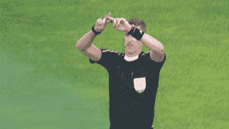
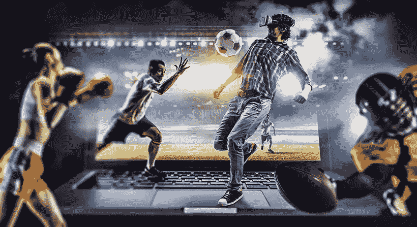

# 体育 2.0:数字化世界的体育变革(安迪·米亚)_ 书评

> 原文：<https://medium.datadriveninvestor.com/sport-2-0-transforming-sports-for-a-digital-world-andy-miah-book-review-680f0bdf5988?source=collection_archive---------25----------------------->

这本书是我 2018 年的第一本书，当然也是扣人心弦的一本书。我希望不久之后，国际组织会像我一样投入到体育 2.0 的体验中，在这个网络中分享我的重要见解。如果你是一名营销经理，正在或渴望为洛桑的奥林匹克联合会工作，这本书绝对适合你。当我正在解读安迪·米亚教授的作品时，一盏灯熄灭了:尽管我们可以说技术改变了运动，但革命才刚刚开始。我希望你离开这篇文章时，带着比你进来时更多的问题。所以用你赤裸的胸膛和我在一起。

在今天的体育文化中，运动场仍然是观看精彩运动员表演和庆祝胜利的最佳场所。行动在观众的眼前展开，尽管我们中的许多人低头使用手机来获得游戏的长期在线体验。一些体育项目也转向集体数字调解，以提高公平性，并最终提高球迷忠诚度。典型的例子是网球，以及最近的足球，它对支持者在看台上和其他地方的行为产生了瞬间的影响。进球，足球的高潮，现在在视频助理裁判(VAR)的帮助下重新配置和保证。

Miah 认为，与此相反，数字技术的使用正在改变体育文化中的某些价值观，这可能导致人们对观看比赛的纯粹身体体验缺乏兴趣。不仅是视频裁判助理，可穿戴技术和这些设备产生的大量数据也在增加竞争对手之间的平等性和事件的可预测性，这对该行业来说是一个商业杀手。在不久的将来，前 10 名选手之间的差异越来越小的田径赛事的故事可能会比所有超媒介接触、POV 体验、现场数据显示、增强现实、重播、在线参与和虚拟现实更少向公众透露。

为了说明体育和数字技术的绝对融合，教授引用了世界上第一个电动街道赛车系列 Formula E 的例子。在这个国际汽联认可的类别中，赛车的性能会受到观众热情的影响。通过这个网站，车迷们可以在比赛前投票来提高他们最喜爱的车手的表现。得票最多的三名车手将各获得一次五秒钟的功率提升，暂时将他们的汽车功率从 150 千瓦提高到 180 千瓦。这些新颖的命题让我们可以对运动员和观众之间的关系做出新的假设，其中之一就是营销部门在比赛领域可能产生的影响。

> 鉴于运动员的表现不再仅仅通过耐力水平来衡量，还可以通过他们的数字媒体表现来衡量，想象新技术将稳步融入传统体育的未来是天真的。相反，在米亚看来，更合理的设想是，现有的体育项目将会进化，全新的体育项目将会因新的技术可能性而发展。

这些转变的细节在电子竞技的大规模增长中尤为明显，电子竞技已经开发出自己的货币化、体育展示、广播和独特品牌体系。新形式的体育模拟游戏通常与玩电脑游戏的负面先入为主的观念联系在一起，即仅仅提倡久坐不动的生活方式或反社会行为，这种新形式的体育模拟游戏使游戏支持更积极的生活方式成为可能。可以说，物理数字文化的最新趋势满足了新一代运动员的需求，他们以数字方式构成，并致力于体育活动。

例如，虽然射箭等传统的奥林匹克运动被指出主要是脑力而不是体力，但国际奥委会需要推进关于将电子竞技纳入奥运会项目的对话。鉴于体育组织面临着适应新的媒体权力层级的挑战，第三方社交媒体平台对于吸引数字化驱动的千禧一代观众变得至关重要，关于电子竞技是否是一种身体活动的讨论显然已经被克服了，现在似乎已经不重要了。数字世界中的运动正与现实世界体验中的身临其境相匹配。事实上，米亚教授断言，它们甚至可能更加身临其境，比真实生活更好。

不仅仅是对体育行业的建议， *Sports 2.0:为数字世界转变体育运动*应该激励领导者重新思考数字文化中物理空间的配置，并理解拥抱数字技术的完整过程。虽然数字营销人员正在部署一些现有的工具来增强观众的体验，但现在开始讨论创建一个相当于传统奥林匹克运动的电子竞技可能还为时过早。在快速变化的数字世界中，我们最好预测今天，赶上明天。

如果你喜欢这篇文章，请随意点击“喜欢”按钮。