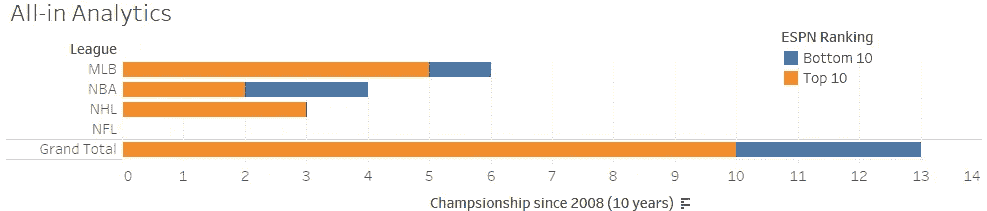
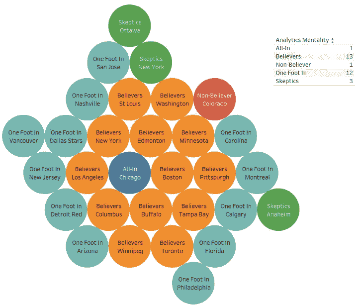
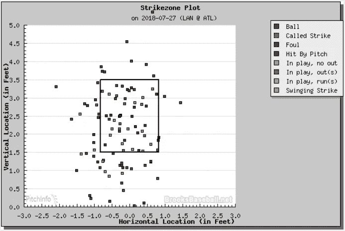
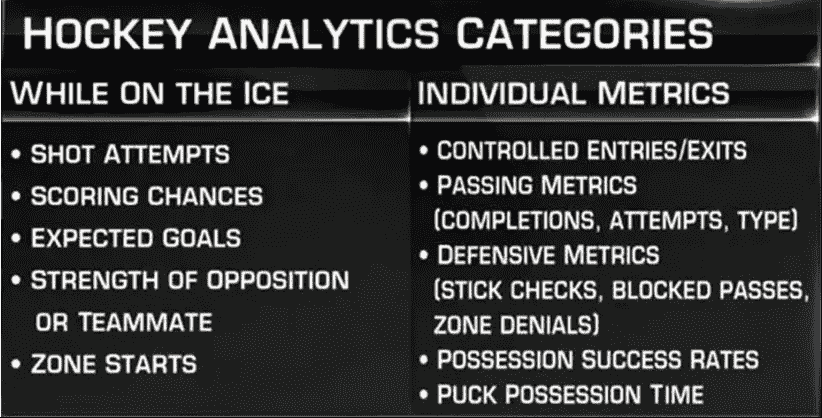

# 体育分析:

> 原文：<https://medium.datadriveninvestor.com/sports-analytics-b3e02738b8ce?source=collection_archive---------6----------------------->

## 探究为什么曲棍球没有利用分析，而其他运动却利用了

## 介绍

在一个数据革命更加迅速和繁荣的经济中，为什么像美国职业棒球大联盟(MLB)、国家篮球协会(NBA)、国家橄榄球联盟(NFL)和许多独特的联盟这样的体育联盟已经利用了统计分析和分析，而国家曲棍球联盟(NHL)只是触及了表面？是因为曲棍球运动发现自己缺乏丰富的数据吗？相反，这是因为数据和指标还没有很好地定义吗？也许这是因为这项运动更流畅，不像 MLB 那样有更少的规则和限制。而且，曲棍球管理的是领导约束吗？我相信最重要的是参与限制曲棍球应该提升到的范式转变。然而，近年来，早期采用者使用分析的成功使得剩余的大多数人和怀疑论者能够利用数据驱动的决策，作为他们团队自上而下的文化的一部分。在这篇文章中，我将谈到曲棍球分析的挑战，以及利用数据分析使 NHL 俱乐部受益的机会。

## 为什么 MLB 是体育分析的早期采用者，而 NHL 是落后者

在我列举曲棍球为什么没有利用分析的原因之前，我想解释一下 MLB 为什么利用了。《金钱球》( Moneyball)是一部根据奥克兰运动家队总经理比利·比恩的小说改编的电影，通过改变领导文化，他的分析策略在 MLB 团队中产生了共鸣。比利的任务是与一流的 MLB 俱乐部、纽约扬基队和波士顿红袜队竞争。这些俱乐部会所不相信工资资本，他们的工资总额在 2 亿到 3 亿美元之间。运动家队的资金上限不到 5000 万美元，比利·比恩不得不做不可思议的事情。他明白他不能签署全明星，因为他们相关的资金紧张的合同，必须复制他需要赢得球赛的一样东西，运行。为了得分，他需要能上垒的球员。他利用的是球员能够上垒的能力/百分比(OBP)。然而，他并不是仅仅通过管理他的俱乐部来实现这一目标的。比利不得不通过更换领导层来做到这一点。当他不听他的球探、高级主管、团队报告等的时候，领导的改变第一次完成了。他脱离了传统的流程。他聘请了艾维大学的毕业生彼得·布兰德(Peter Brand ),这是由比尔·詹姆斯(Bill James)的“棒球统计学原理”驱动的，他随后查看了比赛中棒球统计数据的实证分析。这位分析师只是克利夫兰印第安人俱乐部的另一个无名小卒，最终成为他的总经理助理，比利的得力助手。你可能会问，为什么要听一个艾维统计学毕业生的话，而不是听经验丰富的球探和几年来 MLB 球队的领导人的话？这是因为 Billy 知道他需要文化上的改变，他要求团队善于分析和计算。而不是对球探有直觉或者“一直都是这样”的态度。此外，比利相信这种领导力的转变会奏效。在进入大联盟之前，他曾是一名备受推崇的选秀状元。然而，他没有达到宣传的效果，也没有接受观察一个球员是否能在高强度的情况下比赛不仅包括球探，还包括更多的参与。比利和彼得研究了成功球员的细微特征，从他们个人的角度，而不是靠运气或过去的成功。“运气”和“过去的成功”的意思是，球员因为他们的同龄人而被描绘得更好，或者由于许多因素而有一个成功的爆发赛季，但没有持续下去。此外，他们还研究了为什么那些在低轮被选中的球员，或者由于公众认知差而不受其他俱乐部欢迎的球员，却拥有不可阻挡的工具。在整部电影中，彼得不断地向比利传递信息，告诉他应该收购谁，交易谁，在游戏 x 中扮演谁。这需要时间，但他的俱乐部最终成为一股不可忽视的力量。在一个赛季中，他们连续赢了 20 场比赛，打破了 102 年的记录。虽然比利的管理未能带领他们获得世界职业棒球大赛冠军，但他们显然通过数字改变了比赛，打破了现状。在电影接近尾声时，波士顿红袜队的总裁找到了 Billy，向他灌输了管理团队的分析领导力。当比利拒绝了他的慷慨提议时，波士顿红袜队聘用了比尔·詹姆斯，并在第二年赢得了冠军。具有讽刺意味的是，看到分析是如何被用来赢得冠军的，这在许多年前曾被视为轻而易举的事情最终导致了一支球队的胜利。那么，为什么棒球如此接受实现分析的想法，而曲棍球却无动于衷？

棒球是一种通过渐进动作进行的游戏，你必须等待一个球员做“x”才能让另一个球队做“y”，无论是击球、抢断、投球等等。更不用说，棒球基本上有四个步骤来跑垒，一垒、二垒和三垒，直到跑垒。曲棍球也有进步的动作，但它更流畅，更难追踪。曲棍球只有一种方法可以领先一分，那就是将冰球入网(即跑动)。然而，有许多方法可以实现这一壮举。换句话说，我脑海中有几个场景可以让你得分，不像棒球，你必须一步一步地得分(即一垒接一垒，然后是本垒)。用曲棍球；你可以稳稳地德科几名球员，或者你可以创造几个传球机会让守门员打开空位，或者你可以从蓝线(对手的进攻区)的顶部射门，有各种各样创造性的得分方式。相反，最重要的是，与棒球中的一个投手对一个击球手不同，曲棍球有更多的比赛维度，冰上最多有 12 名球员(包括守门员在内，每队 6 名)，或者在任何给定的时间最少有 8 名球员(powerplays，加时赛)。这样，你改变了得分的方式，补充的是每个球员都有能力移动到他们想去的任何地方(除非是越位)来创造得分机会。这已经改变了游戏的动态，你有 4 个额外的玩家(相比于 1 个)可以得分，他们不限于基地和游戏规则。因此，棒球更容易追踪统计数据，而且多年来他们一直在合法地这么做。由亨利·查德威克领导的 box score 对 1859 年的比赛进行了统计总结，记录了击球、保送、投球、击球、跑垒等。对于游戏中的每个玩家。另一方面，对于曲棍球，这些一维统计数据很容易记录(进球和助攻)，但这无法显示球员如何通过滑冰、传球、退出/进入区域来实现进球的真实故事。如前所述，曲棍球很难跟踪这些统计数据。它只是比棒球更有活力，在棒球中，你有三次出局，然后轮到对手进攻。曲棍球是不可预测的，每一次失误，冰球比赛，抢断，失误等等。是另一个给其他玩家得分的机会。

抛开这项运动的本质，让我们深入探讨一下这两项运动的管理。看看 MLB 和 NHL 的所有者名单，他们都有相似的特点。业主不是这项运动的前玩家，而是投资、房地产、制药和其他行业的巨头。但是它们是如何运行的呢？这两项运动的管理方式不同。MLB 再次由商业领袖管理，而曲棍球，大部分是由前球员经营的。正如文章中所指出的，分析作者 Rob Vollman 指出，他认为 NHL 团队不会为分析而烦恼，因为他们为什么要这样做，正如他所说:

> ***“我想象以前的冰球运动员会说，‘我不需要它。那么为什么现在的玩家需要它呢？…这是一贯的做法。从来没有出现过问题。”***

此外，沃尔曼解释了大多数 NHL 俱乐部是如何不认真对待分析的，他证明这不仅仅是处理数据，还有更多深度——这是在干草堆中找到宝石的能力，因为曲棍球俱乐部是如此受限制。他们也像奥克兰运动家队一样，在有限的工资帽下，很难找到联盟中最好的球员。要做到这一点，你需要能够通过数字的细节和如何衡量他们来找到在低轮被选中的球员，或者在另一个球队的名册上被忽视的球员。正如 Rob 之前所说，不是“全进”或“信徒”的 NHL 俱乐部永远不会从分析中完全受益。你不能只“一只脚”投入到分析中。单靠分析无法将你的 NHL 俱乐部带到新的高度，你必须自上而下地接受。这意味着，领导要为工具、分析专业人员和数据库管理能力注入足够的资源/预算，以正式传达调查结果和见解，作为这些总经理制定决策的基础。然而，有时沟通并没有被恰当地使用。根据定义；沟通需要“双方交换信息”。因此，为了使分析更有优势，需要教练/球员/管理层和分析部门之间的双向沟通。只有在分析团队和高级管理层共同努力理解需要回答或提供见解的正确问题的情况下，花费在开发供 GMs 使用的数据和见解上的所有工具和资源才是有益的，否则 GMs/管理层/参与者不会利用他们所掌握的工具。甚至对于 NHL 团队来说，投资分析似乎也很麻烦，正如迈克尔·洛佩兹博客中的一位受访者引用的那样，他是一位博士统计学家:

> ***“他们在球员身上花费了数亿美元，在教练和工作人员身上花费了数千万美元，但 1 万美元对于一台电脑或一些数据来说是一笔很大的支出，”一位曾与 NBA 球队合作的体育分析专家说***[***【2】***](#_ftn2)

*NBA 是体育分析的先驱之一，他们不相信花在这种“非正统”的球队管理方式上。如果他们不愿意花钱，NHL 球队会怎么想，在球员合同上的整体预算更少？当大部分都是以前的玩家经营的时候？*

*NHL(当然还有其他联盟)需要理解的是；它不仅适用于高层管理人员，也适用于教练和球员。分析随着体育运动而发展，它将继续发展，变得更快、更易获得、更高效，并有望更加有效。过去有一些团队、管理层和教练使用过分析，并从中获得了成功。随着团队承认竞争对手的成功，非分析驱动的 NHL 俱乐部的所有者和主席现在开始接受这些倡议，并*适当地为分析*做预算，以及改变他们的领导或对这些新时代战略的看法。值得注意的是，尽管波士顿红袜队和奥克兰运动家队都有自上而下灌输分析的领导能力。波士顿红袜队有资源资本获得最好的(分析上有利的)球员——而奥克兰运动家队没有。如果你提供足够的资源和文化，很难忽视体育分析在曲棍球中的影响。*

# *NHL 中分析的机会和前景*

*到目前为止，曲棍球队已经更加适应体育分析，并试图围绕这项运动改变他们的文化。在 ESPN 的一篇文章“伟大的分析排名”[【3】](#_ftn3)中，追溯到 3 年前，他们列出了所有联盟中“前 10 名”和“后 10 名”球队的名单，这些球队要么是 A)“全进”，B)“相信”，C)“一英尺进”，D)“怀疑”，E)“不相信”。正如你所想象的，大多数“前 10 名”都不是 NHL 俱乐部；5 个由 MLB 队、4 个 NBA 和 1 个 NHL 俱乐部组成。这份榜单的前 10 名如下:*

1.  *费城 76 人队(NBA)*
2.  *休斯顿太空人队(MLB)*
3.  *休斯顿火箭队(NBA)*
4.  *坦帕湾光芒队(MLB)*
5.  *波士顿红袜队(MLB)*
6.  *纽约洋基队(MLB)*
7.  *圣安东尼奥马刺队(NBA)*
8.  *达拉斯小牛队(NBA)*
9.  *奥克兰运动家队(MLB)*
10.  *芝加哥黑鹰队*

*如果你像我一样是一个体育迷，你会明白这个名单上的大多数球队都是成功的，并且在过去 10 年里在各自的联赛中具有竞争力。对于那些尚未赢得冠军的球队来说，这是触手可及的，但请注意，这再次取决于他们的分析团队结构的成熟度，以及他们的高级领导层如何规定分析将成为管理层、教练和球员前进的支柱和支持者。在实施了“全进”分析战略并成为该领域先锋的团队中，他们在过去十年中获得了冠军，最早可追溯到 2008 年。下图显示了每个联赛的分类，包括他们的冠军。在总共 13 个冠军中，我们可以看到 10 个冠军是带着“全押”的心态赢得的(进入前 10 名名单)，3 个冠军没有。在 3 个以“非信徒”心态赢得的分析中被授予；其中两个总冠军是由科比带领洛杉矶湖人队在 NBA 赢得的，这可能是由于他的领导能力和技术而被扭曲了，但我跑题了。如果我们仔细观察 NHL 锦标赛；芝加哥黑鹰队赢得了 3 次斯坦利杯。现在还要注意的是，在 NHL 中，没有任何其他球队赢得其他斯坦利杯，而是进入了分析驱动团队的前 10 名。所有这三个奖杯都是在芝加哥黑鹰队总经理斯坦·鲍曼(Stan Bowman)于 2009 年聘请第三方咨询公司提高/评估他们的控球/投篮统计数据(如“Corsi”和“Fenwick”)后赢得的，从那时起，他们在 5 年内建立了一个拥有 3 个奖杯的王朝。“Corsi”的非正式定义是:*投篮命中率差，得分超过 50%，意味着你的球员和/或球队比其他对手投篮更多——100%的“Corsi”是一场比赛的总投篮次数*。人们认为，如果你比你的对手投篮更多(Corsi 高于 50%)，那么你就更有可能创造得分机会。*

**

*从那以后，当你看到 NHL 球队转向分析时，你可以看到加入该协议的球队的演变，我在下面创建了一个 ESPN 排名图，显示了 30 支球队的分析心态。有将近一半，14 个团队“全身心投入”或“相信”对整个领导团队的球员进行分析，然而，其余 16 个团队要么投入一半(12 个“一英尺英寸”)，要么 3 个“怀疑者”和 1 个“不相信者”)。请注意，这些是 2015 年公布的统计数据，从那时起，亚利桑那州郊狼队(Arizona Coyotes)这支属于“一英尺英寸”类别的球队，通过聘请曲棍球分析公司“Statletes”的创始人约翰·查卡(John Chayka)担任总经理，“全押”了，使他在 26 岁时成为 NHL 历史上最年轻的总经理。因此，这将意味着他们的领导层正在朝着这个方向发展，从那时起，你可以肯定他所做的所有决定都是经过深思熟虑的，而不仅仅是基于他管理球队的球探。多伦多枫叶队也在领导层发生了类似的转变，他们聘请了另一位年轻且痴迷于分析的人凯尔·杜巴斯(Kyle Dubas)担任他们 10 亿美元球队的助理总经理——快进到今天(4 年后)，他现在被列为运营俱乐部的总经理。*

**

*枫叶队和郊狼队手中都有两个人睡在曲棍球分析中，他们对这项运动充满热情，关于如何利用数据和见解来表现更好，并支持良好的感知想法。然而，他们并不孤单，也不应该孤单，因为随着更多团队变得更加计算化，数据更加实时可访问，这个领域正在等待起飞——这些团队将更具竞争力，更适合竞争。有一些狂热分子的文章和博客准确地记录了带着冰球和不带冰球等进入禁区的数据。然而，他们需要大量的工时和奉献精神来逐帧观看每场比赛。一场 60 分钟的常规比赛至少需要几个小时，然后乘以赛季中最少的 82 场比赛(如果球队进入季后赛，那就需要更多的视频跟踪工时)。*

*直到最近，枫叶队才实施了运动跟踪摄像机来跟踪空间信息，如球员在比赛中的运动，就像他们在 NBA 中所做的那样，在 NBA 联盟中，前 10 名球队中有 4 支球队在分析中“全押”。不管是什么运动，视频都包含了可以通过神经网络算法捕捉的指标。这些算法将通过查看每一帧来识别游戏过程中发生了什么。然而，曲棍球的游戏将比棒球有更多的节点。在棒球运动中，击球手的球运动将决定以下输出，但不限于:1)一垒打，2)二垒打，3)三垒打，4)保送，5)一击即中，6)三振出局。如何首先确定这 6 个输出是通过球场周长的输入。像 MAR I/O 神经网络视频一样，我们可以通过画布上出现的白色方框[【4】](#_ftn4)来可视化机器如何确定其输入。然而，在本例中，输入将是来自摄像机的非结构化数据。此外，还有一些 MLB 工具，如 Pitch F/X 和 Field F/X，可以向您显示任何日期、比赛、投球统计数据以及投球速度、投球类型、释放点等详细信息。这使得棒球在分析上比曲棍球更先进。下面是一个很好的例子，展示了如何定义棒球好球带，以及如何方便球员击球。*

**

*回到我之前提到的曲棍球，它更加流畅。曲棍球运动员在进球方面有更大的灵活性。虽然相机在游戏过程中捕捉类似的空间信息，但这一次有更多的玩家。想象一下，一个击球手的球移动到了框架中他可以传给的其他 4 名球员，并增加了更复杂的事情，6 名其他球员可以阻止进球(5 名前锋，1 名守门员)。为了给国家冰球联盟目前正在关注的事情提供一些背景，下面的图片列出了一些重要的[【6】](#_ftn6):*

**

*在视频中，“今夜非霍奇金淋巴瘤”的工作人员带来了这些项目，曲棍球队今天正在跟踪，但是球队没有能力自己做到这一点。有一家公司 Sport Logiq，总部设在蒙特利尔，他们在 NHL 的大部分时间里实时跟踪这些指标。他们已经建立了复杂的机器学习算法来跟踪上面列出的极其精细的细节。这些粒度数据点可以归结为玩家的手部动作，这些动作都是以与 MAR I/O 示例相似的方式确定的，从非结构化数据到结构化数据，然后从这些数据点得出如下输入:“棍检”、“拦网传球”、“传球”、“射门”、“传球完成”，还有几个。然而，与 MAR I/O 示例不同的是，显然有更多的非结构化数据和更多的输出，但 Sport Logiq 显然已经改变了游戏，因为它能够实时做到这一点，并且不再依赖于人类直观地观看镜头，人类现在只需验证机器学习算法发出的信息是否有效。*

*最后，我认为曲棍球落后的另一个原因是这项运动的性质，以及人们如何只跟踪典型的统计数据；射门次数、+/-评分、上场时间(TOI)、助攻、进球等。—所有这些统计数据都以陈旧的方式管理，需要清理和处理[【7】](#_ftn7)。直到你认真对待本质细节，并找到上述新指标之间的相关性，你才能进行体育分析。首先必须确定这些指标，并发现它们与目标机会相关，然后它们将利用分析来提供洞察力，我相信曲棍球直到最近才出现。*

*虽然存在挑战，但这些挑战使我们成为人类，有能力征服并将障碍推向下一个进化水平。它也可能是乐观的，因为有新技术可以提供更好的数据，从而为开发人员和最终用户提供更好的整体分析体验。2015 年 NHL 全明星赛中使用了冰球传感器和球员标签，展示了跟踪球员速度和获得冰球指标的能力是多么容易-类似于 MLB 跟踪他们的球的运动。想象一下，在几年内，NHL 可能不是落后者，而是利用体育分析的联盟中的常态。*

# *结束语和结论*

*曲棍球分析已经发展到这种状态，但它能继续前进吗？我相信肯定可以。成长的机会受限于它的监督和指导。仍需要领导团队的认同，以理解这是未来的常态。无论这是通过领导层的变化还是接受将欢迎分析纳入管理决策和游戏中的战略战术来实现的，都需要加以解决。只有通过接受和参与，分析才能成为游戏规则的改变者——它必须成为团队文化的一部分。一旦被管理这些俱乐部的总经理和总裁认真对待，预算、资源和工作人员是否会有任何阻碍。随着技术的创新，建立更先进的跟踪设备，如冰球传感器或球员标签，数据将更容易访问和理解。此外，使用神经网络是非常复杂的算法，仍然不是 100%准确。这是对可能发生的事情的一个很好的估计，但是它的输出仍然需要通过人类来验证。通过实施这些创新的传感器，我们可能已经将这些神经网络所需的质量控制数量之间的差距最小化。通过利用传感器技术，基于球员/冰球运动的数据将比机器从非结构化数据中描述的数据更准确。一旦分析超越了这种糟糕的数据和跟踪机制的驼峰，那么将会有更好、更干净的数据来执行分析、分析以及最后的机器学习算法。在那之前，我们作为分析专业人员和数据驱动型个人需要继续设立标杆并推动买入。一旦实现这一目标，我们将彻底改变这项百年运动的玩法。*

*[【1】](#_ftnref1)[https://www . the star . com/sports/leafs/2018/08/04/NHL-not-invested-in-the-numbers-when-it-to-analytics . html](https://www.thestar.com/sports/leafs/2018/08/04/nhl-not-invested-in-the-numbers-when-it-comes-to-analytics.html)*

*[【2】](#_ftnref2)[https://statsbylopez . com/2017/01/15/whats-it-like-to-work-in-sports-analytics/](https://statsbylopez.com/2017/01/15/whats-it-like-to-work-in-sports-analytics/)*

*[【3】](#_ftnref3)[http://www . ESPN . com/ESPN/feature/story/_/id/12331388/the-great-analytics-rankings](http://www.espn.com/espn/feature/story/_/id/12331388/the-great-analytics-rankings)*

*[【4】](#_ftnref4)[https://www.youtube.com/watch?v=qv6UVOQ0F44](https://www.youtube.com/watch?v=qv6UVOQ0F44)*

*http://www.brooksbaseball.net/pfxVB/pfx.php?month=7&day = 27&year = 2018&game = GID _ 2018 _ 07 _ 27 _ lanm lb _ atl MLB _ 1% 2F&pitch sel = 477132&prev game = GID _ 2018 _ 07 _ 27 _ lanm lb _ atl MLB _ 1% 2F&prev date = 727&league = MLB*

*【https://www.youtube.com/watch?v=-qyPlt983Vw】*

*[【7】](#_ftnref7)[https://statsbylopez . com/2017/01/15/whats-it-like-to-work-in-sports-analytics/](https://statsbylopez.com/2017/01/15/whats-it-like-to-work-in-sports-analytics/)*