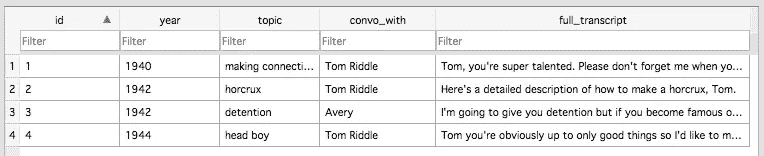
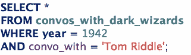
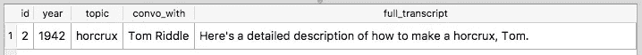
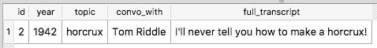
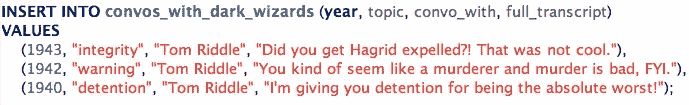
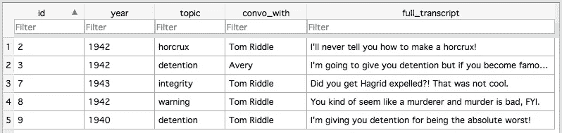

# SQL 101:与冥想盆中的记忆互动

> 原文：<https://medium.datadriveninvestor.com/sql-101-interacting-with-the-memories-in-your-pensieve-80051be6c34c?source=collection_archive---------6----------------------->

如果你读过我之前的帖子[魔法咒语和面向对象编程](https://medium.com/datadriveninvestor/magic-spells-and-object-oriented-programming-934d6c971e6d)，你就会知道你施展的每个咒语实际上都有大量代码在幕后运行。但你可能不知道的是，与冥想盆中的记忆互动也需要大量的代码。

SQL，或结构化查询语言，可以用来添加、编辑、读取和删除你的冥想盆中的记忆。麻瓜使用 SQL 与数据库进行交互，这与冥想盆非常相似。

像数据库一样，养老金计划被组织成各种相关信息的表格。例如，霍勒斯·斯拉格霍恩的冥想盆/数据库可能有诸如`fav_self_transfiguration_memories`、`top_potions_successes`、`convos_with_dark_wizards`和`famous_ppl_i_know`的表格。下面先睹为快他的`convos_with_dark_wizards`表:

# 从冥想盆/数据库中读取

你是霍勒斯·斯拉格霍恩，邓布利多刚刚找到你，说他想看看你 1942 年`convos_with_dark_wizards`桌子上的一张唱片。他说是和汤姆·里德尔的一次谈话让他走上了成为伏地魔的道路。邓布利多和他的戏剧🙄。不过，在你让他接触它之前，你想自己看一下。要访问该特定表中的所有记录，可以运行以下 SQL 查询:

`*`字符表示表格中的所有列。所以上面的查询读起来很像英语:从`convos_with_dark_wizards`表中选择所有内容。但是这并不能真正帮助您找到您正在寻找的特定记录。您需要在您的查询中添加一个`WHERE`子句，使其更加具体。

现在您已经成功地从数据库中提取了适当的记录，您可以看看`full_transcript`字段。

啊哦。邓布利多也许说得有道理…

# 更新冥想盆/数据库中的记录

你现在意识到在你把这张唱片交给邓布利多之前，你需要做一些改变。您可以使用以下 SQL 语法更新您的 pensieve/数据库中的记录:

我们可以从前面的`SELECT`语句的输出中看到，我们正在处理的记录的`id`是 2。因此，我们可以通过包含`WHERE id = 2`子句的`UPDATE`语句来操作该特定记录。现在，当您查看该记录时，您将看到更新后的`full_transcript`值:

完美。邓布利多永远不会知道其中的区别。

# 从冥想盆/数据库中删除记录

现在你已经决定，你最好继续前进，删除所有其他记录，把你和伏地魔联系起来。显然他*是*难以置信的出名，但即使是霍勒斯·斯拉格霍恩也有标准。您可以使用以下 SQL 查询来实现这一点:

这将从`convos_with_dark_wizards`表中删除所有记录，其中`convo_with`值为 Tom Riddle，*不包括邓布利多要求查看的*记录(`!=`表示不等于)。

# 向冥想盆/数据库添加记录

当你这么做的时候，你也可以通过在你的`convos_with_dark_wizards`表中添加一些新的记录来尽可能地美化自己。你需要向邓布利多表明，你总是优先考虑成为一个负责任的教授和导师。您可以使用以下 SQL 语法向数据库中插入新记录:

您会注意到，我们不需要在字段名称或要插入的值中包含`id`字段。这是因为`id`是一个**自动递增的主键**，这意味着 peniseve/数据库将自动*神奇地*为所有创建的新记录分配一个`id`值。

现在，您的`convos_with_dark_wizards`表如下所示:

成功。多亏了一些非常基本的 SQL，你可以在历史上对伏地魔的崛起毫无贡献！

