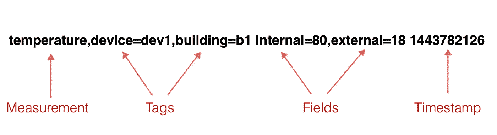
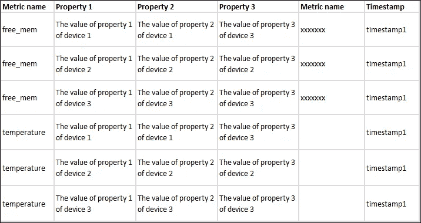
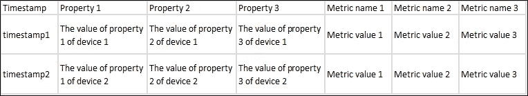
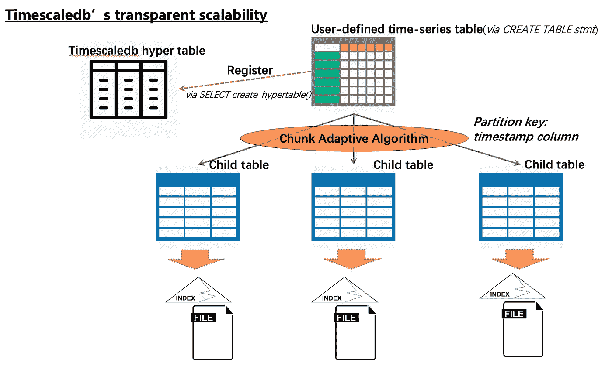
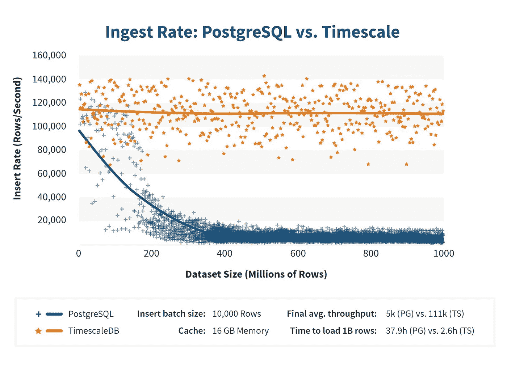
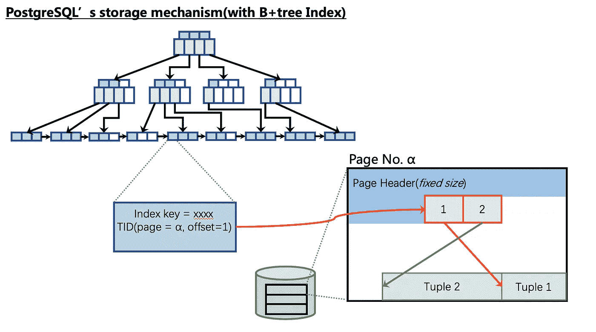

# SQL 和时间刻度 b

> 原文：<https://medium.datadriveninvestor.com/sql-and-timescaledb-e4676aac38a9?source=collection_archive---------0----------------------->

## 深入了解与 SQL 完全兼容的 TimescaleDB


# 1.概观

TimescaleDB 是由[时标公司](https://www.timescale.com/about?spm=a2c41.13239857.0.0)开发的时间序列数据库。成立于 2015 年，号称完全兼容 SQL，本质上是基于 PostgreSQL(以下简称 PG)的扩展。其主要卖点如下:

*   完全 SQL 兼容性
*   由 PostgreSQL 支持的高可靠性
*   时序数据的高写入性能

[](https://www.datadriveninvestor.com/2019/01/25/why-data-will-transform-investment-management/) [## 为什么数据将改变投资管理|数据驱动的投资者

### 有人称之为“新石油”虽然它与黑金没有什么相似之处，但它的不断商品化…

www.datadriveninvestor.com](https://www.datadriveninvestor.com/2019/01/25/why-data-will-transform-investment-management/) 

下面详细介绍产品 TimescaleDB。除非另有说明，这里提到的 TimescaleDB 指的是在 Github 上开源的[独立 TimescleDB v1.1。](https://github.com/timescale/timescaledb?spm=a2c41.13239857.0.0)

# 2.数据模型

TimescaleDB 基于 PostgreSQL，因此其数据模型与 NoSQL 时间序列数据库(如我们的 TSDB 和 InfluxDB)有很大不同。

在 NoSQL 时间序列数据库中，数据模型通常如下，即一条数据既包括时间戳和收集的数据，也包括设备元数据(通常用 Tagset 表示)。数据模型如下:



但是，在 TimescaleDB 中，数据模型必须以二维表的形式呈现。这就需要用户结合自己使用时序数据的业务场景，自己设计定义一个二维表。

在官方 TimescaleDB 文档中，为如何设计时间序列数据表提供了两种范例:

*   窄桌子
*   宽桌子

一个窄表单独记录度量，每行记录只包含一个度量值—时间戳。例如:



宽表以时间戳为轴，在同一行中记录同一设备的多个指标。至于设备的一些属性(元数据)，只是作为记录的辅助数据，甚至可以直接记录在其他表中(以后需要这些数据的时候，可以通过 JOINstatement 查询)。



基本上可以认为窄表对应单值模型，宽表对应多值模型。

由于使用了传统数据库的关系表模型，所以 TimescaleDB 的度量值必须是强类型的，可以是 PostgreSQL 中的数值类型、字符串类型和其他类型。

# 3.时标 b 特征

基于 PostgreSQL，TimescaleDB 做了一系列扩展，主要涵盖以下几个方面:

1.  时间序列数据表的透明和自动划分
2.  面向时序数据应用场景的几种特殊 SQL 接口
3.  PostgreSQL Planner 的扩展，用于写入和查询时间序列数据
4.  时间序列数据表的定制并行查询

上面提到的第 3 点和第 4 点，是基于 PostgreSQL 现有机制对时间序列数据场景的微创新。因此，下面将主要说明第 1 点和第 2 点。

# 透明和自动分区

在时序数据应用场景中，记录的数量往往是巨大的，很容易达到几十亿条。对于 PG 来说，使用了大量的 B+树索引，因此，当数据量达到一定程度时，写性能会明显下降(这通常是因为索引本身变得非常庞大和复杂)。这种性能的下降对于时序数据的应用场景来说是无法容忍的，这也是 TimescaleDB 的核心自动分区特性需要解决的问题。该功能旨在实现以下目标:

*   随着数据写入的不断增加，存储时序数据表中的数据块，保证每个块的索引维持在一个小的规模，从而维持写入性能。
*   在基于时序数据的查询场景中，自动分区时使用时序数据的时间戳作为分区键，以保证查询时能够快速定位到所需的数据块，保证查询性能。
*   分区过程对用户是透明的，以实现自动可伸缩性。

TimescaleDB 自动划分的实现主要基于 PG 的[表继承](https://www.postgresql.org/docs/11/tutorial-inheritance.html?spm=a2c41.13239857.0.0)机制。下图概述了 TimescaleDB 的自动分区机制:



在这种机制下，用户通过 TimescaleDB 的接口创建一个常用的时序表并注册为 hypertable 后，后续的数据写入、查询操作实际上都由 TimescaleDB 接管。上图中，用户创建的原始表一般称为“主表”，而 TimescaleDB 创建的隐藏子表一般称为“chunk”。

应当注意，数据块是随着数据写入自动创建的。每次创建一个新的块时，都会计算该块预期覆盖的时间戳范围(默认为一周)。此外，考虑到不同应用场景下时间序列数据的写入速度和密度不同，在创建新块时使用自适应算法计算新块的时间戳范围，逐步计算出特定应用场景下最合适的时间戳范围。和 PG 10.0

自适应算法的具体实现在于 TimescaleDB 的`chunk_adaptive.c`的`ts_calculate_chunk_interval()`。基本思想是根据历史组块的时间戳填充因子和文件大小填充因子，合理计算下一个组块的时间戳范围。

官方测试结果显示，通过透明和自动分区的特性，TimescaleDB 的写性能，与 PG 传统的单表写相比，在相同的数据量级下，即使量级增加，也能保持相对稳定的状态。



注:以上基准测试结果摘自[官方时标网站](https://docs.timescale.com/v1.1/introduction/timescaledb-vs-postgres?spm=a2c41.13239857.0.0#content-frame)。

# 面向时序场景的定制

TimescaleDB 的对外接口是 SQL，100%继承了 PG 支持的所有 SQL 特性。此外，针对时序数据库使用场景，还定制了一些界面供用户在应用中使用，这些界面都是通过 SQL 函数呈现的(标准名称为[自定义函数](https://www.postgresql.org/docs/11/xfunc.html?spm=a2c41.13239857.0.0))。以下是此类界面的一些示例:

*   `time_bucket()`功能

在执行缩减采样查询时使用此函数。通过此函数指定时间间隔，时间序列数据将以指定的间隔进行缩减采样，并使用所需的聚合函数来实现缩减采样查询。一个示例语句如下:

```
SELECT time_bucket('5 minutes', time)
  AS five_min, avg(cpu)
  FROM metrics
  GROUP BY five_min
  ORDER BY five_min DESC LIMIT 10;
```

以 5 分钟为单位对数据点进行下采样，以找到平均值。

*   新聚合函数

为了以多样化的方式分析和查询时间序列数据，TimescaleDB 提供了以下新的聚合函数。

*   `first()`查找聚合数据集中的第一个值。
*   `last()`查找聚合数据集中的最后一个值。
*   `histogram()`查找数据集合中值分布的直方图。

注意:新增的聚合函数也可以用在非时序场景中。

*   `drop_chunks()`

删除指定时间点之前或之后的数据块。例如，删除超过三个月的所有块。它类似于 InfluxDB 的保留策略特性，但是目前，TimescaleDB 还没有实现自动块删除。如果需要完整的保留策略特性，则需要系统级计时任务(如 crontab)和`drop_chunks()`语句来实现它。

`drop_chunks()`的示例语句如下。这意味着删除`conditions`表中三至四个月前的所有数据块:

```
SELECT drop_chunks(older_than => interval '3 months', newer_than => interval '4 months', table_name => 'conditions');
```

另外，TimescaleDB 定制的一些接口，基本都是方便数据库管理员管理元数据的接口，这里就不赘述了。有关包括上述接口的定义和示例，请参见[官方 API 文档](https://docs.timescale.com/v1.1/api?spm=a2c41.13239857.0.0)。

# 4.时标的存储机制 b

TimescaleDB 没有对 PG 存储引擎进行任何更改，因此索引数据和表数据的存储方式与 PG 中的相同。并且，当 TimescaleDB 索引一个块时，使用默认的 B+树索引。因此，每个块的数据存储机制可以如下图所示:



没有必要解释这种存储机制，因为 TimescaleDB 没有改变它。但是，考虑到时序数据库的使用场景，可以发现 TimescaleDB 块采用这种机制更合适:

*   PG 存储的特点是只增加不修改，即无论是插入数据还是修改数据，都是作为元组的追加操作体现在堆元组中。所以当这个存储引擎用于 OLTP 场景下的常用数据表时，就存在[表扩展](http://mysql.taobao.org/monthly/2015/12/07/)的问题。但是在时间序列数据的应用场景中，时间序列数据在正常情况下是不会被更新或删除的，所以可以避免表扩展的问题(时间序列数据本身是被大量写入的，所以也可以认为在写入海量数据的情况下，单个表实际上仍然是扩展的，但这不是这里讨论的问题)。
*   在原生 PG 中，PG 中存在自动真空机制来解决表扩展问题。通过该机制，表中由更新或删除操作生成的死元组被自动清除。但是这又引入了一个新的问题，就是 AUTOVACUUM 执行的时候给表增加了一个共享锁，从而影响了写性能。但是在时间序列数据的应用场景中，不存在更新或删除操作，所以死元组也不存在。这种块表不会成为 AUTOVACUUM 的对象，因此插入性能不会受到这方面的影响。

至于插入海量数据后表和索引的大小增加的问题，这是通过上述的自动分区特性来避免的。

另外，TimescaleDB 完全基于 PG 的存储引擎，所以没有对 WAL 做任何改动。因此，TimescaleDB 的高可用性集群解决方案也可以基于 PG 的流复制技术来构建。 [TimescaleDB 还正式推出了一些基于 HA 解决方案的开源组件](https://blog.timescale.com/high-availability-timescaledb-postgresql-patroni-a4572264a831?spm=a2c41.13239857.0.0)。

# 5.摘要

综上所述，TimescaleDB 完全建立在 PostgreSQL 之上，所以它有几个固有的优势:

*   它 100%继承了 PostgreSQL 生态系统。由于完全支持 SQL，它对从未处理过时间序列数据的初学者来说更有吸引力。
*   PostgreSQL 质量可靠，所以 TimescaleDB 在质量和稳定性上有品牌优势。
*   它对酸有很强的支持作用。

但它的缺点也很明显。

*   它只是 PostgreSQL 的一个扩展，因此不能在内核或存储级别针对时序数据库使用场景进行优化。
*   从目前的架构来看，还是单机库，无法充分发挥分布式技术的优势。此外，尽管数据是自动分区的，但是 I/O 热点很容易形成，因为时间戳决定了分区。
*   在功能级别，面向时序数据库的场景的功能仍然有限。目前，它更像是一个传统的 OLTP 数据库，具有部分时序特征。

无论如何，TimescaleDB 也是从另一个角度对时序数据库展开的尝试。目前，时间序列数据库仍处于新兴阶段，其未来的发展方向也值得我们关注和借鉴。

*作者:焦贤*

# 原始资料

[](https://www.alibabacloud.com/blog/sql-and-timescaledb_595169?spm=a2c41.13239857.0.0) [## SQL 和时间刻度 b

### 阿里巴巴 Clouder 2019 年 7 月 31 日 240 By 焦贤 TimescaleDB 是由时标公司开发的时间序列数据库…

www.alibabacloud.com](https://www.alibabacloud.com/blog/sql-and-timescaledb_595169?spm=a2c41.13239857.0.0)