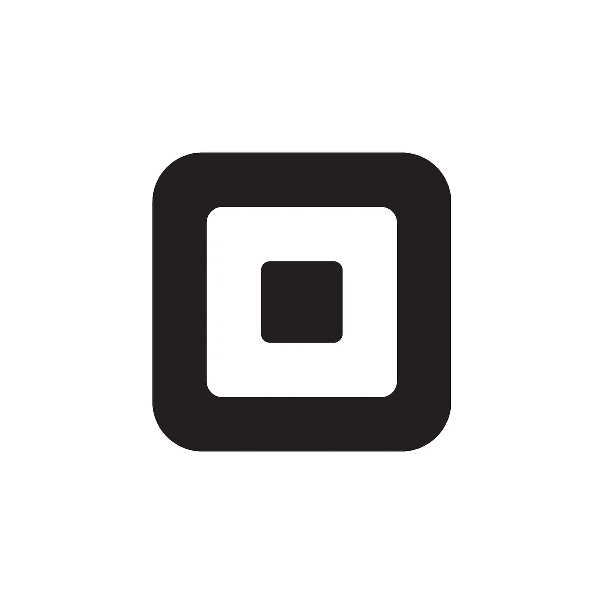

# 向 DoorDash 出售鱼子酱对两家公司来说都是双赢

> 原文：<https://medium.datadriveninvestor.com/square-selling-caviar-to-doordash-is-a-win-for-both-companies-3eae46dac879?source=collection_archive---------3----------------------->

注:本文原载于[市场兄弟传媒](https://marketbrothersmedia.com/square-selling-caviar-to-doordash-is-a-win-for-both-companies/)。

在今天下午 [Square 发布盈利](https://s21.q4cdn.com/114365585/files/doc_financials/2019/Q2/2019-Q2-Shareholder-Letter-Square.pdf)的同时，投资者惊讶地看到另一则公告，该公司[以 4 . 1 亿美元的价格将其鱼子酱业务](https://techcrunch.com/2019/08/01/doordash-is-buying-caviar-from-square/)出售给 DoorDash。根据新闻稿，这笔交易是现金加股票的要约，可能会在今年年底前完成。

现在，在我们开始分析这笔交易(以及为什么我认为这是一个双赢的场景)之前，让我们回顾一下鱼子酱的简短历史，以便我们了解 DoorDash 得到了什么。 [Caviar](https://info.trycaviar.com/us/en/for-restaurants) 成立于 2012 年，口号是“关注食物——我们得到其余的。”据推测，Caviar(我对该产品没有亲身体验)可以让一家餐厅通过一整套易于使用的数字工具轻松完成送货、外卖和餐饮服务。

 [## 动荡迫使暴风雨中的平静|数据驱动的投资者

### 自然界中很少有东西是直线行进的，尤其是经济。当投资者和消费者希望平静时…

www.datadriveninvestor.com](https://www.datadriveninvestor.com/2019/03/25/volatility-compels-calm-amid-the-storm/) 

Square 五年前以 9000 万美元收购了该公司，并将其数字产品与 Square 的订阅产品进行了整合。多年来，有大量传言称 [Square 想要出售鱼子酱](https://www.bloomberg.com/news/articles/2016-10-11/square-said-to-have-discussed-caviar-sale-with-uber-grubhub)(价格远低于 4 亿美元)，因为这降低了公司的利润率。

# 为什么这是 DoorDash 的胜利

由于 DoorDash 是一家私人公司，不提供任何财务信息，我不想过多猜测，但在我看来，他们的核心业务利润率很低。相信这一点的一个原因是，他们与优步或 Lyft 没有太大区别，我们已经从他们的公开财务报表中看到这些企业的成本结构有多糟糕。

我认为 DoorDash 亏损的另一个原因是我实际上是在为他们开车。对于 10-15 分钟的短期送货订单，他们通常会付给我 6.5 美元或更多，而我知道客户的价格要低得多。当可变成本高于销售额时，几乎不可能(嗯，实际上完全不可能)经营一家盈利的企业。

除了给 DoorDash 在食品配送领域带来一些轻微的整合，鱼子酱的作用是提升餐厅的食物链。餐馆使用的订阅服务肯定比 DoorDash 的核心服务有更高的利润，这将有助于他们实现盈利。DoorDash 的规模也将帮助 Caviar 扩展到全球更多地区。这种伙伴关系将在另一个方向上发挥作用，鱼子酱的用户(如果你感到困惑的话，就是餐馆)更倾向于使用 DoorDash 作为他们的递送工具。

# 为什么这是 Square 的胜利

Square 有另一份稳定的收益报告([它是我们在 MBP 的首选之一](https://marketbrothersmedia.com/eight-month-update-of-the-mbp/))，收入增长 44%，订阅收入增长 87%。关于销售鱼子酱的声明可能令人惊讶，但我认为这对公司来说是一个好的举措。我将在下面陈述我的理由。

首先，Caviar 从未真正符合 Square 希望成为的企业，它是企业和个人数字支付交易的推动者(他们拥有 Cash 应用程序)。Caviar 与这个垂直业务领域相邻，作为一个合作伙伴比作为一个子公司更好。

接下来，我相信，剥离 Caviar 将使 Square 建立与 DoorDash 和其他快递初创企业的关系，这些企业目前发展极其迅速。以下是 Square 在他们的[新闻稿](https://squareup.com/about/investors/press/269f24b7-5b57-4c2b-b83c-a268bec2caaa)中对该话题的描述:

*“这项交易继续建立在 DoorDash 和 Square 之间的伙伴关系之上。DoorDash 目前与 Square for Restaurants 销售点整合，简化了商家在线和亲自接受订单的过程，在第二季度，Cash Boost 与 DoorDash 合作，当客户在 DoorDash 使用现金卡时，提供即时奖励。*

因此，尽管 Caviar 不会归 Square 所有，但它们仍将受益于 Square 的持续增长。

第三，没有亏损的鱼子酱(该公司以前曾抱怨过)将有助于 Square 实现盈利和更好的现金流数字。这一点很重要，因为随着它们作为一家公司走向成熟，投资者不仅会期待顶线的增长，也会期待底线的增长。

最后，此次出售将为 Square 的资产负债表增加现金(尽管通过一些股份稀释)，这将使他们能够更积极地投资于我上面提到的核心计划。以下是首席执行官杰克·多西对此的评论:

“我们正在加大对两个不断增长的大型生态系统的关注和投资，一个是针对企业的，另一个是针对个人的。这笔交易进一步推进了这一努力，我们相信与 DoorDash 的合作为 Square 提供了宝贵的战略机遇。”

多尔西和他的团队关注的，也是投资者应该关注的，是他们业务(销售点、组织工具、Square Capital)和个人产品(现金应用和现金卡)的增长。他们正在乘风破浪，是这个可能价值万亿美元的行业中最大的创新者之一。