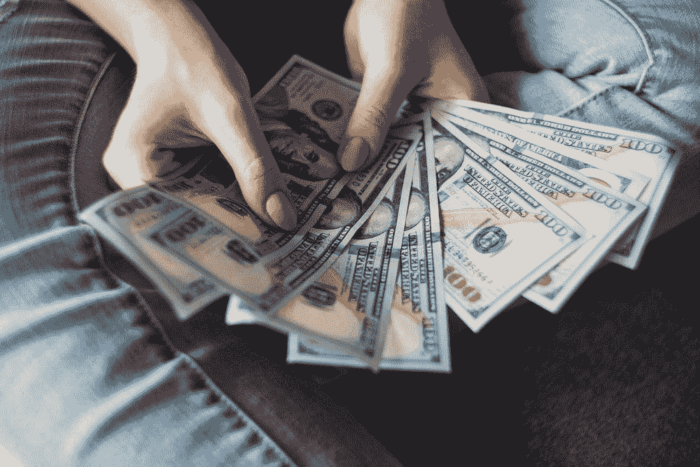

# 广场应该买编钟

> 原文：<https://medium.datadriveninvestor.com/square-should-buy-chime-6a2ff7fdbccd?source=collection_archive---------4----------------------->

我在《福布斯》的一篇关于网上银行 Chime 的文章中看到了这句话:

*“据一位知情人士透露，2019 年，它的(收入)将达到近 2 亿美元，比 2018 年增长 4 倍。现在，该公司计划扩展到信用卡和投资服务等其他产品，以寻求成为一家提供全面服务的数字银行。”*

这是一些恒星的增长。Chime 是美国最热门的金融科技初创公司之一，被认为是估值 50 亿美元的[，如果不是更多的话。这将使他们(假设上面的数字是正确的)的价格销售比达到 25，这对于一个年增长率为 300%的高利润企业来说是相当合理的。](https://www.bloomberg.com/news/articles/2019-10-10/chime-nearing-new-funding-round-at-5-billion-valuation)

这是一个指标，表明我们终于到了无分支银行拐点。每年都有数百万美国人过渡到无现金的生活方式，这使得银行分行和自动取款机变得越来越无关紧要。这为 Chime 与世界美洲银行之间的竞争铺平了道路。现在重要的是实际的银行产品、用户界面和客户体验。Chime 在所有这些类别中都可以做得更好。

看起来 Chime 自己做得很好。然而，我相信有一种方法可以让他们的增长更快。

# 被 Square 收购

方形购买编钟将是天作之合。为什么？因为 Chime 拥有 Square 无论如何都要建造的产品。

多年来一直有传言称，Square 希望在其现金应用程序中添加[真实支票和储蓄](https://www.reuters.com/article/us-square-banking/payments-company-square-to-re-apply-for-a-bank-license-idUSKCN1OI283)。他们不应该经历申请 FDIC 保险的艰难过程，而应该直接收购 Chime，加大进军银行业的力度。

这对 Square 来说是一个胜利，因为，第一，他们将收购一个每年增长 300%的竞争对手，第二，因为它将与现金应用程序完美集成。现在，你可以在一个应用程序中支付朋友、消费和投资。**整合 Chime 将正式使现金应用成为满足您个人理财需求的一站式商店。**

但为什么 Chime 希望被 Square 收购是个好主意呢？首先，他们可以轻松地向超过 1500 万现金应用用户交叉销售他们的银行产品。这将使他们与 Ally 等其他在线竞争对手区分开来，并使 Chime 更容易获得客户。

他们想被收购的另一个原因是为了与他们竞争而花费的巨额资金。守旧派银行、其他创业公司和大型科技公司正在花费数十亿美元为他们的银行账户建立和争取客户。如果 Chime 要取得成功，他们需要不知疲倦地工作，可能需要筹集更多的资金，然后通过 IPO 来击败竞争对手。被 Square 收购将使他们获得一家主要金融科技公司的支持，并可能加速他们的用户/销售增长。

唯一的问题是 Square 是否有资金收购 Chime。[上个季度末](https://s21.q4cdn.com/114365585/files/doc_financials/2019/Q3/2019-Q3-Shareholder-Letter-Square.pdf)，Square 拥有 18 亿美元现金，远低于收购 Chime 所需的 50 亿美元。除此之外，他们已经有大约 10 亿美元的长期债务。他们会在负债上增加 30-40 亿美元的债务吗？大概吧。但这肯定会让 Square 成为风险更高的资产。

话虽如此，我确实认为杠杆化(或股份稀释，如果他们选择了那条路)的风险是值得的，因为存在上行效应。这将是对已经快速增长的现金应用程序**的完美补充，进一步将 Square 和 Chime 从竞争中分离出来。**