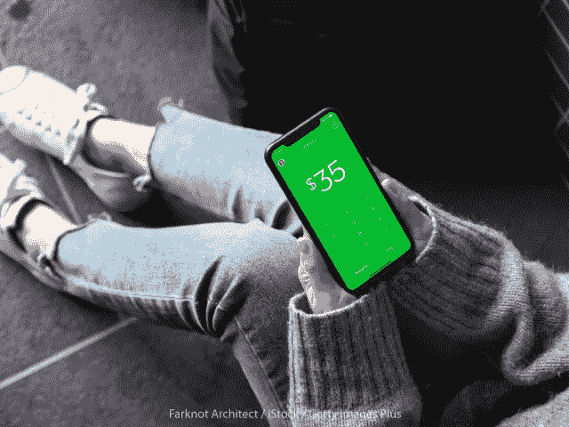
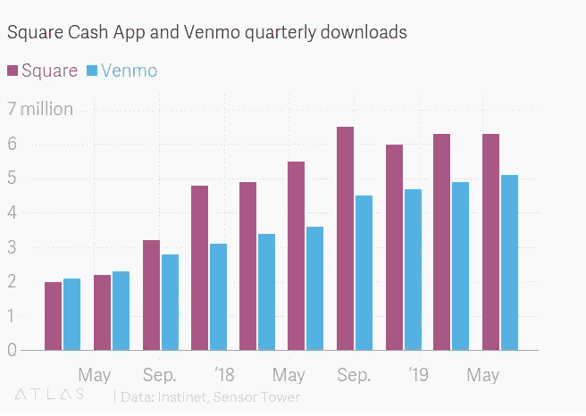

# 广场，早期的亚马逊

> 原文：<https://medium.datadriveninvestor.com/square-the-amazon-in-its-early-days-835efc674f5c?source=collection_archive---------7----------------------->

Square 最初的唯一目标是为小商户提供公用设施，主要是那些年销售额在 20 万美元左右的商户。他们的座右铭是通过使用其硬件在任何地方接受信用卡/借记卡来帮助企业“永不错过销售”,在短短 10 年内，他们每年处理超过 1000 亿美元。

这家领先的移动支付处理公司在过去几年中进行了自我转型，甚至现在还在继续转型。它的业务最初是为小商户提供通过读卡器处理移动支付的能力，十年后，它提供了运营商户业务的服务。服务包括通过 Square Capital 提供的贷款、即时存款、接触新客户的 Square 营销、帮助从不错过销售的发票，以及工资单、零售、餐馆和其他。

 [## 算法交易的机器学习|数据驱动的投资者

### 当你的一个朋友在脸书上传你的新海滩照，平台建议给你的脸加上标签，这是…

www.datadriveninvestor.com](https://www.datadriveninvestor.com/2019/01/30/machine-learning-for-stock-market-investing/) 

与亚马逊类似，Square 的足迹始于为商家创造效用，允许任何人参与经济并成为卖家，无论规模大小。在巩固了自己作为移动销售点领域领导者的地位后，Square 转向了消费者，就像亚马逊一样，它通过现金应用程序打入了其他未开发的市场。与激烈的竞争对手 Venmo 分享这一空间，Cash App 希望通过提供借记卡和奖励(即所谓的 boosts)来区分自己。它很快就提供了买卖比特币的能力，最近还提供了股票交易。它从一个只能在朋友之间收发钱的二元应用程序转变为一个雄心勃勃的完整的移动银行。凭借其不断的创新，它现在看起来准备进一步控制 P2P(点对点)支付领域。

去年 12 月，Cash App 的月活跃用户超过了 1500 万，我的计算显示，截至今天，该应用的月活跃用户刚刚超过 2500 万。两年多来，Cash 应用程序一直是 IOS/Google Play 中排名第一的金融应用程序，并一直位居总下载量前 20 名。在短短三年左右的时间里，Cash App 产生的收入已经从 100 万美元增加到超过 6 亿美元/年。多年前，Venmo 已经在 P2P 领域站稳了脚跟，但由于其服务没有取得实质性进展，Cash 应用程序终于在 2018 年夏天的总下载量上超过了竞争对手，自那以来，它在两者之间的总下载量上继续扩大领先优势。

自满是致命的，Venmo 坐在他们的荣誉上，而 Cash App 继续创新，看起来他们没有放慢脚步。Venmo 最近开始复制 Cash App 的一些功能，但似乎有点太晚了，因为两者之间的下载差距越来越大，Cash App 甚至进入了股票市场，扮演了罗宾汉的角色。

Square 现在看起来有兴趣向非洲扩张，我想主要的吸引力是通过 Cash 应用程序。预计它将很快在加拿大和澳大利亚推出，我看不出它的存在仍然锁定在任何边境的理由。与过去的亚马逊类似，Square 的大部分潜在收入可能来自我们今天看不到的载体。他们在 2009 年的服务业务就是如此，三年前的现金应用程序也是如此，今天的卖家和现金应用程序这两个生态系统的潜在整合也是如此。Square 的收入增长来自几年前不存在的领域，似乎每隔几年，该团队就会开发一些新东西来扰乱金融技术领域。

许多人会将此归因于前首席财务官杰克·多西和莎拉·弗莱尔(Sarah Friar)，但事实是，Square 的运营方式就像一家初创公司，但规模非常大。团队有承担风险的自主权和能力，正是风险让伟大得以诞生。

当然，在 1999 年，没有多少人有远见去想象 20 年后的亚马逊会是什么样子。从一个简单的网上图书一站式商店到管理美国大部分电子商务，以及 AWS 和 Prime Video 等许多其他成功的企业。我相信，十年或二十年后，类似的故事将在 Square 上讲述。杰克·多西首先为小商户创建了一个接受卡支付的实用程序。后来发展成为一个完整的 POS(销售点)系统，接受任何形式的支付，并能够管理库存、物流、销售和收据。几年后，Square 提供了独特的服务来帮助企业运营，这也是他们迄今为止最大的成功，进军 P2P 领域。2012 年，杰克和他的团队开发了一种语音结账技术，允许 Square 卖家允许买家通过大声说话和与卖家沟通来进行购买。我相信这项技术，但经过完善，以及商家/买家体验的许多其他方面，将在未来几年发生变化，顺风顺水，对 Square 有利，因为他们现在占整个美国总卡支付量的近 7%。

reach Square 一直在增长，尤其是在大型卖家的高端市场。商家端(Square Seller)和消费者端(Cash App)之间的整合将为该公司带来难以置信的优势，包括之前开发的功能，以及大量其他可能性。如果 10 年后，最受欢迎的“银行”是 Cash App，在 Square 零售店结账就像大声说话一样简单，我不会感到惊讶，你也不应该感到惊讶。