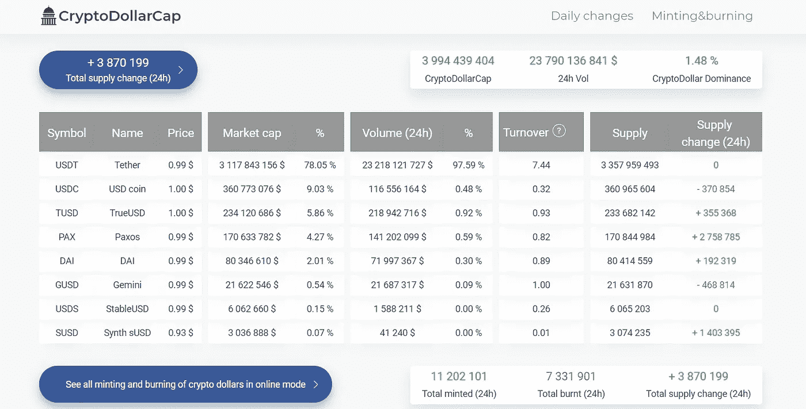
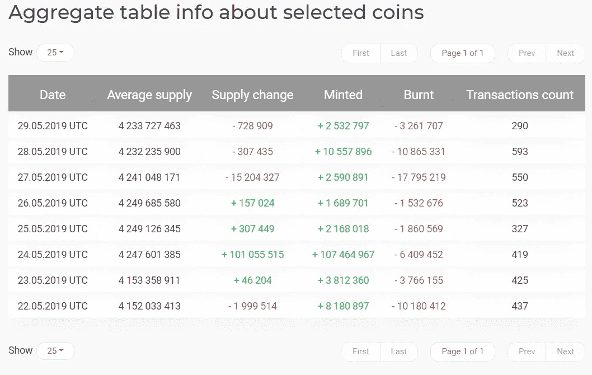
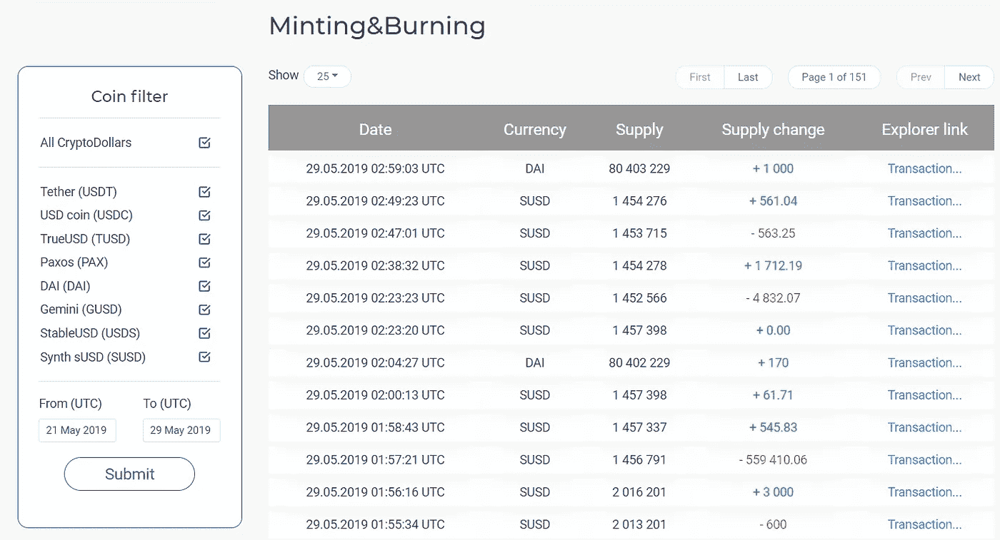

# 稳定共轭分析

> 原文：<https://medium.datadriveninvestor.com/stable-coin-analytic-service-7025a905f8e0?source=collection_archive---------8----------------------->

2018 年底，我有了一个稳定币分析的“简单一页网站”的想法。这个想法已经发展成更多的东西。我们做了一个稳定的硬币(到目前为止只有美元)扫描仪！

主要发行方连接: **Tether(扫描 Omni、以太坊、创区块链)、USD Coin、TrueUSD、Paxos、DAI、Gemini、Stable USD、Synth sUSD。**

 [## 创新警报:区块链 3.0、Terra 协议、ICO 门户和更多数据驱动的投资者

### 尽管过去几个月加密货币的价格波动很小，但这项技术并没有停止发展…

www.datadriveninvestor.com](https://www.datadriveninvestor.com/2019/03/16/innovation-alert-blockchain-3-0-terra-protocol-an-ico-portal-more/) 

在当前的实现中:

【https://cryptodollarcap.com】主页:

🔸引入了“加密美元优势”的概念，并跟踪这一指标；

🔸表格形式显示了稳定硬币的每个发行者的份额、交易量、资本化、营业额和加密美元数量的供应变化；

🔸在图表中，您可以看到每个发行者的加密美元数量，以及其相对于所有加密美元的份额。

**每日变化:**[https://cryptodollarcap.com/changes](https://cryptodollarcap.com/changes)

🔸考虑到区块链的交易数量，你可以看到在过去的 24 小时内和每天分别铸造和燃烧了多少稳定的硬币。您还可以筛选发行人和日期；

🔸以图表的形式，显示了特定发行者在用户选择的时期内稳定硬币的动态。

**交易页面:**[https://cryptodollarcap.com/transactions](https://cryptodollarcap.com/transactions)

🔸稳定硬币的每一次发行和燃烧都伴随着可以在区块链中被检查的交易；

🔸按日期和发行人过滤。该表显示了交易的日期、发行者、烧录或创建的加密美元的数量、来自发行者的当前加密美元的数量。每个交易都有一个链接。

*该服务可用于分析目的和交易决策。例如，一个交易机器人，当接收到 2000 万美元发行的数据时，可能会对顶级加密货币的购买做出投机性的决定。出于这些目的，我们计划为交易者实现一个用于机器人的 API+Telegram-bot。*

服务逻辑是和格罗莫夫·叶夫根尼一起想出来的。此外，他还负责项目的所有技术实施。设计师和前端开发人员被吸引外包。

部分截图:

Main page of Stable Coin Service Analytics

Daily changes of Stable Coins

Page with transactions of Stable Coins

期待收到反馈+你可以写你的合作提议。谢谢！