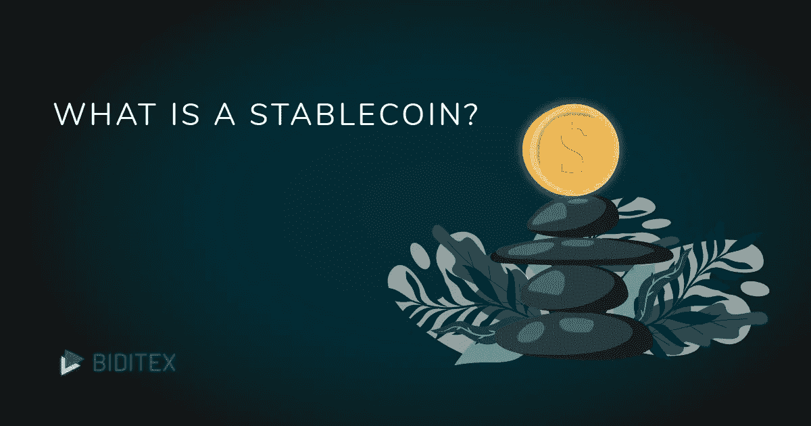

# 稳定的硬币加密货币:低估但无价，其类型和天秤座

> 原文：<https://medium.datadriveninvestor.com/stable-coin-cryptocurrency-undervalued-but-invaluable-its-types-and-libra-928ed0772ff6?source=collection_archive---------6----------------------->

Stable coin: Cryptocurrency that has the potential

***稳定币*** 是一种加密货币，意在保持其稳定价值。

稳定硬币的主要任务是在市场上提供流动性。但是稳定的硬币带来稳定吗？稳定的硬币最初是作为安全和快速的交易手段而构建的。它们被认为会给市场带来更多的平衡，并在加密交易中活跃地交易。如果我们把稳定的硬币比作股票交易产品，它们可能很像债券。尽管债券本身被认为是更安全、流动性更强的投资方式，但它们也有波动的趋势。同样，稳定的硬币是更平衡、风险更低的投资品种。然而，稳定的硬币仍然像其他加密货币一样不稳定。

有几种类型的加密货币:法定抵押的稳定货币，商品抵押的稳定货币，加密抵押的，完全没有抵押的，等等。

菲亚特-抵押稳定硬币，顾名思义，是由菲亚特支持的。有了菲亚特抵押的稳定币，你可以用稳定币购买面包、巧克力或饮料，就像用美元或欧元一样。它采用 1:1 系统，这意味着 1 枚稳定的硬币价值 1 美元，这使得交易和计算更加容易。如果一枚稳定硬币价值 1 美元，那么任何其他加密货币都可以变成稳定硬币，然后变成法定货币。

目前，使用最广泛的稳定硬币是 Tether ( [USDT](https://biditex.com/) )，其市值在所有加密货币中排名前十。这枚硬币也在 [BIDITEX](https://biditex.com/) crypto exchange 与[比特币](https://biditex.com/)、以太坊和莱特币一起交易。

其他稳定的硬币包括 TrueUSD (TUSD)、LBXPeg，而 Paxos Standard (PAX)和 Gemini Dollar (GUSD)是 2018 年首批成为受监管加密货币的货币。

与法定抵押硬币不同，商品抵押硬币是由贵金属等商品支持的。换句话说，这种加密货币背后有一些东西，让许多人信任它，并继续使用它。你可以买房子、汽车、黄金等。所以我们可以区分各种类型的商品支持的稳定币:由黄金支持的(Digix Gold (DGX))、由技术创新中使用的贵金属支持的(Tiberius Coin (TCX))、由房地产支持的(SwissRealCoin (SRC))。

加密抵押的 stablecoins 是完全去中心化的纯区块链产品。一种这样的密码是由以太网支持的 Dai。

也有这种完全没有抵押的 stablecoins。

最近，脸书宣布了一种叫做 Libra 的新硬币，金融新闻，加密新闻和全世界都在讨论这个名字和脸书应该承担的责任，脸书可以提供的信任，等等。但不是真正的产品本身。天秤座是一个稳定的硬币，它有自己的钱包，叫做 Calibra。正如创始人所说，它的目标是让全世界的每个人都能使用钱包。他们说，如果今天很少有人仍然使用银行系统，相反，他们将能够使用这个钱包进行支付。因此，摩羯座和天秤座的目标是大多数人，包括老年人和年轻人。正如大卫·马库斯在他的演讲中提到的“对它的信任只有 1%”。但是他们会成功的。无论如何，该产品将于明年推出。所以让我们保持耐心，关注即将到来的事件。

*如果您想了解更多，请访问 BIDITEX 页面并提出您的问题，关注我们的* [*推特*](https://twitter.com/biditex_com) *，* [*脸书*](https://www.facebook.com/biditex/) *，* [*中型*](https://medium.com/@biditex) *，* [*电报*](https://t.me/biditex%20%28edited%29) *等。投标变更同***。**