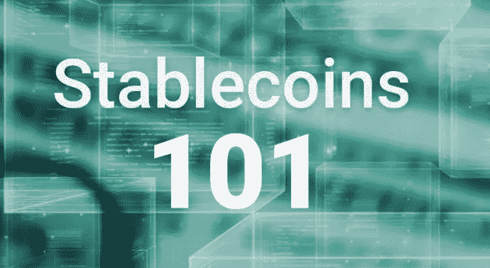

# 稳定 101

> 原文：<https://medium.datadriveninvestor.com/stablecoins-101-f089090784ac?source=collection_archive---------1----------------------->

众所周知，加密世界是不稳定的，所有的投资者和交易者都在寻找价格稳定的方法。不管他们是否知道，当涉及到寻找一种更稳定的资产来注入他们的资金时，每个寻求投资加密的人都有选择，这包括交易回法定货币一段时间，但如何保持他们的资产在加密市场？那是“稳定的硬币”进入的地方。

哪些硬币是稳定的，为什么认为是稳定的？让我们来看看它们的区别，以及为什么你应该在你的投资组合中考虑它们。记住，我承诺过我会谈论我自己投资的东西。

大多数投资者，就像阅读这篇文章的人一样，都受过良好的加密货币交易知识教育。他们知道调查硬币的历史，潜在的区块链技术，充分了解价值和价格的相关性，以及了解如何接受一枚硬币或令牌是由大众。

了解支持新资产类别的技术已经是所有投资者的先决条件，因为更多的知识有助于更好的投资决策。在了解了传统加密货币的基本面之后，就更容易理解为什么稳定货币存在以及它们填补市场的需求。然而，关键的区别在于，传统的加密货币，如法定货币，没有任何东西的“支持”。相反，加密货币的价值取决于使用情况和其他人的接受程度。

**系绳**

[Tether](https://tether.to/) 是一种储备账户中完全由法定货币支持的硬币。值多少钱？兑换率是 1 USDT = 1 美元。如果流通中的所有限额少于或等于银行账户中持有的所有法定限额，则该整合良好且已建立的平台被视为完全支持。唯一的缺点是它是集中的，不可信，而且他们拒绝审计。

**马克尔道**

与 Tether 不同，Maker 是一个分散的平台，是一家与美元挂钩的公司，但 100%由 ether 支持。戴是本文中第二枚完全稳定的硬币，每枚面值 1 美元。戴的稳定是通过一个自主的智能合约系统来维持的。交易戴的唯一方法是将您的代币发送到创客平台。这个平台唯一的缺点是运行起来有点慢。好的一面是，它与以太的连接使它位于区块链上，增加了它的可信度、透明度和稳定性。

**haven**

Havven 的令牌通过构建一个用两枚硬币支持自己的系统来提供稳定性。哈夫文是储备中的代币。在这种情况下，起部分支持作用的稳定币称为 Nomins，用于正常交易。所有交易费用都通过公司返还给令牌持有者，作为维护支持自身的系统的奖励。我喜欢这枚硬币，因为它分散且相对快速。唯一的缺点是它对市场来说相对较新。

**基础币**

[Basecoin](http://www.getbasecoin.com/) 也将其价格固定为 1 美元……你看到趋势了吗？基础货币的不同之处在于，他们利用共识来收缩和扩大货币供应。当基础硬币下跌并开始以美元交易时，硬币通过允许持有者购买债券而收缩。这些债券交易中使用的硬币被淘汰。供给减少，价格上涨，简单的经济学。他们反其道而行之，扩大供给。这枚硬币之所以稳定，部分原因是它有大量资金的支持，但你需要相信这枚硬币的交易过程，才能让你有交易的意义。

为什么 stablecoins 这么吸引人？嗯，因为它们在市场上的波动性很低，不像比特币或以太坊这样的硬币。如果以太币的价格是 500 美元，而你用 1 个以太币换了一个稳定的硬币，比如系绳。你会有 500 个单位的系绳。让我们假设以太坊的价格下周下跌 100 美元，你仍然会有 500 个单位的系绳，你可以随时转换回以太网或者一起投资一些新的东西。基本上，如果你正确使用 stablecoins，你就不会失去价值。

为了让加密货币成为主流，我们需要创造一个波动性更小的环境，而这些硬币的目的正是为了做到这一点。

这篇文章是为了教育的目的，我并不建议你需要投资以上任何一种，或者你会从任何交易中获利。

