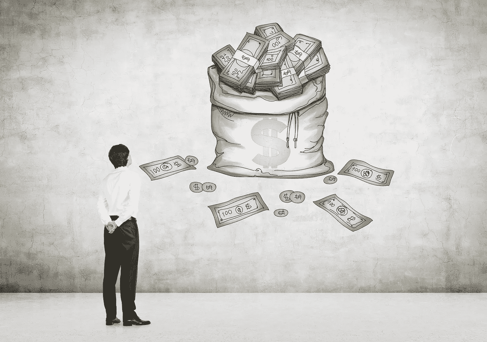
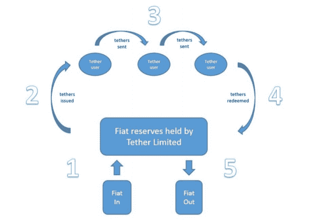
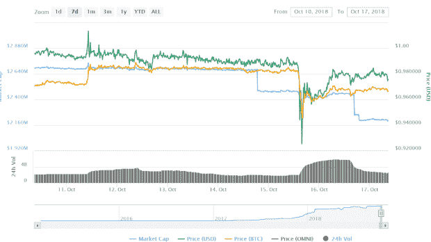
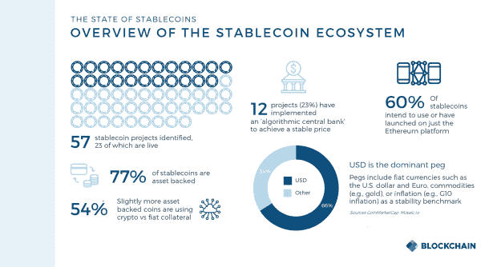

# 好的、坏的和奇怪的

> 原文：<https://medium.datadriveninvestor.com/stablecoins-the-good-the-bad-and-the-opaque-6401c56b0a79?source=collection_archive---------16----------------------->

> “世界上没有稳定的东西；喧嚣是你唯一的音乐”——约翰·济慈

加密货币不稳定已经不是什么秘密了。在过去几年中，这种资产类别的价格波动频繁发生，crypto 因给投资者带来惊人的收益和巨大的损失而赢得了声誉。

事实上，在 2016 年至 2017 年间，美国经济研究所[发现](https://www.aier.org/research/bitcoins-price-volatility-trending-wrong-direction)比特币的日均价格变化比三种基准货币——英镑、欧元、日元和黄金——的平均值高出 6 倍以上。

部分是为了应对这种难以控制的波动环境，稳定硬币作为一种加密货币形式出现，可以为投资者提供价格稳定。这通常(但不总是)通过将每个发行的代币与基础现实资产(如法定货币)挂钩来实现。

例如，最受欢迎的稳定币 [Tether (USDT)](https://coinmarketcap.com/currencies/tether/#charts) 声称，对于其所有流通中的代币，它持有等量的美元储备，这使其能够与美元平价交易。

# 稳定币的类型

**法定抵押稳定资产:**这些是 USDT 等加密资产，通常与美元或欧元等法定货币保持 1:1 的关系。这意味着稳定的硬币在银行里必须有和流通的稳定硬币一样多的法定货币单位。因此，就 USDT 而言，银行账户中应该有超过 20 亿美元的储备货币，以匹配目前流通的同等数量的代币。

就动态而言，对于发行的每个稳定币代币，第三方将收到一个法定货币单位的相应存款。类似地，第三方将焚烧稳定币代币，并在持有者决定兑现其持有的现金时向其发送等价的法定货币单位。

[source](https://tether.to/wp-content/uploads/2016/06/TetherWhitePaper.pdf)

**加密抵押稳定币:**类似于法定抵押稳定币，但不是法定储备，而是由一种或一篮子加密货币支持。这通常是在以太坊(Ethereum)等区块链上使用智能合约完成的，从而避免了涉及银行/第三方的需要。

MakerDAO 的 stablecoin 是最受欢迎的加密抵押品之一，它使用智能合约来储备 ETH。Dai 用户通过锁定每一个与 1.00 美元挂钩的 Dai 令牌的价值 3.00 美元的 ETH 来发布令牌的抵押品。该项目还发行了一个额外的治理令牌 MKR，[赋予其持有人投票支持创客系统](https://makerdao.com/faq/voting)的风险管理和业务逻辑。

**算法控制的稳定币:**这种稳定币没有任何基础资产支持。相反，代币价格由“算法中央银行”控制，该银行操纵代币的总供应量，因此，如果价格因需求增加而开始上涨，代币供应量就会增加，使价格回落(同时中央银行在此过程中获得利润(或“铸币税”)；相反，当价格下跌时，代币供应就会收缩，这通常是由央行利用其铸币税利润购买代币实现的。比方说，稳定的货币与 1.00 美元的挂钩就这样保持了。

可以说，这一类别中最著名的项目是 Basecoin，它最近更名为 Basis，并采用一种独特的方法来维持其与美元的联系。如果 Basis 的价格低于其 1.00 美元的固定价值，该项目将以低于 1.00 美元的价格发行单独的“债券代币”。代币出售时承诺，将来可以兑换成基础硬币。

用户购买这种债券代币的预期是价格会回升到 1.00 美元。一旦价格超过 1.00 美元大关，该算法就会通过发行与购买的债券代币数量相等的基础硬币来增加货币供应量，从而保持挂钩并偿还债券代币购买者。

在这个阶段，泰瑟仍然是无可争议的稳定之王。根据[最近的 Blockchain.com 报告《Stablecoins 的现状》，](https://www.blockchain.com/research) Tether 是交易第二活跃的加密货币，约占 BTC 日交易量的 60%;它占所有稳定币总市值的 93%,控制着所有稳定币交易量的大约 98-99%。

# 稳定硬币的问题

从表面上看，在维持与美元的平价方面，Tether 迄今基本上发挥了预期的作用，从而为投资者提供了一种对冲加密波动的方式。但它并非没有问题，最大的问题是它无法提供任何审计来证明其代币确实由等值美元支持。

尽管发布了一份透明度报告，详细说明了它如何聘请 Freeh，Sporkin & Sullivan LLP (FSS) “审查银行账户文件，并对流通中的股份数量和相应的货币储备进行随机检查”，但该报告明确指出，它“不应被视为审计结果”

Tether 透露了与加密交易所 Bitfinex 的关系，即两个实体有相同的首席执行官和首席财务官，直到最近，还有相同的首席财务官，这也引起了人们对其合法性的严重担忧。这两项业务之前坚称它们是分开运行的，但最终被发现是假的(关于它们活动的更详细的时间表可以在[这里](https://bitcoinmagazine.com/articles/warning-signs-timeline-tether-and-bitfinex-events/)找到)。

[6 月份发布的一份有影响力的报告](https://papers.ssrn.com/sol3/papers.cfm?abstract_id=3195066)发现，2017 年 12 月比特币价格的大幅上涨有一半是因为在系绳流向少数其他交易所后的几个小时内。该论文的结论是，USDT“被用来提供价格支持和操纵加密货币价格。”

事实上，许多稳定的货币无法永久保持与基础资产挂钩，这也是一个令人担忧的问题。10 月 15 日，USDT 未能保持其盯住美元的汇率，在北海巨妖加密交易所交易跌至 0.90 美元。

虽然它设法挽回了这一损失，但这种来自所谓稳定币的价格不稳定不会很好地满足用户的期望。就连币安首席执行官赵似乎也对最近的事件嗤之以鼻。

与此同时，另一方面，双子星币——文克莱沃斯兄弟最近推出的稳定货币——在飙升至 1.19 美元时，短暂失去了挂钩。显然，如果这些稳定的货币始终无法与其挂钩的货币保持平价，投资者对它们的信心将继续减弱，市场很可能最终崩溃。

同样值得注意的是，由于银行账户持有支持 USDT 等稳定国家的储备，这种系统是高度集中的。我们有效地依靠这家银行来确保每个代币都有相应的美元存在帐户中。鉴于这种持有活动没有在区块链记录在案，我们无法确定该银行用这些储备做了什么。

虽然加密担保的稳定币通过确保不依赖于菲亚特世界来分散事情，但这种稳定币的明显缺点是，由于受到加密的支持，它暴露于加密的波动性。正如我们所看到的，这种波动性可能是巨大的，因此它似乎违背了 stablecoins 的设计宗旨:消除加密世界的波动性，而不是复制它。

此外，加密抵押债券与其基础资产的比率不是 1:1，而是通常与其支持加密债券的比率大于 1:1，以防止价格大幅下跌和失去挂钩。例如，戴稳定币使用智能合约以 3:1 的比例持有 ETH 作为储备，这意味着你必须在这个系统中占用更多的资本作为抵押品，这既不可取也没有效率。

一种由算法控制的稳定硬币可以很好地消除资产支持硬币的上述一些问题。但是它的相对复杂性很可能是一个绊脚石。例如，Basis 项目需要三个不同的令牌来运行。只有在债券代币购买者预期基差价格未来会上涨的基础上，它才能成功发挥作用。如果基币失去了挂钩，代币持有者*不指望会反弹到 1 美元，他们就没有什么动力去购买债券代币。因此，基础硬币价格的进一步下行压力可能会导致市场崩溃。*

# 然而，尽管存在这些问题…

我们现在正目睹大量新的稳定硬币被推向市场。

[source](https://blog.blockchain.com/2018/09/26/the-state-of-stablecoins/)

对稳定硬币的兴趣持续增长。例如，在 9 月下旬，著名的硅谷风险投资公司 Andreessen Horowitz 向投资了 1500 万美元，作为对 stablecoin Dai 的补充治理资产。这将使 Andreessen Horowitz 的新加密基金 a16z crypto 参与管理 MakerDAO 和 Dai 信用体系。

此举反映出主要投资者对稳定债券的看法越来越乐观。主要原因是*如果 USDT 等稳定的国家能够解决它们的透明度问题，它们将在加密货币生态系统中扮演重要角色:它们将提供稳定性以抵御波动。因此，它们将作为投资者的合法对冲/保险工具，而其几乎不变的价值可以为市场参与者提供几个关键好处:*

*   对于渴望涉足加密领域但还没有准备好应对其波动性的新投资者来说，它们可能是一块“垫脚石”。购买 stablecoin 可能是菲亚特世界和密码世界之间有用的第一座桥梁，从长远来看，最终会带来更多的用户。
*   它们在市场不确定时期提供了灵活性。如果你认为你投资组合中的一种或多种加密货币可能会遭受损失，你可以随时将你的持有物暂时转移到一种稳定的货币中，这将保持你投资组合的价值，直到你决定再次兑换另一种代币的时机成熟。
*   它们有可能成为法定货币或其他资产的数字版本。如果能够实现这一点，个人、零售商和企业使用 stablecoins 进行支付可能会变得司空见惯。

宣布稳定币的概念完全万无一失还为时过早。但在提高透明度方面正在取得进展。审计领导者普华永道(PwC)和分散式贷款平台 Cred 在[宣布建立合作伙伴关系，以“理解快速迈向增强标准的关键考虑因素，在加密生态系统中建立信心和信任，并迎来下一个 1 亿加密资产用户”，这只是帮助建立这种透明度的最新进展。](https://www.pwc.com/us/en/press-releases/2018/pwc-collaborates-with-cred.html)

希望在这方面能够取得进展。鉴于加密货币的波动性，稳定币等有效、合法的对冲工具将支持市场成熟的过程，这是加密日益迫切需要的。

*原载于 2018 年 11 月 6 日*[*www.datadriveninvestor.com*](https://www.datadriveninvestor.com/2018/11/06/stablecoins_the_good_the_bad/)*。*