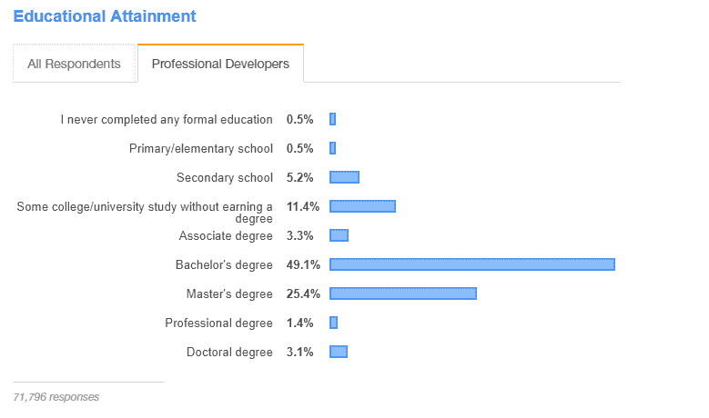
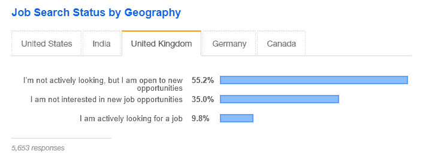
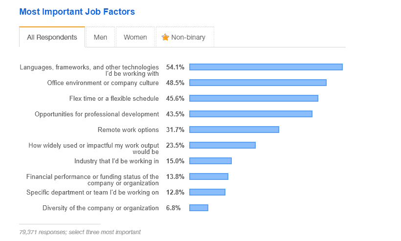

# 2019 年堆栈溢出开发者调查:从顾问的角度

> 原文：<https://medium.datadriveninvestor.com/stack-overflow-developer-survey-2019-froma-consultants-perspective-b252c9a48c63?source=collection_archive---------8----------------------->

嘿大家，我回来了，写东西。我阅读了一年一度的 [Stack Overflow 开发者调查](https://insights.stackoverflow.com/survey/2019?utm_source=so-owned&utm_medium=blog&utm_campaign=dev-survey-2019&utm_content=launch-blog)——用他们自己的话说，这是“对全世界编码人员进行的最大、最全面的调查”，调查结果来自全球近 90，000 名参与者。

我总是认为任何大量统计数据的字里行间都隐藏着一些有趣的见解(嗯，这也是它们的部分目的，对吧？)，但我认为从招聘的角度来看，有一些非常有趣的地方值得一提。由于这项调查是国际性的，而不仅仅是英国本土的，我很高兴对以下几点提出一些警告——我已经尽了最大努力来说明什么情况只适用于英国。

 [## AI 会取代你的工作吗？-数据驱动型投资者

### 人工智能(AI)通过赋予机器有效的方法来实现以下目标，从而彻底改变了科技行业

www.datadriveninvestor.com](https://www.datadriveninvestor.com/2018/04/16/will-ai-replace-your-job/) 

# 别再问学位了

我首先想到的是调查中的教育问题。在那次调查中，49%的人拥有学士学位，25%的人拥有硕士学位；这些学位中有 63%拥有计算机科学/软件基础学位。我们看到多少职位说明书上写着“必备资格:计算机科学、软件工程或类似领域的学位”？你认为有多少人会因为这些工作规范而不去申请甚至通过审核？嗯，我们可以相当准确地说，你将错过大约 51%的市场。

听着，我明白。有些东西你可能想从工程师那里学到，这些东西通常会在软件工程学位中教授——但是人们可以自己学习这些东西！如果他们有相似的经历，在相似的岗位上工作过，并且证明了他们的能力，为什么学位就应该是最重要的呢？截至去年夏天，谷歌不再关心你是否有学位；是的，当然，如果你有一个，他们会考虑，但它不会阻止你的脚进入大门，因为他们说。我知道市场上的每一家 A 轮创业公司都认为他们需要尽可能最好的人才，他们会纯粹根据简历上的品牌和你是否有牛津或剑桥的学位来决定，但说真的，如果谷歌不需要，他们也不需要。看技能、经验、知识、态度。

# 你的软件工程师将离开你的公司

是真的。我不是说这是某种恐吓战术，或者诺比的“招聘人员会猎头你的人才”之类的事情，但这只是在“候选人驱动的市场”中工作的性质。这意味着，在人才短缺的情况下，许多不同的公司和方向都在寻找候选人，他们可以决定如何离开的条款——我们看到更高的工资增长，对人才的更多需求，以及更多留住人才的措施(通知期，无竞争条款等)。).

在这项调查中，Stack 确定英国 55%的工程师没有在找新工作，但可能对正确的事情持开放态度，而另外 10%的人正在积极寻找新的东西；除此之外，近 60%的工程师在过去两年中换了工作。

从统计数据来看，如果你的一名工程师任期将满两年，他们更有可能会离开，而不是留下来——在他们递交辞呈之前，你不会有任何线索。现在，这不是纯粹的厄运和黑暗，因为关心的公司会做正确的事情来确保这不会发生——确保你有一个包容和多元化的文化，高薪，提供学习和发展等。

建立一个伟大的公司，人们就会留下来——但是不要假设人们不是因为快乐而寻找，因为你永远不知道，有人可能刚刚给他们留下了关于他们完美梦想角色的信息。

# 了解员工的优先事项

最后，在我看来，在调查中更具启发性的部分，Stack 概述了受访者最重要的工作因素。世界范围内的三个主要问题都超过了 45%，依次是:“语言、框架和其他我将使用的技术”，“办公环境或公司文化”，然后是“弹性时间或灵活的时间表”。我不认为这些事情有什么大不了的，因为它最终包括你每天将与什么一起工作，你将与什么样的人一起工作，以及你在生活中是否可以有一点灵活性。

对我来说，我必须举起我的手，说最大的惊喜是在这一部分的底部标记的元素。与我的预期相比，“我的工作成果会有多广泛的应用或影响”，“我将工作的行业”和“公司或组织的财务表现或资金状况”，所有这些都非常低。

我认为，我自己、内部招聘人员甚至招聘经理(有些在小公司，有些在伦敦最受尊敬的科技公司)都会经常提到你将做的工作的“影响”、令人兴奋的行业和惊人的增长(由惊人的资金显示)——真正有趣的是，只有不到 25%的人关心这些。

我认为这是由上面提到的市场竞争潜在决定的；如果一个软件工程师收到的每一条招聘信息都是“在一个颠覆性行业中的惊人影响力，3000 万美元的 B 系列！”那你打算用什么来区分这两个报价呢？最终，这将归结于日常生活和便利。

在结束我的以招聘和调查为主题的意识流之前，我首先要感谢 Stack Overflow 的调查。他们在调查中投入了大量的工作，对数据进行推断，并使其对像我这样的傻瓜来说是可读的——这也是非常有用的数据，可以帮助像我这样的人更好地完成我的工作，并从我每天工作的行业中听到更广泛的观点。希望有了上面提到的一些东西(教育、候选人驱动的市场、人们的优先考虑)，我们可以努力让所有的事情变得更好。

# 资源

这篇文章由我们的前端开发顾问[杰克·普里奥尔](https://medium.com/u/d94db16991ee?source=post_page-----b252c9a48c63--------------------------------)撰写，最初发表在 [LinkedIn](https://www.linkedin.com/pulse/thoughts-insights-stack-overflows-2019-developer-survey-jack-prior/) 和 [RedCat 博客](https://www.redcat-digital.com/stack-developer-survey-consultants-perspective/)上

[您可以在堆栈溢出时阅读完整的调查结果。](https://insights.stackoverflow.com/survey/2019?utm_source=so-owned&utm_medium=blog&utm_campaign=dev-survey-2019&utm_content=launch-blog)