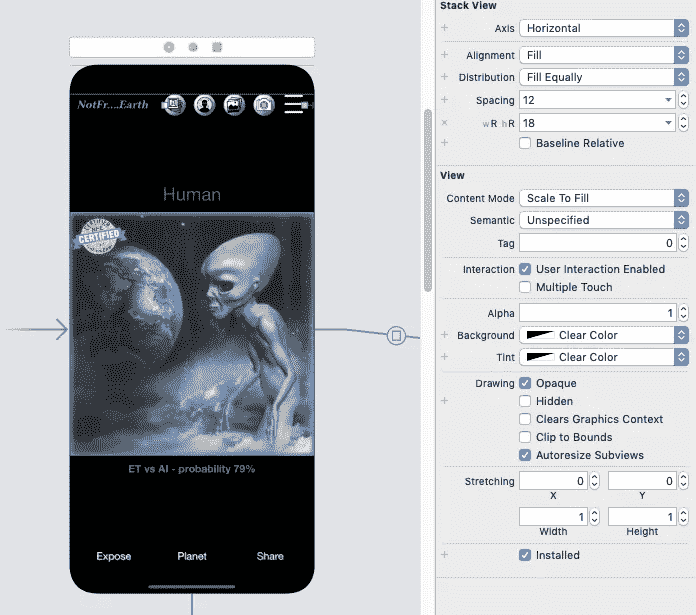
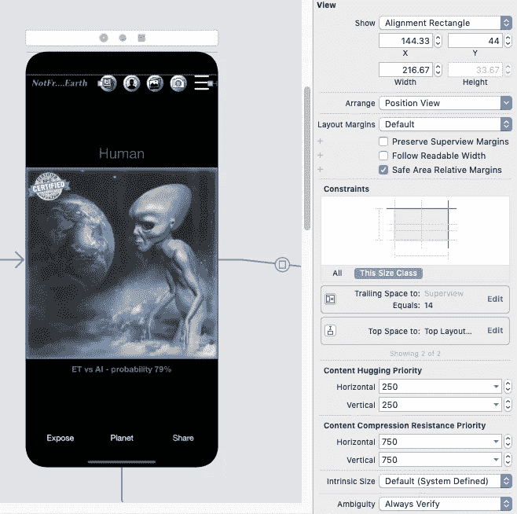
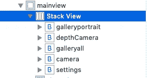
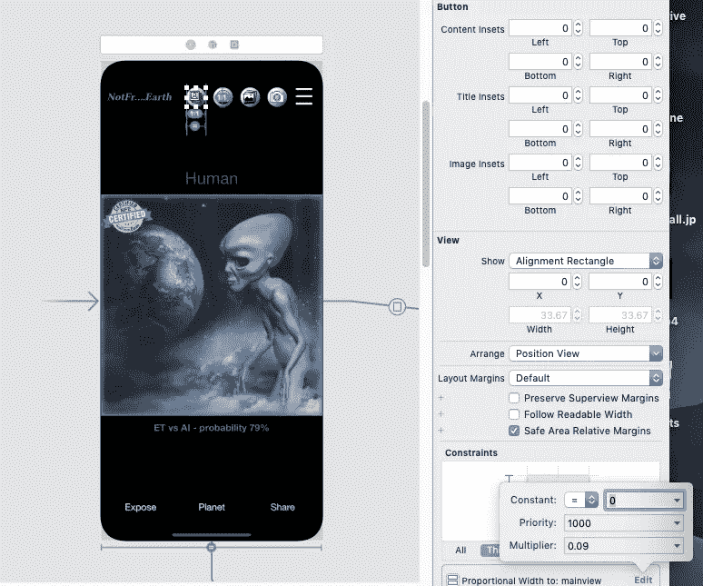
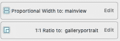

# 有效的 Xcode 堆栈视图方法

> 原文：<https://medium.datadriveninvestor.com/stack-view-method-that-works-dbcf4031bb3a?source=collection_archive---------4----------------------->

## Xcode 堆栈视图和自动布局应该一起工作，没有戏剧性。

应用程序设计很重要，你的设计应该在所有尺寸的设备上看起来相似。堆栈视图的使用似乎应该是一个简单的任务。但是就像器官修理工知道用锤子敲哪里一样，我们需要学习一些堆栈视图技巧。

假设我们有五个按钮，希望放在屏幕的右上角。我们也有这些基本要求。

1.  这些按钮的大小应该都一样
2.  无论屏幕大小如何，按钮都不应倾斜
3.  按钮的大小应该增加以匹配屏幕大小
4.  按钮之间的间距应该根据屏幕大小而定

好了，看这两张快照(iPhone 和 iPad)。我们要重点关注的按钮是右上角的五个。它们存在于堆栈视图中。那么，它们是如何针对不同的设备进行调整和定位的呢？他们如何符合我们上面的四个标准？

我已经阅读了关于自动布局的堆栈视图的各种文章和文档，但我仍然有问题。我必须找到挖掘的地方。只需使用故事板按照下面的四个步骤。

Samples of Stack View button menu

**1** 。使用故事板，创建一个 Stack 视图，如所示(图 1)。将对齐设置为填充，将分布设置为均匀填充。此外，为子视图设置适合 iPhones 的间距，为 iPads 设置另一个间距。当你设置好所有的按钮后，再使用这些值。

Figure 1 — Stack View for top right buttons

**2** 。如所示定位堆栈视图(图 2)。**堆栈视图不需要尺寸限制**。请注意堆栈视图的位置。约束使用尾部空格设置水平位置，使用顶部空格设置垂直位置。子按钮视图决定了堆栈视图的大小。

您可能想调整堆栈视图的大小，然后将按钮放在里面。我建议不要那样做。这是一个棘手的问题。

Figure 2 — Position Stack View

**3** 。将按钮或其他对象拖到堆栈视图中(图 3a)。然后使第一个的宽度等于主屏幕的宽度(图 3b)。接下来，将宽度编辑为主屏幕的百分比。请注意乘数 0.09。这样做将使堆栈视图中的所有子视图的大小根据屏幕大小进行调整。

Figure 3a — Buttons in Stack View

Figure 3b — Button in Stack View with a relative width constraint

**4** 。给这个孩子再添加一个约束(图 4)。选择长宽比，使其为 1:1。这将防止你的按钮歪斜。将该约束添加到堆栈视图中的所有子对象。

Figure 4 — Setting the equal aspect ratio

First Button Constraints

那是一个包裹。这种堆栈视图和自动布局的基本方法在大多数情况下都有效。

寻找一篇即将发表的文章，看看 IBM Watson、Apple CoreML 和 Google Colab 如何合作识别外星人。

更多截图请点击此处:

 [## 视频|非来自地球

www.notfrom .地球](https://www.notfrom.earth/aliens-gallery)