# 体育场融资与令牌化

> 原文：<https://medium.datadriveninvestor.com/stadium-financing-and-the-tokenization-a3ef75c72c8e?source=collection_archive---------13----------------------->

## 以及符号化如何为职业运动队、联盟和运动员创造无数创新机会，与他们的粉丝互动

我热爱运动，我感谢父亲教给我运动的宝贵价值。我从 5、6 岁起就一直这样做，现在仍然这样做，每天都这样，嗯……差不多。要看的话，没有什么比美国体育更好的了。这与这项运动本身无关——例如，我喜欢看橄榄球，它在美国并不流行——但这与美国人有能力上演一场出色的表演、一场精彩的娱乐节目有关。没有什么比得上超级碗、NBA 季后赛或大型 UFC 比赛这样的壮观场面。

Super Show

最重要的是，美国体育一直是一项大生意。在世界上任何其他地方之前，就有大量资金参与其中。**在这方面，** [**令牌化**](https://medium.com/hackernoon/why-tokenization-is-still-a-chimera-2f149734f68f)**——可用作融资的有效工具——是一项技术发展，将对体育行业未来的融资产生重大影响**。我相信，我们很快就会看到体育行业中第一批符号化的例子。也许可以从大型场馆的建设和融资开始，这是所有体育项目中最大和最复杂的。

# 美国体育场馆的融资方式——个人座位许可证

迄今为止，体育场和大型运动场馆的建设主要由公共和私人资金混合资助。与政府资助相关的部分历史上一直相当大，实际上相当于[纳税人补贴](https://en.wikipedia.org/wiki/Stadium_subsidy)授予私有团队/特许经营[，它们攫取了最大的经济利益](https://www.forbes.com/sites/jeffreydorfman/2015/01/31/publicly-financed-sports-stadiums-are-a-game-that-taxpayers-lose/)。这通常是以市政债券、免税或低于市场利率贷款的形式实现的。但是，声称所有这些都是为了当地经济和居民的利益——通过关于球队将在其城市产生的经济影响的可疑研究，这种说法被巧妙地说服了— [现在由于许多新的研究而受到更加公开的挑战。更多关于这个问题的信息](https://www.johnlocke.org/research/public-financing-of-mls-stadiums-warrants-a-red-card/)[这里](https://www.theatlantic.com/business/archive/2016/06/a-better-kind-of-stadium-deal/486596/)和[这里](https://econreview.berkeley.edu/the-economics-of-sports-stadiums-does-public-financing-of-sports-stadiums-create-local-economic-growth-or-just-help-billionaires-improve-their-profit-margin/)。

 [## 5 行业转型区块链应用|数据驱动投资者

### 除非你一直生活在岩石下，否则我相信你现在已经听说过区块链了。而区块链…

www.datadriveninvestor.com](https://www.datadriveninvestor.com/2019/02/13/5-real-world-blockchain-applications/) 

其结果是，即使公共资金份额没有完全消失，至少也有可能减少，所有者将不得不以其他方式弥补差额。因此，这需要私有团队/特许经营方投入更多资金来完成其基础设施项目。

美国特许经营权所有者近年来为这些基础设施项目筹集资金的最重要途径之一——特别是在 [NFL 联盟](https://www.nfl.com/)中——是**所谓的** [**个人座位许可证**](https://en.wikipedia.org/wiki/Personal_seat_license) 。PSL 实质上是一种选择权，由特许经营权授予球迷，购买若干赛季特定座位的比赛门票。

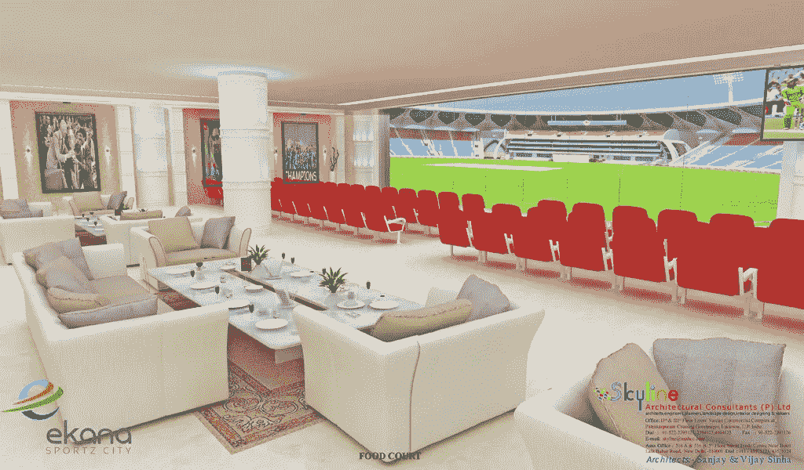

PSL 在持续时间、价格、座位位置和附属权利方面有所不同，例如获得接待服务、贵宾休息室、粉丝互动活动、特别活动等。PSL 与欧洲足球队通常卖给球迷的季票有很大不同。事实上，PSL 通常可以转售，并且已经发展了一个二级市场来交易这种“期权”。T2 认为这是否是一项好的投资还有争议。对 PSL 的历史和功能的一个很好的描述[你可以在这里找到。](https://www.greenberglawoffice.com/personal-seat-licenses/)

传统上，PSL 是 NFL 球队为其体育场项目融资的一种非常有效的方式。筹集到的资金相当可观。

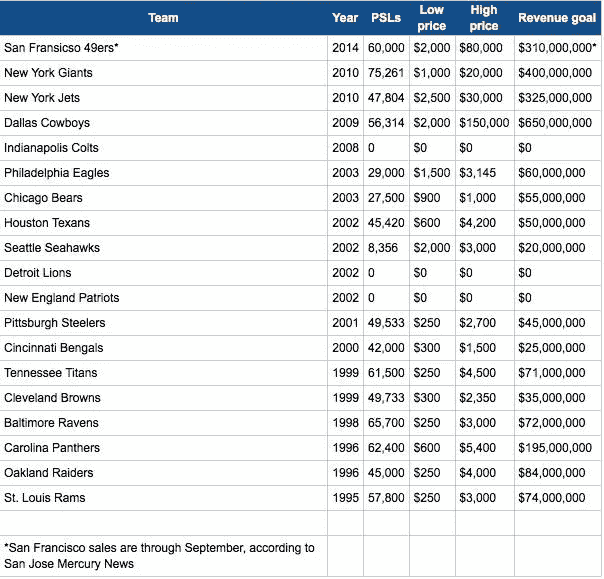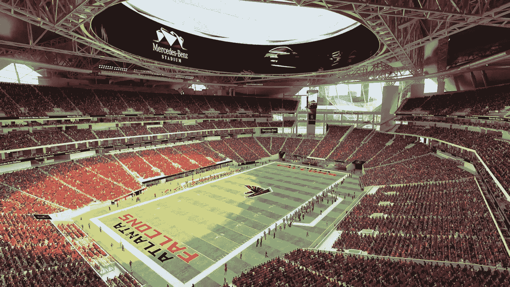

最近，梅赛德斯-奔驰赞助的亚特兰大体育场(猎鹰队[的主场)耗资 15 亿美元，其中 11 亿美元来自特许经营权的私人融资。这是总成本的 73%。其中，猎鹰队在 PSL 的销售额超过了 2.5 亿美元。这是对所有私人资金的 22%的重要贡献。如果说过去 PSL 许可证的创纪录价格是由达拉斯牛仔队球迷支付的 15 万美元，那么新的记录将由洛杉矶公羊队创下，预计他们将以高达 22.5 万美元的价格出售 PSL，从而为新 SoFi 体育场的 26 亿美元造价做出贡献。](https://www.atlantafalcons.com/)

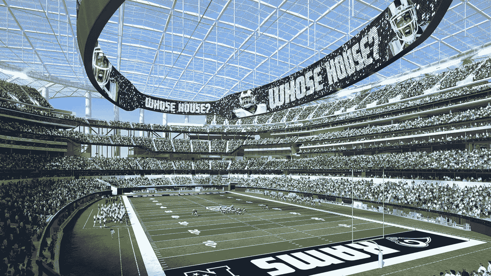

Los Angeles Rams´ home — The world´s top financial performer with US$ 420 million operating profits per year

出于一定程度的谨慎，并考虑到人口统计和其他重要的当地经济数据，越来越多的 NBA、MLB 和 NHL 联盟球队或大型赛事(如 F1 和 Moto GP[Circuit of Americas](http://circuitoftheamericas.com/))也在尝试出售 PSL 以资助特许经营企业的策略。

# 欧洲体育场馆的融资方式

相反，在欧洲大陆，创新通常较少。例如，在意大利，大多数足球/足球场仍然由地方议会公有，然后特许球队使用。因此，考虑到地方政府普遍预算紧张，每当需要重组工程或全新建设项目时，问题总是会出现。这种情况目前正在米兰市发生，当地的两家足球俱乐部 Internazionale F.C .和 Milan A.C .正在与地方议会争论各自应出资 12 亿€(€为该体育场出资 6 . 5 亿，加上在附近开发一个“体育城”,另外花费 5 . 5 亿€)建造一个新体育场，还是花费约 5 . 5 亿€翻修旧的“圣西罗梅阿查”。虽然这是意大利足球的常态，但也有一些例外值得注意。

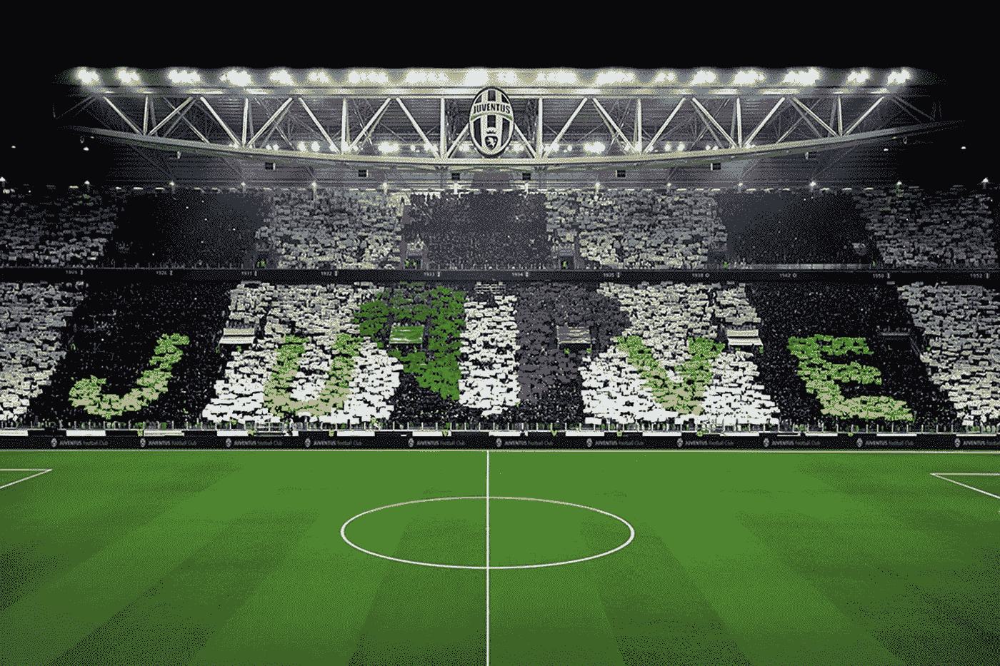

[尤文图斯都灵](https://www.juventus.com/it/)是[尤文图斯安联体育场](https://www.juventus.com/it/stadium-e-museum/)的所有者，该体育场是 2009 年根据当地议会授予的 99 年土地租赁权特许建造的。一些小球队也是如此，比如乌迪内斯和萨索洛。

相反，在英国，托特纳姆热刺队引领潮流，将美国模式向前推进了一步。似乎他们的新体育场几乎完全是私人投资的。俱乐部已经获得了价值 3 . 4 亿英镑的土地，并组织了一个贷款财团(高盛、美林、罗斯柴尔德和汇丰银行)来为该项目提供 10 亿英镑的贷款。然而，如果没有像 PSLs 预售这样的机制，托特纳姆热刺队的老板将承受风险的冲击。

# 哪些优势可以带来记号化

**职业体育是符号化的完美候选**。我的同事[托马斯·欧拉](https://www.linkedin.com/in/thomaseuler)在本文中解释了为什么[。](https://medium.com/liquiditeam/professional-sports-need-to-be-tokenized-62f144e73c52)

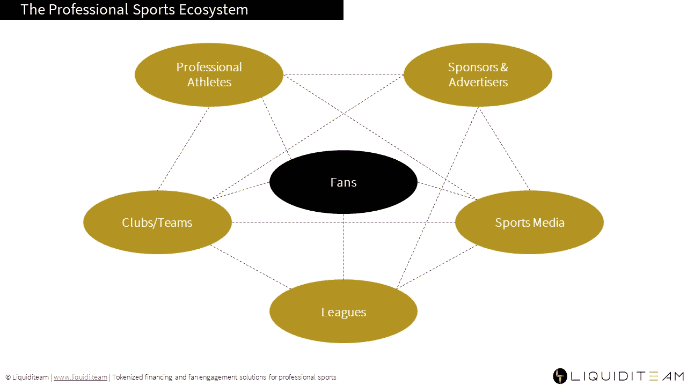

**简而言之，符号化是一种工具，可以在复杂的生态系统中有效地使用，以减少摩擦点，并调整多个利益相关方的激励和利益**。就复杂体育基础设施项目的融资而言，我们与多个利益相关方打交道，如当地政府、球队、赞助商、媒体和大型市民/球迷社区。他们都有不同兴趣和动机。**因此，加密令牌是一项伟大的技术创新，可以帮助筹集建设新体育场所需的资金，并通过创造正确的激励机制和减少摩擦来协调上述所有利益相关方的利益**。

> *术语“* [*令牌化*](https://cointelegraph.com/news/why-tokenization-is-still-a-chimera-expert-take) *”表示“创建加密令牌，它是资产、权利、债权、数据或货币价值的数字表示，使用公钥加密在 data 区块链基础设施上存储和传输。这是通过部署所谓的“智能合同”来实现的，智能合同包括将此类权利和资产的基础协议的条款和条件转换成计算机代码行，这些代码行将由软件在某些预编程条件下自动执行。这里的关键是自动无信任执行”。*

**更简单地说，对于那些不熟悉区块链和加密资产等主题的人来说，这项技术可以将 PSL 合同协议、比赛门票、参加特殊活动的权利和球迷参与选项以及基本上任何其他合同权利“打包”到一个数字容器/工具(即令牌)中。然后，令牌可以由它的所有者存储在数字“个人钱包”中(例如在他的移动电话中)，并且可以容易地与其他人直接(对等)快速和安全地交换。这项技术还使得一些合同条款和条件(例如 PSL 有一些转让限制)可以直接编程(即编码)在令牌中并自动执行**。

# TPSLs 是 PSL 的自然发展

因此，令牌化的个人座位许可证(TPSLs)将很快出现，它们是 PSLs 不可避免的自然演变。它们将具有许多关键优势:

现有的二级市场必须发展，变得更有效率。流动性将会增加，允许点对点直接转账 TPSLs 和相应的加密货币和稳定货币支付选项。

**转会限制**，如今对于球队来说很难执行，但可以很容易地编程到代币中并自动执行(智能合同编码)。特别是，通过监控区块链上的交易，可以很容易地执行客观标准，例如对 TPSL 或基础比赛门票的销售价格设置上限(以阻止昂贵的转售商)。

它也将**解决假冒问题**。

简单明了的**自动执行任何适用的转让费**，该费用可作为“汽油费”从交易价格中扣除。

如果买家通过团队贷款购买了 PSL，那么**同样的贷款可以装入令牌**中，在出售 PSL 的时候，它可以自动转移到新所有者的钱包中，而不需要团队、买家和卖家之间的任何文件传递。此外，任何利息支付可以自动从买方钱包中扣除，任何到期金额也可以锁定在一个加密托管中，以保证买方未来向球队支付利息。

# TPSLs 在欧洲有潜力吗？

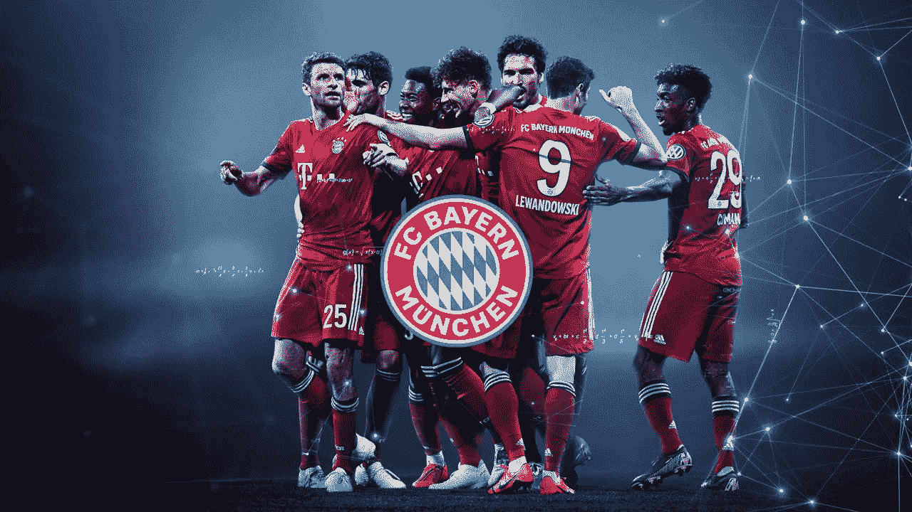

欧洲顶级足球俱乐部无疑拥有当地社区的人口结构、消费能力、财富和收入，能够成功发行 TPS。如果不像他们的 NFL 对手一样在几十万范围内，最肯定的是在几万范围内。至少数字在那里。除了达拉斯牛仔队——它是世界上财务表现最好的球队，每年有 4 . 2 亿美元的营业利润——所有其他 NFL 球队的收入和营业利润或多或少与欧洲顶级足球俱乐部处于同一联盟。

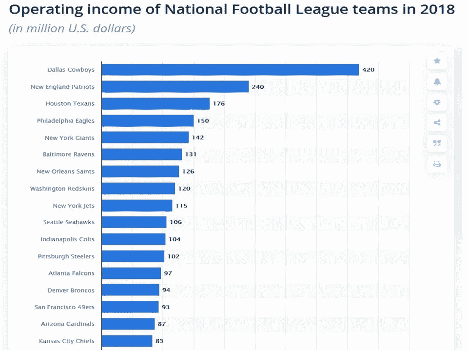

根据这份 [2019 德勤足球金钱联赛报告](https://www2.deloitte.com/bg/en/pages/finance/articles/football-money-league-2019.html)皇马以超过€7.5 亿英镑的收入击败竞争对手。为了将这个数据与上面的 NFL 球队数据进行比较，我们应该找到欧洲球队的营业收入。据统计，营业收入约占总收入的 50%。因此，我们可以估计，根据下面的图表，比较苹果和苹果，欧洲俱乐部的营业收入大约在€皇马的 3.25 亿英镑和€西汉姆联队的 9800 万英镑之间。因此，就收入和营业收入而言，排名前 20 位的欧洲足球队或多或少与排名前 20 位的 NFL 美国队处于同一联盟。

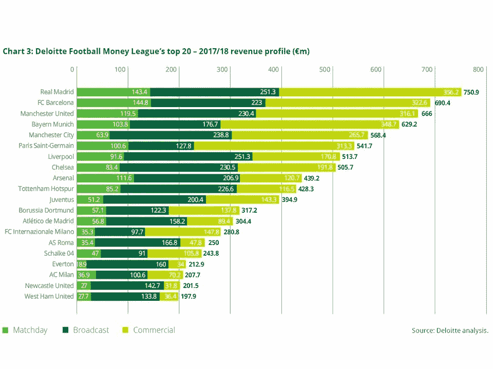

比较欧洲俱乐部每年出售的季票数据也是有用的。曼联在 2019 年出售了全部 52.000 张季票。像国际米兰、米兰和尤文图斯[这样的意大利意甲顶级球队在 2019 年分别卖出了 41.000、30.000 和 29.300](https://www.oasport.it/2019/09/serie-a-2019-2020-la-classifica-degli-abbonamenti-inter-prima-con-41000-davanti-a-milan-e-juventus/) 的季票。因此，即使在这方面，欧洲顶级团队也可能成功销售 TPS，并效仿美国为自己的项目融资。

# 代币经济与体育产业

> 但是标记化可以给这个复杂的生态系统带来比仅仅标记 PSL 更多的东西。符号化为特许经营带来了无数与投资者、粉丝、赞助商和媒体互动和接触的新机会。这既适用于整个体育生态系统，也普遍适用于娱乐业。更有可能的是，涉众的创造力将是真正的极限:

**利润分享权**可以令牌化，让投资者或贷款人在游戏中有更多的利益，从而允许特许经营所有者与他们分享一些风险。这可以通过发行所谓的安全代币来实现，安全代币在所有情况下都是证券，其发行和转让受适用的证券法规的约束。球迷们可能也想在比赛中有所作为，而不仅仅是在体育场拥有一个座位。他们可能想拥有自己心爱团队的一小部分。这个团队的创造力是对其[粉丝](https://en.wikipedia.org/wiki/Fandom)来说这种令牌内容的限制。

地方政府也可能从游戏中获得更多利益。以上面提到的托特纳姆热刺队以 3 . 4 亿英镑从当地市议会购买土地为例。俱乐部老板可以向当地议会提供 2.4 亿英镑和一些新发行的证券，代表企业的利润分成。车队老板将会降低其在合资企业中的风险敞口，而地方议会将会分享合资企业的潜在经济收益。

代币可以提供**无限的机会来吸引粉丝**参与特殊活动、进入医院和贵宾区、商品销售和体育明星纪念品、梦幻游戏、参与团队问题的决策/投票，如采用新球衣、制服等。

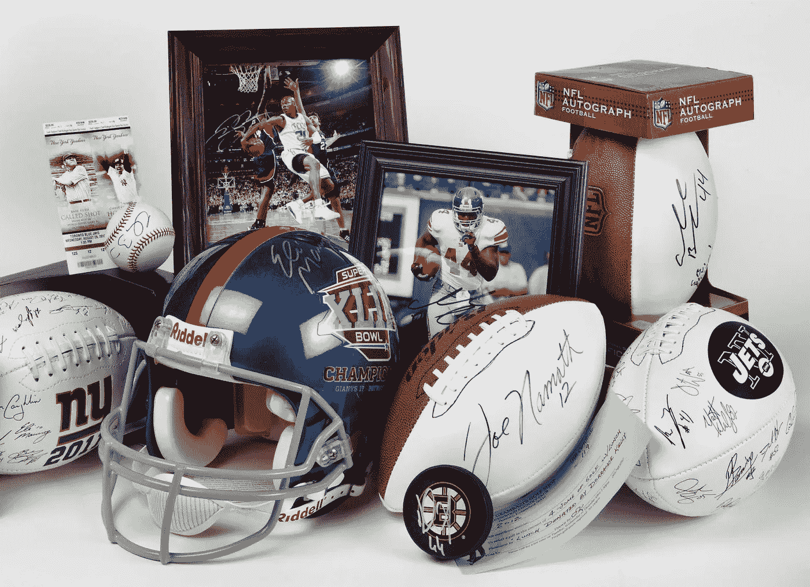

团队可以直接向粉丝出售独家媒体内容，这些内容可以用代币支付，从而避免传统媒体广播或其昂贵且现已过时的电视频道。

**代币可以在比赛或赛事期间启用及时微赞助**。想象一下，如果赞助商可以在得分后几秒钟就直接瞄准粉丝的话:“祝贺伙计，我们得分了！！！你刚刚赢得了一杯免费饮料！！来和我们一起庆祝吧”。Blip，球迷的个人钱包刚刚被存入一个代币，可以从体育场饮料站获得免费饮料。或者团队商品的折扣或者别的什么。同样，创造力是这里唯一的限制。

# 结论

TPSLs 是 pls 的自然进化，我们很快就会看到第一个例子。**但是，由于上述将对整个职业体育生态系统产生的好处，标志化必将成为创造激励机制和协调多个利益相关方(如团队、赞助商、粉丝、投资者、媒体和联盟)利益的主流解决方案。我们将会看到许多创意和新想法正在实施，不仅是在足球领域，在体育和娱乐行业也是如此。**

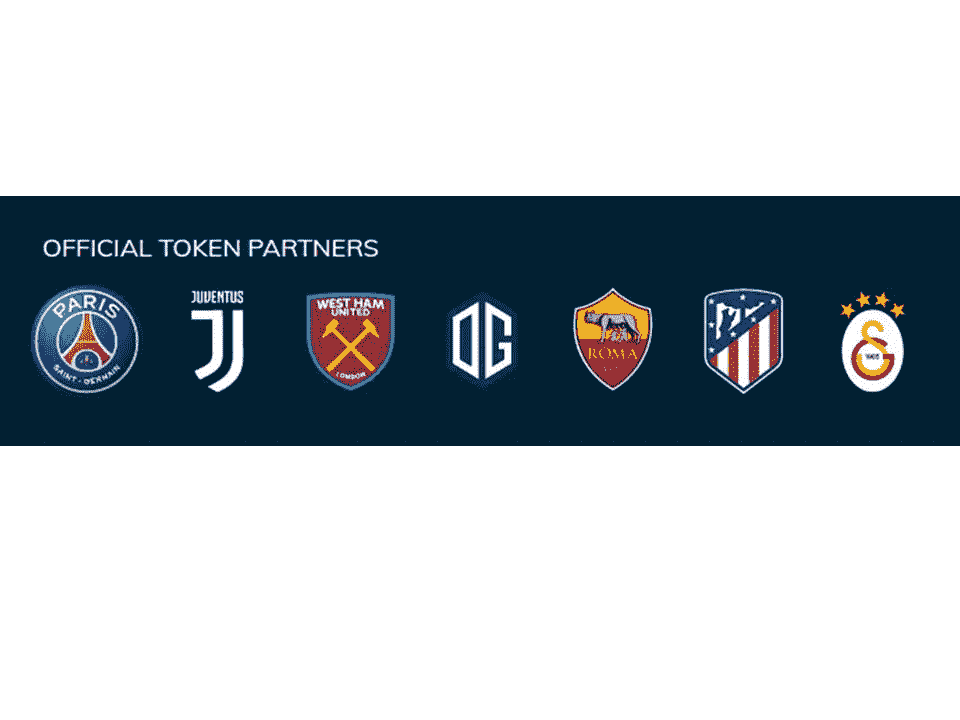

一些欧洲顶级足球俱乐部是 Socios 平台上粉丝代币[的早期采用者之一。更多的公司将会跟进，很快将推出安全代币来筹集资金和/或与投资者和粉丝分享风险投资的利润。一个充满机遇的全新世界正在我们眼前展现，让体育娱乐圈变得更大、更有趣。看起来会更有趣…](https://www.socios.com/)

你可以在这里联系我:[https://www.bianconiandrea.com/contact/](https://www.bianconiandrea.com/contact/)

****************************************************************

如果你喜欢这篇文章，请在左下角“鼓掌”x 次，这样它会被更多的人分享。多谢

#区块链# bianconiandrea # think block tank # football # token ization # token # stadium # personal seat license # American football # sport

****************************************************************

**法律免责声明**:本网站及其中包含的信息仅供一般指导，不构成法律意见。因此，它不应被用来替代就具体问题与律师的磋商。本文中的所有信息均按“原样”提供，不保证完整性、准确性、及时性或任何形式的明示或暗示的担保。

**投资免责声明**:本网站及其中包含的信息无意成为与所提交材料相关的建议或信用分析的来源，本网站中包含的信息和/或文件不构成投资建议。

[www.bianconiandrea.com](http://www.bianconiandrea.com)—2019

*原载于 2019 年 12 月 10 日*[*【https://medium.com】*](https://medium.com/@andreabianconi/the-financing-of-stadiums-with-the-tokenization-dcd37f68de05)*。*