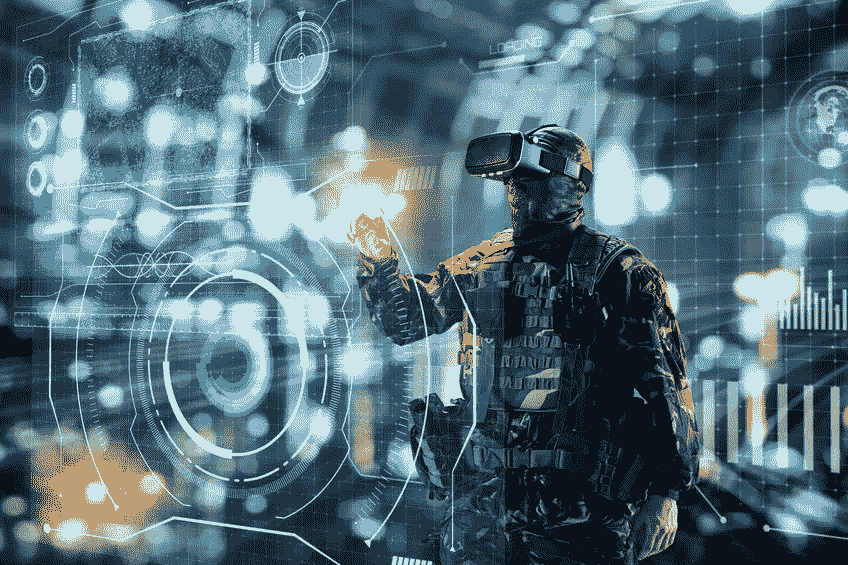
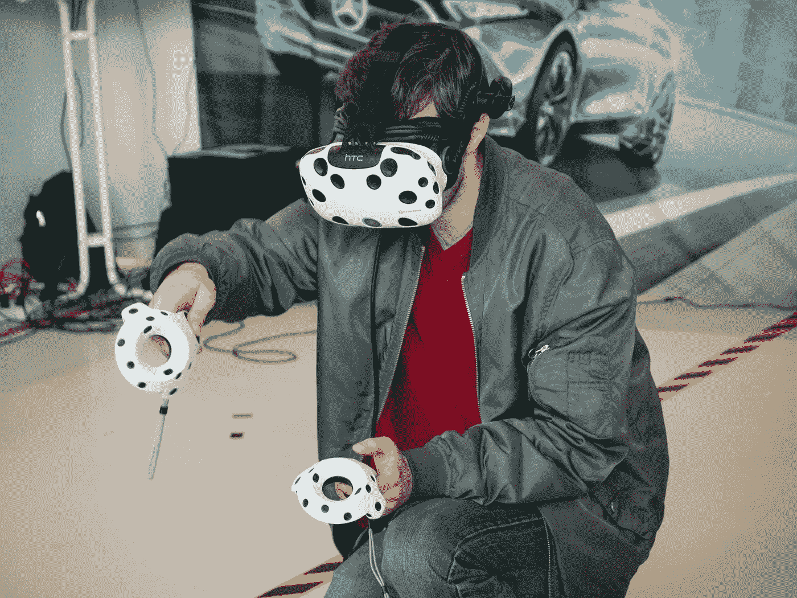

# 恐惧笼罩:虚拟现实会是我们需要的答案吗？

> 原文：<https://medium.datadriveninvestor.com/stalked-by-fears-will-virtual-reality-be-the-answer-we-need-d581f70ff648?source=collection_archive---------12----------------------->

©anolkil

叮当，叮当，叮当，子弹打在装甲车外壳上的声音是无情的。嘣！一枚路边炸弹爆炸了，车内的每个人都被扔了出来，变成了一堆血淋淋的尸体和身体的一部分。

空气中充满了呻吟，当火焰开始笼罩眼前的一切时，烟雾升起。随之而来的恐惧和害怕让那个开车的人的记忆越来越深。所有这一切都是一个清晰的记忆，任何卷入这场悲剧的人都不会忘记。许多人将因此遭受长期的焦虑障碍。

[感觉记忆](https://exploringyourmind.com/memories-evoked-five-senses/)是被称为[创伤后应激障碍](https://en.wikipedia.org/wiki/Posttraumatic_stress_disorder) (PTSD)的焦虑症的组成部分。在他们回家的路上，军人和女人会有这些持续的现实和他们的情绪的混乱。噩梦如火山爆发般接踵而至，让夜晚成为恐惧重现的时刻；恐怖从未停止。

正在发射 AK-47 子弹。突然的倒叙让他们在街上停下来，有些人蹲下了。人们可能会疯狂地大喊救命。医疗兵，医疗兵，医疗兵！每个人都会盯着看，不知道该跑还是打 911 求救。这是生活的改变和残疾。回到他们以前的生活或自我似乎是不可能的。通常，自杀是一个答案。

治疗和虚拟现实

> 虚拟现实(VR)使用虚拟场景、眼镜、软件和手持物体在受控的治疗环境中重建环境。这个场景在任何意义上都是“真实”的，除了它不是真实的。

通过电脑程序和耳机上的数字屏幕让一个人沉浸在一个重建的虚拟环境中，这是麻省理工学院的伊凡·苏泽兰在 1968 年首先发明的。萨瑟兰解释了这个术语和软件是如何出现在视频中的。从那时起，这种基于数字现实的编程形式的潜力已经从游戏发展到治疗，因为它在精神卫生保健方面找到了额外的用途。焦虑是主要目标。

虚拟现实作为焦虑症的治疗干预手段，结合了强大的技术，研究表明非常有效。最初的技术是由乔瑟夫·沃尔普于 1958 年发明的，被称为 T2 系统脱敏法或交互抑制法，对治疗“战争神经官能症”很有效

该理论认为，不可能同时体验恐惧和放松，基于这一模型开发了一种三步法。[步骤](https://www.simplypsychology.org/Systematic-Desensitisation.html)包括学习放松的方法，建立恐惧的等级，然后逐渐暴露在恐惧刺激中。这样，在治疗练习中，身体和精神能力都可以发挥作用。

Photo by [XR Expo](https://unsplash.com/@xrexpo?utm_source=unsplash&utm_medium=referral&utm_content=creditCopyText) on [Unsplash](https://unsplash.com/s/photos/virtual-reality-therapy?utm_source=unsplash&utm_medium=referral&utm_content=creditCopyText)

作为一种创新的技术，虚拟现实可能被用于几种令人恐惧的情况。然而，有些人可能无法利用它。任何经历过头晕(被称为网瘾)、癫痫或某些心脏疾病的人都不适合这种疗法。逐步引入虚拟环境可能会减少网瘾。

其他一些人可能也不是候选人，包括偏头痛患者。有精神病或人格障碍倾向的人也可能被排除在外，他们可能会混淆虚拟世界和现实。然而，未来是光明的，更多的人将被纳入虚拟现实疗法的保护伞下。

虚拟现实与自闭症

是什么把自闭症患者的注意力完全吸引住了，以至于他们无法将自己从注意力上移开？这是马特·克拉克，一个患有自闭症的儿子的父亲，想要回答的问题。他对自己问题的回答导致他在伦敦的维多利亚和阿尔伯特博物馆开发了一个虚拟现实展览。该展览是其他博物馆的众多展览之一，旨在重现一个自闭症男孩的感知世界，但也不乏批评者。

正如克拉克所说，他 15 岁的儿子“不会说话；他的行为极具挑战性。”因此，我们怎么能指望他表达自己来协助我们理解呢？对于克拉克、几位患有自闭症的艺术家以及有自闭症亲属的家庭成员来说，这是一个开始。虚拟环境的使用现在可以打开一种新型的对话，让人们第一次站在自闭症患者的立场上。他们怎么能这样做？

> 考虑这样一个事实，自闭症是一种通常具有视觉、声音和运动的严重超负荷的疾病。他们的世界通常是不可知的，他们自己也很难理解。

一旦他们离开他们的家或学校，即使在一个我们觉得舒适的地方，也可能是令人恐惧的；[某商场](https://www.youtube.com/watch?v=DgDR_gYk_a8)。重现自闭症世界的一个尝试是英国《卫报》制作的[视频。观看它只能提供一点真实的体验，但这是值得努力的。自闭症患者可以在哪里使用虚拟现实？](https://www.youtube.com/watch?v=OtwOz1GVkDg)

如果没有虚拟现实，求职面试将会非常紧张和低效。涉及面试情况的职业咨询培训项目可以从温和到更具攻击性；这是任何求职者都必须面对的问题。

在学习如何在虚拟环境中处理各种情况时，强化面试技巧是最实用的，也是强化学习的一种方式。但是，了解如何找到工作并不是这些人需要理解和练习回答的唯一地方

在一群人面前演讲时，课堂环境也很有挑战性。即使是在这个封闭的空间里，公开演讲也比其他学生更具威胁性。

这里也可以设想一系列不同的环境，这样自闭症儿童就可以减少焦虑，对即将到来的事情有更多的准备。虚拟现实项目可以是宽容和宽恕的，因为很少有老师会这样对待有这种残疾的学生。

虚拟现实的未来前景

临床医生和研究人员看到了一个乐观的前景，虚拟现实项目不仅可以治疗 PTSD 和特定恐惧症等焦虑症。技术的进步和设备的初始成本使虚拟现实更容易实现。残疾人或自闭症患者将学习适当的技能，减少他们的恐惧。

没有明确针对疾病的项目的独特任务为增强自我效能感和认知增强提供了希望，以应对功能失调的信念。所提供的经验实际上可以为在其他环境中取得积极成果创造机会。

VR 还可以增强学习或将学习融入新的情境。挑战在于程序员和那些能够预见新机会的人的创造力。