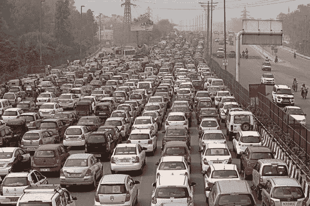
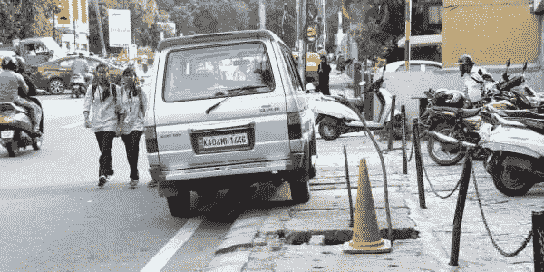

# 捍卫无车者的权利

> 原文：<https://medium.datadriveninvestor.com/stand-up-for-the-rights-of-carless-40376d5731fb?source=collection_archive---------10----------------------->

当你走上印度的道路，你会发现经济差距在印度社会中根深蒂固。超级富豪开着他们的巨型 SUV，富人开着他们的豪华轿车，中上阶层开着他们的掀背车，中下阶层的人骑着他们的低端摩托车。穷人要么使用拥挤的公共交通设施，要么骑自行车。并且，行人在道路上几乎没有任何空间。

Indian roads have ceased to be democratic spaces. The car-centric infrastructure such as expressways and flyovers are quickly gobbled up by cars leaving no space for public transportation.

**新兴的汽车文化**

作为西方消费主义的核心，汽车文化正在印度迅速发展。有盲目模仿西方文化、价值观和生活方式倾向的印度人正在掀起一场购车狂潮。几乎所有知名的跨国汽车制造商，加上少数国内制造商，都在印度大力推广他们的车辆。印度的乘用车销量正以 10%的速度增长，预计到 2020 年，每年将有 500 万辆汽车上路。如今，获得汽车贷款比获得农业贷款容易得多，而且利率也非常诱人。

社会上层不断增长的可支配收入、糟糕的公共交通状况、与拥有汽车相关的精英主义以及示范效应是印度汽车文化繁荣的部分原因。汽车文化使公共空间非民主化。汽车占据了 80%以上的道路空间，极大地加剧了交通拥堵。他们不仅挤走了骑两轮车的人，还使行人的生命岌岌可危。而且，很少有汽车能满载乘客，大多数汽车只载车主兼司机。因此，占据大部分道路空间的汽车只能承载少量的人，这使得汽车在像印度这样的国家成为一种效率非常低的交通方式。

**石油依赖是恶性循环**

这些耗油量大的汽车增加了印度对燃料的依赖。原油进口的急剧增加给经济带来巨大压力，尤其是外汇储备。汽车文化的先驱美国以推翻流氓政权或消灭恐怖组织为借口发动了多次战争。然而，在许多情况下，美国侵略的主要潜在原因是其对石油丰富的国家实施控制的野心，其意图是确保不受阻碍的碳氢化合物供应。美国领导下的西方国家发动的石油战争在盛产石油的伊斯兰世界播下了有毒的种子，结果，整个世界现在都在以基地组织和 ISIS 等恐怖组织的形式收获苦涩。如果印度不遏制汽车文化的传播，它可能会发现自己在寻求确保不间断石油供应方面处于非常困难的境地。

支持汽车的政府政策

在 2012 年做出的一项具有里程碑意义的判决中，德里高等法院认为，“交通设施是用来运送人的，而不是汽车，应该有利于所有用户，而不仅仅是那些有幸使用私家车的少数人”。在印度有许多人持有错误的观念，认为一个充满汽车的国家就是发达国家，因此主张让更多的汽车上路，以获得发达国家的地位。每个国家，无论其经济状况如何，都必须建立方便、负担得起和高效的公共交通系统，以使社会各阶层都能舒适地出行。政府没有为公交车开辟专用道路空间，也没有提高其他公共交通设施(如郊区火车网络)的容量，而是拓宽道路，修建新的立交桥和停车位，这些很快就被汽车和其他私人车辆占用了。

在许多印度城市，有一种趋势是，那些买了车却没有停车位的人，倾向于把车停在他们家门前的人行道上，从而危及行人的安全。根据交通事故统计，在印度道路上死亡的人中超过一半是骑自行车的人和行人。最近，酒后驾车和未成年人驾车的事件越来越多，夺去了包括儿童和老人在内的行人的生命。坑坑洼洼、狭窄的印度道路，挤满了无数的私人车辆，对旅行者来说变得越来越危险。2015 年，平均每天有 400 人死于交通事故。换句话说，每年有多达 147 万人在印度的道路上咽下最后一口气，这让他们陷入了死亡陷阱。

**为无车一族的权利挺身而出**

When cars are parked on pavements and the pavements are badly maintained, the lives of the pedestrians turn precarious.

尽管印度的汽车文化存在诸多弊端和不适应性，但精英们还不准备改变他们的生活方式。他们甚至不准备容忍任何人质疑他们随意使用汽车的权利。这个国家的人民，不管他们的经济状况如何，都必须认识到这样一个事实，那就是，为他们的豪华生活提供燃料的汽车拥有者，正享受着无限的特权。这些特权必须被削减，以赋予穷人和普通人收回他们在民主公共空间中的份额的权力。否则，富人和精英们会把他们的特权误认为是权利，他们会把社会变成他们的领地，在马路上占据不成比例的大空间，到处乱停放汽车，不给行人或公共交通留下任何地方。

没有汽车的穷人，他们没有发言权，对他们的自行车和步行空间的逐渐缩小成为沉默的旁观者。最好的例子是，当德里政府推出减少汽车排放的单双号计划以降低污染水平时，所有精英都变得凶猛起来，并发起了一致的社交媒体运动来诋毁政府。拥有汽车的精英们控制着大部分机构，拥有压倒性的强大话语权，有了这种话语权，他们甚至可以制造有利于他们汽车文化的共识。另一方面，没有汽车的穷人，他们没有发言权，对他们的自行车和步行空间的逐渐缩小成为沉默的旁观者。

印度的政府，无论是联邦政府还是邦政府，总是声称自己是亲穷人的，不会留下任何机会来谈论社会正义。然而，在实践中，他们以促进汽车工业的名义为私人车辆特别是汽车铺平道路，这种做法不民主地抢占了公共空间，对环境和人民的健康造成了不可挽回的损害。现在是政府改变政策，促进安全、可持续、负担得起和可靠的交通设施的时候了，以确保社会各阶层的顺畅和无障碍流动。这项任务总是把公共交通放在第一位，汽车放在最后。