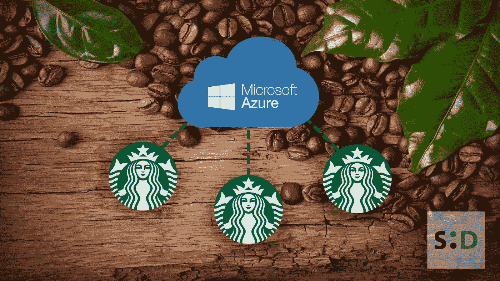

# 星巴克和微软的目标是利用区块链技术实现预测订购和从豆子到杯子的跟踪

> 原文：<https://medium.datadriveninvestor.com/starbucks-and-microsoft-aim-to-achieve-predictive-ordering-bean-to-cup-tracking-with-blockchain-8d7470df85a?source=collection_archive---------2----------------------->

2019 年 5 月 6 日，知名新闻来源 [GeekWire](https://www.geekwire.com/2019/microsoft-teams-starbucks-predictive-drive-thru-ordering-bean-cup-blockchain/) 爆料称，全球咖啡商星巴克(Starbucks)正在与同样是全球科技巨头的微软(Microsoft)建立合作关系。这场意想不到的联姻的原因之一是使用微软的 Azure 区块链来简化和增强星巴克的许多服务。

在 5 月 6 日的微软 Build 开发者大会上，两家公司列出了他们正在合作的一系列项目。这些举措包括跟踪咖啡豆的旅程并使用区块链技术保护它的系统，以及使用人工智能来*【学习】*星巴克顾客偏好的系统。

 [## 准备在 2019 年改变世界的技术-数据驱动的投资者

### 很难想象一项技术会像去年的区块链一样受到如此多的关注，但是……

www.datadriveninvestor.com](https://www.datadriveninvestor.com/2019/01/17/the-technologies-poised-to-change-the-world-in-2019/) 

《极客连线》报道称，以下是此次合作的成果:

*   **预测推动订单**
    通过使用 Azure 云，星巴克团队旨在更新其移动应用程序，该程序使用客户的订单历史来推荐饮料。希望扩展他们向免下车餐馆推荐饮料的能力，可能使用数字板。
    该系统将通过关注商店交易历史和*“超过 400 个其他商店级标准”*来工作，而不是使用应用程序的订单历史，这些标准包括天气、库存和一天中的时间。
    在会议期间，微软确实提到客户可以*通过推荐‘选择加入’个性化驾驶。但愿，这意味着你不会很快被扫描到你的车牌或面部。*
*   *互联咖啡机
    星巴克基本上计划使用 Azure 云来监控每家商店的所有设备。通过将他们所有的咖啡机、研磨机和搅拌机连接到一个人工智能系统，他们将能够更好地了解任何给定机器的*健康*。
    这家咖啡巨头希望通过从每一杯注入的浓缩咖啡中提取 12 个数据点，更加主动地维护他们的设备。目前缺乏这样的信息意味着星巴克必须等到机器坏了才能修理。通过使用 Azure cloud，希望他们能够在机器损坏之前修复它们，以减少停机时间。另一个好处是能够一次更新所有连接到云的机器。目前，星巴克需要发送数千个 USB 驱动器来更新他们所有的咖啡机。有了物联网云系统，他们在这方面的工作将成为过去。*
*   ***咖啡豆到杯子区块链**
    微软打算在与星巴克的合作中实现其 Azure 区块链服务，使用它来跟踪他们咖啡中使用的咖啡豆。基本上，用咖啡豆来杯区块链的目的就像它可能听起来的那样:追踪每个咖啡豆的旅程。
    由于存储在可公开验证的分布式分类账系统上的数据的不可变性质，存储在区块链内的数据是不可破坏的。它为制造商、农民、经销商和客户提供了相互联系的能力。*

*你看，上周是披萨，这周是咖啡。我想知道下周会发生什么。汉堡？*

*爱，和平和幸福。*

*最初发布:[*https://something deadline . co . uk/news/区块链/Starbucks-and-Microsoft-aim-to-achieve-predictive-ordering-bean-to-cup-tracking-with-区块链-tech/*](https://somethingdecent.co.uk/news/blockchain/starbucks-and-microsoft-aim-to-achieve-predictive-ordering-bean-to-cup-tracking-with-blockchain-tech/)*