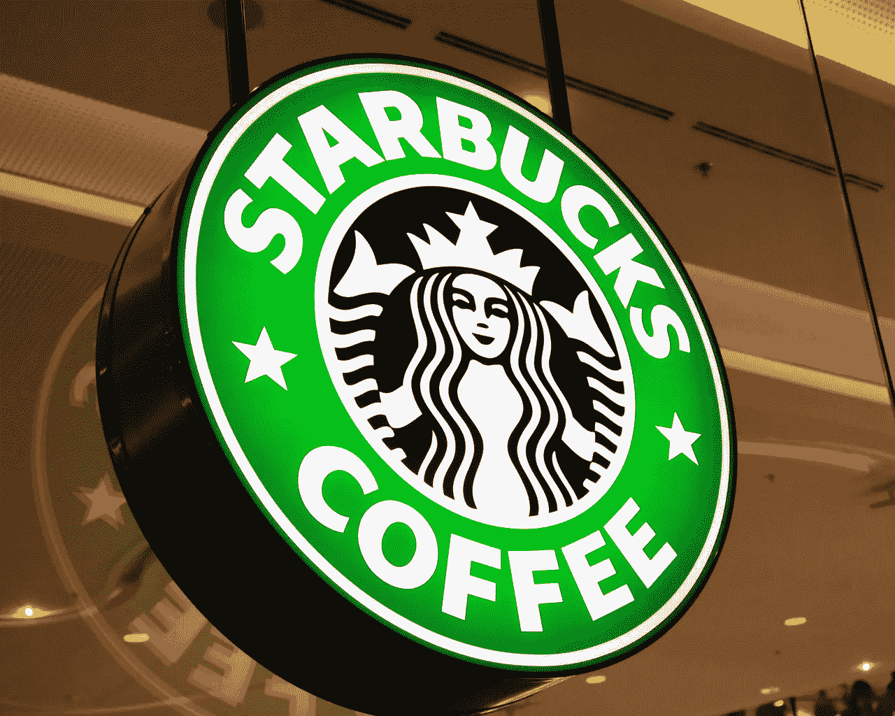
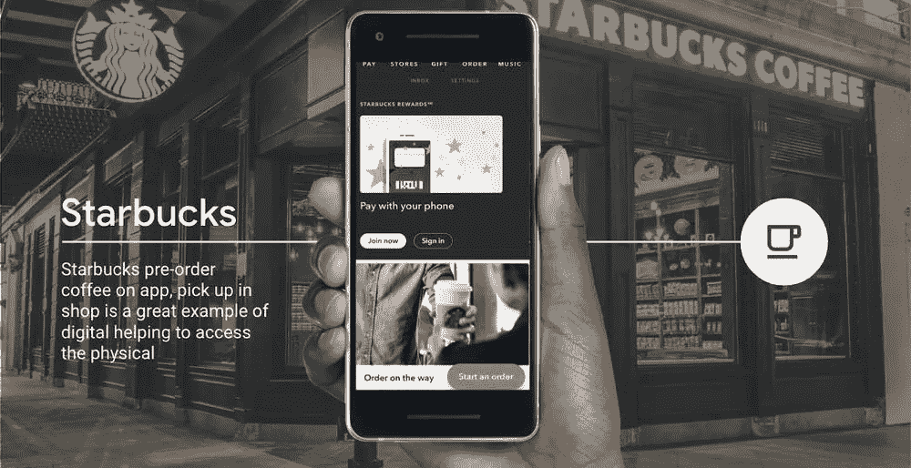
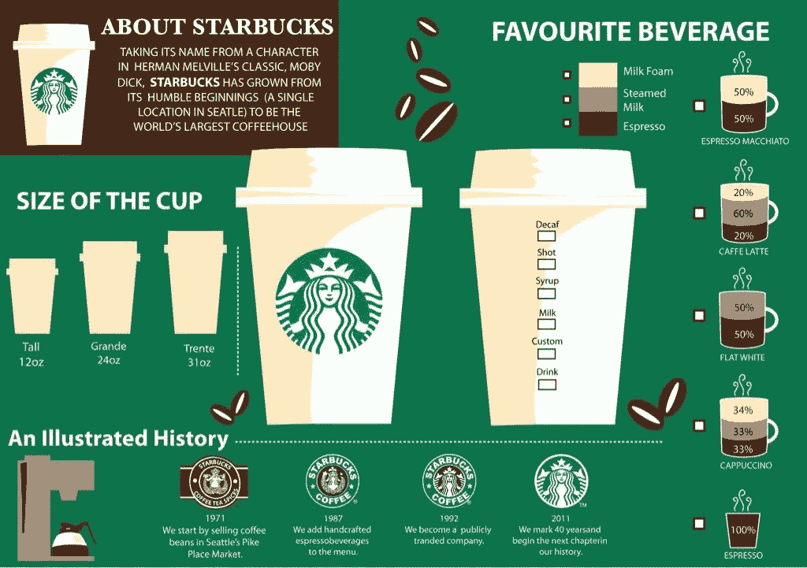

# 这就是为什么每个人都对星巴克着迷

> 原文：<https://medium.datadriveninvestor.com/starbucks-b762fa729138?source=collection_archive---------4----------------------->

## 顶级品牌|第 1 部分

星巴克如何使用区块链、物联网和人工智能来转变客户体验

多年来，星巴克咖啡公司已经为全球成千上万的人定义了早上喝咖啡的体验。仅在美国，星巴克就有超过 14，000 家门店，在咖啡领域拥有压倒性的市场份额。尽管它的咖啡可能会非常两极分化，有人称它为“Charbucks ”,因为它的黑烘焙酿造和苦味，但它已经成为这个星球上最知名的品牌之一。但如果不是咖啡，是什么让星巴克建立了如此忠诚的顾客群？为什么星巴克是世界第一的咖啡机？

# 体验

逛星巴克总是一种体验。星巴克卖给你的是整个体验，它只是碰巧把饮料作为其中的一部分来卖。商店的整体氛围是这样设计的，让人们体验一杯咖啡，而不仅仅是 T2 买一杯咖啡。当你走进星巴克，你确切地知道你会得到什么，从商店里的香味到杯子上你拼错的名字。加上出色的客户服务和质量控制，星巴克已经成为世界上仅次于麦当劳的最大快餐公司之一。

 [## 物联网危险预测|数据驱动的投资者

### 物联网危险预测|数据驱动的投资者

物联网危险预测|数据驱动的 Investorwww.datadriveninvestor.com](https://www.datadriveninvestor.com/2018/09/26/infographic-dangers-of-the-internet-of-things/iot-dangers-snip/) 

# 技术在发挥作用

几年前，星巴克已经推出了非常成功的移动应用，简化了顾客的整体体验。因此，星巴克已经通过其应用程序获得了有价值的客户数据，知道你的喜好和厌恶。现在，星巴克在技术方面比以往任何时候都更加雄心勃勃。

星巴克已经与微软 Azure 合作，通过一个名为“Deep Brew”的内部人工智能平台来创造更智能的客户体验。基于强化学习模型，“Deep Brew”可以根据你的口味、你当地星巴克最受欢迎的选择，甚至你当前的天气情况提供推荐。这将有助于星巴克更好地满足其多样化的全球客户群的偏好。

星巴克还拿出了 IoT(物联网)咖啡机，里面有最新的配方，保证每次都是一样的味道。这些机器将在一个集中的网络上，能够执行动态变化。高层管理人员认为，扩展这些机器将**而不是**非常难以实现，并将带来“实时可追溯性”。

随着越来越多的顾客开始意识到他们的咖啡豆的质量，它也试图通过教育他们今天早上喝的咖啡是如何从农场到当地星巴克的方式来提供透明度。该公司正在使用区块链系统向消费者提供更多关于其咖啡产品的信息，该系统将跟踪从“农场到杯子”的咖啡豆

星巴克的大受欢迎使其能够尝试其他快餐品牌从未尝试过的技术。他们雄心勃勃地将食物与最先进的技术无缝融合的努力值得称赞。星巴克提供非常完整的顾客体验，总是让顾客想要更多。

