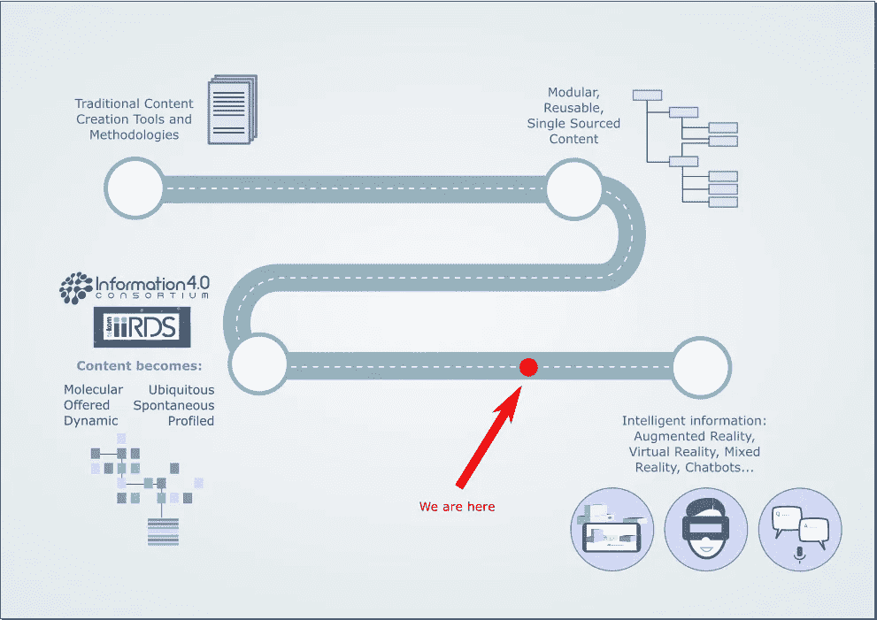

# 展望工业 4.0 世界的内容未来

> 原文：<https://medium.datadriveninvestor.com/staring-into-the-content-future-of-an-industry-4-0-world-f26d546f8c3?source=collection_archive---------40----------------------->

流行文化中各种各样的乌托邦科幻作品都试图描绘未来社会的图景。从 *1984* 到*银翼杀手*再到*少数派报告*，很多人都尝试过，大部分都失败了，有的还出奇的接近。但是现在我们正处在这样一个边缘，你可能会觉得这听起来像是另一个科幻故事，但很可能会成为现实。

第四次工业革命是我最近与几个内容营销客户交谈中出现的一个话题，但最终被搁置了，因为他们不完全确定它是什么，或者它与他们有什么关系。事实是，我也不是，直到我参加了一个讨论它如何与信息专业人士相关的[内容辩论者](https://thecontentwrangler.com)网络研讨会。

网上研讨会真的令人大开眼界，激起了我对潜在影响的兴趣，不仅是对我们的工作生活，而是对整个人类。深右？无论如何，我想我会以尽可能简单的方式分享一些让我思考这个话题的重要知识。

**什么是第四次工业革命？**

你可能至少听说过，也可能听说过工业 4.0。那是因为它们是一回事。德国政府首先创造了这个词——确切地说是工业 4.0——来概括它正在致力于推动制造业计算机化的一个高科技项目。

工业 4.0 的核心原则是技术流程的自动化，因此是下一次工业革命的逻辑概念——我们已经从蒸汽机、工业化、电子自动化，现在进入智能自动化。

工业革命发展的下一步是我们内心的科幻怪胎开始疯狂奔跑的地方。因为这意味着我们将看到机器开始代替我们做决定，而“实际上聪明的”机器基于人工智能引擎做出认知决策。这种智能自动化概念包括信息物理系统、物联网、云计算和认知计算，本质上是一种智能网络，机器可以通过它相互通信，并与人类实时通信。

在我们达到这一点之前，我们面前有各种各样的挑战，从安全问题、法律问题、缺乏监管和机器的可靠性，到这对企业的传统 IT 部门构成的威胁，他们普遍不愿意接受变化，以及缺乏高级管理层的承诺。但企业需要迅速行动，迎接变化，否则就有被更精明、更具创新性的竞争对手甩在后面的风险。

**工业 4.0 大图**

这种转变并不完全与技术有关。当然，我们将会看到机器开始相互交谈，并实际上开始在没有我们批准的情况下做出自己的独立决定——当你考虑太久时，这有点可怕。但更大的图景是这将如何影响我们的社会，影响我们所知道的一切，我们所做的一切，以及我们作为人类的行为方式。

人工智能的兴起和不断扩大的物联网设备网络正在让我们更加适应每天与机器对话的概念。我们现在非常熟悉告诉 Alexa 做我们最基本的任务，并依赖 Siri 打开我们懒得自己开发的应用程序。

如果那是你，那么好消息是我们将会做得更多。不仅仅是在我们舒适的家中。此外，我们将开始看到机器相互通信，这提出了一大堆我们还没有答案的问题，例如:

他们会分享什么信息？

他们将使用什么代码？我们能读懂它吗？(很可能不会)

我们如何跟踪决策过程？

后一个问题非常有趣。目前，我们做出的任何决定都可能被记录在某个地方，并保存起来以备将来参考。但是，在一个机器根据我们无法阅读的代码中共享的信息做出决定的世界里，我们怎么可能决定责任呢？

这只是工业 4.0 快速发展过程中出现的许多有趣的模糊和异常现象之一。此外，在一个日益复杂的世界中，数十亿台设备共享的数据量令人难以置信，这就是为什么我们需要机器来帮助我们。但是，在它成功之前，必须有人帮助我们理解它。

**随着工业 4.0 而来的是信息 4.0**

机器的崛起——用稍微不那么启示录的方式宽松地引用*终结者*的话——完全依赖于数据。你可能已经注意到数据已经非常庞大了。就像，荒谬的不可能理解大量的层次。从这个背景来看，目前流通的数据中有 90%是在过去两年中产生的，如果不是更少的话，数据车轮只会转得更快。

人们每秒钟搜索谷歌大约 7 万次。每分钟都积累了 1，600 万条已发送的短信、176，220 次 Skype 通话、210 万次快照、430 万次 YouTube 视频观看、473，400 条推文、750，000 首 Spotify 歌曲流和 1，111 个正在发货的亚马逊包裹。随着这种数据创造失去控制，我们需要能够驾驭它，并收获它的价值。我们不能自己做所有的事情，所以我们需要机器来为我们做脏活。

这就是为什么工业 4.0 正受到技术通信社区的回应:信息 4.0。

这实质上为传统文档提供了一个死亡之丘。因此，它告别了分页结构、内容页面、词汇表和所有那些枯燥的东西，你好极简主义者、独立的、高度上下文化的、粒度化的内容。这种新外观的内容将与用户的需求高度相关，讨论一个特定的主题，最重要的是，足够小，机器可以管理其存储和交付。

由此产生的难以想象的大量微内容对人类来说太多了，无法创造或管理，所以我们需要机器来领导。因此，期待看到内容创作者的角色被人工智能规则作者和策展人取代。大口喝。

为了使这一点更容易理解，[信息 4.0 联盟](https://information4zero.org/)创建了以下文档，并为信息 4.0 指定了以下特征:

**Molecular** :在过去的十年中，大部分技术交流者使用 DITA 结构创作内容，DITA 结构支持模块化内容创建、单一来源和重用。有了信息 4.0，内容将变得更加精细。

**动态:**内容根据内容指标和客户互动的分析自动更新。

**提供:**内容被创建并存储为信息的分子块，然后根据上下文进行组合，并在用户请求时交付。

**无处不在:**内容在线，可搜索，可查找。它也是单一来源，有多个交付渠道。

**自发的:**根据信息请求的上下文，实时收集和显示信息。

**自动分析:**内容不再通用。所提供的信息与用户概况及其需求相一致。

如果你读了这篇文章，并认为“这不会发生很久，我还没有必要担心它”，实际上你错得不能再错了。机器就要来了，但它们不会取代我们的工作，而是会帮助我们做更有效率的工作，做不同的工作，并彻底改变我们的生活。

有一点是肯定的，变化正在快速到来，这是一个令人兴奋的时刻。为了了解更多关于工业 4.0 的信息并帮助塑造未来的内容，我建议您在此加入信息 4.0 联盟。

与此同时，我计划在这两方面多读一些，试着思考一下未来的内容会是什么样子。