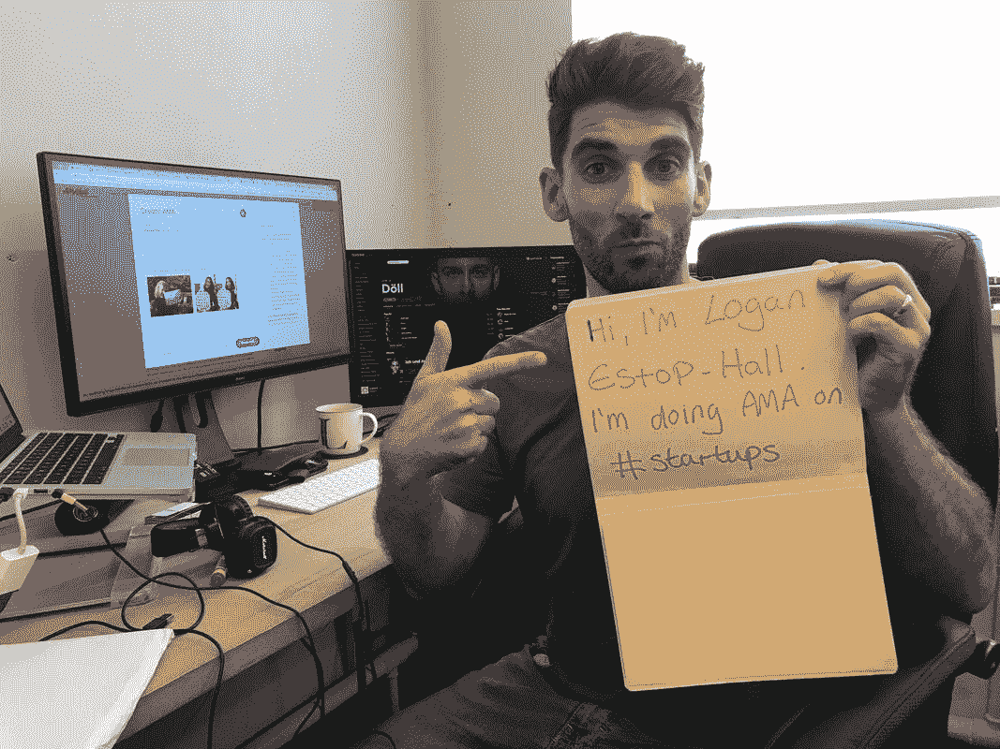
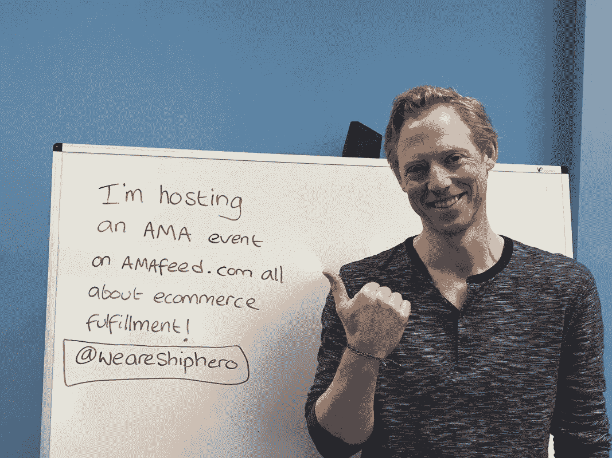
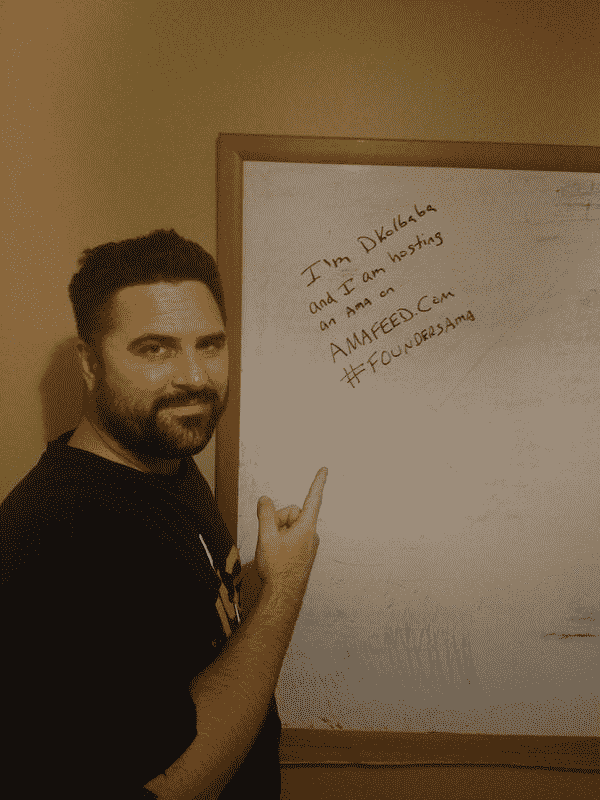
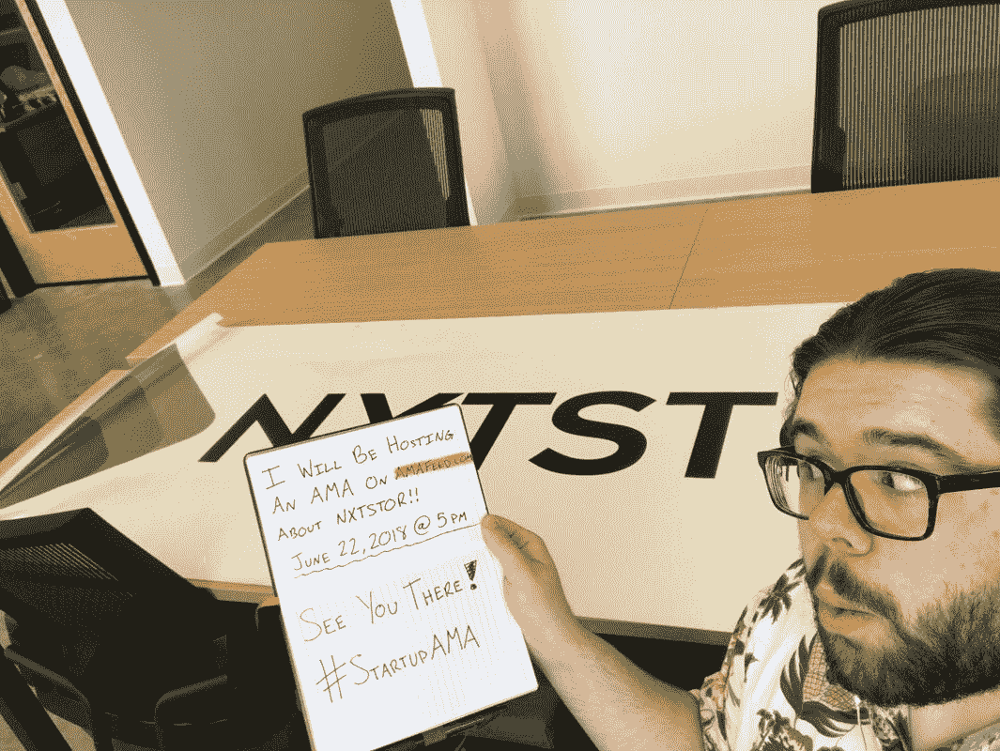

# 启动你的创业公司:在创建你自己的创业公司之前你需要知道的 13 件事

> 原文：<https://medium.datadriveninvestor.com/start-up-your-startup-13-things-you-need-to-know-before-creating-your-own-startup-company-e24f2ab1d878?source=collection_archive---------8----------------------->

我们在 AMAfeed 上听到了很多关于初创公司的报道，这些报道举办了大量的会议，可能会让你想到进入这个行业，我们实际上可以看到为什么——在这个风险企业可以提供的所有机会中，毫无疑问，为什么企业家会不顾他们潜在的挫折，把赌注压在初创公司身上。创业的确是在你即将席卷的行业中打响你的名声的绝佳方式。

你决定了吗？在开始之前，我们有三个问题要问你:

1.你知道你在做什么吗？

2.你知道你必须做的事情和不需要做的事情吗？

最重要的是，

3.你准备好从头开始了吗？

无论你是新人还是寻找更多改进方法的老手，所有这些和更多的问题都将在下面得到详细解答，我们将为你带来关于创建自己的创业公司的真相，通过那些能给你最好帮助的人——创业企业家的话来展示利弊以及两者之间的一切。

**1。商业计划是必须的*，*不是选项**

“[商业计划是]你的剧本。如果你没有提前想好至少几个剧本，你怎么知道你要去哪里，如何到达那里？随着你的成长，如果你不能把这个剧本交给别人，你最终会成为一群激进分子，而不是一个团队。我认为，让一个编辑为这个计划提供大量的投入(贡献者)——这样，每个人都会签署同意。”— [卡尔·卢埃林](https://startupama.amafeed.com/how-to-forecast-success-without-looking-like-youve-smoked-something-507881)，第五次创业的企业家

**2。在**中，有些关键点你可能想早点记下来

1.  “尽早关注盈利能力，而不是规模
2.  确定你真正在解决什么问题，并确保它不只是在你的脑海中。
3.  找出解决问题的方法。
4.  知道你的利基客户在哪里，并吸引他们。
5.  确定哪些价值主张与您的客户群体有共鸣。
6.  增加投资。”–[洛根·霍尔](https://startupama.amafeed.com/i-love-enabling-business-ideas-to-get-above-the-noise-feel-free-to-ask-me-509254)，Rebelhack.com 的联合创始人兼首席执行官

**3。趋势和变化有其含义——理解它们。**

“社交媒体的成熟服务正在衰落，而社交媒体的利基市场正在崛起。SaaS 是潮流，尤其是如果你解决了一个小企业的问题(会计/金融/官僚主义)。博彩业正在崛起，并将随着人们有更多的空闲或浪费而继续崛起。此外，与环境相关的想法也很受欢迎。应用程序商店个人应用程序正在减少，但商业/工具应用程序仍然可以。总的来说，我们认为本地应用将被更标准的网络所取代。

“人工智能将在未来几年大受欢迎。区块链将被一种更好的“无废物”分布式技术所取代。搜索引擎优化和其他一些传统行业也会消失。云将留在这里，但像亚马逊和谷歌这样的大公司正在用流行语和不必要的复杂环境充斥市场，将人们束缚在他们的平台上。”— [埃琳娜·本](https://startupama.amafeed.com/ask-me-anything-about-how-to-realize-your-startup-idea-and-get-your-mvp-ready-511451)，创业公司 Realizer 创始人

**4。破产是*完全*正常**

“实际上，最初几年赔钱是很常见的。对我来说，在我进入商界之前，我已经经历过破产，所以我特别害怕这种痛苦。”— [苏·斯泰尔斯](https://businessama.amafeed.com/entrepreneurs-solopreneurs-behind-the-curtain-what-its-really-like-the-508519)，商业顾问、会议发言人和作家

**5。** **你的职场不仅仅是办公室。**

“我们非常重视工作场所。你的团队是你的积蓄，和你的生意一样值得投资和时间。每周 WIPS 是定时和记录的。幸运的是，我们都有着相同的精神特质，在正确的地方拥有我们的价值观。这对任何团队来说都是一个很好的基础，因此我们在任何需要的地方都培养和支持这一点。”— [乔丹·帕诺斯](https://startupama.amafeed.com/aussie-entrepreneur-family-man-invested-in-climate-action-recently-launched-508045)，连续创业家和 Ecoloads 创始人

**6。数字营销并不总是答案**

“[对数字营销最常见的误解是]认为它是所有问题的解决方案。许多企业只知道他们应该有数字营销战略，但他们不知道为什么。有些人还认为，只要一家公司有网上业务，他们就不需要其他营销策略。我的经验告诉我，没有哪家企业能仅靠一种营销工作生存。社交媒体营销也在传统公关、事件营销等方面获得了内容和力量。”— [Michella Chiu](https://marketingama.amafeed.com/ask-me-anything-about-marketing-and-pr-to-help-your-startup-receive-national-519854) ，GREAT WINE 公司品牌营销总监

**7。让您的网站/应用成为移动和社交媒体友好的事物**

“简而言之，您需要站在客户的角度，了解他们使用的设备以及他们的用户体验。我们在创建 ShipHero 时关注的是为移动设备创建一套全面的工具。设计和构建的外观和感觉就像典型的智能手机应用程序。”—[Nicholas Daniel-Richards](https://startupama.amafeed.com/ama-for-building-your-e-commerce-business-to-deliver-better-than-507918)，ShipHero 联合创始人

**8。社交媒体有两个方面——明智地使用它们**

“在这一点上，我们不能说有机社交媒体做了任何事情来帮助卡宴获得更多曝光率。我们认为，有机社交媒体更多的是作为一种工具来展示公司的合法性和更多信息，而不是作为领导一代。至于付费社交媒体(即广告和赞助)，社交媒体在帮助 Cayenne 获得更多曝光率方面发挥了很大作用！”— [Cayenne 服装团队](https://startupama.amafeed.com/we-are-the-founders-of-cayenne-clothing-we-believe-that-the-current-shopping-508483)

**9。** **并不是只有一种定价结构**

“我们通常致力于基于价值的定价。这意味着我们的价格是由它为客户提供的价值决定的，而不是生产它所涉及的工作。另一方面，如果我们正在与一家只想要一个基本网站的小企业打交道，我们可能会基于成本定价。”——[丹尼尔·汉纳](https://businessama.amafeed.com/ama-im-a-small-business-owner-that-started-a-web-design-business-with-220-509021)，Rhythmwebsites.com 车主

**10。伙伴关系既有利又有风险**

“你们甚至不应该是朋友。应该是很业务的关系。如果你想把敏感或复杂的任务委派给某人，那么你应该等到他们向你证明了自己。根据具体情况，这可能需要几个月或几年的时间。一次给他们一点点责任，看看他们如何处理。一旦你开始这个过程，并且他们一直满足你的期望，那么也许他们已经准备好接受一些更复杂的任务了。正确雇佣员工也很有帮助。确保你面试的人将会适应这个行业，文化，最重要的是，和你一起工作！信任某人为你工作始于雇佣合适的人，并给他们时间来学习你的业务。”— [D .科尔巴巴](https://foundersama.amafeed.com/dynamic-founder-who-specializes-in-major-startup-businesses-with-little-to-no-508573)，连续创业者

**11。扩展你的界限需要完美的时机**

“根据我们的经验，我们投资组合中最成功的公司都是从本地化的初创公司起步，然后扩张。企业家通常从真正影响他们日常生活的痛点开始创业，因此也要根据他们所处的环境或地区来创业。在扩展之前，这里的验证最有意义。最后，你想在你工作的地方立足。因此，国际扩张需要大量的地面资源。确保你对此有所准备。很多创业公司失败是因为他们扩张或国际化太早。”- [阿迪·阿比里](https://startupama.amafeed.com/ama-about-accelerating-international-startups-with-adi-507973)，AngelHack 加速器公司董事总经理

12。有一些免费的方式来做品牌推广

“网络——这看起来很简单，但是如果没有广告预算，最简单的方法就是在线网络。去博客看看你是否可以合作，搜索你的理想客户会使用的相似标签，然后聊天，留下一些评论。这需要一段时间，但这是让你的企业走出去的最好方式。然后制定你自己的策略，知道在哪里集中你的时间会得到最好的结果。作为一家初创公司，时间很短，所以你不想浪费时间。永远记住你的理想客户和目标。”— [Ally](https://startupama.amafeed.com/hi-everyone-i-am-ally-from-aura-socials-branding-photographer-and-strategist-509037) ，AuRa Socials，由 AuRa Creator 库存

**13。时间管理既是挑战也是关键**

“我倾向于把我的课程安排在上午，所以直到下午早些时候我才真正开始工作，但是一旦一天的课程结束，我就可以很清楚地完成一些工作！我们试图更好地记录当前/计划中的项目，所以我将看看与我的领域(主要是前端 web 开发)相关的最紧迫的问题。我们将优先考虑导致主要功能损失的问题，然后继续改进网站。工作几个小时后，我会回复邮件，然后看看作业！”— [Mike Gargasz](https://startupama.amafeed.com/classroom-to-boardroom-running-a-startup-in-college-with-nxtstor-llc-mike-508675) ，NXTSTOR，LLC 的联合创始人兼产品开发主管。

创建一家创业公司是你进入商业世界的一小步，正如他们所说，第一步是最难的一步。确保你意志坚定，全心全意地接受挑战——要么做大，要么回家。

*最初发表于*[T5【startupama.amafeed.com】](https://startupama.amafeed.com/start-up-your-startup-13-things-you-need-to-know-before-creating-your-own-599772)*。*