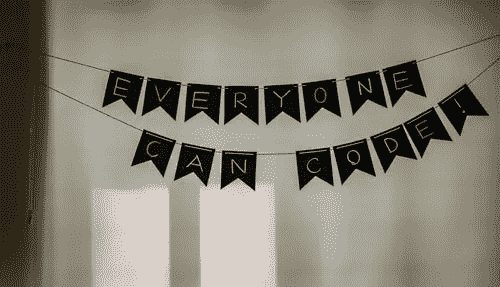

# 开始您的编程之旅——“为什么”和“如何”

> 原文：<https://medium.datadriveninvestor.com/start-your-programming-journey-why-and-how-5168bbc19b6b?source=collection_archive---------18----------------------->

当我们刚刚开始的时候，编程可能太难了。我经历了很多焦虑，为了应对焦虑，我阅读了大量关于“如何开始编程？”的文章他们中的大多数都没有帮助，我的焦虑一直持续到我意识到我一直在问一个错误的问题。于是，我改成了‘我为什么要做编程？’其余的都在。仅仅 5 个月，我就从“不会编码”变成了“擅长编码”。

我的 CS 之旅比预期的更不稳定。从小到大，我的思维定势都不足以成为一名程序员，我在很多场合都限制自己，从未释放我在这个领域的潜力，直到我意识到我可以做到，我可以从 0 到 1。如果我可以，你也可以。

[Source](https://unsplash.com/photos/mDinBvq1Sfg)

为了保持有趣，让我们从创建一个 5 的数组开始——我们称之为 dig[4]。从“为什么编码”到“如何编码”有五个步骤！

dig[0]:编码==创意与逻辑
编程不是机械的工作。没有一种编码方式可以得到想要的结果。编码是逻辑和创造力的结合，是一种艺术形式。既然没有一种正确的编码方式，你可以尝试你能想到的一切。你可以走任何风格来展现你的创造力！

dig[1]:'拥有它'
我们更擅长一项任务的关键原因之一是因为我们开始拥有它。恐惧、无知和回避会让我们感到沮丧和无助。开始编程就是拥有它，在你开始编码之前知道你的原因。了解你的目标，可以是取得好成绩，找到一份好工作，有所作为，或者教书。拥有主体；接受它是你日常生活的一部分。一旦它是你的，它将是你的！

【2】:语言是用来交流的:
爱上一门语言。沟通很重要；不管是人类还是电脑。由于我们一直在努力让计算机发挥作用，交流变得无可挑剔地重要。从任何语言开始——Python/c++/C/JAVA，尝试用每种语言构建 1-2 个项目，最终你将能够用一种语言来识别自己。我个人很喜欢 python，它简单又干净。现在你知道怎么和电脑交流了，对吧？现在的恐惧在哪里？哼！

dig[3]: def GameOfSyntax
意识到这是一个语法游戏。还记得我们在学校经常玩的句子混乱吗，语法是一样的。这里用 tab，那里用冒号，这里用 def，那里用 return，就完成了。相信我，语法是这个过程中最简单的部分。我们就快成为编程专家了，不是吗？

dig[4]:最后一步
大学里有很多同辈的压力，我们不断地寻找认同。有一些超级聪明的程序员，也有一些不那么聪明的。曾经有人告诉我，我没有足够的逻辑来编码，我相信他们。我们每个人都会遇到这种情况，这会让我们对自己的工作失去信心。这是憎恨的大忌——不要让别人的观点影响你。所以，在有人走到你面前说你不够好之前，好好想想；别人怎么可能让你不爱上创意，激励你去过平庸的生活！

> “你认识的每一个伟大的开发人员都是通过解决他们没有资格解决的问题而获得成功的，直到他们真正做到了。”帕特里克·麦肯齐

返回“GOLD”
这个过程很简单，也很有意义，绝对能帮助你改变心态。这就是你，职业程序员！！

编程永远不会出错，因为你有能力控制它。明智理智就好。

*这是“用语言编程”系列的第 1 部分。第 2 部分即将推出。*

## 来自 DDI 的相关故事:

 [## 数据科学和软件工程哪个更有前途？

### 大约一个月前，当我坐在咖啡馆里为一个客户开发网站时，我发现了这个女人…

medium.com](https://medium.com/datadriveninvestor/which-is-more-promising-data-science-or-software-engineering-7e425e9ec4f4)