# 多伦多大学启动自动驾驶汽车专业

> 原文：<https://medium.datadriveninvestor.com/starting-the-self-driving-cars-program-by-the-university-of-toronto-31c785d218ea?source=collection_archive---------3----------------------->

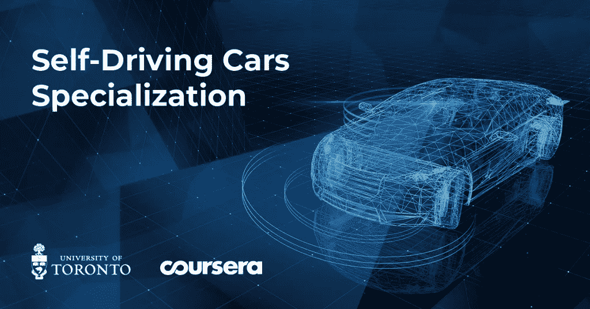

本月，我收到了一封电子邮件，是关于多伦多大学在 Coursera 开设的无人驾驶汽车新课程的。我对人工智能和深度学习越来越有热情，所以我很高兴能申请到财政援助。你必须填写一张表格，写下你学习这个专业的原因及其背后的动机。

我有很多理由来分享我为了学习人工智能和深度学习而遵循的旅程。幸运的我，两周之后，收到了我申请**自动驾驶汽车介绍**的助学金申请被批准的消息！！

# 自动驾驶汽车课程是关于什么的？

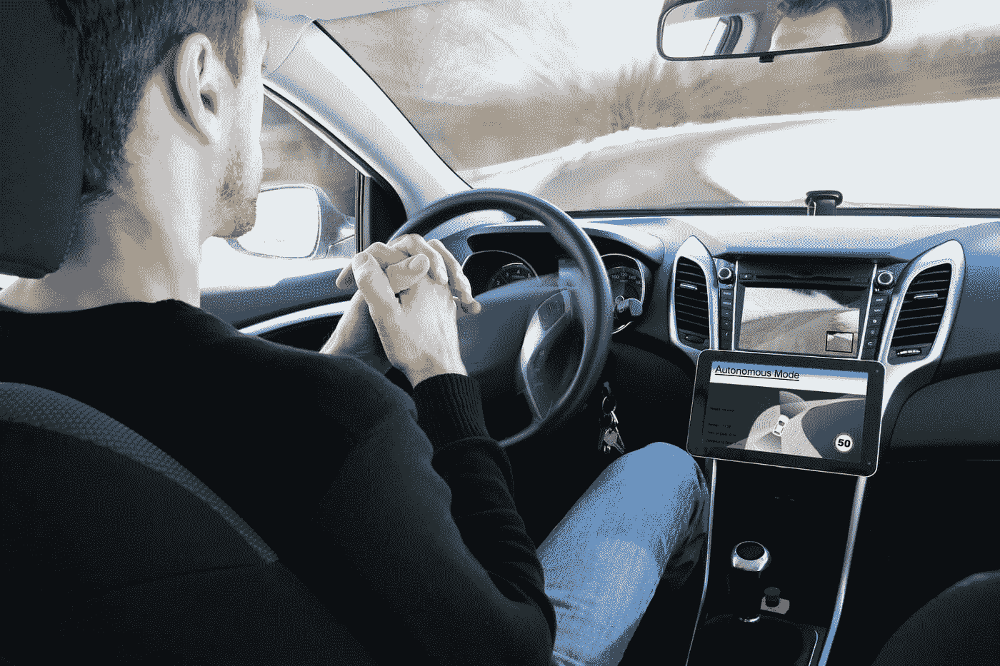

我很兴奋，因为这是多伦多**大学自动驾驶汽车专业**的第一门课。

这个课程对我来说是一个新术语的介绍，比如自动驾驶汽车的设计考虑和安全评估。

完成本课程后，您将能够:

*   了解自动驾驶汽车常用的硬件
*   确定自动驾驶软件堆栈的主要组件
*   飞行器建模和控制程序
*   分析车辆开发的安全框架和当前行业实践

# 期末项目和卡拉模拟器

我决定参加这门课程的主要原因是你可以获得实践经验。在期末项目中，学生将有机会开发控制代码，在 **CARLA 模拟环境中驾驶自动驾驶汽车在赛道上行驶。**

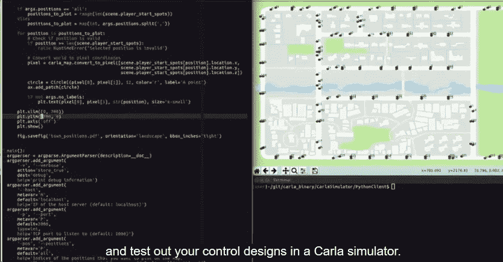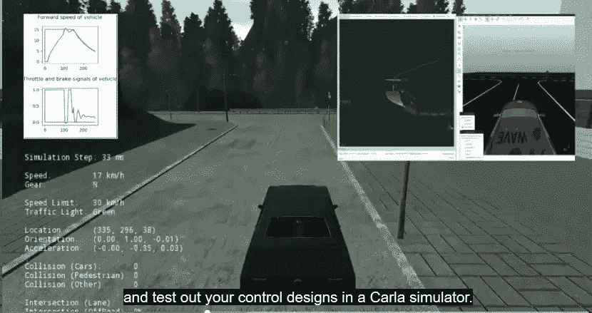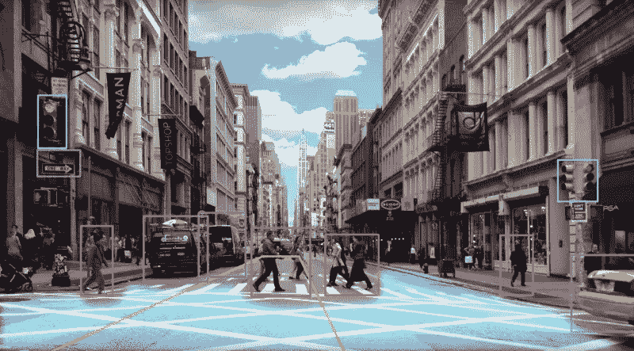

# 期末专题要做的事情:

*   您将使用 Python 3.0 构建车辆的纵向和横向动态模型，并创建控制速度和路径跟踪性能的控制器
*   您将测试控制设计的极限，并了解在车辆性能极限下驾驶所固有的挑战

我花了将近两年的时间研究数据科学领域，并在我的项目中使用 Python。这是一门高级课程，面向具有机械工程、计算机和电子工程或机器人背景的学习者。我有计算机科学的背景，但是我仍然需要提高我的工程技能。要想成功完成这门课程，你应该有 Python 3.0 的编程经验，熟悉线性代数(矩阵、向量、矩阵乘法、秩、特征值、向量和逆)、统计学(高斯概率分布)、微积分和物理学(力、力矩、惯性、牛顿定律)。

# 运行 Carla 模拟器的硬件和软件要求:

您需要满足以下要求才能从事编码工作:

*   Windows 7 64 位(或更高版本)或 Ubuntu 16.04(或更高版本)
*   四核英特尔或 AMD 处理器(2.5 GHz 或更快)
*   NVIDIA GeForce 470 GTX 或 AMD 镭龙 6870 高清系列卡或更高
*   8 GB RAM 和 OpenGL 3 或更高版本(适用于 Linux 计算机)

这个专业总共有 4 门课程:

*   自动驾驶汽车简介
*   状态、估计和本地化
*   自动驾驶汽车的视觉感知
*   自动驾驶汽车的运动规划

# 自动驾驶汽车的故事

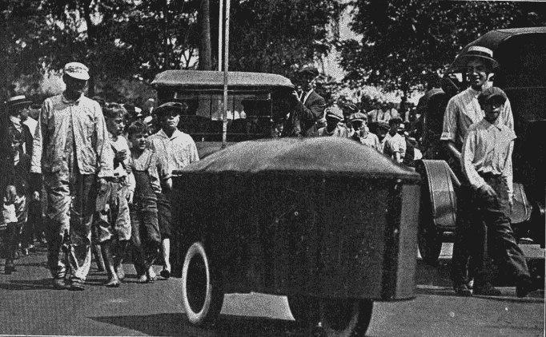

1925 年，开始了自动驾驶汽车的梦想。当地机械师弗朗西斯·p·乌迪娜是第一个使用遥控装置测试无人驾驶汽车的人，被称为“美国奇迹”。这是一个古老的想法，但现在，有了可用的技术，这些系统可以比几年前更容易地开发。

# 在繁忙的交通中驾驶的现实

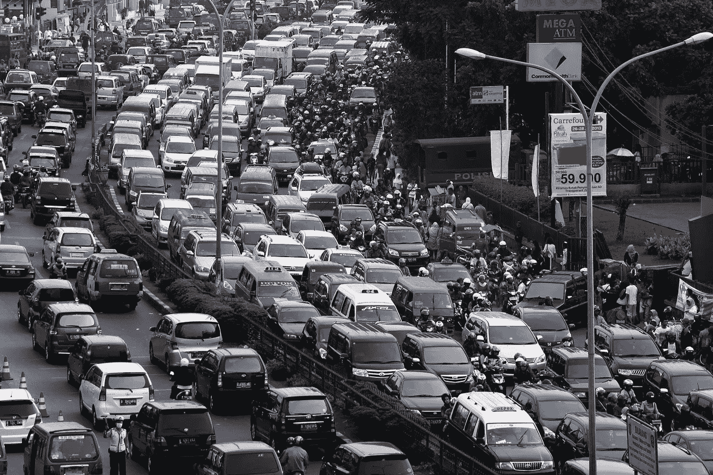

出于安全目的，自动驾驶汽车不仅仅是一种奢侈品，还需要重新定义交通工具。想象一个世界，我们不再需要驾驶，而是依靠自主系统。好处是巨大的:交通事故将大大减少，因为这项任务将不再依靠人类，而是依靠机器。机器永远不会厌倦驾驶！它可以改变我们的通勤方式，为其他任务节省更多时间。

我推荐你看这个 *TED 演讲*:**克里斯·厄姆森**的《无人驾驶汽车如何看路》。克里斯是谷歌无人驾驶汽车项目的一部分，该项目是将人类从驾驶座上移除的几项努力之一。他有一个伟大的观点，关于自动驾驶汽车的必要性，以及为了减少交通事故和拯救生命的好处。****

**点击此处观看视频:**

# **驾驶分类学**

## **驾驶任务**

**驾驶任务由三个子任务组成:**

**感知:感知你驾驶的环境。示例:跟踪汽车的运动并识别我们周围世界的各种元素(道路服务、路标、车辆、行人等)。**

**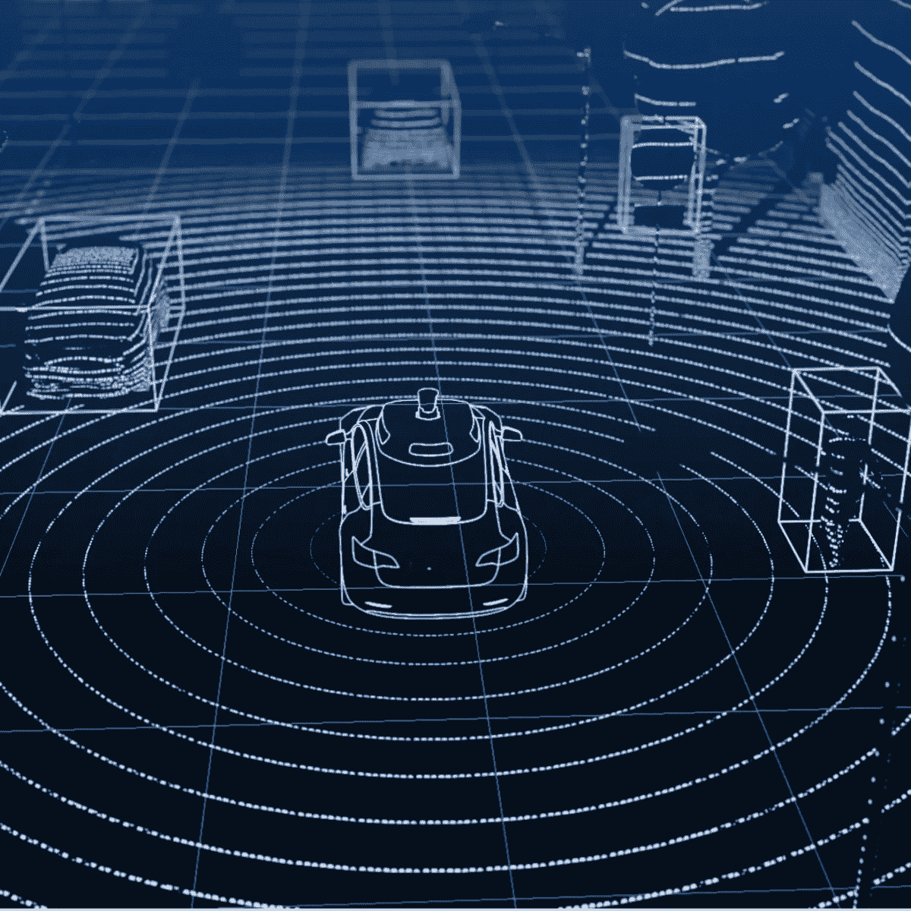**

****运动规划:**这让我们能够成功到达目的地。例如:从你家开车到你的办公室。**

****车辆控制:**我们需要采取适当的转向、刹车和加速决策来控制车辆在道路上的位置和速度。**

## **操作设计领域(奇数)**

**构成给定系统设计运行的运行条件(一天中的环境时间、道路和汽车可靠运行的其他特征)。**

# **如何对驱动系统自动化进行分类**

**为了对驱动系统自动化进行分类，我们需要考虑以下几点:**

*   **司机注意要求(*开车上班可以看电影吗？*)**
*   **驾驶动作要求(*需要转向吗？，需要变道吗？*)**
*   **驾驶任务到底是由什么组成的？**

# **驾驶任务到底是由什么组成的？**

****横向控制:**转向**

****纵向控制:**制动、加速**

****对象和事件检测和响应(OEDR):** 检测和反应**

****规划:**它主要关注旅行目的地所需的长期和短期计划，或者执行诸如变道和交叉路口等操作。**

****杂项:**人们在驾驶时也做的任务(用指示器发信号、挥手、与其他司机互动等等)。**

# **SAE 标准 JBOY3 乐队 016 定义的常用自动化水平**

****0 级-无自动化(全人类感知、规划和控制)****

**在这个级别，没有驾驶自动化，一切都由司机完成。**

****1 级-驾驶辅助****

**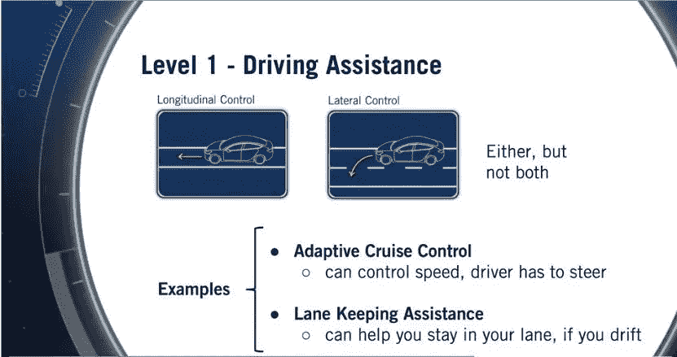**

**自主系统通过执行横向或纵向控制任务来帮助驾驶员。例如:**自适应巡航控制(ACC)** 。在 ACC 中，系统可以控制车速，但需要驾驶员进行转向。因此，它可以执行纵向控制，但需要人执行横向控制。另一个例子是**车道保持辅助**。在这种情况下，该系统可以帮助你保持在自己的车道内，并在你接近边界时发出警告。如今的系统依赖于车道边界的视觉检测和车道对中横向控制。**

****

****Adaptive cruise control (ACC)****

**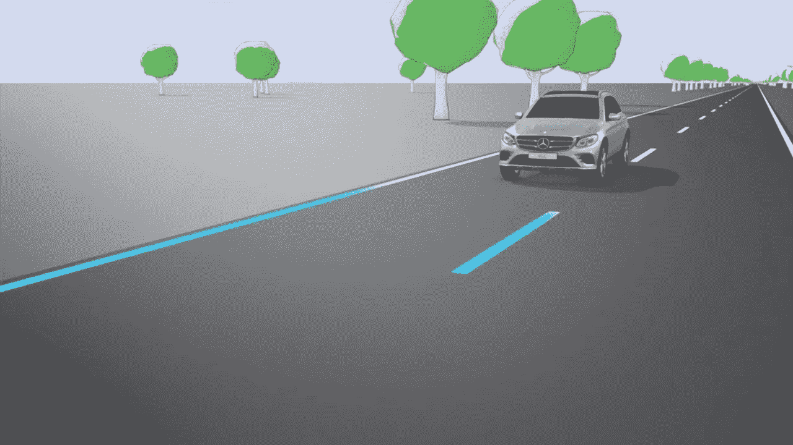**

****Lane Keeping Assistance****

****二级-部分自动化****

**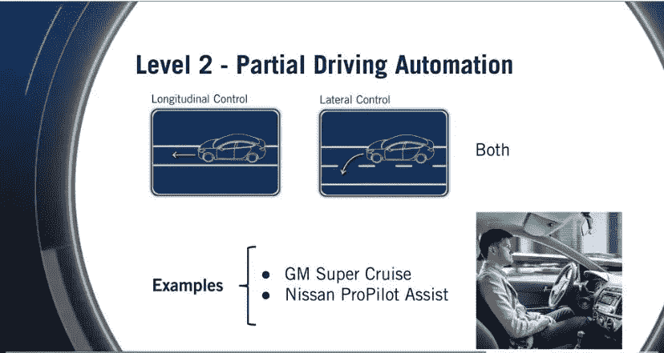**

**在这一级别，系统在特定的驾驶场景中执行横向和纵向控制任务。这些系统的例子有:**通用的 Super Cruise 和日产的 Pro Pilot Assist。**这些系统可以控制您的横向和纵向运动，但仍然需要驾驶员监控系统。一些提供这种自动化水平系统的公司有:**梅赛德斯、奥迪、特斯拉、**和**现代**。**

**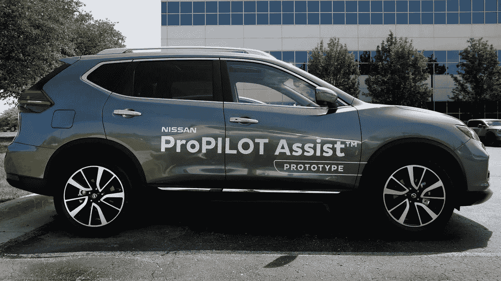****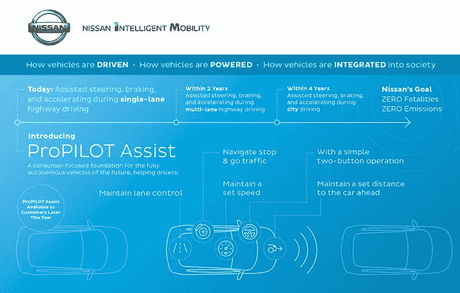**

****三级-有条件驾驶自动化****

**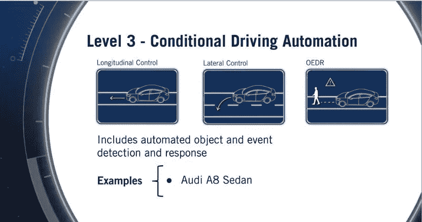**

**在这个级别中，除了控制任务之外，系统还可以在一定程度上响应执行**对象和事件检测，但是在失败的情况下，控制必须由驾驶员接管。2 级和 3 级之间的关键区别在于，驾驶员在某些特定情况下不需要注意，因为车辆可以及时提醒驾驶员进行干预。这些系统例子有:**奥迪 A8 轿车**(可以在慢速交通中不受监控地导航)。****

**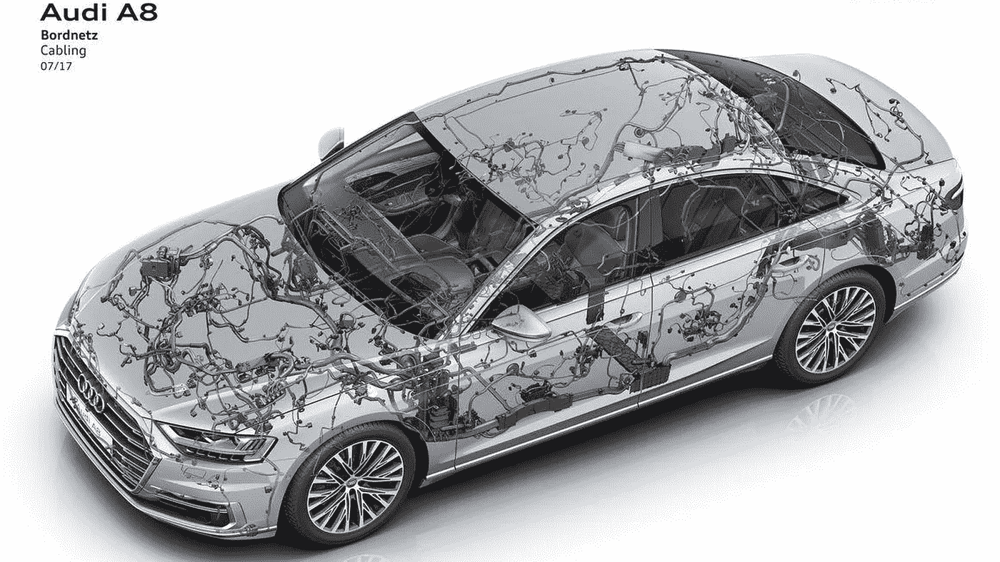**

****四级-高驾驶自动化****

**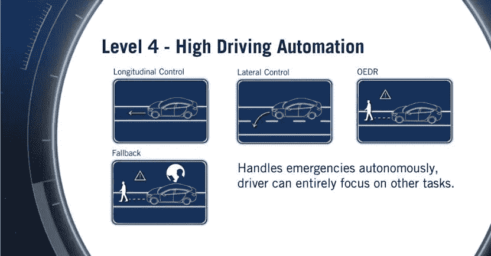**

**该系统能够在驾驶员没有及时干预紧急情况的情况下达到最小风险状态。这些系统可以自己处理紧急情况，但仍可能要求司机接管，以避免不必要的路边停车。在这个级别，乘客可以检查他们的手机或观看电影，因为他们知道该系统能够处理紧急情况，能够保证乘客的安全。然而，这个水平仍然允许自动驾驶系统具有有限的 ODD。例子: **Waymo** ，它是唯一一家为公共交通部署这种自主水平车辆的公司。**

**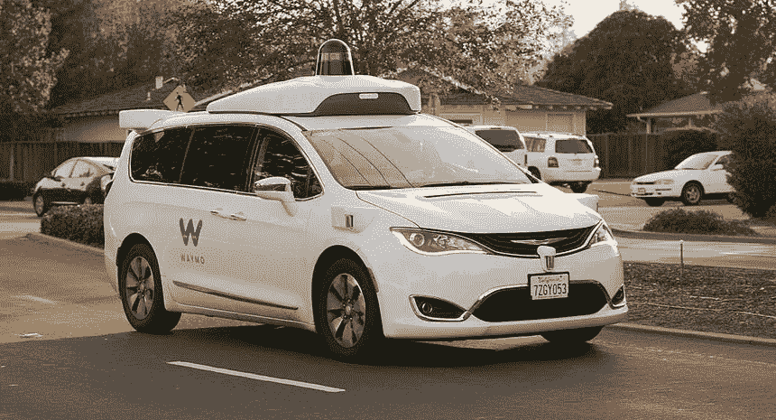**

****第 5 级——完全驾驶自动化****

**该系统是完全自治的，其奇数是无限的，它可以在任何必要的条件下运行。这种程度的自动化还没有实例。**

# **结论**

**这些是我关于本课程第一模块的笔记。希望你喜欢！**

# **参考**

**您可以观看关于这一专业的视频:**

****卡拉模拟器研究论文:****