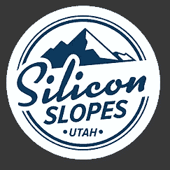
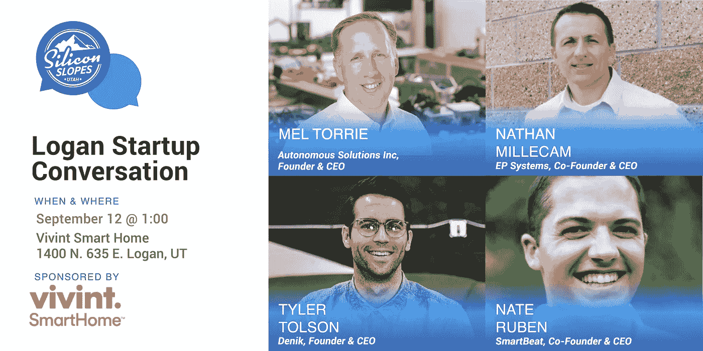

# 正在启动 Cache Valley

> 原文：<https://medium.datadriveninvestor.com/starting-up-cache-valley-793e62969862?source=collection_archive---------30----------------------->

让北犹他州的创业公司崭露头角

许多人都知道我对 Cache Valley 的热爱，小镇的感觉，靠近户外娱乐场所，山城的氛围，美味的食物[(这里是我的一些首选)](https://medium.com/@chaserson/top-5-unique-cache-valley-eats-b2a66fd07144)，以及 5 分钟的通勤路程。在过去的几年里，我一直在努力探索如何让生活在这个山城变得更容易。我们如何为想在这里谋生的人提供更多的机会。

答案通常归结为工作和职业机会。从那以后，我一直致力于找出如何将伟大的公司带到洛根，并为新的创业公司创造茁壮成长的沃土。似乎生活质量是大多数人在融入一个社区和职业时所追求的。Cache Valley 提供了许多人们寻求的东西和潜在蓬勃发展的行业的种子，在一些最令人兴奋的行业中提供了长期的职业机会。

我很高兴地宣布，洛根将成为[硅斜坡分会](https://siliconslopes.com/logan/)的所在地，该分会将帮助汇集制造商、创造者和企业家来建设缓存谷。Cache Valley 的一些最伟大的头脑和最成功的企业家将定期举办活动。这将是一个激发灵感、寻找下一个共同创始人或合作者、构建下一个项目的地方。

[洛根硅坡](https://siliconslopes.com/logan/)不仅举办大型活动，还庆祝 Cache Valley 不可思议的公司和不断增长的行业，以及为有抱负的企业家提供工具和支持系统，帮助他们创办自己的公司。

在我们最近的创业对话中，四位不可思议的企业家分享了他们对为什么在 Cache Valley 建立公司的见解。以下是一些经验教训和背景。

**缓存中的消费者**

Denik 的 Tyler Tolson 和 SmartBeat 的 Nate Ruben 证明，由于互联网的存在，你的公司的位置变得越来越不重要。由于互联网允许电子商务与全国和全世界的客户联系，企业家更有能力在他们想生活的地方创业。

Denik 已经证明，通过专注于利用犹他州立大学出来的年轻人才，以及与耐克、阿迪达斯、Stance 等公司的品牌合作伙伴关系，你可以建立一个有创意的公司并蓬勃发展。对泰勒来说，成功属于那些比竞争对手做得更多的人。喧嚣并不局限于大城市。在 Cache Valley，忙碌和干劲可能是企业家的品质。

SmartBeat 是一家脱胎于个人经历的公司。作为新父母，内特和他的妻子度过了不眠之夜，不知道他们的新孩子是否能活过今晚。SmartBeat 是一款婴儿监控器，通过摄像头跟踪呼吸，让父母放心。

独特的想法不仅限于大城市的个人。每天，每小时，人们都会遇到痛点，需要解决的问题。它只需要改变思维模式和创造东西的动力，建立一个创业公司，并把它建在你想生活的地方。

**移动的未来**

缓存谷一些鲜为人知的秘密包括，这里的企业家正在解决一些世界上最大的问题，并处于下一个重大技术突破的前沿。每个人都知道特斯拉、优步和谷歌在自动驾驶领域做什么，但很少有人知道你可以在[自动解决方案公司(ASI)](https://utahbusiness.com/autonomous-solutions-inc-grow-home/) 的缓存谷从事自动驾驶工作。

ASI 关于自主工业设备的宏伟愿景正在改变世界。没有几个州可以吹嘘自己是一家已经经营了 18 年的充满活力的自动驾驶公司的所在地。不仅犹他州可以吹嘘这一点，缓存谷也可以。

随着车辆快速电气化，存储容量是新的前沿领域， [EP Systems](https://business.utah.gov/ep-systems-selects-cache-county-manufacturing-site/) 在创造轻便可靠的锂离子电池技术方面处于领先地位，可为航空航天业提供电力。虽然电动汽车只是开始，电气化飞机是 EP 引领行业走向未来的地方。再一次，来自犹他州立大学的 Cache Valley 的年轻人才是将这个充满活力的创业公司从加利福尼亚搬迁到犹他州山区的充分理由。

你要建造什么？

我们第一次硅斜坡讨论中的每一位企业家都证明了这可以在犹他州北部的一个小山城实现。是什么阻碍了您构建 Denik、SmartBeat、EP 或 ASI？

[在此注册，获取硅坡 Logan 活动的最新信息。](https://siliconslopes.com/logan/)