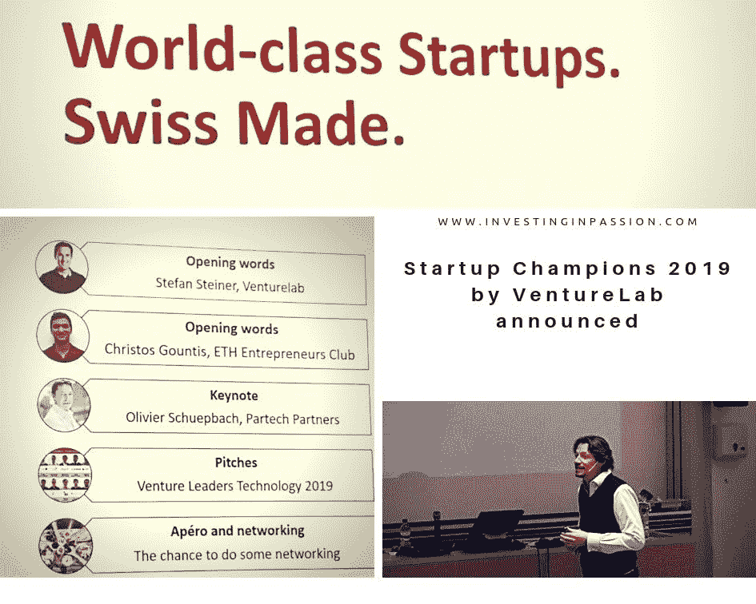
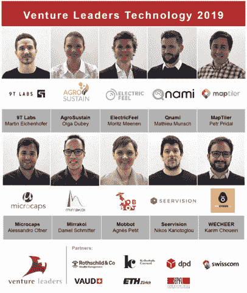
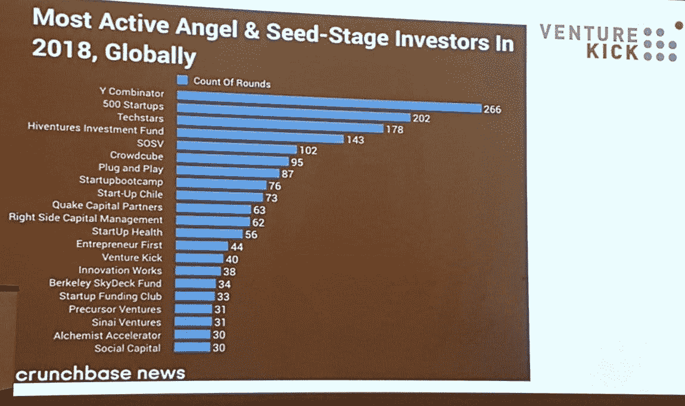
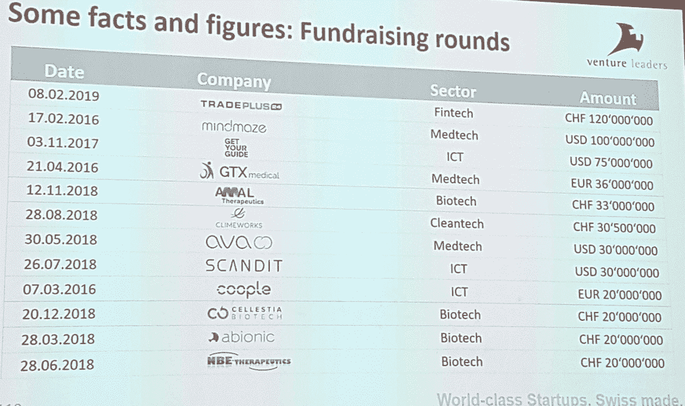
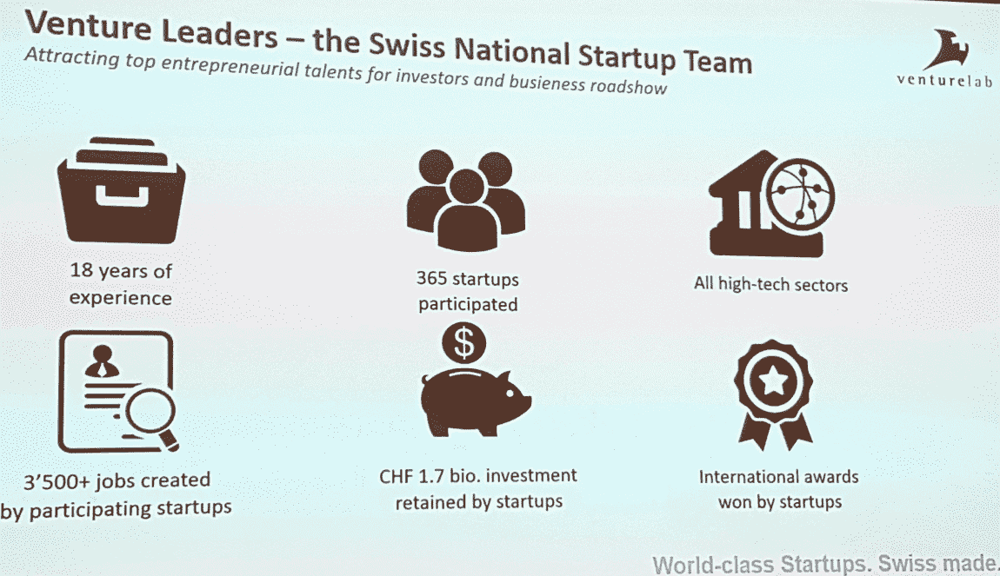
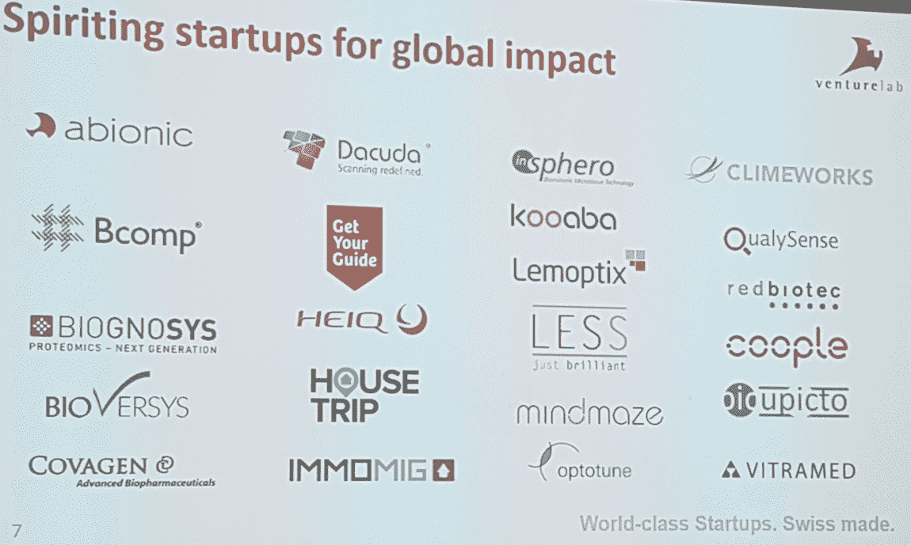
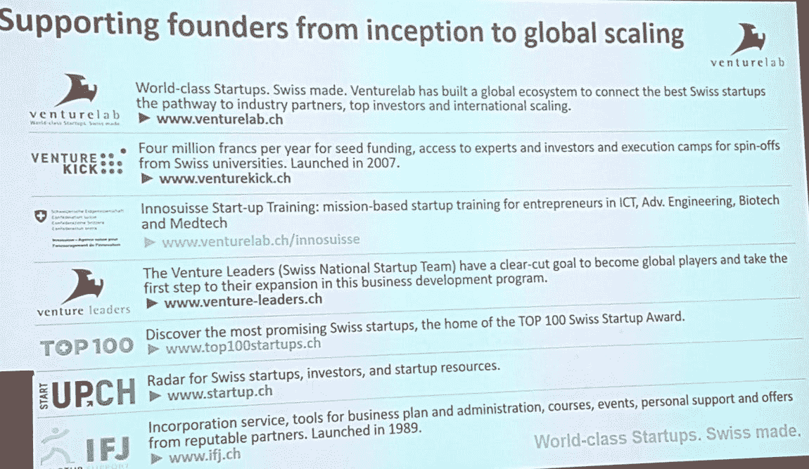

# 2019 年创业冠军揭晓

> 原文：<https://medium.datadriveninvestor.com/startup-champions-2019-announced-34fce1448c51?source=collection_archive---------21----------------------->

昨天， **Venturelab** 举办了一场特殊的活动，并正式介绍了**瑞士国家创业团队。**他们是 10 位将走向全球的世界级企业家，为此，他们将在硅谷度过几周时间，会见投资者并了解当地的生态系统。**这是瑞士国家创业团队:**

2019 年的 Venture Leaders Technology team 是从 120 名申请者中选出的，现在正准备去硅谷进行路演。他们将在 Startup Champions 活动中展示他们的创业公司，并了解美国当地市场的情况，他们如何成功地介绍他们的产品，以及如何超越瑞士和欧洲的边界。这是一个千载难逢的机会，在这样一个经验丰富的组织 [**Venturelab**](https://www.venturelab.ch/) 的支持下，真正起飞并获得新的市场。

> [DDI 编辑推荐——盖伊·川崎《创业基本指南》](http://go.datadriveninvestor.com/entrepreneurship1/matf)

活动期间发表主题演讲的是与德国 Partech Partners 合作的国际风险投资人 Olivier Schuepbach。他和我们分享了一些非常重要的建议，这些建议真正有助于全球创业公司明智而成功地发展。作为一名企业家，他与被易贝收购的 brands4friends 合作。作为一名风险投资人，他在 2006 年与 Wellington Partners 一起创立了这家公司，从那以后，他一直在帮助众多初创公司起步，并积极有效地发展他们的业务。看看下面来自 Olivier 的简短但却很有意义的建议:

1.  专注于关键的附加值，对于其余的合作伙伴和外包。
2.  获得大合作伙伴作为不公平的竞争优势。
3.  先关注大市场。不要走得太宽太快。
4.  拥有强大的首席财务官和财务部门。
5.  尽你所能衡量一切。利用商业智能。
6.  在每个阶段确保合适的投资者和足够的融资。
7.  在你周围大肆宣传。大声点。
8.  **准备出发。旅程就是目标。**

**关于 venture ick**

Venture Leaders 技术是 Venturelab 的几个标志性项目之一。他们被认为是 2018 年最活跃的天使和种子阶段投资者之一*(由 crunchbase)* ，仅比市场上最大的投资者 Y Combinator 低几分。

他们可以为相当多的成功故事而自豪。下面是一些由 Venturelab 资助或支持的公司的例子。

如果你想更多地了解 Venturelab 运营的项目，可以随时查看他们的[网站](https://www.venturelab.ch/)、 [facebook](https://www.facebook.com/venturelab.ch/?eid=ARBLO7Z4RqOy2gqKCb1qEaYB-c7u4i-i2qQdciLxVmEHfTGZd2fvt0W8ZAF6Nx1q5eP-FBZa1zWMnmFm) 页面、 [twitter](https://twitter.com/venturelab_ch) 账户、 [Linkedin](https://www.linkedin.com/company/venturelab/?originalSubdomain=ch) 个人资料或[天使](https://angel.co/venturelab-2)列表。

*原载于*[*www.InvestingInPassion.com*](http://www.InvestingInPassion.com)

编辑披露:编辑有时会发布有用资源的链接。如果你发现它们有用并购买，我们会赚很多钱。不，我不是说要把我的薯条做大。我说的是超大披萨上的意大利香肠。感谢您一直以来的支持，我们将继续为 p̶e̶p̶p̶e̶r̶o̶n̶i̶出版而努力。