# 创业冠军-2019 年中国创业领袖发布

> 原文：<https://medium.datadriveninvestor.com/startup-champions-venture-leaders-china-2019-announced-f88ce265bbae?source=collection_archive---------4----------------------->

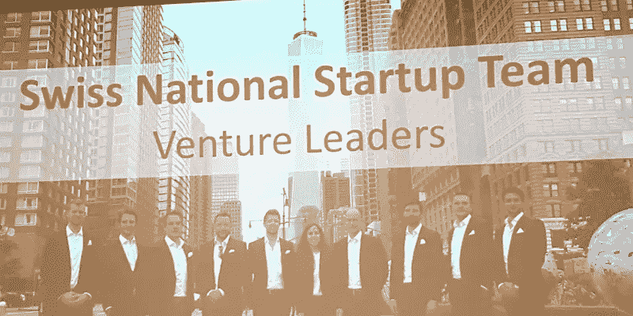

瑞士正在让越来越多的创业公司走出国门，走向全球。这一次，我想简要介绍 10 家初创公司，它们将飞往中国了解现场生态系统，并寻找潜在的商业合作伙伴和/或客户。本周 [**Venturelab**](https://www.venturelab.ch/) 举办了一场特殊的活动，展示了瑞士国家创业团队从十几个申请中脱颖而出的作品。我很高兴地注意到，只有一名女性代表，所以多样性是存在的，不仅涉及到不同的市场，还涉及到年龄、国籍和性别。鉴于中国市场不那么容易征服，我将跟踪早期的创业公司，看看他们在几年内会有多成功:)这将是一次迷人的旅程！

晚会以萨迪克·哈菲佐维奇的**主题演讲开始。**

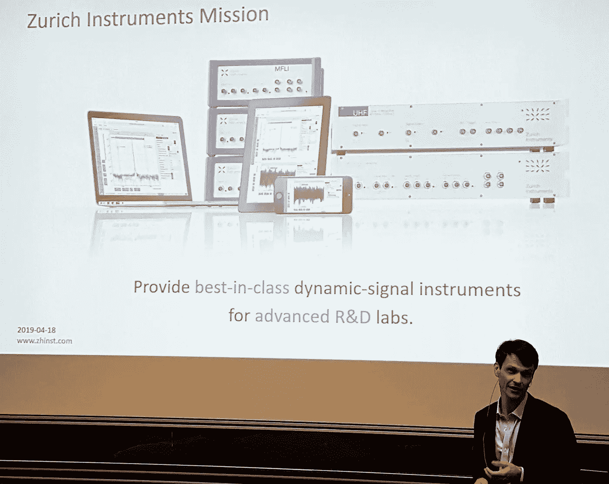

他是苏黎世仪器公司的联合创始人兼首席执行官，该公司成立于 2008 年，是瑞士联邦理工学院的一个分支。如今，该公司在全球 6 个国家拥有 70 名员工。该公司为世界各地的高级研究实验室提供一流的测量仪器，这些仪器我从一开始就不知道，但听起来很先进，对 R&D 中心非常有帮助。在他的主题演讲中，他分享了他在建设一家全球活跃的公司过程中所学到的经验，并重点讲述了极具挑战性的招聘流程。人是每项业务的关键，如果你找到了与你分享激情的优秀人才，这已经是一个巨大的成功了。在世界不同的地方保留“房子”(这是他们对办公室的称呼)，拥抱不同的文化是一次惊人的冒险和永无止境的学习之路。

 [## 波动迫使数据驱动的投资者冷静

### 自然界中很少有东西是直线行进的，尤其是经济。当投资者和消费者希望平静时…

www.datadriveninvestor.com](https://www.datadriveninvestor.com/2019/03/25/volatility-compels-calm-amid-the-storm/) 

紧随其后的是代表阿德洛集团的马克·福斯特。

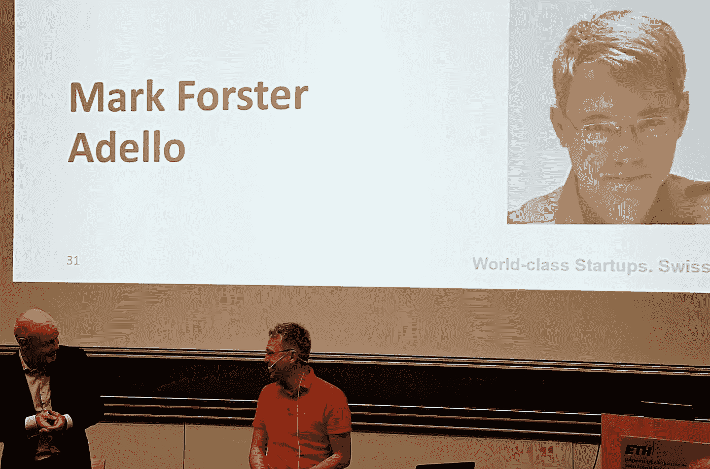

他是一个真正的连续创业者、投资者和数字空间老手(他确实对此略知一二)。他共同创立了几家公司，包括一家移动营销开发公司 One motion，该公司已被哥德巴赫收购。他谈到了他的 Adello，以及成为移动营销领域全球玩家的感受。马克是一个非常鼓舞人心的人，他非常尊重他人，欣赏他和他的员工一起建立的东西，并分享阅读清单，以防你想从生活、创业和商业中学习一些东西。

2019 年风险领袖中国团队将于 6 月前往中国进行路演，他们将在创业冠军活动上展示他们的公司。他们来自不同的市场，开发像医疗技术、人工智能、音乐、机器、AR、无人机、软件等产品。如果你对他们做什么感到好奇，请继续阅读。

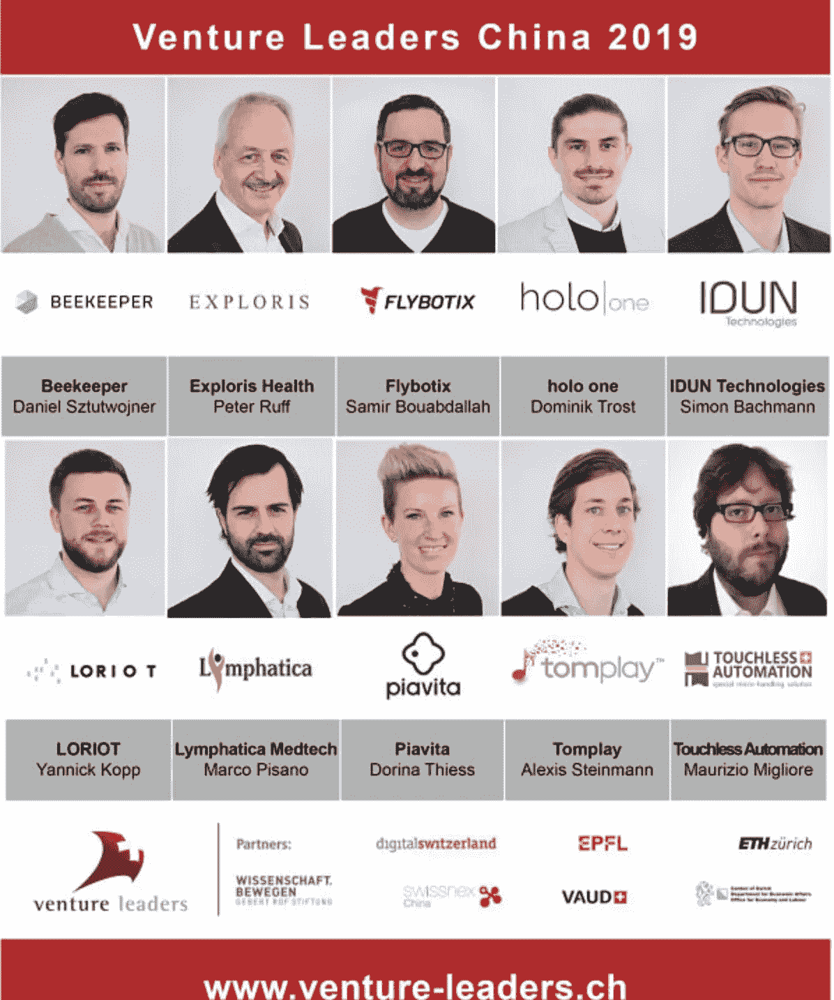

[BEEKEEPER](https://www.beekeeper.io/en) -连接非办公桌员工的员工应用程序。Beekeeper 的数字工作场所应用程序针对非办公桌工作人员进行了优化，将多个操作系统和通信渠道集成在一个安全的中心，可从桌面和移动设备访问。

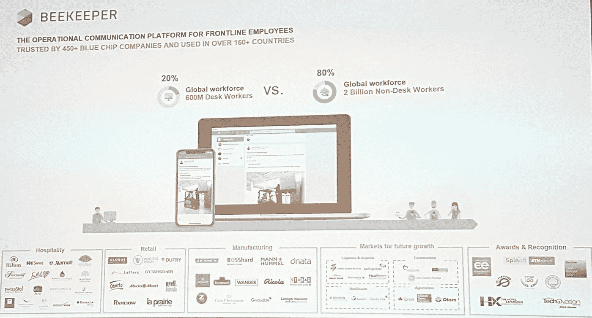

[EXPLORIS](https://www.exploris.info/)——开发非侵入性诊断测试，用于及时检测冠状动脉疾病。Exploris 是首批拥有通过临床研究的基于人工智能的诊断和治疗解决方案的公司之一。

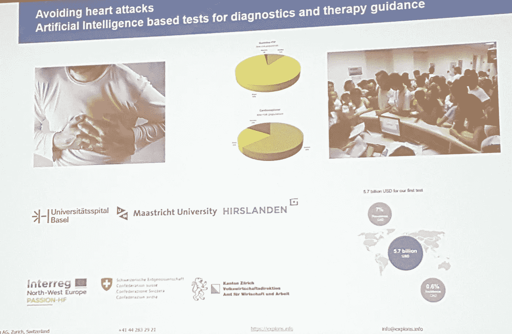

[FLYBOTIX](https://flybotix.com/) -生产专业的检查无人机。

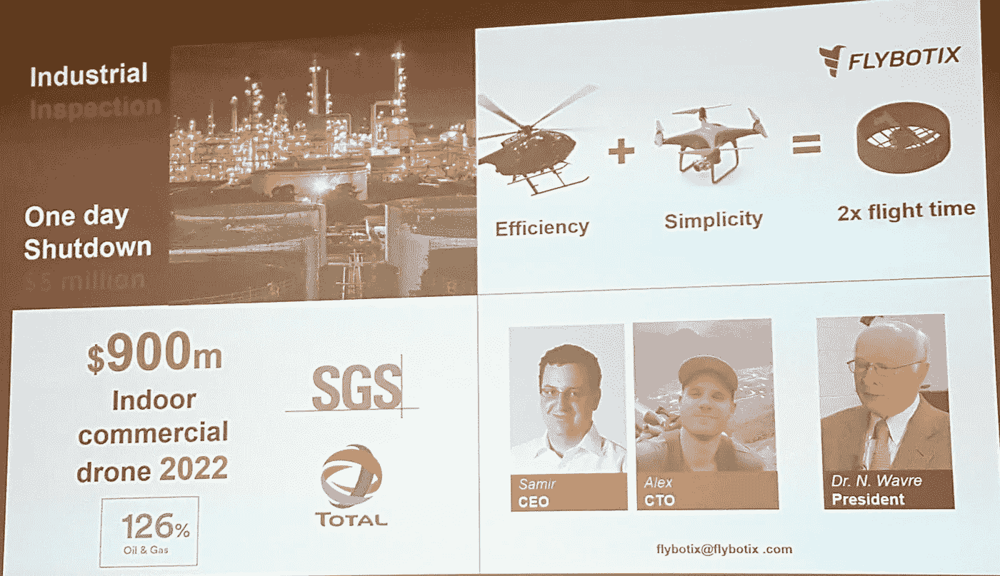

[HOLO ONE](https://holo-one.com/) — sphere 是一个由 holo|one 开发的 AR 平台，被全球的企业所使用。基于云的解决方案已被证明能够提高效率、减少错误并确保各行各业业务流程的质量。

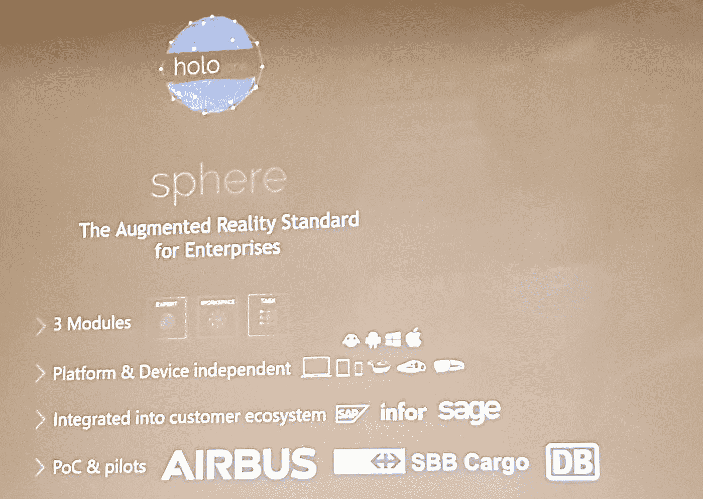

[IDUN TECHNOLOGIES](https://iduntechnologies.ch/) -我们为未来的医疗保健和人类互联网提供可穿戴设备。我们的柔软和表面结构化电极显示出皮肤顺应性和粘附性，从而减少噪音和运动伪影。我们的电极能够以临床级性能实现不引人注目的长期生物电位记录。

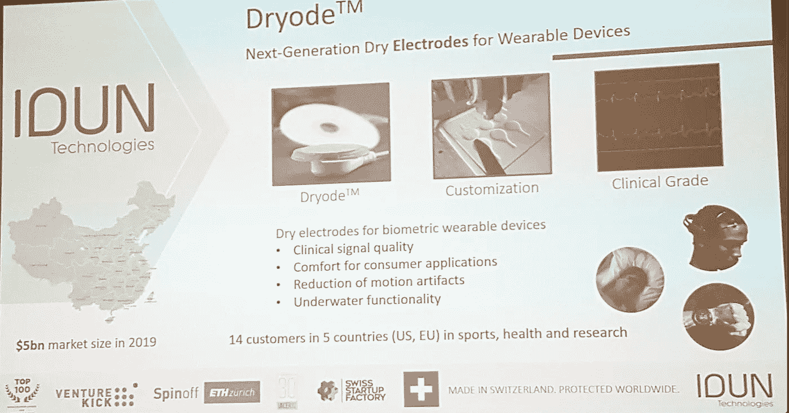

[LORIOT](https://www.loriot.io/) -物联网的未来在远程
我们为物联网提供远程基础设施。
我们将您的 LoRa 网关和设备带入云中。

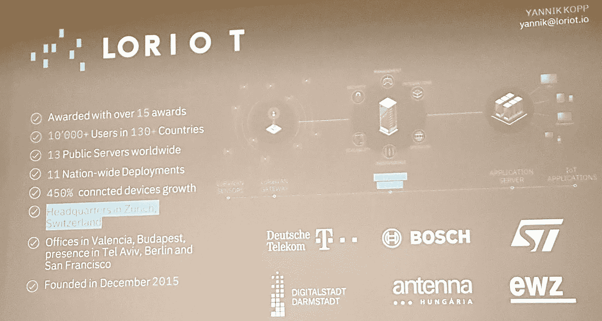

-我们开发治疗淋巴疾病的医疗设备。

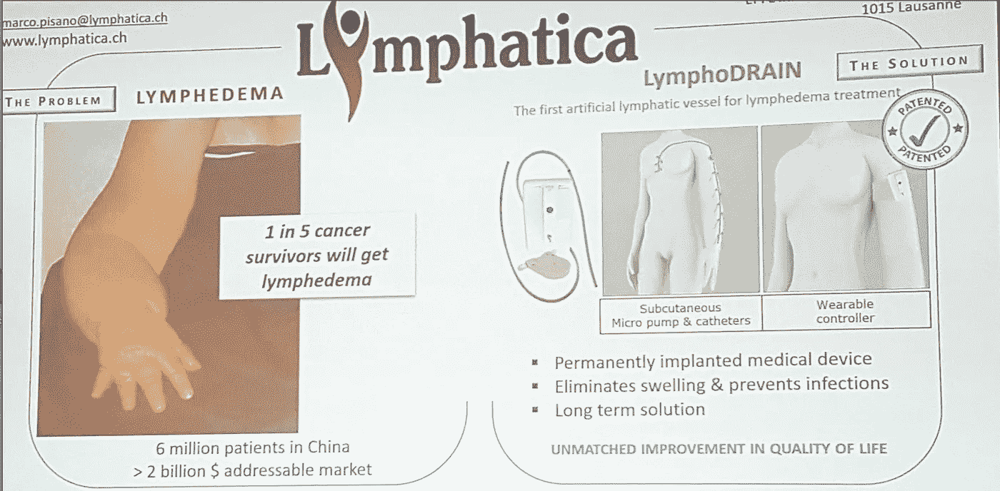

[pia vita](https://www.piavita.com/)-Piaget 系统是一个硬件支持的智能辅助工具集，通过 Piaget 传感器技术和 Piaget 云应用程序的快速、易用和智能组合来支持兽医。

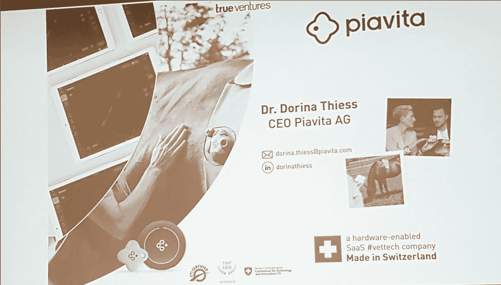

[汤姆-播放](https://tomplay.com/)-汤姆播放互动活页乐谱。与专业音乐家的真实录音一起演奏。

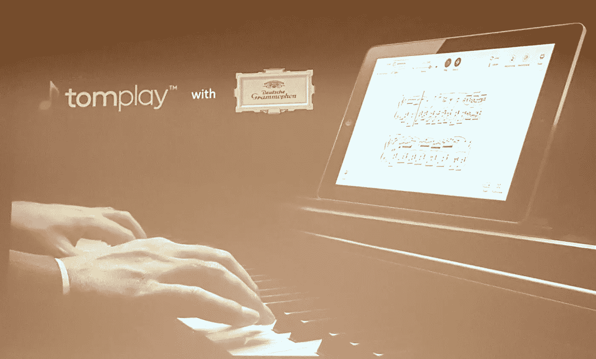

[无接触自动化-](https://touchless-automation.ch/) 由于其新发明的技术方法允许对微型元件进行无接触操作，其目标是提供解决方案，以提高任何处理微型元件组装行业的产量。

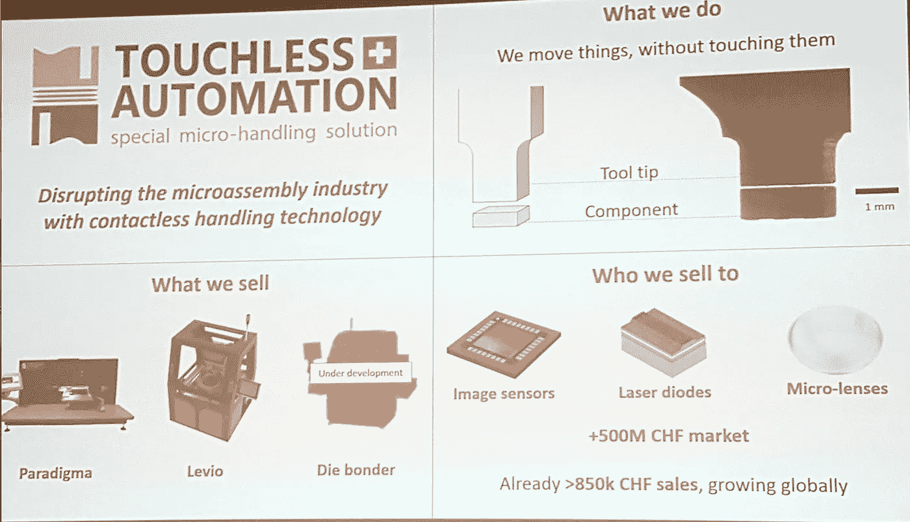

和我一起祝贺该队取得惊人的成功。
**打开你的思维，获得灵感:)**

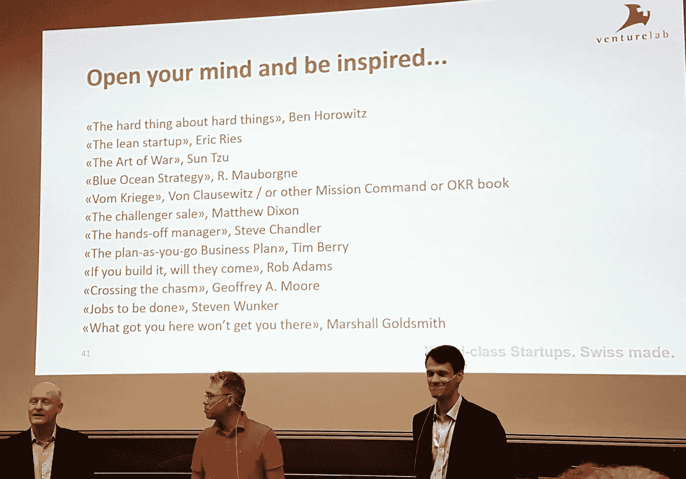