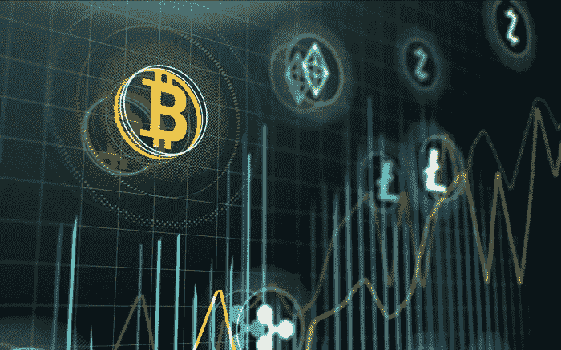

# 初创公司 ICO 被瑞士金融监管机构打了一巴掌

> 原文：<https://medium.datadriveninvestor.com/startup-ico-gets-slapped-by-swiss-financial-watchdog-b37769fff16?source=collection_archive---------11----------------------->

## 密码需要被这些罪犯监控。原因如下。

在不断的身份盗窃、诈骗和非法冒险中，新的加密产品不总是面临审查吗？这就是你的日常黑帽大亨的努力，利用一个系统以牺牲社会的完整性为代价获得畸形的收益，这一切都是因为新技术。

这是一个事实:[加密货币](https://vigyaa.com/@pierre/3-cryptocurrency-stories-that-will-scare-the-blockchain-out-of-yo-863507f4/)很不稳定，不是因为它的不可靠性，而是因为有多少人想要利用[区块链](https://vigyaa.com/@pierre/germany-takes-a-chance-not-a-risk-on-the-blockchain-and-heres-5ab50e24/)所预示的新金融时代的无缝性和效率。谢天谢地，我们监督 FINMA 在这一点上，以确保没有勾结进行加密！

 [## 正在改变行业的 5 个真实世界区块链应用——数据驱动的投资者

### 除非你一直生活在岩石下，否则我相信你现在已经听说过区块链了。而区块链…

www.datadriveninvestor.com](https://www.datadriveninvestor.com/2019/02/13/5-real-world-blockchain-applications/) 

# 以下是瑞士金融市场阿尔卑斯山中加密货币骗局的内幕

多亏了 FINMA，监测发现一家瑞士公司 Envion AG 目前正在清算，接受了超过**9000 万法郎**。对于那些美国人来说，这是至少 37000 万投资者之间支付的 9100 万美元，以换取类似债券的代币。

问题是这些债券没有许可证，因此是非法的。此外，发行这些代币的条件在所有投资者之间并不平等，没有内部审计程序，达不到最低要求。谁知道加密货币投资有一定的法律指引？那是显而易见的。毕竟，这涉及到其他人的钱，投资在一个没有可行的、可见的或可塑的投资回报的产品上。总的来说，都是善意的。

为了保护这些投资者，指导方针必须到位。

不过，据说 Envion 没有打算挪用资金，这当然会损害投资者的利益。这并不能否认这是违法的。

# 尽管如此，在加密货币技术方面，融资已经取得了很大进展

但是它也有一些小问题，网络恐怖主义，欺诈和缺乏透明度的风险。初创公司基本上可以通过数字方式筹集资金。虚拟代币让这变得非常容易。然而，监管者看到了警告信号。

事实是，包括瑞士在内的许多国家将 ico 视为唯一的证券。因此，在关注传统资本市场时，需要应用某些规则。这些投资不是硬通货——因此，由于比特币和其他持续波动的密码的波动性和不断上升和下降的螺旋，存在操纵的空间。在这种情况下，交易法会得到更多的执行。

然而，其他国家——如中国和印度——甚至不考虑 ico。可能出错的地方太多了。然而，这并没有阻止 ico 和 sto 的不断增长，比去年翻了一番，超过 1K，仍然是我们所谓的*加密谷*的顶峰。

# 毫无疑问，正如 Envion 所经历的那样，风险是存在的——但除此之外，你还能如何成功呢？

有时候你不得不冒一些风险——尤其是在一个全新的竞技场上。你可能会输、犯错或犯规，但这就是游戏的名字。这并不意味着密码游戏结束了。你只是在学习、体验和进化。不过，要肯定的是，你是真的在*学习，而不是简单地试图寻找系统中的“漏洞”。你会不断陷入很多麻烦。*

你如何看待区块链和加密货币？好还是坏？ [**注册一个 VIGYAA 账户**](https://vigyaa.com/accounts/login/) 并确保也 [**查看数据驱动投资者以获得对技术的更多见解**](http://datadriveninvestor.com) **！**