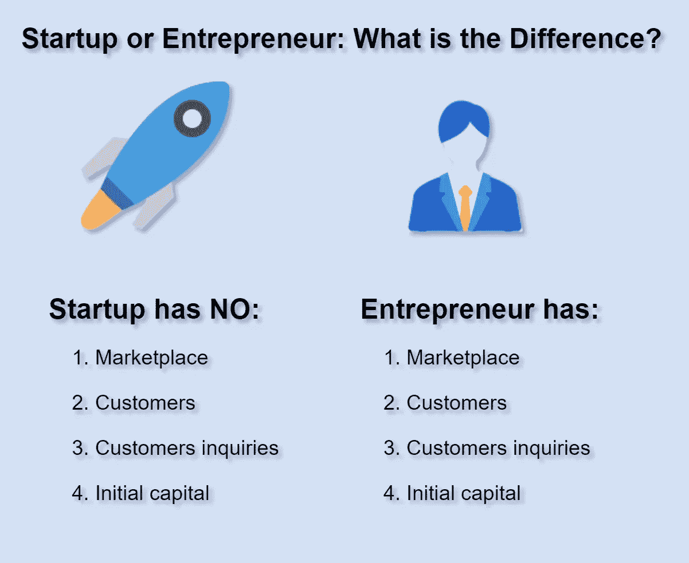

# 创业公司或企业家:区别在哪里？

> 原文：<https://medium.datadriveninvestor.com/startup-or-entrepreneur-what-is-the-difference-860af3b7f949?source=collection_archive---------10----------------------->

去年，我开始为我最好的创业项目之一写商业模型。我做了一个假设，进行了测试，并开始编写一个应用程序。几个月后，我意识到我非常缺乏如何成功开展 B2C 业务的知识。去年夏天，我潜心阅读了一些营销和商业建模方面的书籍。这里可以看总结[。](https://medium.com/datadriveninvestor/startups-what-they-need-to-know-3ec719575d23)

除了书籍，我还通过大量的谷歌搜索和维基百科的文章来帮助自己学习。后来，只剩下一个问题:**我是企业家还是初创公司？我明白了如何做生意、如何开始、需要注意什么以及如何理财。但是这个问题没有答案。**

当夏天结束的时候，它在我的脑海里响起。我消化了我读过的所有事实，并写下了接下来几个非常重要的差异:

**一个企业家有:**

1.  市场
2.  客户
3.  客户询问
4.  创办资本

**一个启动没有:**

1.  市场
2.  客户
3.  客户询问
4.  创办资本

这几个事实在我读过的书中到处都有提及，但并不像它们应该的那样清晰。我是一名工程师，我必须承认通读所有这些故事根本不是我的强项。我总是忽略了这一点。

如果你想理解所有这些，考虑这个例子。

假设你是一个创业者，你已经决定要创业。你是一名优秀的机械师，对保养和维修汽车充满热情。几乎所有人都是司机，都有车。所以，你**有客户**。汽车必须维修，即使你的竞争对手就在街对面，市场上仍然有你的服务。你**有一个市场**和**客户咨询**。你有一个车库，你在银行存了一些钱来购买必要的设备。你有**初始资本**。

假设你是一个创业者。你有一个创造飞行电脑的想法。市场上没有这样的东西，但有一个是好的，因为客户经常将笔记本电脑从一个地方转移到另一个地方。如果他们能有一台会飞的电脑，他们只需运行一个应用程序，电脑就会跟随他们。

首先，市场上没有这种产品，人们根本不知道它。所以，作为一家初创公司，你既没有顾客也没有市场。最糟糕的是，你没有**的客户询盘**，当然，**也没有初始资金。**你需要创新一台会飞的电脑，创造它，然后发布它。这将花费你大量的资金。

我可以说一个企业家有更多的机会成功。他们的生意可靠多了。相比之下，初创企业必须:

1.  创建一个市场
2.  创造客户
3.  创建客户查询
4.  获得初始资本

换句话说，创业公司必须说服客户使用他全新的产品。一个创业公司必须有改变世界的力量。

所有这些对于创业者和创业公司来说都是非常重要的。我可以说，企业家主要是为普通生活提供服务——但创业公司推动着世界的进步。最终，在他们的最后阶段，企业家为初创公司推出的初始产品或服务创造服务。

**作者** : [马特加斯·马鲁西格](https://www.linkedin.com/in/matjazmarussig/)

**编辑** : [凯特琳·沃尔什](https://www.linkedin.com/in/caitlin-walsh-77a711125/)

**参考文献**

爱，H. (2016)。创业 J 曲线:创业成功的六个步骤。【Kindle 版】。从 Amazon.com 取回

约尼卡斯博士(2017)。从创意到盈利和可扩展业务的创业演化曲线:创业营销手册。从 Amazon.com 取回

— — — — — — — — — — — — — — — —
***随时订阅发布我下一篇文章的通知*** [***这里***](https://docs.google.com/forms/d/e/1FAIpQLSe9pf7Wq9NhCqKuljPufwo2WIgjKRb-r9VPaXGwo01IWiekww/viewform) ***。***