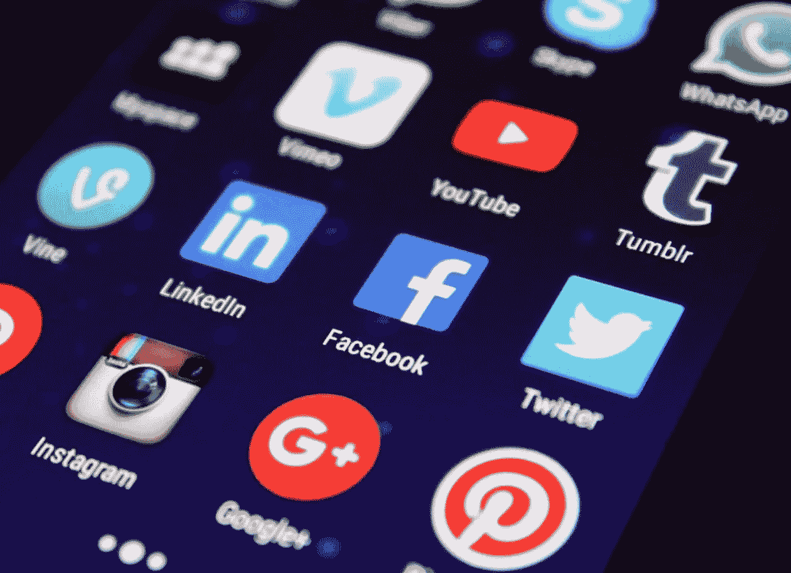

# 不管有没有启动，数字规则是最重要的

> 原文：<https://medium.datadriveninvestor.com/startup-or-not-digital-rules-prevail-5085d63fa212?source=collection_archive---------11----------------------->

## 在网上积极参与社交活动会带来巨大的投资回报

让我们约定，创业是你想成为的样子。就规模、年龄或专业而言，创业公司没有一个广为接受的定义——尽管科技公司是这个头衔的有力竞争者。

初创公司难以捉摸的本质让人想起最高法院大法官波特·斯图尔特对色情作品的描述:[“我一看就知道。”](https://en.wikipedia.org/wiki/I_know_it_when_I_see_it)勇挑重担的企业家和寻求投资回报的风险投资家一看就知道初创企业，也知道等待他们的挑战，不管这些通常是中小型企业的性质如何。

 [## 金融科技初创公司正在扰乱世界各地的银行业-数据驱动的投资者

### 传统的实体银行从未真正从金融危机后遭受的重大挫折中恢复过来…

www.datadriveninvestor.com](https://www.datadriveninvestor.com/2018/10/20/fintech-startups-are-disrupting-the-banking-industry-around-the-world/) 

可能最少被考虑的挑战和影响——然而对创业成功有很大影响——是社交媒体。蓝线营销公司(Blue Thread Marketing)的联合创始人兼首席数字媒体策略师莫迪凯·霍尔茨(Mordecai Holtz)认为，活跃的社交网络具有巨大的投资回报潜力，尤其是当最大的投资是时间而不是金钱时。

霍尔茨说:“社交是最终的破冰方式。“初创公司希望并需要消费者基础、思想领袖网络和接触潜在投资者的渠道。

“许多投资者和思想领袖会在互动前检查初创公司的社会证明，”他说。如果竞争对手基于内容获得了关注，开始使用它。如果不是，那就是即时优势。"

# 充分利用数字技术

这使得掌握数字技术的企业主得到了额外的奖励。事实上，数字技能对今天的企业家来说是一笔巨大的财富，他们可以充分利用这些技能来获得巨大的利益。这是企业家和谷歌数字技能首席培训师汝瓷·伊迪丝擅长的地方。

“一个数字企业家创造了一个其模式或框架利用互联网的企业，”伊迪丝在一次[非洲推特](https://twitter.com/AfricaTweetChat)聊天中说，“这意味着创造企业主在线营销和分销的数字产品和服务。数字企业家专注于在线或网络商务。它可以是获得客户或顾客、设计和提供产品或服务、创造收入或降低成本的策略。

她说:“数字企业家提出的想法或技能可以帮助其他想成为企业家但不知道如何开始的人。”

 [## 数字领导者希望打造最佳体验

### 企业家寻求优势，在网上找到最佳地点

medium.com](https://medium.com/datadriveninvestor/digital-leaders-want-to-build-the-best-experience-b4086fe630fa) 

就像动作片中的英雄一样，这些企业家需要有一套非常特殊的技能。对伊迪丝来说，这意味着拥有为他人创造机会的技能。她举的主要例子是优步、脸书、阿里巴巴、Airbnb 和 Skype。她敦促谨慎，因为“我们使用的平台极大地有助于我们的想法获得成功。

“社交媒体帮助你扩大市场份额，”伊迪丝说。“你可以选择尝试有机社交媒体或付费社交媒体，为浏览量、点击量或行为付费。”

以下是她对创业公司的数字基本要求:

*   了解可用的渠道。
*   了解数字营销基础知识。
*   了解客户的人口统计数据。
*   要谨慎对待时间，因为数字技术在不断发展。

这将有助于企业家利用社交媒体。

伊迪丝说:“我们必须为中小型企业进行数字技能培训，让他们了解在进行数字营销时需要什么样的的[基础知识。”她补充说，初创企业主可以随时学习数字世界的新技能。](https://learndigital.withgoogle.com/digitalskills)

“社交媒体是每个人都在利用的平台之一，”她说。“它有助于接触新的受众，创造新的机会，锁定特定的客户并开发新的网络。当你在网上出现时，你的内容就是王道。让信任成为你的女王，确保你赢得客户忠诚度和良好声誉。”

# 强调娱乐

这些是伊迪丝关注内容的关键:告知、教育、建议和娱乐。

“人们喜欢娱乐和一些有很好的插图和描述的东西，”她说。

自信和实证主义是创业者最大的卖点。销售是一种情感行为，人们会购买你。

“了解你的品牌、保护你的品牌并让人们积极谈论你的品牌的艺术是数字企业家应该关注的，”伊迪丝说。“我们的品牌更响亮。了解我们客户的人口统计数据和微时刻也有助于创业者知道何时何地最适合他们。"

就像初创企业所有者的整体业务一样，数字多功能性不会神奇地出现。从做好一件事开始，或者如伊迪丝所说，“品牌从一个平台开始，测试它，然后尝试其他平台，这总是明智的。

“数字技能主要是企业家在数字平台上展示自己的方式，他们使用的语言以及他们选择关键词的敏锐程度，”她说。“有像关键字规划器这样的谷歌工具可以帮助你为你的内容选择最好的关键字，以便于索引。”

# 对数字的普遍需求

忽视整合社交媒体战略需求的初创企业所有者将会被抛弃。

伊迪丝说:“数字化正成为各行各业企业家的必需品。”。“在 YouTube 上观看的视频是领先的，我非常肯定每个人在看到它如何工作后都会想要消费一些东西。”

 [## 远程医疗为远程连接开出了药方

### 从远处看很有帮助，应用程序也有自己的隐私问题

medium.com](https://medium.com/datadriveninvestor/telemedicine-prescribes-cure-for-distant-connections-a4d87383c808) 

对于那些在手机上阅读这篇文章的人来说，一个普遍的技术是移动技术。伊迪丝说，大多数人通过手机上网。从手机上下载的应用数量比上一年增长了两倍。她建议企业家创建响应性网站和应用程序。

“互联网已经控制了局面，”伊迪丝说。“这取决于企业家如何利用在线平台，让他们的产品保持最新。我总是建议创业者利用好时间，总是非常灵活，随时准备适应新的变化。”

她指出，内容营销有助于品牌创造知名度，产生流量和增加销售额。品牌个性化提供了额外的推动力。

伊迪丝说:“在做电子邮件营销、重新定位和重新营销时，这种方法真的很管用。”。“它会带来转变和重大事件。

“如果你是一名数字企业家，就专门为你的目标受众创作内容，”她说。“这将帮助你赢得利基市场，降低成本，实现利润最大化。有预算、计划和战略就足够了。”

即使他们可能专注于世界上的某个小角落，创业公司的所有者也必须记住，他们的数字声誉会传播得很广，不管他们是否愿意。

伊迪丝说:“当作为一名企业家运用数字技能时，你必须知道你在和世界上 40 亿人打交道。”“通过具体说明来筛选这些人群，以适合你的目标人群。从小处着手，然后随着时间扩展。

“我们的定位帮助我们触及目标受众，”她说。“这就是我们得到的内容和参与度。我们经历的认知和转变告诉我们是否达到了目标。”

这是一个适用于任何规模和任何类型的任何类型的企业的指导方针，尤其是掌握创业艺术的企业家。

**关于作者**

吉姆·卡扎曼是[拉戈金融服务公司](http://largofinancialservices.com)的经理，曾在空军和联邦政府的公共事务部门工作。你可以在[推特](https://twitter.com/JKatzaman)、[脸书](https://www.facebook.com/jim.katzaman)和 [LinkedIn](https://www.linkedin.com/in/jim-katzaman-33641b21/) 上和他联系。

*原载于 2019 年 6 月 28 日*[*https://Dave schneider . me*](https://daveschneider.me/startup-or-not-digital-rules-prevail/)*。*