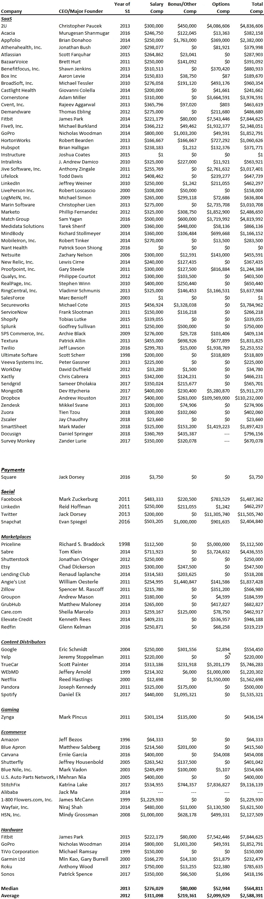

# 首席执行官的启动工资

> 原文：<https://medium.datadriveninvestor.com/startup-salaries-for-ceos-12836e94dcf?source=collection_archive---------11----------------------->

“gray laptop computer beside white ceramic mug and black smartphone on brown wooden table” by [rawpixel](https://unsplash.com/@rawpixel?utm_source=medium&utm_medium=referral) on [Unsplash](https://unsplash.com?utm_source=medium&utm_medium=referral)

我们已经看到风险投资支持的公司的 CEO 薪酬有很大差异，从低至每年 3.5 万美元到高达 32.5 万美元(外加奖金)。虽然没有明确概述初创公司薪酬水平的数据集，但我们可以利用科技公司 IPO 时的薪酬来了解一位成功离职的首席执行官的薪酬水平。以下数据显示了 101 家科技公司首席执行官在 IPO 时的薪酬。

一些观察结果很突出:

一些最好的首席执行官拿着最低的薪水。例如，Salesforce 的马克·贝尼奥夫(Marc Benioff)在 IPO 时的薪水是 1 美元，南特健康(Nant Health)的帕特里克·史昂(Patrick Shiong)没有薪水，Square 的杰克·多西只有 3750 美元，亚马逊的杰夫·贝索斯只有 64333 美元。也就是说，这些人在 IPO 之前都是独立富裕的，但看到一位首席执行官放弃了他/她不需要的高薪，总是令人耳目一新。它为公司的其他人树立了一个榜样，建立了一种现金效率/节俭的文化，并展示了一位创始人将公司置于自己之上。拿着低薪的创始人在融资时也表现得很好。风险投资更愿意支持一个斗志昂扬、节俭的创始人，而不是一个无偿花钱的人，首席执行官的薪水告诉你很多关于首席执行官的咒语。

**对于一家非常成功的公司来说，27.6 万美元是中间值。**请记住，27.6 万美元的工资中位数是针对一家即将上市的公司的首席执行官而言的。换句话说，这些公司在上市之前都非常成功，但首席执行官的工资仍然低于我们看到的一些首轮融资初创公司，尤其是在西海岸。一定要根据你公司所处的阶段相应地调整你的薪水。

**其他形式的薪酬包括期权和奖金。**请注意，奖金的中位数是 8 万美元，期权授予的中位数是 5.2 万美元。事实上，接受基于绩效的奖金并不是不合理的，随着公司的成熟和更加成功，创始人也会被授予股票，尤其是如果他们的工资很低的话。股权，而不是工资，应该是你的主要关注点。

在 IPO 之前，一些创始人接受了价值不菲的期权。例如，Fitbit 的詹姆斯·帕克(750 万美元)、Twitter 的迪克·科斯特罗(1130 万美元)和 True Car 的斯科特·佩因特(520 万美元)等人都在 IPO 前一年获得了不错的期权套餐。作为一名首席执行官，只要你在推动惊人的增长和价值，期望作为首席执行官获得额外的期权奖励并不过分。这实际上是市场，好的投资者会毫不犹豫地奖励表现出色的首席执行官。

随着时间的推移，工资已经上涨。如下表所示，自 1998 年以来，首席执行官所有权的中位数水平有所上升。从 1998 年到 2007 年，每年的中位数平均为 15.6 万美元。从 2008 年到 2016 年，中位数平均为 28.3 万美元。这是当老板的好时机。

我们希望上述数据有助于设定期望薪资。保持尽可能低的比例，期待期权奖励和成功奖金，记住价值的真正来源是你的股权:贝尼奥夫、史昂、多尔西和贝佐斯在上市时分别拥有各自公司 32%、57%、24%和 48%的股份。不言而喻，他们在股票上赚的钱比在薪水上赚的多得多。

*在 Blossomstreetventures.com 拜访我们*

*原载于 2018 年 10 月 9 日 about.crunchbase.com。*