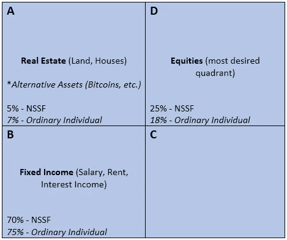

# 乌干达的创业/中小企业融资:哪里&如何获得资金，哪里&如何投资，第 3 部分

> 原文：<https://medium.datadriveninvestor.com/startup-sme-finance-in-uganda-where-how-to-get-the-money-where-how-to-invest-it-part-3-83d2bbbb8e45?source=collection_archive---------11----------------------->

Photo credit: VC Circle

这是三(3)部分中的最后一部分。在第一部分中，我们总结了我们可以利用的资金来源，详细强调了在哪里可以找到它们。在第 2 部分中，我们研究了创业/中小企业融资的其他来源、一些例子和一些案例研究。

在这最后一部分中，我们将以 NSSF 为案例研究，探讨初创企业/中小企业的投资渠道，以确保定期的现金流入以及与任何企业的公司治理相关的其他事项。这对你个人也有帮助，因为你将了解风险和投资。

我们离开之前告诉你，仅仅以房地产的形式拥有或持有我们所有的投资是不明智的。

在这种情况下，你在五(5)年前以 100，000 美元低价买入并希望高价卖出的资产可能最终价值非常低(折旧因素)。最终的结果要么是以市场价值出售，这是一个公平的销售价值；或者以你不想要或不期望出售的价格——强制价格。

抵押贷款更好，因为抵押贷款会升值。投资 100%的资产对生意和你都不好！分散投资组合，分散投资风险。我建议你使用一个矩阵，如下图所示。

我们来看看上面的矩阵。

典型的投资计划考虑两(2)件事；

1)风险

2)退货

风险越高，预期收益越高，反之亦然。理想情况下，投资应该根据风险敞口和预期回报，分布在房地产、固定收益和股票以及其他(你喜欢的)资产中。

在象限 A 中，7%应该投资于房地产，因为风险太高，而回报通常很低。75%应该是固定收入来源的投资(因为在给定的一段时间内收入是不变的)；而且风险和回报都很低。

普通人大多落在象限 b，象限 D 是最可取的。原因是，风险和回报都很高；以及更长的时期/未来。

你为了长期回报而购买股票是有风险的，因为随着时间的推移，股票的价格或价值至少会因为良好的表现而上升。投资股票也会让你的孩子、孙子和曾孙受益。

成为洛克菲勒家族的一员。

基于同样的矩阵，它也适用于 NSSF。社保基金将 5%的投资分散到职工住宅的房地产上…..70%为固定收入，如固定银行存款；25%投资于股票(主要是上市公司)。你应该知道 NSSF 在配电公司 ume 和其他公司拥有大量股份。在房地产业，是的，但很少。这些只是它购买和拥有的财产。它还在对面建了一个法国大使馆。

属性是如此不稳定。

加密货币(比特币等。)是另一个新兴的投资渠道。然而，我不推荐他们，因为他们不受管制。它们属于不动产，例如比特币。它们基本上是另类资产。据我所知，你也应该知道，这类资产有潜在的价格或价值上涨，但波动性很大。一定要谨慎！

因此，除了我们上面看到的，企业家和初创企业/年轻企业主需要了解企业融资的过程或周期。我称之为“创业融资流”。下面是这样的；

**内圈/3Fs >引导带>授予/比赛>风投> P.E > CMA(使用)/保险单**

简单来说，自举意味着靠微薄的预算和资源生活/经营——有时每天使用自己的资金来经营商业活动。内圈/3f 是朋友、家人和傻瓜，你可以向他们借钱来支持你的创业。

通常一些核心圈子里的人被许诺在企业中有股份——没有基础，尽管有风险。如果你有这样的想法，首先去读读莫耶的《切馅饼》这本书。赠款是由非政府组织和其他实体向某些行业的初创企业提供的免费资金。竞赛为最佳创意提供现金奖励。

风险投资是个人组成公司，为创业公司和企业提供资金。他们也可以是影响力投资者，通常捐赠金额在 1000 万美元以上。他们不同于天使投资者，因为他们通常给的金额少于 10，000，000 美元，也可能超过 10，000 美元。它们也可以是非正式投资。

资本市场是上市公司通过首次公开募股，获得保险政策，融资和投资组合可以多样化。要在资本市场上市，你需要满足关键的严格要求，比如公司治理——它有多强？

作为一家社会保障机构，NSSF 拥有如此强大的公司治理结构，多年来提高了效率，重塑了品牌，并在此过程中进行了其他一些改革。大多数时候，政府/国有半国营企业的形象非常糟糕，因为它们缺乏管理事务和资源的商业方法来盈利。

当新的管理层接管 NSSF 时，要做的第一件事就是改变标志，然后是其他内部系统和人力资源。目前，截至 2018 年，NSSF 拥有约 220 万名会员，高于约 100 万人，拥有约 16 或 17 个分支机构，低于此前的 25 个。

它还拥有大约 30 辆汽车，比以前的 100 辆减少了大约 30 辆，工作人员从大约 800 人减少到大约 450 人，减少了大约一半。目前，它的交易以电子方式完成(约 60%的电子交易)和 40%的现金交易。这就是效率的意义所在。

现在回到这篇文章的第一部分(你们中那些一直在关注的人)，我们提到了像“企业的目的”这样的东西，这些是；

1)面向客户的解决方案

2)你会回馈给顾客什么

3)你对社会有什么回馈

去年 11 月中旬左右，NSSF 决定通过启动一项价值 20，000 美元的基金来回报社会，该基金面向任何有前途的初创公司、企业家或年轻企业，为他们的客户或社会提供非凡的想法或解决方案。

这项投资应该是具有挑战性的，而且你需要在第一年年底前实现合理的营业额。

我告诉过你，钱跟着想法走。所以，去拿钱吧；就像耐克说的，只管去做！

***注意:本文节选自 NSSF 医学博士 Richard Byarugaba 在 2018 年创新村举办的企业家讲座。***

注:这篇文章也出现在 WordPress 上，作者是同一个人。点击[这里](https://bit.ly/2nSoMYu)

***关于作家***

*Julius Masaba 毕业于乌干达穆科诺基督教大学工商管理(会计&金融)。他在 Inachee 工作了 4 年，担任副研究员；在那之前，他在同一家公司做业务伙伴。他还精通商业投资研究。他做中小企业/创业咨询。他目前正在乌干达烈士大学完成他的 MBA(市场营销)论文。*

*联系上尤利*[*jjjmasaba@gmail.com*](mailto:jjjmasaba@gmail.com)

跟着他；

http://facebook.com/masabajuliuscaesar 脸书

推特[http://twitter.com/juliussmasaba](http://twitter.com/juliussmasaba)

http://instagram.com/juliussmasaba 的 Instagram

中型[http://medium.com/@jjjmasaba](http://medium.com/@jjjmasaba)

领英[https://www.linkedin.com/in/masaba-julius-11119497/](https://www.linkedin.com/in/masaba-julius-11119497/)

在 [**企业家精神和创业**](https://app.ddichat.com/category/entrepreneurship) **:** 中安排一次对话

 [## 专家-企业家精神和创业- DDIChat

### DDIChat 允许个人和企业直接与主题专家交流。它使咨询变得快速…

app.ddichat.com](https://app.ddichat.com/category/entrepreneurship) 

在此申请成为 DDIChat 专家[。
与 DDI 合作:](https://app.ddichat.com/expertsignup)[https://datadriveninvestor.com/collaborate](https://datadriveninvestor.com/collaborate)在此订阅 DDIntel [。](https://ddintel.datadriveninvestor.com/)