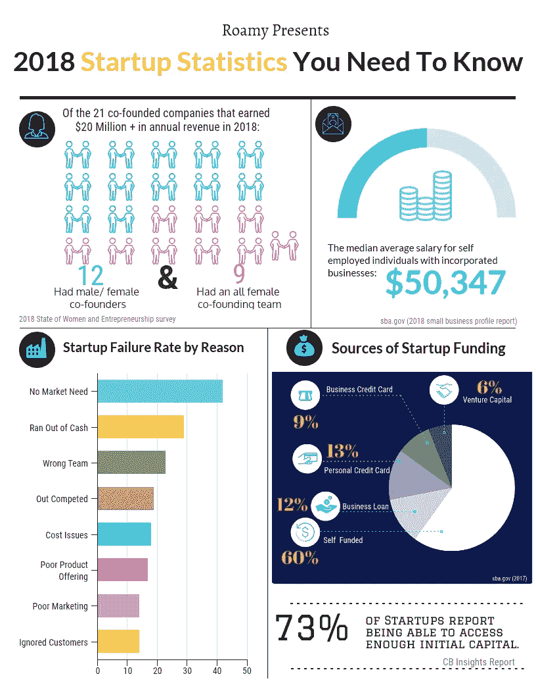

# 你需要知道的启动统计数据

> 原文：<https://medium.datadriveninvestor.com/startup-stats-you-need-to-know-ce4ca85ff1bf?source=collection_archive---------7----------------------->

在这个时代，很难确定创业成功和失败的事实，因为公司倾向于只发布关于他们自己的最佳数据，媒体倾向于报道“成功”的故事，而不是“现实”的故事。

风险投资公司的大肆宣传与 90%的新企业都会失败的格言形成了鲜明对比，因此我决定自己做一些调查。

我整理了一份清单，列出了我能找到的最令人惊讶的、相关的、最新的创业统计数据。我在下面的信息图中描绘了这些数据。

Startup Stats- 2018

随着 2019 年进入高速发展，很明显，初创企业的融资格局和增长率是健康的。我发现的一个令人惊讶的统计数据是，尽管创业生态系统中有大量的风险资本和投资，但企业家的平均工资仍然只有 5 万美元****2018 年所有新创业企业中只有不到 6%得到了风险资本的资助**。在一个似乎每个人都在筹集数百万美元的时代，值得注意的是，许多初创公司都是自力更生，最初是自筹资金的。**

**如果你知道任何伟大的创业统计数据，请在下面评论它们！**

********