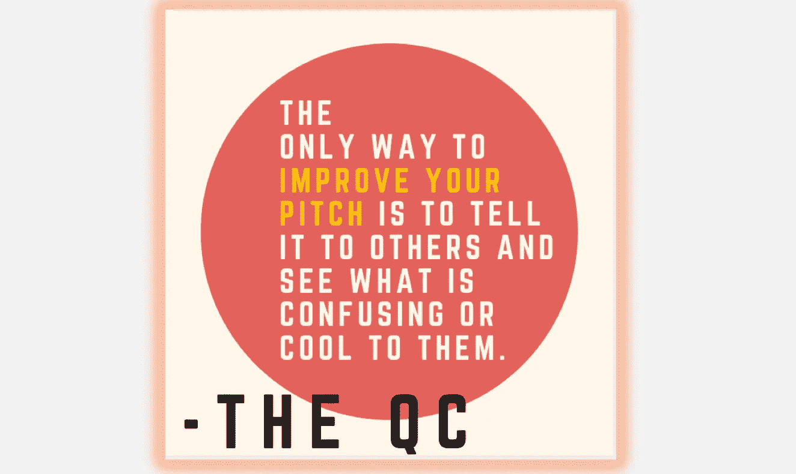
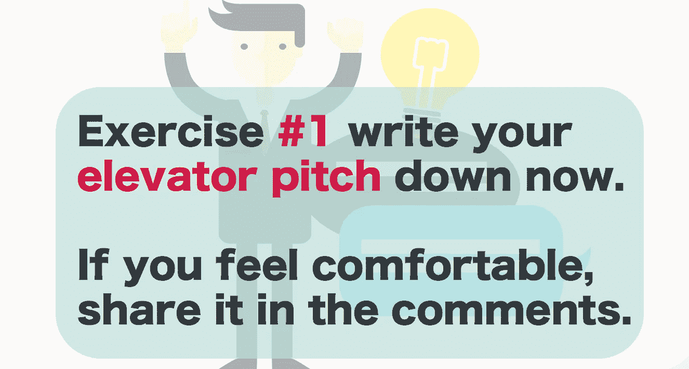
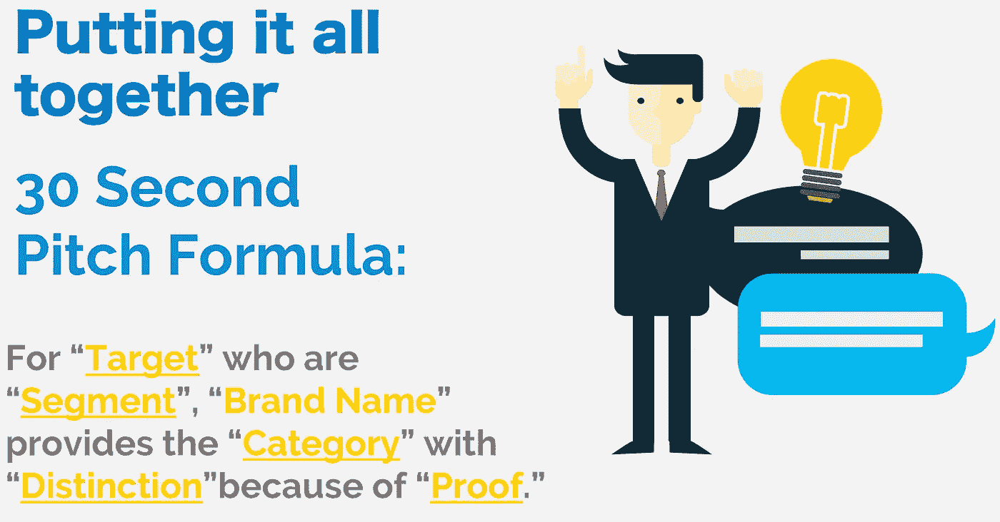

# 创业故事:精心策划一场精彩的电梯推介

> 原文：<https://medium.datadriveninvestor.com/startup-storytelling-craft-a-kick-ass-elevator-pitch-a39a1af579ce?source=collection_archive---------1----------------------->

想象你正在电梯里做自己的事，这时三楼的门开了，马克·库班和你一起走进了太空。当门关上时，你在想“什么？那是马克·库班，我必须告诉他我的创业想法，我知道他会喜欢的。”你有大约 12 层楼的时间来说服这位亿万富翁你的想法是惊人的。

**去吧。**

实际上，这是“电梯营销”的前提这是一个非常简短的公司和产品(或服务)描述，旨在引起潜在客户的兴趣，并解释你做什么。电梯间推介的目标是确保您始终将最初的对话提升到下一个级别。这意味着好奇、兴奋，最重要的是——清晰。

 [## 动荡迫使暴风雨中的平静|数据驱动的投资者

### 自然界中很少有东西是直线行进的，尤其是经济。当投资者和消费者希望平静时…

www.datadriveninvestor.com](https://www.datadriveninvestor.com/2019/03/25/volatility-compels-calm-amid-the-storm/) 

我是一名创业教练，我看到新创业者在电梯推销中一次又一次地犯同样的错误。他们想把 T2 做的每件事都塞进这个狭小的空间，结果通常是一团糟。问题是，没有人真正有精力或时间听你谈论自己。如果他们授予你这样做的特权，你应该尊重这段时间，充分利用这段时间，做一个简短的推介，解释你的产品(或服务)将如何帮助*他们*。

有成百上千的文章告诉你不要用这种推销方式做什么(例如，不要试图用这种推销方式推销)+大量的文章给出了该做什么的建议(例如，以一个问题来引发听众的好奇心)，但是没有太多的文章详细说明了你应该在你的推销中使用的确切公式。

这是**那篇**文章。

> 下面是一个精确的一步一步的公式，你可以用它来制作你的创业电梯间推介。每次都能准确而简单地描述每家公司。

这是我从哈佛大学创新实验室的营销学教授 Mike Triano 那里学到的一个公式，他也是一些非常成功的创业公司的创始人(这些公司获得了数百万美元)。

我对这个公式非常有信心，实际上我在自己的网站上使用它。我很难描述我作为一名创业教练做了些什么，但在填补了这个公式的空白后，描述我的服务变得非常容易。

我认为，当你看到一个例子时，你会更容易理解一些事情，所以这是我的电梯营销，使用我将要教你的公式:

> 对于早期创业的企业家，QC 提供专家业务指导。通过我们基于脑科学的方法，创始人可以获得现实的建议和可行的战略培训。

## 快速练习:写下你的推销词

太好了，现在你已经写好了你的电梯间推介，让我们稍微修改一下吧。

## 步骤 1- **目标:定义你的整个潜在市场**

对于这一步，缩小范围，看看你的市场中所有可能的用户。如果你在为女性创建优步(就像 T2·戈萨夫一样)，你的目标应该是女性。很简单。如果你的业务有点复杂，想想你产品的用户，试着为他们找一个通用术语。

对于我的生意，量化教练，我把我的目标简单地定义为“企业家”。

**你的目标是什么？写下来。**

## 步骤 2- **段:预处理属性因子**

这是你确定你的目标受众的部分。我知道你认为每个人都是你的客户，每个人都可能是，但是如果你和每个人说话(通过你的营销)，你将无法接触到任何人。你得具体点。那么，你想专注于你的“目标”的哪一部分呢？

对于 GoSafr(优步女性应用程序)，他们通过专注于向生活在大城市的女性营销来“细分”他们的“目标”受众。这是有道理的，因为大城市的妇女比农村地区的妇女更需要交通服务。对于 QC，我将我的细分市场定义为“早期初创企业创始人”，因为虽然我在每个阶段都与初创企业创始人合作，但处于预融资阶段的创业者最需要战略方面的帮助。

**你的细分市场是什么？写下来。**

[The Quantified Blog](http://www.blog.quantified.coach)

## 第三步-品牌名称

你公司的名字是什么？很好，记下这一步。

## 步骤 4-类别:买方的竞争框架

你要进入什么主要行业？每个初创公司都认为自己“没有”或“很少”竞争，但事实很少如此。即使拥有像优步这样的颠覆性技术，他们也有传统出租车作为直接竞争对手。任何能帮助你的客户解决问题的公司或服务都是你的竞争对手。

对于量化教练，我列出的竞争框架是“商业教练”行业，因为虽然我特别关注初创公司和创业教练，但商业教练和顾问仍然是我的竞争对手。

**你是什么类别？写下来。**

## 第五步-区别:在你上面列出的类别中，是什么让你与众不同？

这是你列出你的“秘方”或者更清楚地定义你的定位的地方。你希望能够做出一个清晰的、易于支持的陈述，因为下一步要做的是证明。想想你的 USP(独特的销售主张)和你实际做的是什么。与所有这些部分一样，要把客户放在心上。你做了什么来帮助他们？

你的特点是什么？写下来。

## 步骤 6-证明:感知到的真理证据。

这个公式的创造者 Mike Triano 说得很清楚，这里感知这个词是最重要的。如果你的证明非常专业，难以理解，人们不会认为它是真的。另一方面，如果价值主张易于理解，你就有很大机会让人们相信你的证据。

社交证明(证明、评级、同行对话)在这里特别管用，但如果你没有能力说“受到美国 300 万家庭的信任”，你可以概述你在这个领域的权威或你的认证方法。

对于 QC，我使用的证据是我们基于脑科学的启动策略。我与神经科学合作，帮助企业家进入正确的思维模式，同时了解客户大脑的内部运作。酷吧？

**那么，你的证据是什么？写下来。**

# 把所有的放在一起

这是一个完整的公式，每次都适用于每个企业。

再看看我的电梯推销:

针对**创业者**与**早期创业**， **QC** 提供**专家业务辅导**。通过我们的**基于脑科学的方法**，创始人可以获得**现实的建议和可操作的战略培训**。

你可以在球场上看到公式的所有部分。只需按照上面的公式，将您的答案写在空白处，就有了一个完整的(而且非常棒的)电梯营销！

如果你发现这些信息有用或有价值，**还有更多来自那里的**。前往 [**我的创业辅导课程网站**](http://www.quantified.coach) ，在那里我有一大堆迷你课程(就像这篇文章一样)供创业者免费上**。**

***一如既往，喜欢上脸书或者关注推特上的最新消息！***

********