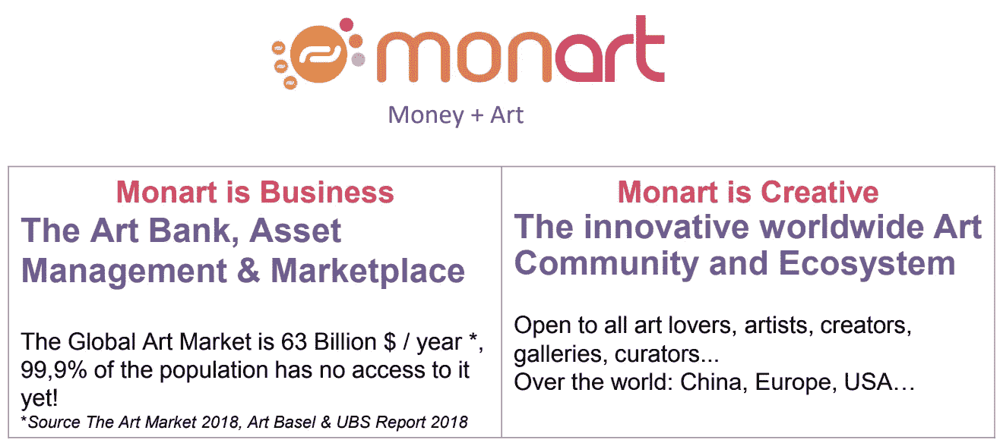
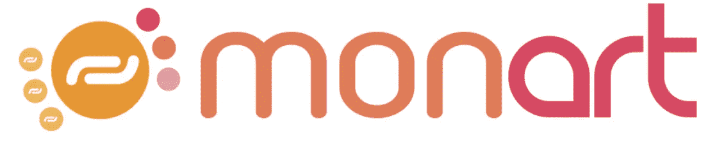
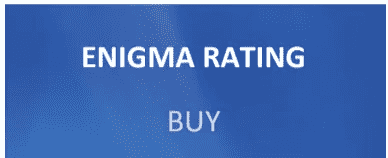
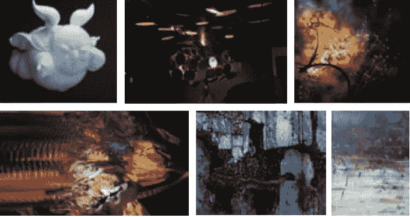

# 启动观看-莫纳特-分散的艺术市场

> 原文：<https://medium.datadriveninvestor.com/startup-to-watch-monart-the-decentralized-art-marketplace-a35d55d3ae2e?source=collection_archive---------13----------------------->

由于我对新的艺术创意非常感兴趣，并且个人非常尊重艺术家和他们的创作，我被介绍给了一家令人惊叹的、具有颠覆性的早期初创公司，该公司正在建立**去中心化的艺术市场。**它面向艺术家、艺术爱好者、投资者和所有对各种艺术及其市场定位感兴趣的实体开放。

[**Monart**](http://Half of the ICO-STO proceeds are invested in a major art collection that in turn will generate revenues shared with token holders. Those revenues are enhanced by additional shared revenue generated by the marketplaces user transactions.) 利用多种不同的媒介组织线上和线下的重大艺术家和艺术作品推广活动，包括在北京、巴黎和纽约等全球主要城市开设 Monart 空间。这样的空间创造了一种追求、发现、享受，当然还有投资的感觉。一个巨大的享受艺术的社区！

然而，这不仅仅是基于随机的想法。Monart 有很强的战略，并发现了劳动力市场上的真正问题。作为对当前问题和缺乏透明度的回应，他们将提供**具体的**解决方案，最大程度地满足每一方的需求..

**问题**

艺术家
推销自己和他们的艺术品面临巨大挑战
高度依赖中介
难以证明和追踪艺术品所有权
没有艺术品的跟踪记录或跟进
没有转卖权
艺术家和艺术爱好者之间的互动很少

艺术爱好者和买家
无权发现或推荐艺术家
不透明的艺术家和艺术品评级系统
缺乏信任
缺乏透明度，没有历史信息
难以进入艺术品市场。需要重要的投资

**解决方案**:

**艺术家**

艺术爱好者和买家
发现或推荐艺术家，选择赞助艺术家
开放并保护众筹艺术家和艺术品评级
系统
信任使用安全区块链技术的平台
透明的历史(日志)信息
通过共享所有权、艺术收藏、
新兴艺术家艺术收藏，轻松进入艺术市场

**此外**，对于这个特殊项目来说**的独特之处**，莫纳特正在开发一个全球艺术生态系统，创造一个新的市场和**艺术货币**标准。 **MONART 的创新安全 Tok 以大量艺术收藏&未来事件流为支撑。**

ICO-STO 的一半收益被投资于一个大型艺术品收藏，这反过来将产生与令牌持有者分享的收入。这些收入因市场用户
交易产生的额外共享收入而增加。

**第一个基于 ART 的安全令牌 ICO-STO**

STO 的结构将允许令牌持有者分享项目的收益。该项目由英格玛证券评估，获得了绿灯和“购买”级！

Monart 的首要任务是拥有**成熟安全的技术。**

**ICO 平台**——MonArt ICO 将在高度安全的平台上运行，包括 AML 和 KYC 等重要功能。
**令牌投资流动性**——MonArt 将与越来越多的交易所合作，并与做市商合作
，以确保 MonArt 令牌与 Ethereum、
比特币、Fiats 等之间的 MonArt
令牌(MART)的流动性。
**COMMUNITY ART PLATFORM**——该平台将提供冗余服务器、高级数据库解决方案、加密数据等广阔安全的环境。
**钱包**——MonArt 的用户将获得简单易用且高度安全的钱包，可在
智能手机/平板电脑和 Mac/PC 上使用。

MonArt 已经为成功的艺术社区和市场奠定了良好的基础。他们获得了认可，并于 2018 年 10 月在巴黎获得了**第一届 price @ ICO 大奖。**

他们在北京、巴黎、旧金山和马耳他都有代表。由 20 多名市场专家组成的团队已经在进行下一步工作，即最终确定白皮书，准备私人销售和 ICO 活动。

我坚信，这一举措将打破全球艺术市场，成为所有艺术相关项目中最受认可、最值得信赖、最方便用户的市场之一。市场上对这类服务有巨大的需求。这是目前最早和最成熟的项目之一，我期待着它在市场上的实施。

**如您想了解更多关于该项目的私人销售情况，ICO 可通过**
**investinginpassion@gmail.com**与我联系

最初发布于:[https://investinginpassion . com/2018/12/01/startup-to-watch-monart-the-decentralized-art-market place/](https://investinginpassion.com/2018/12/01/startup-to-watch-monart-the-decentralized-art-marketplace/)