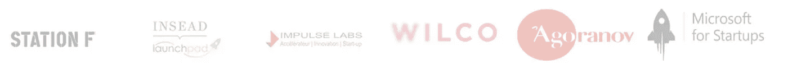

# 启动观看-网站流-革命性地数字化你的作品的软件

> 原文：<https://medium.datadriveninvestor.com/startup-to-watch-siteflow-software-that-revolutionarily-digitise-your-work-7b0a49baf9f7?source=collection_archive---------7----------------------->

最近，我观看并评估了即将到来的风险投资挑战赛，其中一个让我大吃一惊。建筑和维护公司在具有挑战性的场地上运营，它是如此简单和有用，很难相信以前没有人实现过它。

 [## DDI 编辑推荐:5 本机器学习书籍，让你从新手变成数据驱动专家…

### 机器学习行业的蓬勃发展重新引起了人们对人工智能的兴趣

go.datadriveninvestor.com](http://go.datadriveninvestor.com/5ML1) 

**这是什么，它是如何工作的？**
SiteFlow 是一个取代石油&天然气、特种工程、核工业等文档流程的平台..这些领域特别依赖于程序，一步一步地执行活动，签署每一个已完成的流程，这是一种古老的工作和记录工作的方式。

**它解决什么样的问题？**
SiteFlow 提议使用替代的**全电子**系统，该系统**可将**花费在文档上的总时间减少约 **50%。
软件释放生产力，强化质量流程，打造公司智慧。**

**商业模式是什么？**
他们已经证明了对结果非常满意的吸引力和付费客户。SiteFlow 每年按用户出售许可证，他们已经卖出了大约 30 个(目前的平均价格是 3000 欧元)。

**竞争呢？**
市场上的竞争实际上并不存在，所以风险相当低。

**市场规模有多大？这个市场的规模大约是 360 亿美元，他们很快就会打破这个市场。**

团队中有哪些人？最后但绝非最不重要的一点是，这个团队不仅在业务上，而且在实地都有实际经验。他们对产品及其帮助人们工作的方式充满热情。

他们已经与以下公司合作:

SiteFlow 现在已经过了种子前期阶段，他们有**强大的愿景**成为**方法和质量**的市场参考。它是如此简单和有用的解决方案，用户已经喜欢，所以我真的看到了这一倡议的巨大潜力和指数级的全球增长在未来一年。此外，如果我们考虑调整系统功能并加入不同的业务，市场将远远超过 260 亿美元。