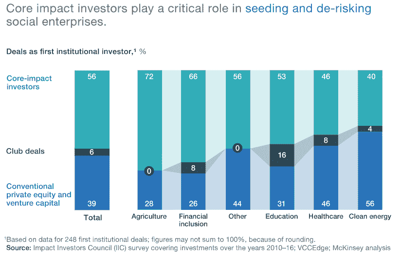

# 创业公司和影响力投资者——好还是坏？

> 原文：<https://medium.datadriveninvestor.com/startups-and-impact-investors-good-or-bad-af4bb50cf193?source=collection_archive---------19----------------------->

价值=估价。估值->利润。利润！=暴利。

你是一个想知道这个序列的初创公司吗？那么你可能要考虑与影响力投资者合作。这样做有好处也有陷阱，在讨论之前，让我们先来定义风险资本的类型。

**1)三种不同类型的风投**

传统投资者，通常也被称为机构风投，只有一个底线:财务回报。换句话说，投资于一只基金的有限合伙人指望基金经理接受他们的投资并赚钱，在美国，20%的内部收益率加上 3 倍的净费用是一只高绩效基金的基准。

战略投资者，通常也被称为公司风投，有其他的动机，往往比财务回报更重要。这些包括了解一个市场，密切关注一家初创公司的合作/收购，或者与其他投资者和企业家合作。衡量战略回报是复杂的，最常见的指标是投资组合公司和业务部门之间合作的数量和范围。

 [## 风险投资家在给创业公司播种时会考虑什么标准？数据驱动的投资者

### 2017 年，风险投资资金攀升至十年来的最高水平。你的创业公司目前吸引风险投资的机会是…

www.datadriveninvestor.com](https://www.datadriveninvestor.com/2018/04/20/what-criteria-do-venture-capitalists-consider-when-seeding-a-startup/) 

影响力投资者，通常也被称为社会风险投资，除了利润还有其他底线。许多人会称自己为双底线基金(金融+社会)，少数人已经开始增加第三维度(环境)。衡量社会影响具有挑战性，在教育领域，它可能围绕新生人数或学术表现，而在卫生领域，它可能是疾病发病率或死亡率的下降。以下是旧金山湾区的[社交风投的综合列表。](https://medium.com/gooddler-tech-and-philanthropy/top-social-venture-capital-firms-san-francisco-bay-area-73fc5edaf109)

**2)特别有助于种子**

定义什么是影响力投资有点模糊。投资健康或能源等领域的基金，即使声称只有财务底线——它们合格吗？支持以使命为导向，创造更能适应创业生活起伏的文化，从而获得更好结果的营利性企业家——这符合条件吗？寻求代表性不足的少数民族的投资者——他们合格吗？

因此，很难准确量化影响力投资的数据。麦肯锡(McKinsey)2018 年一项专注于印度的研究得出结论，社交风险投资在种子阶段尤为重要，因为这是一个新想法风险最大的阶段。

**3)更多的宽恕，但混合感知**

影响力投资者不是慈善机构，即把钱作为赠款送人。他们和其他创业投资者一样，接受股权、董事会席位并期待财务回报。主要的好处是围绕你的使命的积极帮助(介绍、雇佣、品牌、潜在的合作伙伴)和你创造的社会影响的信用。如果你在 A 轮融资中没有达到 100 万美元的 ARR 或 10 倍的退出，社交风投会宽容得多，这是撰写本文时美国初创公司普遍持有的基准。

从社交风投那里筹集资金的优势恰恰也是它的弱点。如果你的其他现有或潜在投资者纯粹是为了追求利润最大化，那就会有内在的冲突。对于有影响力的投资者是否意味着更低的回报，以及他们是否真的只属于风险更高的新兴市场，存在重大争议。实际上，你可能无法吸引顶级机构风投或最高金额的资本——如果这是你目标的核心，那么影响力投资者可能不适合你。

*原载于:* [*数据驱动投资人*](https://www.datadriveninvestor.com/2019/11/24/startups-and-impact-investors-good-or-bad/) *。”我是*[*Tau Ventures*](https://www.linkedin.com/pulse/announcing-tau-ventures-amit-garg/)*的管理合伙人和联合创始人，在硅谷工作了 20 年，涉足企业、创业公司和风险投资基金。这些都是专注于实践见解的有目的的短文(我称之为 GL；dr —良好的长度；确实读过)。我的许多文章都在*[*https://www . LinkedIn . com/in/am garg/detail/recent-activity/posts*](https://www.linkedin.com/in/amgarg/detail/recent-activity/posts/)*上，如果它们能让人们对某个话题产生足够的兴趣，从而进行更深入的探讨，我会感到非常兴奋。如果这篇文章有对你有用的见解，请对这篇文章和 Tau Ventures 的 LinkedIn 页面***发表评论和/或给予赞，感谢你对我们工作的支持。这里表达的所有观点都是我自己的。**