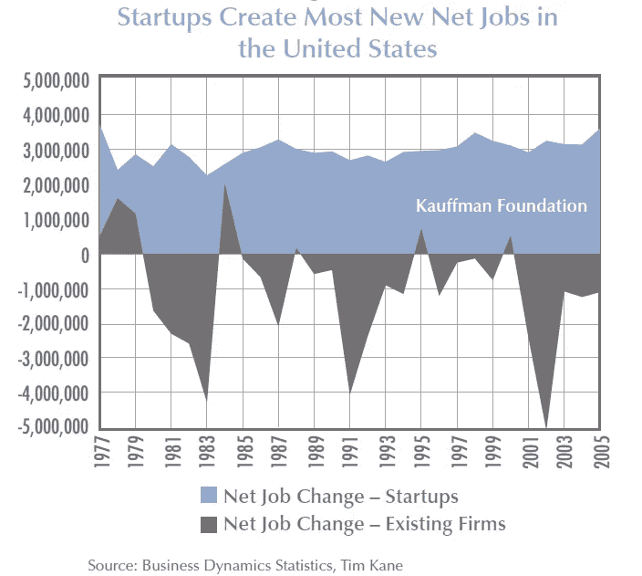
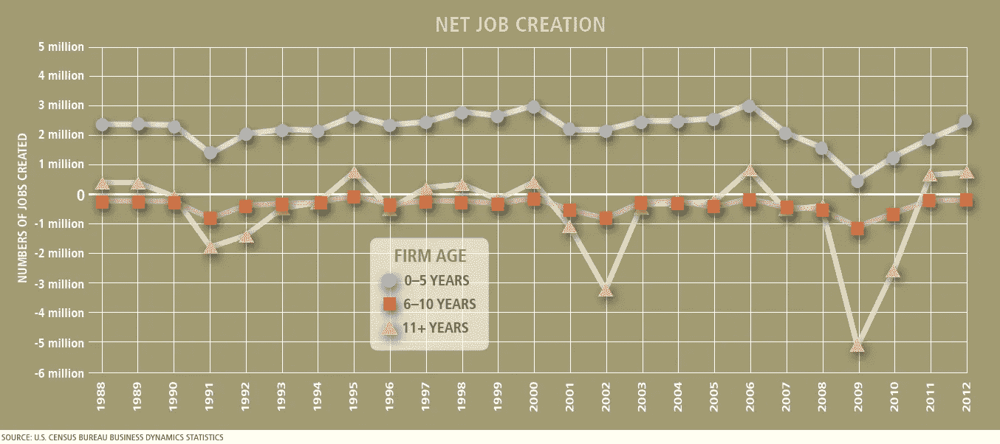

# 确切地说，什么样的创业公司会得到资助？

> 原文：<https://medium.datadriveninvestor.com/startups-and-job-creation-cd95e8a0162?source=collection_archive---------3----------------------->

K

> 这是对所有我作为投资者不得不拒绝的企业家说的。下面的注释希望能澄清创业投资世界明显的异想天开的本质。

让我们先了解一下创业这个词的含义。下面的故事在各种文章、书籍和纪录片中都有很好的记录。它始于 20 世纪 50 年代末，当时很少有硅芯片制造商在旧金山湾区南部及其周边落户。该地区当时以农业和畜牧业闻名，生活成本较低。1956 年至 1958 年间，在该地区三次科技公司上市(包括惠普公司)后，“叛逆八人组”的员工离开肖克利半导体实验室，成立了飞兆半导体公司，该公司后来催生了英特尔和许多其他公司。企业家们有意识地发展了努力工作、尽情玩乐的文化，并制造出了第一个集成电路(ICs)和微处理器。英特尔联合创始人戈登·摩尔观察到，集成电路芯片每平方英寸的晶体管数量大约每两年翻一番，而成本却减半(摩尔定律)。

 [## 金融科技初创公司正在扰乱世界各地的银行业-数据驱动的投资者

### 传统的实体银行从未真正从金融危机后遭受的重大挫折中恢复过来…

www.datadriveninvestor.com](https://www.datadriveninvestor.com/2018/10/20/fintech-startups-are-disrupting-the-banking-industry-around-the-world/) 

这些公司向在各种金融机构兼职的个人寻求投资。希望从这场半导体革命中获利的成功企业家投资于羽翼未丰的“创业公司”。这个现在被称为硅谷的地区，在机会主义者和冒险者之间，在发明家和天使投资者之间，以及在斯坦福大学的技术专长之间，形成了一种共生关系。机构投资者意识到了这些市场变化，并开始投资于快速增长的早期公司，这些公司承担了比他们习惯的更多的风险，并最终为这种特定的资产类别成立了风险投资公司，这种特定的资产类别通常比传统的投资风险评估需要更多的直觉。

在印度，政府为了提供一个主流平台，从年营业额(100 卢比或以下)、年龄(10 年以下)和具有创新元素的公司等方面定义了初创企业一词的含义。关于创新的第三个要点仍然模糊不清，这就是“创业”一词的模糊性和对传统含义的偏离。早在近三十年前，印度科学技术部(DST)就启动了最初的几个创业孵化器。整个“创业生态系统”，即风投、天使投资人和创业公司，都是吸收了硅谷创业精神而独立发展的。自然，在政府最近通过 Niti Aayog 进行干预后，虽然现在可以称为创业公司的公司范围有所增加，但创业生态系统仍然植根于传统意义，因此替代投资(风投和天使投资)的来源大体上保持不变。政府寻求推动技能培养和创造就业机会的意图是正确的。初创公司和风险投资来自于这样一个观点，即低效率是最大的雇主，并寻求创新，即从最佳资源中增加回报或从最少的资源中获得最大的利益(阅读摩尔定律)。值得注意的是，并不是每个初创公司都是 Flipkart 或 Ola，它们创造了大量的直接和间接就业机会。例如，当 Whatsapp 被脸书以 190 亿美元收购时，该公司由 32 名工程师和 4.5 亿月活跃用户组成，即每 1400 万用户有 1 名工程师。这就是二分法。在本文的上下文中，让我们通过“创业 1”来区分风险投资可投资的创业公司，通过“创业 2”来区分政府对创业公司的定义，其中创业 1 是创业 2 的子集。

这种影响是如此之大，以至于很多拥有 [DIPP](https://dipp.gov.in/programmes-and-schemes/industrial-promotion/startup-india) 创业认可证书的创业公司都不被认为是风投可以投资的。这种后果可能是由各种原因造成的；然而，主要原因仅仅是缺乏创新。每个风投都在寻求投资一个投资/产品领域的类别创造者或一个类别领导者。对于大多数行业来说，第五家做同样事情的公司对风险投资来说可能太多了。因此，绝大多数初创企业都没有资金。反过来，大多数拥有合理资金的初创企业也懒得申请 DIPP 证书。无抵押贷款的 [Mudra](https://www.mudra.org.in/AboutUs/Genesis) 计划迎合了极少数人的需求。鉴于创业资金的魅力和运营资本来源的普遍缺乏，许多拥有同质产品的公司在与无数公司的完全竞争中努力重塑自己的形象。这些公司最终会被放在创业的篮子里——比如新的餐馆或咖啡馆。

为政府说句公道话，有大量研究表明创业对经济有积极影响。

考夫曼基金会早在 2010 年就发表了一项研究，该研究肯定了美国经济中的净就业增长仅通过初创企业实现。[*https://www . Kauffman . org/-/media/Kauffman _ org/research-reports-and-covers/2010/07/firm _ formation _ importance _ of _ startups . pdf*](https://www.kauffman.org/-/media/kauffman_org/research-reports-and-covers/2010/07/firm_formation_importance_of_startups.pdf)*。该研究涵盖了 1977 年至 2005 年间成立不到一年的初创公司。*

在 2015 年的另一项研究中，考夫曼基金会指出，不管公司的规模如何，自 2008/09 年经济衰退以来，成立 5 年以下的初创公司几乎占了所有净新增就业岗位。[*https://www . kauf fman . org/-/media/kauf fman _ org/resources/2014/entrepreneurs-policy-digest/2014 年 9 月/entrepreneurs _ policy _ digest _ September 2014 . pdf*](https://www.kauffman.org/-/media/kauffman_org/resources/2014/entrepreneurship-policy-digest/september-2014/entrepreneurship_policy_digest_september2014.pdf)

尽管存在各种政策问题，但我们生活在一个激动人心的时代。创业生态系统不仅包括投资者和创业公司，还包括他们的客户、用户、父母以及这些创业者的家庭，所有这些人都为培育有利的环境做出了贡献。去找一个潜在客户，共同构思一个即将推出的产品要容易得多。我有机会与财富 500 强的首席执行官和农产品市场的一线工人一起忙碌，度过富有成效的时光。对于一个创业者来说，在创业会议上见到纳拉亚纳·穆尔蒂可能比一般的印孚瑟斯员工更容易。父母变得更加支持并允许孩子探索其他职业。父母渴望他们的孩子在公共部门工作或在软件服务公司如 Infosys 或 TCS 工作的时代已经一去不复返了。生态系统倾听萌芽中的个体，这是来自[创业印度](https://www.startupindia.gov.in/)运动的一个巨大的积极红利。我们一直在谈论的人口红利不仅仅是由我们人口的年龄来定义的，也是由这些“年轻”企业家的人数不断增加来定义的，他们尝试创业或在创业中工作，体验了比在公司更具企业家精神的做事方式——更多的责任，更多的主动性，创造性思维，灵活性，成长思维，360 度的经验，所有这些都预示着长期的良好前景。未来的决策者对一种在企业中观察不到的敏捷性变得敏感。

也许是时候给整个企业家精神一个更大的推动力了，而不仅仅是初创公司。在印度，中小企业雇佣了仅次于农业的最大规模的劳动力，而且它们总是有发展的空间。对于成功的创业公司来说，他们最终要么被收购，要么成为中小企业，或者可能成为大公司。这对于一劳永逸地解决营运资本危机以及像支持创业公司一样支持中小企业至关重要。国有化银行的建立仅仅是为了迎合较小的组织；然而，当银行从更大的组织中建立 NPA 时，这些小组织在努力解决同样的老问题。这就引出了我的最后一点。

让我们用三个桶来重新想象企业家——可扩展、可靠和生活方式。每门创业课程都针对这三个动机中的任何一个进行了优化。

(1)可扩展业务是那些试图在短期内实现最大影响的业务，追求曲棍球杆式增长和快速增长-快速失败理论。这些业务通常有一个酝酿期，需要外部风险资本来创造市场领导地位。风投倾向于支持这一类别，更喜欢给它们贴上创业公司的标签。在其旅程的某一点上，由于组织的规模，公司可能会失去其灵活性和敏捷性，这时它不再是一家初创公司，而是一家公司。

(2)另一方面，可靠的企业是为生存而优化的。其目的可能是照顾眼前的家庭需求，并建立一个长期收入有保证的企业。根据企业家的偏好，它们可能偶尔会带来风险。这些也可以被称为电子表格创业。银行或私募股权公司可能主要根据公司在电子表格上的表现为这一类别提供资本。在前一个类别中，颠覆性的市场机会比公司在电子表格上的表现更重要。一般来说，制造、分销、贸易、进出口、F&B 和服务行业属于这一类，往往被称为 SMB、MSMEs 或 SME。除非这类公司上市，否则它们很少被媒体谈论。

(3)生活方式的商业为自由而优化。追求激情而不考虑经济回报的自由。我绝不是说这些公司不能成为盈利的大公司；然而，高额利润并不是主要驱动力。它可以是企业家以前没有机会探索的职业，也可以是年轻人探索艺术，甚至是一个充满激情的餐厅项目。

“印度创业”运动鼓励几乎所有人创业。为了进一步推动这一势头，政府承诺提供资金和指导。鉴于缺乏区分良师益友的恰当标准，这种将企业家与自称导师和顾问的家庭手工业联系起来的有组织的努力没有起到多大作用。以[基金中的基金](https://inc42.com/features/the-128-startups-that-raised-funding-from-the-dipps-fund-of-funds/)形式的资金已经走上了风险投资的道路，受益者仍然是可扩展创业公司的一个小子集。对于其他类别的企业，早期资本是不存在的，因为银行和私人股本公司需要查看现金流电子表格才能进行投资。此外，风投不接受其余的人作为初创公司。这种二分法破坏了创造就业的整个目的，因为正如报告所显示的那样，成立不到 5 年的企业对净就业创造的贡献最大。推而广之，我们可以得出结论，银行和私人股本对创造就业贡献甚微。

该运动不清楚其支持这些企业的任何特定类别的意图。结果造成了巨大的混乱，企业家们为了追求资本或认可，在这些类别的混凝土操场上跳来跳去。你会经常在创业活动中发现餐饮公司、服务公司或利他公司，有时他们甚至会被授予一些奖项。孵化器、加速器、媒体和颁发奖项的协会机构等辅助行业对这一问题保持沉默或无法提供任何澄清，是助长混乱的同谋。

然而，经济不能仅仅依赖风险投资支持的创业公司，其他类别需要更多的资本来源。对于那些既不关心也不关心有机增长的人，或者那些满足于雇佣少量劳动力、为生计创造自营职业的人，我们能平等地赞美他们吗？我们能和我们最喜欢的餐馆老板或附近卖手工艺品的人分享如何扩大生意的想法吗？我们能赞美那些对社会贡献巨大的企业家吗？他们从创造财富的唯一角度看待创造就业机会，比如在艺术、护理或自我发现领域。