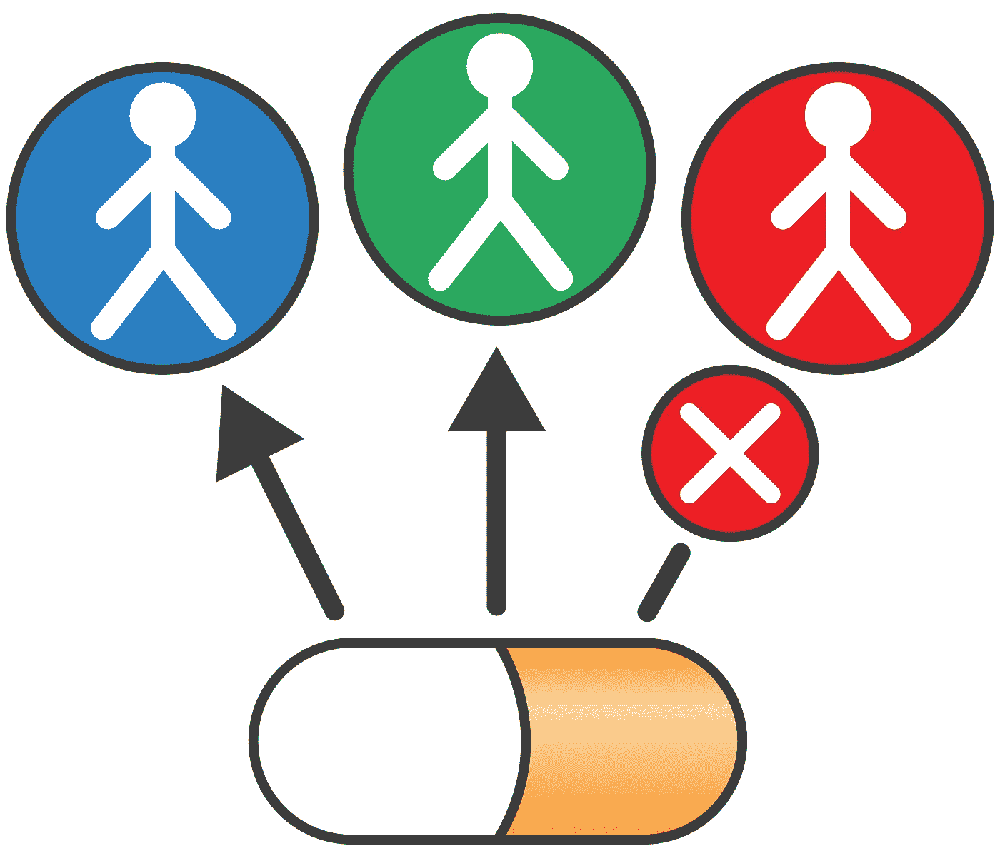
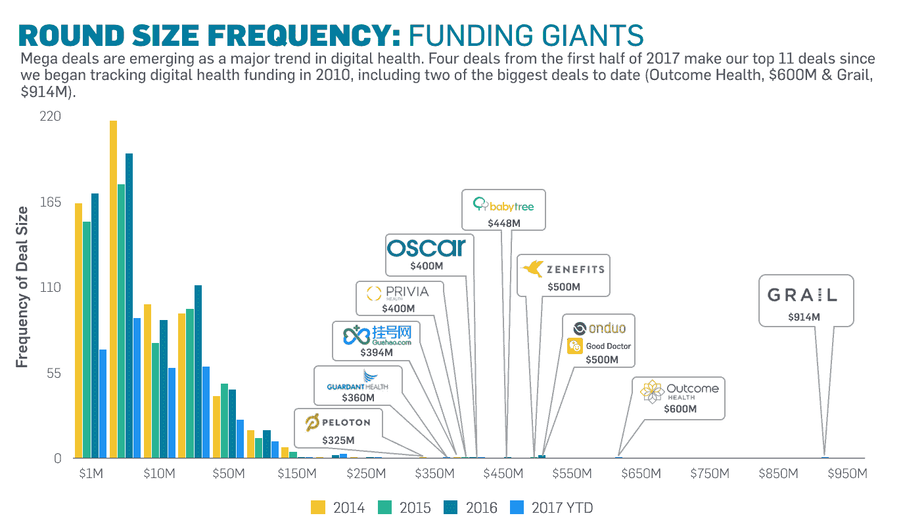
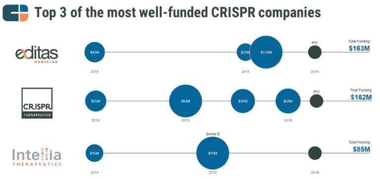

# 创业和个性化医疗:希望和危险

> 原文：<https://medium.datadriveninvestor.com/startups-and-personalized-medicine-promises-and-perils-f31dd0261aaf?source=collection_archive---------1----------------------->

个性化或精确医学与医学本身一样古老，但在过去二十年中，随着对疾病分子基础的深入了解，它真正走上了前沿。企业家们同样也在努力推进几个领域的技术发展，这篇文章关注的是一些比较突出的领域，以及其中的前景和危险。

癌症——我们正在超越拨款吗？

美国国家癌症研究所的一些统计数据:

*   2018 年美国新增病例 170 万例，死亡 61 万例
*   大约 38%的男性和女性一生中会被诊断患有一次癌症
*   每年花费 1500 亿美元，随着年龄的增长和暴露在致癌物质中的风险增加，这一成本预计还会增加

癌症背后的巨大挑战已经并将可能继续是了解原因，然后制定具体的解决方案。鉴于这么多的研究仍在进行，我们需要更多的时间和金钱。好消息是，我们正看到大量资金进入数字健康领域，其中相当一部分是针对癌症的。像 Foundation 和 Flatiron 这样的退出正在发生，这为整个引擎提供了燃料——我们最终可能会获得商业可扩展性。

**2)基因组学——告知还是恐吓的产品？**

消费者基因组学在 23AndMe 经历了第一次革命和挫折。该公司一直以低于 100 美元的价格销售其产品，从而使大众买得起基因测序。与此同时，他们与美国食品和药物管理局有巨大的争议，认为他们分发的信息需要监管。23AndMe 通过非常小心地定位基因发现和风险找到了立足点，该领域的其他公司也纷纷效仿。但是，在医疗建议和将其付诸实施之间保持平衡仍然是一个显而易见的挑战。

CRISPR 可以说是该领域的第二次革命，有其自身的一系列伦理挑战，但一些资金充足的例子象征着这种兴奋:

**3)微生物组——如何实现强大的商业模式？**

对你的肠道细菌进行测序有望帮助诊断(例如食物不耐受的潜在原因)和治疗(例如追求哪种饮食)。uBiome 可以说是最杰出的创业公司，但远不是唯一的一家，有太多的公司获得了资金和启动。这类似于基因组学领域的情况，早期的领导者有很多追随者。这一领域的风险是相似的——随着测序成本呈指数级下降，如何建立可持续的商业模式，特别是具有循环组件(如食品配送)而不是一次性组件(如购买套件)。

这篇文章的灵感来自与 Sanjay Goel 的一次谈话。这些都是专注于实践见解的有目的的短文(我称之为 GL；dr —良好的长度；确实读过)。如果它们能让人们对某个话题产生足够的兴趣，从而进行更深入的探索，我会感到非常兴奋。我在三星的创新部门 [*NEXT*](http://samsungnext.com/) *工作，专注于深度科技领域软件和服务的早期风险投资，这里表达的所有观点都是我自己的。*