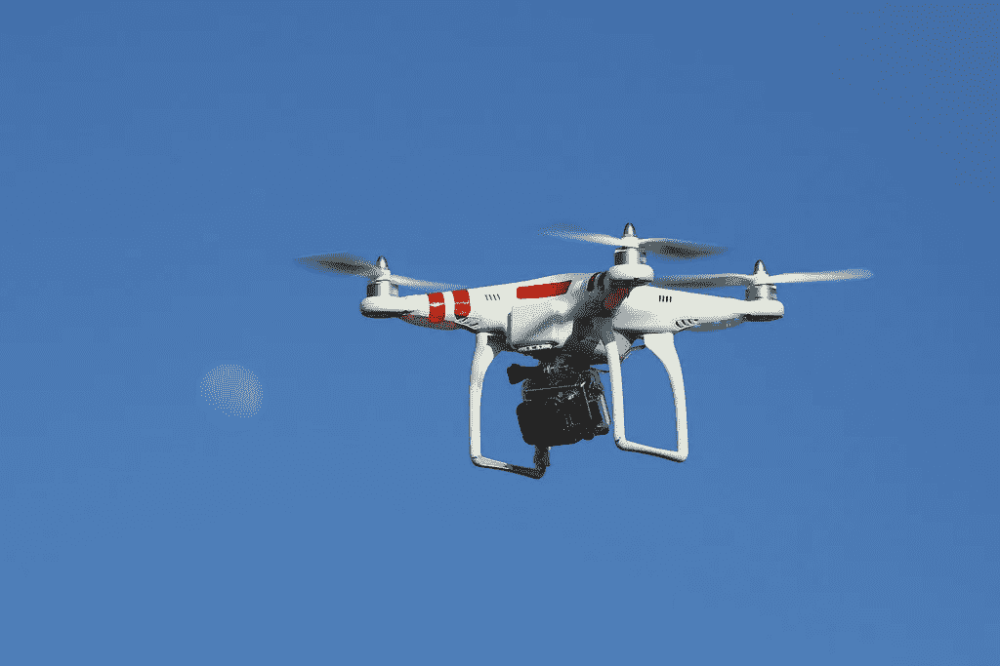
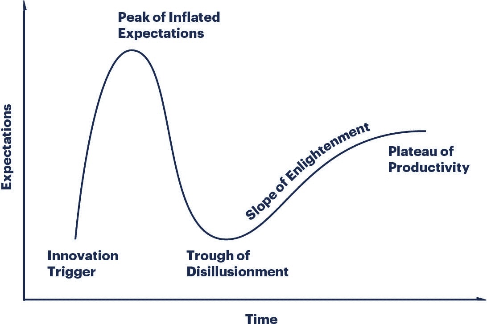
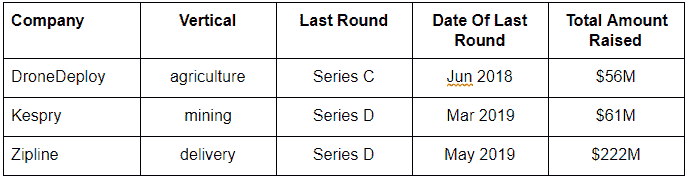

# 创业公司和无人机复兴

> 原文：<https://medium.datadriveninvestor.com/startups-and-the-drone-renaissance-490d0445727a?source=collection_archive---------5----------------------->

无人机，或者更准确地说是无人驾驶飞行器(UAV)，是一个古老的概念，在过去十年里获得了显著的发展。在整个 20 世纪，军方尤其不断创新无人机能力和用例。但实际上是在过去十年中，当三个发展达到指数变化时——组件成本下降，组件尺寸减小，计算能力增强——创造了完美风暴。无人机大规模起飞，各种公司得到资助，然后大量倒闭。引人注目的失败包括 [Lily 经历了 1500 万美元的融资](https://www.wired.com/story/the-drone-company-that-fell-to-earth/)和 [Airware 在燃烧了 1 . 18 亿美元](https://techcrunch.com/2018/09/14/airware-shuts-down/)后崩溃。

2019 年的今天，我们看到了一场复兴，因为无人机正在触及所谓的启蒙斜坡。

中国公司已经垄断了硬件领域，具体来说，DJI 在 2017 年的收入为 27 亿美元，在消费者领域的市场份额超过了 70%。但在其他各种领域，初创公司都有巨大的机会，这导致了三个关键趋势:

 [## 波动迫使数据驱动的投资者冷静

### 自然界中很少有东西是直线行进的，尤其是经济。当投资者和消费者希望平静时…

www.datadriveninvestor.com](https://www.datadriveninvestor.com/2019/03/25/volatility-compels-calm-amid-the-storm/) 

**1)垂直解决方案是目前的**

鉴于消费者市场基本上是 70–20–10 寡头垄断，在任何可预见的未来，企业都是创业机会所在。围绕企业销售的一般原则——专注于赢得销售周期，打造针对您所服务的行业的产品，并提供更好的客户支持——可以降低 CAC、降低流失率和提高 LTV。垂直市场的一些著名例子:

**2)集成商是未来**

无人机之间的数据/分析受到了很多指责，因为前面提到的 Airware 和 3D Robotics 等公司的失败，到 2016 年[已经烧掉了 1 亿美元](https://www.forbes.com/sites/ryanmac/2016/10/05/3d-robotics-solo-crash-chris-anderson/#55c1992e3ff5)，到 2019 年才恢复。但正是因为没有一个单一的平台将不同的平台联合起来，随着无人机应用的增加，总会有一个机会。问题仍然是，它是否会被一家初创公司捕获，或者它是否会被一个财团或像 DroneCode 这样的开源公司管理。

**3)卫星图像是生存威胁**

实时卫星成像的价格可能会大幅下降，以至于无人机在除送货以外的关键用例中的相关性大大降低。当然，在室内或者当视线被云层或森林阻挡时，仍然需要它们。但是像行星实验室这样的公司正在挑战极限，目前获得了 80 厘米的分辨率，这使他们不可避免地与无人机发生碰撞。

*这些都是专注于实践见解的短文(我称之为 GL；dr —良好的长度；确实读过)。如果它们能让人们对某个话题产生足够的兴趣，从而进行更深入的探索，我会感到非常兴奋。这里表达的所有观点都是我自己的。如果这篇文章有对你有用的见解，请给个赞，任何想法请留言。*