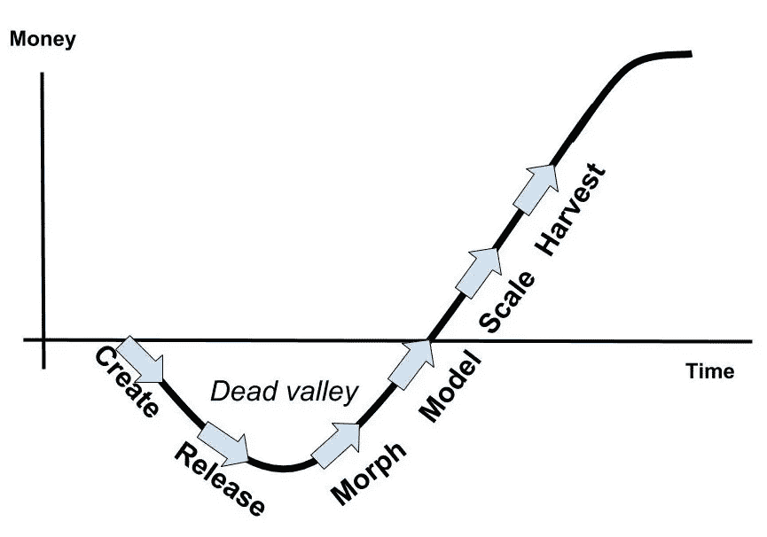
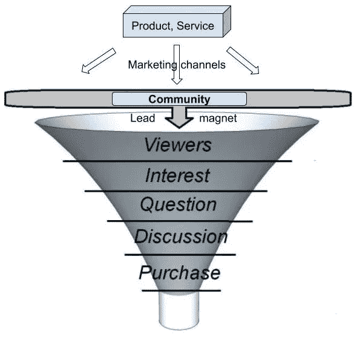
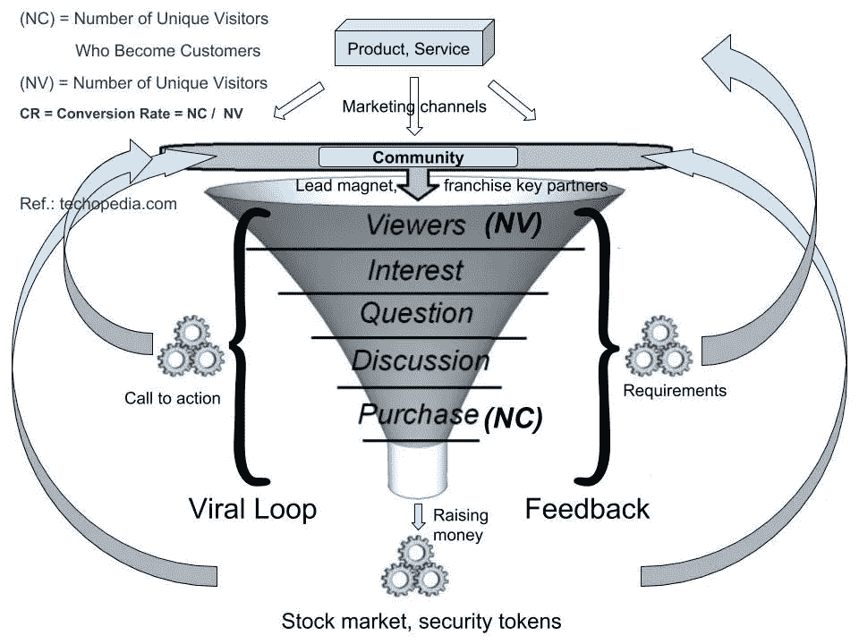
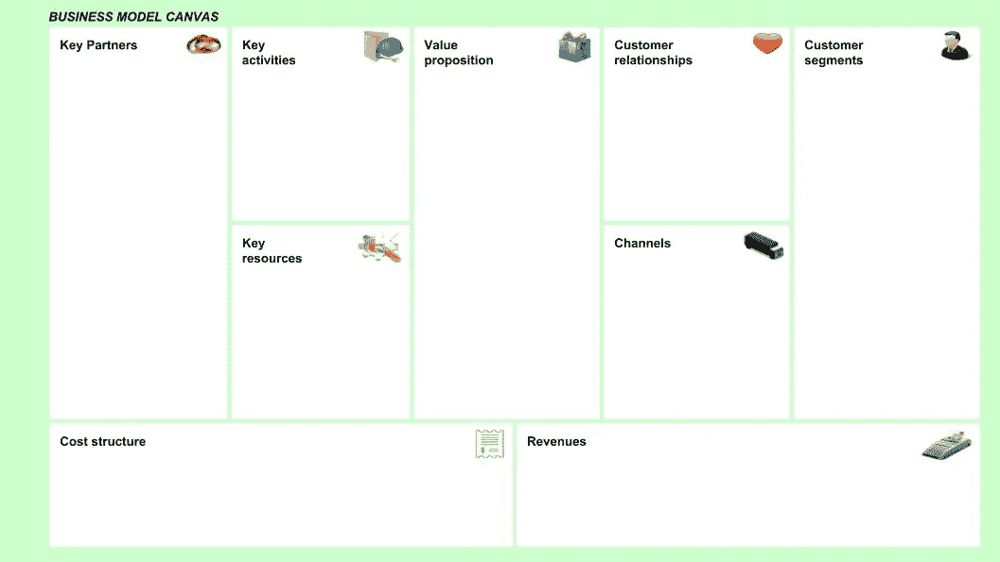
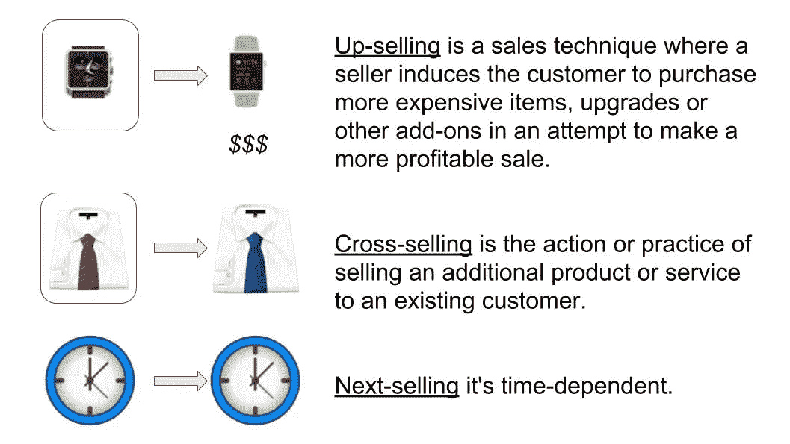
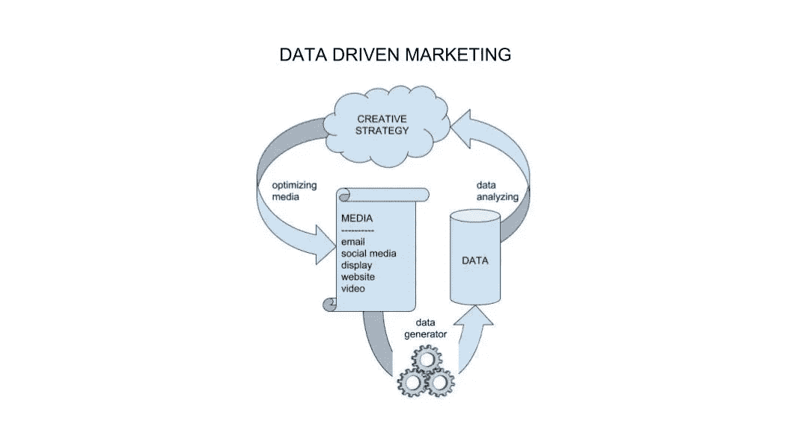

# 创业公司:他们需要知道什么

> 原文：<https://medium.datadriveninvestor.com/startups-what-they-need-to-know-3ec719575d23?source=collection_archive---------7----------------------->

Image source: rawpixel, pixabay.com

创业公司强烈依赖他们的内部和个人知识。这些环境中充满了具有非凡想法、毅力和高期望的人。不幸的是，初创公司经常发现自己难以跟上成为老牌公司的进程。仅仅有一个伟大的想法是不够的——这是一个复杂的过程，需要大量的工作。整个项目应该被视为一个新产品的诞生，甚至在生产开始之前就充满了测试和假设。

这就是为什么我在过去的这个夏天致力于阅读产品进化基础知识，并让我自己的创业项目进入休眠模式。(你可以在本文末尾的参考文献中找到这些书，我强烈建议至少读一本。)整个夏天的阅读和研究让我对整个产品(或服务)开发过程有了深入的了解，从想法本身到规模和利润。

这些书中的一个常见问题是它们提供了过于复杂的文本图像解释。为了弥合这一差距，我创建了一个概述，并试图尽可能简单地展示市场引擎，如以下部分所示。

# 启动曲线

那么——初创公司需要了解什么？

首先，启动创业项目和公司项目是有区别的。创业公司不断尝试，直到成功；公司在现有客户中推出新产品，如果出现任何错误，他们会立即修复。

每个启动都应该了解启动曲线及其阶段。

S-Curve
Image source: Matjaz Marussig

1.  创建:这是一家初创公司最初的兴奋之处，三个关键要素汇集在一起:想法、团队和资金。这是筹集资金的最佳时机，因为初创公司正在体现——并出售——他们的激情。
2.  **发布**:这是初创公司向市场发布产品的地方，也是市场提供反馈的地方。这是橡胶遇到道路和现实的地方。正是在这个阶段，创始人真正需要倾听客户的意见。
3.  **变形**:在这个阶段，初创公司需要根据客户的反馈对他们的产品或商业模式进行调整。在这个阶段，需要进行多次迭代，直到实现理想的产品市场适合度。
4.  模式:在这个阶段，创业公司需要优化他们的商业模式。我们的目标是，如果有更多的资金投入到创业中，就能获得直接的投资回报。
5.  **规模**:商业模式确定后，对创业公司的投资就可以扩大业务规模。
6.  收获:这是初创企业发展成成熟企业的地方，也是创始人有机会收获劳动成果的地方。这也是他们需要决定他们想要采取什么方向的地方，包括首次公开募股、收购等。

他们也应该理解“死亡谷”,并坚持走出它。

# 营销漏斗

创业公司还应该了解什么是营销漏斗，以及它是如何工作的。创造社区意识是一个重要的先决条件。你的产品或服务应该成为这个社区的“销售线索磁铁”;否则，人们甚至不会对你的创业公司多看一眼。

Image source: Matjaz Marussig

社区中的一些人会看到你的产品或服务，只有少数人会购买。购买者和不购买者之间的比率被称为“转换率”对于任何创业公司来说，这都是非常重要的信息。有了谈话率，我们就知道销售需要多少钱，并且可以计算出我们需要多少线索。这也为我们提供了营销活动所需的资金。转换率是任何初创企业发展过程中的一个关键计算因素。

CR =转化率

NC =成为客户的独立访问者的数量

NV =独立访问者的数量

CR = NC ÷ NV

潜在客户在两个引擎中运行。第一个引擎是一个“病毒循环”，他们将产品或服务的信息发送给他们的朋友和他们认为会感兴趣的人(号召行动)。第二个引擎是将修改产品或服务的需求发送给开发团队的人。漏斗把自己变成了一个全方位服务的机制。客户转变角色，成为销售代理(第一引擎)，然后成为初创团队的顾问(第二引擎)。

在生产产品或服务的公司如此引人注目以至于社区开始购买股票的情况下，第三个引擎被创建来筹集资金。

现在，我们总共有三个引擎来创建一个更大的市场机制:病毒循环、需求和股票市场。随着引擎工作速度加快，整个机制的速度也随之提高，从而支持更好的扩展和利润水平。在这里，客户扮演着最重要的角色，而不是创业团队。顾客决定产品或服务应该如何外观和功能，他们尽最大努力影响其生产以获得他们需要的东西。创业团队试图向他们的客户交付，股东获得公司股权，客户通过口碑提供广告。这是一个新产品或服务诞生的全部概念。

Image source: Matjaz Marussig

创业团队必须创建一个贷款业务模型画布。这迫使团队进行分析性思考。画布应该短小精悍(只覆盖一到两页，而不是 50 页)。这也有助于投资者快速了解他们支付的是什么。像这样灵活的计划很容易修改和适应市场的要求。这种灵活性和适应性在产品或服务的整个生命周期中至关重要。

Image source: Matjaz Marussig

一个成功的创业团队还应该理解向上销售、交叉销售和下一次销售等术语。

Image source: Matjaz Marussig

理解数据驱动营销非常重要。这意味着营销活动的结果不仅仅是点击和数字，而且是分析性的。这些结果需要一名数据科学家来解释、评估和说明结果。如果团队想要降低成本并了解他们的目标社区需要什么，拥有坚实的分析能力是至关重要的。

Image source: Matjaz Marussig

**作者** : [马特加斯·马鲁西格](https://www.linkedin.com/in/matjazmarussig/)

**编辑** : [凯特琳·沃什](https://www.linkedin.com/in/caitlin-walsh-77a711125/)

**参考文献**

布兰克·s .(2012 年)。创业业主手册:建立伟大公司的逐步指南。【Kindle 版】。从 Amazon.com 取回

建造者，C. (2017)。如何营销你的 ICO:在你首次发行硬币(ICO)或代币销售之前，学习如何建立一个真实、强大的粉丝群的营销基础。(ICO 营销第一册)。【Kindle 版】。从 Amazon.com 取回

Dib，A. (2018)。1 页营销计划:获得新客户，赚更多的钱，脱颖而出。【Kindle 版】。从 Amazon.com 取回

帕拉斯克瓦斯，M. (2017)。在以太坊区块链中创建自己的 ICO:如何创建、验证和营销您的 Altcoin。【Kindle 版】。从 Amazon.com 取回

麦卡锡(2014 年)。500 个社交媒体营销技巧:商业的基本建议、提示和策略:脸书、Twitter、Pinterest、Google+、YouTube、Instagram、LinkedIn 等等！。【Kindle 版】。从 Amazon.com 取回

T.诺曼，A. (2017)。区块链技术讲解:关于区块链钱包、挖矿、比特币、以太坊、莱特币、Zcash、Monero、Ripple、Dash、IOTA、智能合约的终极初学者指南。【Kindle 版】。从 Amazon.com 取回

爱，H. (2016)。创业 J 曲线:创业成功的六个步骤。【Kindle 版】。从 Amazon.com 取回

约尼卡斯博士(2017)。从创意到盈利和可扩展业务的创业演化曲线:创业营销手册。从 Amazon.com 取回

转换率，可在:[https://www.techopedia.com/definition/1450/conversion-rate](https://www.techopedia.com/definition/1450/conversion-rate)【2018 年 11 月 6 日获取】。

转换率，可在 https://www.startupgrind.com/blog/the-startup-j-curve/【2018 年 11 月 6 日获取】。

由 draw.io 图创建的图片