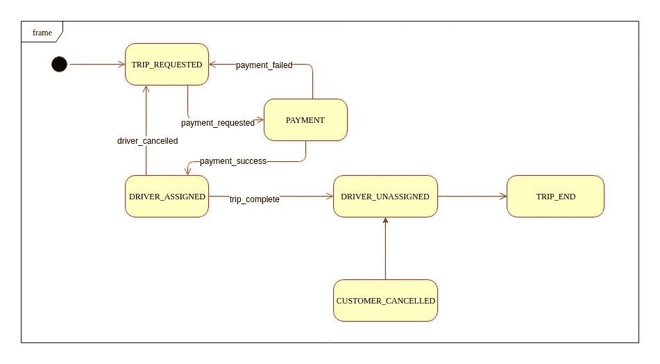

# 状态机设计模式—第 2 部分:状态模式与状态机

> 原文：<https://medium.datadriveninvestor.com/state-machine-design-pattern-part-2-state-pattern-vs-state-machine-3010dd0fcf28?source=collection_archive---------0----------------------->

[](http://www.track.datadriveninvestor.com/1B9E)

在上一篇文章中，我们谈到了使用状态机构建面向状态的系统来解决几个业务问题。在我们开始构建任何合适的状态机示例之前，我们最好探索其他替代方案并讨论它们的优缺点。它将帮助我们正确地认识到状态机设计模式的潜力。

## 问题陈述:

让我们考虑一个非常简单的优步旅行生命周期。生命周期由以下状态和转换组成，如下图所示。让我们找出不同的方法来建立这个面向状态的系统。



## 基本方法:

首先想到的直观方法是通过简单的`if else`处理状态和转换。但是这种方法没有伸缩性，随着每个新的状态/转换的添加/删除，您需要改变驱动整个逻辑的大块`if else / switch`语句。参考下面的代码来确定代码看起来有多乱&想象一下当代码库大规模增长时会发生什么😮。这种方法可以处理极其静态的转换&状态，但是这种可能性非常小。您应该避免这种方法，因为它会成为一个巨大的维护开销。示例代码:

```
void manageStatesAndTransitions(Event event, InputData data) {
  State nextState = getNextState(event, data);

  switch(nextState) {
   case State.TRIP_REQUESTED:
    handleTripRequest(event, data);
    break;

   case State.PAYMENT:
    handlePayment(event, data);
    break;

   case State.DRIVER_ASSIGNED:
    handleDriverAllocation(event, data);
    break;

   case State.DRIVER_CANCELLED:
    handleTripCancellationByDriver(event, data);
    break;

   case State.CUSTOMER_CANCELLED:
    handleTripCancellationByCustomer(event, data);
    break;
  }
 }

 void handleTripRequest(Event event, InputData data) {

  if(event == Event.trip_requested) {
   // Check pre-conditions
   // do some work if needed...

   manageStatesAndTransitions(Event.payment_requested, data);
  } else if(event == Event.payment_failed) {
   showBookingError();
  }
 }

 void handlePayment(Event event, InputData data) {
  if(event == Event.payment_requested) {
   Payment payment = doPayment(data);

   if(payment.isSuccess()) {
    manageStatesAndTransitions(Event.payment_success, data);
   } else {
    manageStatesAndTransitions(Event.payment_failed, data);
   }
  } else if(event == Event.payment_failed) {
   manageStatesAndTransitions(Event.payment_failed, data);
  } else if(event == Event.payment_success) {
   manageStatesAndTransitions(Event.driver_assigned, data);
  }
 }
```

## 状态模式方法:

状态模式是四人帮设计的行为设计模式之一。在这种模式中，相关的对象拥有可以改变的内部状态&对象的行为相应地改变。

**特性:**

1.  特定于状态的行为在不同的类中定义&原始对象将行为的执行委托给当前状态的对象实现。
2.  状态触发从一种状态到另一种状态的状态转换。
3.  所有状态都实现了一个定义所有可能行为/动作的公共接口。

让我们通过下面的机制来模拟优步旅行状态:

1.  我们将定义一个表示状态契约的接口。所有状态都将实现这些方法，这些方法规定了对象在特定状态下的行为。如果某个方法在某个州不适用，该州将忽略在该方法中定义任何操作:

```
interface State
{
    void handleTripRequest();
    void handlePaymentRequest();
    void handleDriverCancellation();
    void handleCustomerCancellation();
    void completeTrip(); // Driver completes trip, Unassign the driver.
    void endTrip(); // After driver is unassigned, do driver & customer rating, take feedback etc. 
}
```

2.我们将做不同状态的具体实现。
**旅行请求状态:** 这是客户请求旅行时的初始状态。它执行`handleTripRequest`方法，并在成功启动后，将状态设置为`Payment`。所以这个州间接称为`Payment`州。

```
class TripRequested implements State {

 UberTrip context;

  public TripRequested(UberTrip ctx) {
   this.context = ctx;
  }

 [@Override](http://twitter.com/Override)
 void handleTripRequest() {
   if(!context.tripStarted()) {
    context.setState(context.getPaymentRequestedState());
  }
 }

   [@Override](http://twitter.com/Override)
    void handlePaymentRequest() {
     System.out.println("This state just handles initiation of trip request, it does not handle payment");
    }

    [@Override](http://twitter.com/Override)
    void handleDriverCancellation() {
     System.out.println("This state just handles initiation of trip request, it does not handle cancellation");
    }

    [@Override](http://twitter.com/Override)
    void handleCustomerCancellation() {
     System.out.println("This state just handles initiation of trip request, it does not handle cancellation");
    }

    [@Override](http://twitter.com/Override)
    void completeTrip() {
     System.out.println("This state just handles initiation of trip request, it does not handle trip completion");
    }

     [@Override](http://twitter.com/Override)
    void endTrip() {
     System.out.println("This state just handles initiation of trip request, it does not handle ending trip.");
    }
}
```

**支付状态:** 处理支付请求，成功&失败状态。成功时，它将跳闸状态设置为`DriverAssigned`，失败时，它将跳闸状态设置为`TripRequested`。

```
class Payment implements State {

 UberTrip context;

 public PaymentRequested(UberTrip ctx) {
  this.context = ctx;
 }

   [@Override](http://twitter.com/Override)
   void handleTripRequest() {
  System.out.println("Payment state does not handle trip initiation request.");
   }

 [@Override](http://twitter.com/Override)
 void handlePaymentRequest() {
   Payment payment = doPayment();

   if(payment.isSuccess()) {
    context.setState(context.getDriverAssignedState()); // Call driver assigned state.
   } else {
    context.setState(context.getTripRequestedState()); // Call trip requested state
   }
    }

    [@Override](http://twitter.com/Override)
    void handleDriverCancellation() {
     System.out.println("Payment state just handles payment, it does not handle cancellation");
    }

    [@Override](http://twitter.com/Override)
    void handleCustomerCancellation() {
     System.out.println("Payment state just handles payment, it does not handle cancellation");
    }

    [@Override](http://twitter.com/Override)
    void completeTrip() {
     System.out.println("Payment state just handles payment, it does not handle trip completion");
    }

    [@Override](http://twitter.com/Override)
    void endTrip() {
     System.out.println("Payment state just handles payment, it does not handle ending trip.");
    }
}
```

**driver assigned state:** 当指定司机取消行程时，行程的状态设置为`TripRequested`状态，新的行程请求自动开始。当驾驶员完成行程时，行程状态变为`DriverUnAssigned`状态。

```
class DriverAssigned implements State {

    UberTrip context;

    public DriverAssigned(UberTrip ctx) {
      this.context = ctx;
    }

    [@Override](http://twitter.com/Override)
    void handleTripRequest() {
     System.out.println("Driver Assigned state does not handle trip initiation request.");
    }

    [@Override](http://twitter.com/Override)
    void handlePaymentRequest() {
     System.out.println("Driver Assigned state does not handle payment request.");
    }

    [@Override](http://twitter.com/Override)
    void handleDriverCancellation() {
     context.setState(context.getTripRequestedState()); // If driver cancels, go back to trip requested state & try again.
    }

    [@Override](http://twitter.com/Override)
    void handleCustomerCancellation() {
      System.out.println("Driver Assigned state does not handle customer cancellation.");
    }

    [@Override](http://twitter.com/Override)
    void completeTrip() {
     context.setState(context.getDriverUnAssignedState()); // Call driver unassigned state
    }

    [@Override](http://twitter.com/Override)
    void endTrip() {
     System.out.println("Driver Assigned state does not handle ending trip.");
    }
}
```

**客户取消状态:** 当客户取消行程时，不会自动重试新的行程请求，而是将行程状态设置为`DriverUnAssigned`状态。

```
class CustomerCancelled implements State {

    UberTrip context;

    public CustomerCancelled(UberTrip ctx) {
      this.context = ctx;
    }

    [@Override](http://twitter.com/Override)
    void handleTripRequest() {
     System.out.println("Customer Cancelled state does not handle trip initiation request.");
    }

    [@Override](http://twitter.com/Override)
    void handlePaymentRequest() {
     System.out.println("Customer Cancelled state does not handle payment request.");
    }

    [@Override](http://twitter.com/Override)
    void handleDriverCancellation() {
     System.out.println("Customer Cancelled state does not handle driver cancellation.");
    }

    [@Override](http://twitter.com/Override)
    void handleCustomerCancellation() {
      context.setState(context.getDriverUnassignedState()); // If customer cancels, umassign the driver & related stuffs.
    }

    [@Override](http://twitter.com/Override)
    void completeTrip() {
     System.out.println("Customer Cancelled state does not handle trip completion.");
    }

    [@Override](http://twitter.com/Override)
    void endTrip() {
     System.out.println("Customer Cancelled state does not handle ending trip.");
    }
}
```

此外，`DriverUnAssigned`状态可以处理客户/驾驶员评级&反馈，相应地&将行程状态移动到`TripEnd`状态。这里的代码中没有显示。

**UberTrip 类:** 这是描述旅途中所有可能动作的类。它管理由单个状态对象设置的内部状态。`UberTrip`将行为委托给单个状态对象。

```
class UberTrip {
 State tripRequestedState;
 State paymentState;
 State driverAssignedState;
 State driverUnassignedState;
 State customerCancelledState;

 // CurrentState
 State state;

 public UberTrip() {
  tripRequestedState = new TripRequested(this);
  paymentState = new Payment(this);
  driverAssignedState = new DriverAssigned(this);
  driverUnassignedState = new DriverUnAssigned(this);
  customerCancelledState = new CustomerCancelled(this);
 }

 public setState(State st) {
  this.state = st;
 }

 public getState() {
  return this.state;
 } 

 public void requestTrip() {
  state.handleTripRequest();
 }

 public void doPayment() {
  state.handlePaymentRequest();
 }

 public void driverCancelled() {
  state.handleDriverCancellation();
 }

 public void customerCancelled() {
  state.handleCustomerCancellation();
 }

 public void completeTrip() {
  state.completeTrip();
 }
}
```

## 国家模式的利弊:

该系统中没有明确定义的转换。转换由状态本身处理。状态可以基于一些参数定义检查，以验证它是否可以调用下一个状态。这是实现基于状态的系统的一种相当混乱的方式，转换仍然与状态紧密耦合&状态通过在上下文对象(这里是 UberTrip 对象)中设置下一个状态来负责调用下一个状态。所以从逻辑上讲，一个状态对象处理它自己的行为&下一个可能的转换——多重责任。随着更多新状态和转换的出现，代码库可能会变成垃圾。此外，所有的状态对象都通过接口实现常见的行为，这在现实生活的开发中似乎是多余的&额外的工作。这种模式比基于基本`if else / switch`的方法更好，在这种方式下，你可以考虑将你的应用程序分解成状态&将行为划分成多个状态，但是由于转换是由状态本身隐式处理的，这种方法是不可扩展的&在现实生活中，你可能会违反`Open Closed — Open for extension & closed for Modification`原则。

在下一篇文章中，我们将讨论通过 Spring 状态机实现一个合适的状态机。