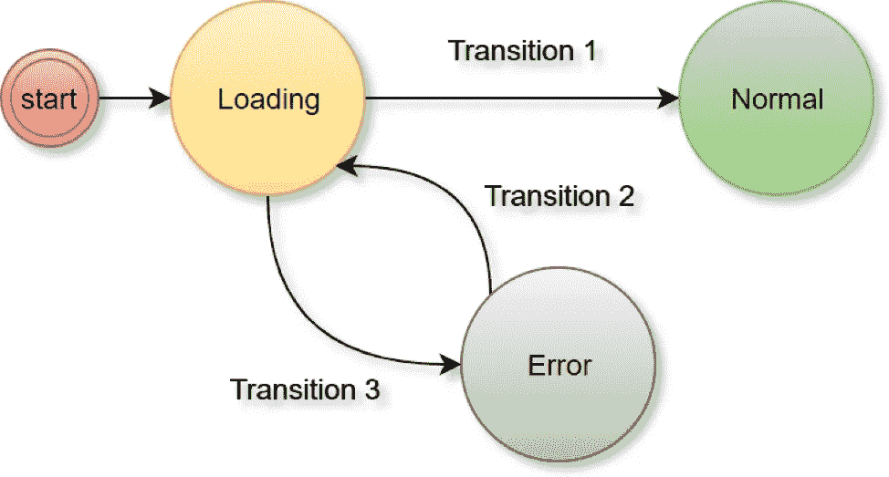

# 状态机设计模式—第 1 部分:何时、为什么和如何

> 原文：<https://medium.datadriveninvestor.com/state-machine-design-pattern-why-how-example-through-spring-state-machine-part-1-f13872d68c2d?source=collection_archive---------0----------------------->

状态机建模是计算机科学中最传统的模式之一。这是那些通过不同软件影响我们日常生活的设计模式之一。它不是面向编码(四人组类型)的设计模式，但它是面向系统的，主要用于围绕业务用例建模。

Courtesy: Google. Representational image.

## **用外行人的话来说什么是状态机:**

让我们考虑一个通过优步预订出租车的非常基本的真实用例:

1.  你首先打开应用程序，主屏幕出现，你在搜索栏中输入目的地。
2.  一旦找到正确的目的地，优步会向你展示推荐的旅行选项，如 Pool、Premier、UberGo、优步 XL 等，以及可能的价格。
3.  一旦您选择了付款方式，并按下“确认”按钮，按下所需的旅行时间(如果需要)，旅行就被确认，司机就被指派。
4.  优步现在向你展示一张地图，你可以在上面追踪你的司机。

在这个用例中，屏幕 1 是独立的，它是向所有用户显示的第一个屏幕。屏幕 2 依赖于屏幕 1，不在屏幕 1 上提供有效数据，就不能移动到屏幕 2。同样，屏幕 3 依赖于屏幕 2，屏幕 4 依赖于屏幕 3。一旦您的行程得到确认&您或您的司机都没有取消行程，您将停留在屏幕 4 上，在您当前的行程结束之前，您不能预订任何新的行程。

现在假设雨下得很大&没有司机接受你的行程，或者在你所在的地方找不到合适的司机来完成你的行程，所以会弹出一条错误消息通知你司机不可用&你停留在屏幕 3 上。不过，你可以回到屏幕 2，然后屏幕 1，你可以一直回到第一个屏幕。

如果您仔细注意这里，您正在进入预订出租车的不同阶段，只有当某个操作在当前阶段成功时，您才能进入下一阶段。例如:当您在屏幕 1 上时，如果您提供了错误的目的地，您就不能移动到屏幕 2，同样，如果没有在屏幕 2 上选择旅行选项，您也不能移动到屏幕 3，但是除非您的旅行已经预订，否则您总是可以返回到上一阶段。在上面的示例中，我们通过一系列活动分解了出租车预订流程，根据预订的当前阶段，活动可能会也可能不会调用另一个活动。这就是状态机用来建模的东西。理想情况下，所有这些阶段/状态都是独立的情况，只有当当前阶段通过成功或失败完成时，一个阶段才能调用另一个阶段。

## **状态机的技术术语:**

状态机让我们可以自由地将一个复杂的大任务分解成一系列独立的小任务，就像上面的例子一样——将出租车预订活动分解成多个小阶段。较小的任务通过事件相互联系，从一种状态到另一种状态的运动称为转换。当从一个状态转换到另一个状态时，我们通常会执行一些操作，完成上面示例中的一些工作—在后端实际预订、生成发票、存储用户分析数据、在数据存储中记录预订数据、在旅行结束时触发支付等等。状态机的一般公式是:

***当前状态+某个动作/事件=另一个状态***

## **为什么&我们什么时候需要状态机:**

如果我们能够将大型复杂任务分解成一些较小的独立单元，状态机可以帮助我们以更抽象的方式想象和管理这些单元，我们只需要配置何时一个状态可以转移到另一个状态&我们专注于定义当转移发生时会发生什么。配置完成后，我们不需要关心过渡是如何发生的。我们只是关注`when` & `what`而不是`how`。此外，状态机帮助我们以一种非常可预测的方式想象状态的整个工作流，一旦转换被配置，我们就不需要真正关心状态的管理不善或错误转换，错误的转换只有在我们以错误的方式配置状态机时才会发生。我们有一个状态机中状态&转换的完整视图。如果我们不使用任何状态机，要么我们无法通过不同的可能状态来可视化我们的系统，要么我们有意或无意地将我们的组件彼此紧密耦合，要么我们编写许多`if else`条件来模拟状态转换，这反过来使我们的单元&集成测试更加困难，因为我们必须确保编写所有测试用例来验证所使用的所有条件&分支的可能性。

## 状态机的优势:

1.  你在代码中去掉了硬编码条件。状态机代表您抽象出所有关于状态和转换的逻辑。在下一篇文章中，我们将探索除了状态机之外创建面向状态的系统的一些方法，你将会看到这些系统中的问题。
2.  实际上，状态机通常有有限数量的状态&状态中定义了明确的转换，因此很容易跟踪哪个转换/数据/事件导致了请求的当前状态。
3.  配置好状态机后，开发人员可以专注于定义动作和前提条件。通过适当的验证和前提条件，状态机可以防止无序操作。就像在优步的例子中，除非旅程结束，否则司机不能得到报酬。
4.  状态机可以是高度可维护的。逻辑上，在每个转换期间执行的动作是相互独立的。因此相应的代码片段可以被隔离。
5.  通常，状态机是稳定的&不太容易改变。因此，如果当前和未来的用例非常清晰，维护这样的系统就变得非常容易。

## 状态机的缺点:

1.  通常，状态机本质上是同步的。因此，如果您需要异步执行后台 API 调用/作业执行，您可能需要做出正确的判断来选择最佳的一个。
2.  代码很容易变得非常混乱。由于状态机是数据驱动的，根据不同的数据/输入参数，您的产品团队可能会要求您从同一状态执行不同的转换。因此，这种需求可能会导致一些带有混乱的前提条件检查的转换。这完全取决于产品&机器的当前实现。
3.  如果需要负载平衡状态机实例，请选择启用了持久性的实例，否则您可能需要添加自己的持久层&适当的验证，以便向不同状态机实例发出的多个请求可以给出一致的结果。
4.  没有太多的资源或社区可用于不同的状态机实现，所以一旦选择了特定的库，支持可能就不那么好了。

## 使用状态机时需要注意的事项:

理想情况下，如果您使用状态机或工作流系统，您的系统中应该有两个逻辑组件——a .状态机/工作流系统本身，b .封装在一个或多个服务中的业务逻辑。状态机/工作流系统可以被想象为驱动状态转换的基础设施，它验证从一个状态到另一个状态的移动，它在转换之前/期间/之后调用配置的动作，但是它不应该确切地知道在那些动作中执行了什么业务逻辑，这是您的服务的责任。所以一般来说，通过创建适当的抽象将状态机从底层业务逻辑中分离出来是一个很好的实践，否则它将成为一个需要管理的代码地狱。当当前阶段成功时，我们可以使用简单的`if else`语句，而不是使用状态机从一个状态转移到另一个状态。但是这个过程很难管理&一个糟糕的设计可以紧密耦合系统&可能提供较少的灵活性。

## **真实生活用例:**

在现实生活中，许多事情可以围绕状态机或工作流系统进行建模。一些例子:

1.  从在线电子商务网站订购:当您订购某件商品时，订单会经历不同的状态，如订购、包装、发货、取消、交付、付款、退款等。当用户取消或要求退款等时，货物在不同阶段通过仓库或物流&扫描时，会自动进行转换。
2.  点餐也要经历类似的循环。
3.  *旅行预订也可能经历类似*的状态——旅行请求、司机分配、客户取消、司机取消、客户等待、司机到达、旅行开始、支付完成、旅行完成、评级完成等。
4.  ETL 作业也可以围绕状态进行配置。
5.  像 Android UI 活动一样，IOS Swift 活动也可以围绕状态和转换来考虑。就像在优步的例子中，状态机可以决定显示哪个屏幕&根据用户输入和动作，你可以抽象出屏幕活动，比如隐藏一些数据或在单个屏幕活动中滚动数据逻辑等，状态机可以驱动这个流程。
6.  React 还提供了状态机功能，我不是前端人员，所以不能多谈😐。
7.  微服务部署也可以围绕状态的工作流进行建模。

## **现实生活中的状态机/工作流系统:**

如果您决定使用状态机的概念，您可以从一堆已经可用的实现中自由选择。尽管状态机&工作流系统之间存在一些[差异](https://workflowengine.io/blog/workflow-engine-vs-state-machine/):

1.  **Spring 状态机:**如果你因为这样或那样的原因没有自由使用一个合适的工作流系统，你可以使用 [Spring 状态机](https://projects.spring.io/spring-statemachine/)来建模你的用例。这是一个让您开始了解状态机功能的好项目。更多细节&功能可以在[这里](https://docs.spring.io/spring-statemachine/docs/2.0.3.RELEASE/reference/htmlsingle/)找到。通常，业务流程不是很复杂的创业公司可以进行这个项目。你必须在代码本身中配置状态、转换、动作等，据我所知，没有 UI 可用于从 UI 创建工作流。
2.  Activiti: [Activiti](https://www.activiti.org/) 是一个开源的业务流程管理(BPMN)引擎，适用于企业系统中复杂的工作流相关用例。它提供非常高级的功能，如查询服务、监控、云就绪服务等。它将工作流元数据存储在自己的数据库中。如果你有复杂的工作流程或者一些企业需要复杂的业务自动化，activiti 可以作为一个选择。 [Alfresco](https://www.alfresco.com/platform/process-services-bpm) 提供基于 activiti 平台的许可用户友好工具，可轻松用于创建&管理工作流。
3.  **Apache air flow:**[air flow](https://airflow.apache.org/)(原为 Airbnb 项目)是一个用 Python 编写的开源工作流系统。这是一个高度可扩展、模块化的面向消息的系统。这使得在它们之间定义任务&依赖关系变得容易。如果你有用 Python 写的系统，或者你有能力用 Python 写一个专用的工作流管理系统/微服务，你当然可以考虑 Apache Airflow。这是一个非常广泛使用的系统。我见过 ETL 公司使用这个系统来围绕大数据处理建模任务。

## 对现实生活中面向状态机的系统的期望:

我在几个系统中使用过状态机。因此，我可以谈谈在我们的系统中使用状态机时，我们期望能够正确处理的一些真实场景:

1.  状态机不仅仅是关于状态、转换和动作。它还应该能够定义状态转换的边界。就像在某些情况下，只有当授权系统或用户触发时，转换才能成功。可能有几种这样的情况。因此，我们应该能够定义适当的保护逻辑来启用或禁用状态转换。
2.  在许多情况下，我们最终会有多个不同的工作流与同一个业务实体相关联，它们可以并行工作。在这种情况下，一个工作流不会阻止其他工作流，它们可能会或可能不会一起触发，但它们可以一起工作，第二个工作流可能会从第一个工作流的一个合格状态中触发，然后它可能会从第一个工作流中分支出来并独立工作。这种用例完全由业务决定，不是每个业务都有这种用例。
3.  理论上，工作流系统独立于业务领域。因此，可以在同一个工作流系统中配置多个与同一业务实体无关的完全不同的工作流。它们可能有相同或不同的起点，这取决于工作流系统是否支持不同的起点。当在同一个工作流系统中配置了许多独立的工作流时，它提供了跨系统中不同业务实体运行的所有业务流程的全局视图。此外，根据业务用例，不同的工作流可能共享一些共同的状态。

下一篇文章讨论了构建面向状态系统的不同方法，以及它们的优缺点。敬请期待！

参考资料:

[1].[https://robots . thought bot . com/有限状态机-android-kotlin-good-times](https://robots.thoughtbot.com/finite-state-machines-android-kotlin-good-times)

[2].[https://blog . baxi . taxi/using-finite-state-machines-in-baxis-ride-booking-system-126 c 52952 a 04](https://blog.baxi.taxi/using-finite-state-machines-in-baxis-ride-booking-system-126c52952a04)